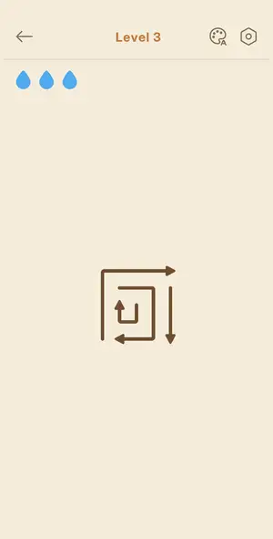
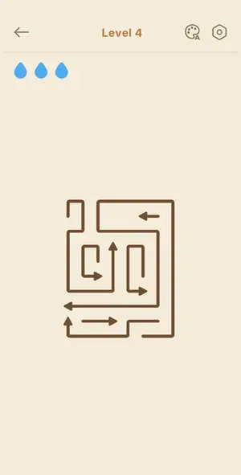
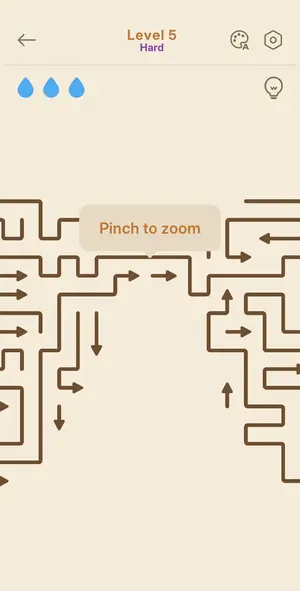
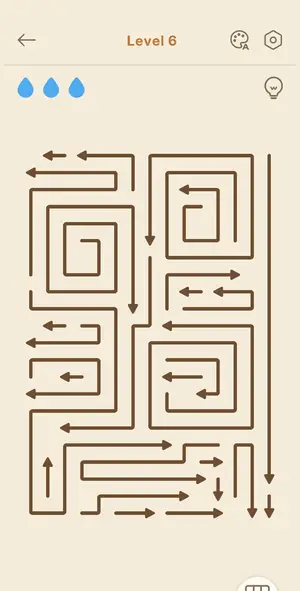
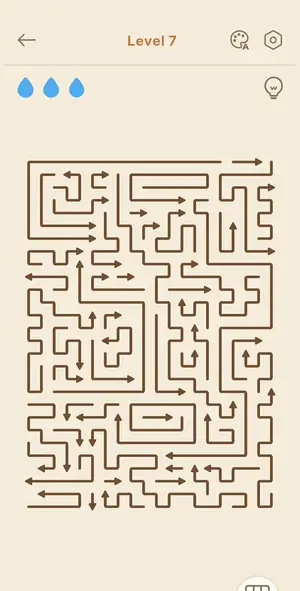
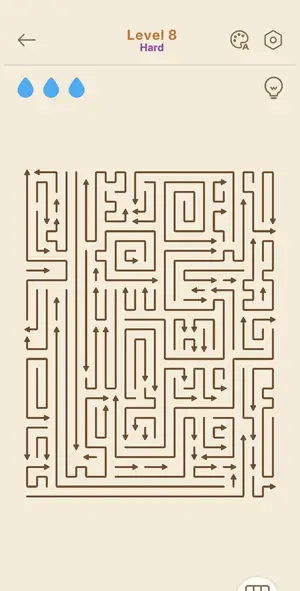
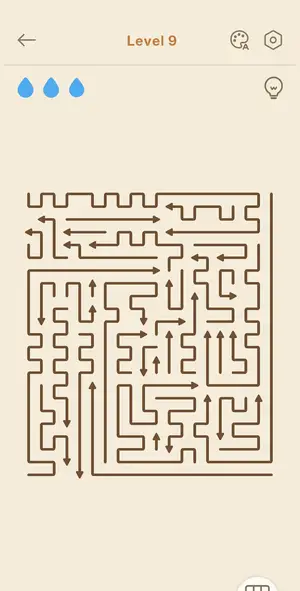
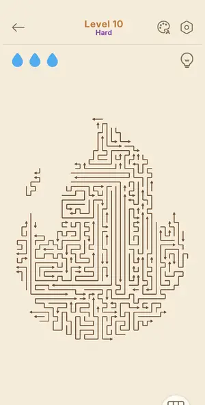

# Levels: Amaze GO!

Every level the agents met, as its board looked at the start (the ad strips cropped). The notes tell where a new element or rule appears.

| level 3 | level 4 | level 5 | level 6 | level 7 |
|---|---|---|---|---|
|  |  |  |  |  |

| level 8 hard | level 9 | level 10 hard | level 3 guideline look |
|---|---|---|---|
|  |  |  | no frame |

## Tries

| Level | Mechanic | Result | Time | Note |
|---|---|---|---|---|
| level 3 | arrows-escape | 1 won | 35 s | 4 arrows, order outer->inner |
| level 4 | arrows-escape | 1 won | 105 s | L4 won Perfect (win screen seen, frame 25), 1 mistake: blocked tap = lost drop, arrow flashed red |
| level 5 | arrows-escape | 2 won, 2 quit | 863 s | Won via hint loop: hint highlights a free arrow green, panning the board; script taps green. 1 mistake (drop lost). |
| level 6 | arrows-escape | 1 won | 110 s | solver (fine pitch, button masked) cleared 28 arrows in 2 rounds of 14 taps, 3 stars, no drop lost; Rate Us popup over the win card |
| level 7 | arrows-escape | 1 won | 100 s | solver: 54 arrows on a ~45 px pitch board, 4 rounds, 51 taps (2 extra), 0 mistakes, 3 stars Arrow Pro!, in-game 00:55 |
| level 8 hard | arrows-escape | 1 won | 168 s | solver, no hints: board fit the screen at 35 px pitch (26x34 nodes), 78 arrows, 6 rounds of up to 14 taps, 0 mistakes; 3 stars Arrow Pro!, Time 01:30, Score 1700 |
| level 9 | arrows-escape | 1 won | 71 s | solver: 36 arrows, 3 rounds, 0 mistakes, 3 stars Unstoppable Today!, 00:37, score 1500 |
| level 10 hard | arrows-escape | 1 won | 268 s | solver: board fit at 23.6 px pitch (39x50 nodes), 99 arrows, 8 rounds, 0 mistakes; Untouchable! card behind the Bronze League popup |
| level 3 guideline look | arrows-escape | 1 quit | — | look only |
