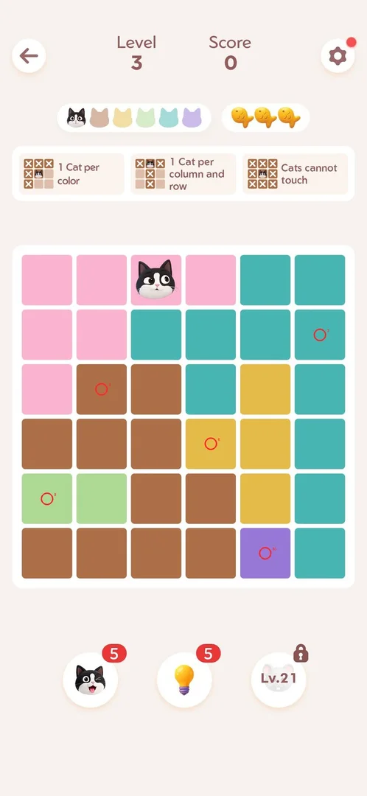
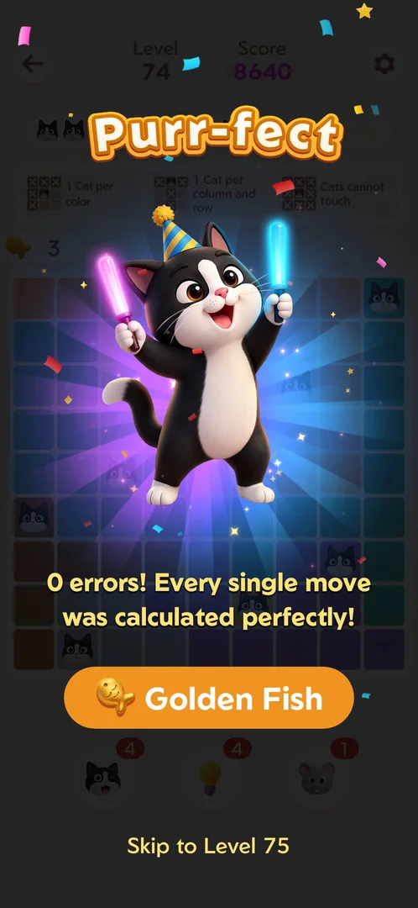

# How to play: Meowdoku

The player reads this before every level and works in the local copy `state/com.oakever.meowdoku/playbook.md`;
the dream merges it here. Level times: `sw.py playbook`.

## queens: Cat placement on color regions (Queens-like)
- Goal: N×N board with N colour regions; place N cats: one per region, row and column, no two cats
  touching (diagonals included) [s:20260930-233055-chrono-2FYKPJ#9].
- Controls: DOUBLE TAP places a cat (`sw.py taps "X,Y:2"`); a single tap or a swipe marks X (notes
  only). Boosters: cat (180,1357), hint (367,1357) → Apply, mouse (553,1357) [s:20261001-013526-chrono-2FYKPJ#77] [s:20261001-013526-chrono-2FYKPJ#80].
- Rules: a wrong cat costs 1 of 3 fish (orange X); at 0 fish "Out of Fishes" [s:20261001-013526-chrono-2FYKPJ#81] [s:20261001-022624-chrono-2FYKPJ#40].
- Method: solver [`solvers/com.oakever.meowdoku/queens.py`](../../../solvers/com.oakever.meowdoku/queens.py): reads the board from the
  screenshot (saturation bands, colours clustered by hue down to N groups), backtracks, returns at most
  3 double taps ([x, y, 2]) per round with `rescan`. It returns no moves (see its note) when the grid
  size, the regions or the cat count look wrong or the board has several solutions.
- **Fast method (from L84 on, every model): `solve queens` once to draw and read the solution, check it
  on the drawn frame, then place every cat in ONE `taps` batch of double taps** from the grid formula
  [s:20261001-115413-chrono-2FYKPJ#62] [s:20261001-115413-chrono-2FYKPJ#66] [s:20261001-182810-chrono-2FYKPJ#2]
  [s:20261001-223249-chrono-2FYKPJ#2]. Cell centres in the 730x1583 frame (normal levels; c = column,
  r = row, from 0):

  | Board | x | y | Source |
  |---|---|---|---|
  | 10x10 | 54 + 69c | 515 + 69r | [s:20261001-182810-chrono-2FYKPJ#2] |
  | 9x9 | 59 + 77c | 520 + 76.5r | [s:20261001-183504-chrono-2FYKPJ#8] |
  | 8x8 | 65 + 86c | 525 + 86r | [s:20261001-182810-chrono-2FYKPJ#10] |
  | 7x7 | 84 + 93.7c | 547 + 94r | [s:20261001-082114-chrono-2FYKPJ#30] |

  Skip the cell of a cat that is already on the board (a double tap there may remove it). `solve queens
  --run --rounds 8` also works (bench L97-99, L104-108) but needs 3-4 rounds [s:20261001-182015-chrono-2FYKPJ#4].
- When the solver reads the board wrong (it merged two similar colours on L84, left 1-5 cats out on
  L49-55, read nothing on L56), read the grid by hand into one letter per region and solve it with a
  short row-by-row search (one cat per row, column and region, no touching); each board has one
  solution [s:20261001-115413-chrono-2FYKPJ#9] [s:20261001-060942-chrono-2FYKPJ#60] [s:20261001-082114-chrono-2FYKPJ#4].
- `sw.py solve queens` draws the planned cats on the frame:

  

- Level plan: on Home tap "Level N" at **(365,1185)**; on the win screen the next-level button is at
  (365,1245). An interstitial follows almost every level start: `launch`, wait 3-4 s, `solve queens`,
  one `taps` batch, wait about 6 s, win screen [s:20261001-185238-chrono-2FYKPJ#10] [s:20261001-182810-chrono-2FYKPJ#9].

  > ⚠️ Previously (v1.18.0, 2026-10-01): "Level plan: tap Level N (365,1245)". That holds on the win
  > screen only; on Home (365,1245) does nothing [s:20261001-183504-chrono-2FYKPJ#1].
- After a win: from level 11 the leaderboard overlay comes first: Tap to Continue (365,1413), then
  look at the frame before the next-level button (365,1245) - the overlay can be late and a blind pair
  of taps drifts by a level [s:20260930-233055-chrono-2FYKPJ#72] [s:20261001-013526-chrono-2FYKPJ#110].
- **Golden-offer pitfall:** on the win screen of every 4th level (54, 58 ... 126) the next-level button
  is replaced by **Golden Fish** at the same place, so the routine tap (365,1245) starts the golden bonus
  board (one fish, about a minute, sometimes after an ad). Look at the frame first; to go on, tap "Skip
  to Level N" at (365,1475) [s:20261001-093348-chrono-2FYKPJ#64] [s:20261001-181422-chrono-2FYKPJ#11]
  [s:20261001-182015-chrono-2FYKPJ#20]. A golden board has no "Level" in its header (only "Score") and
  one fish: never record it as a level [s:20261001-181422-chrono-2FYKPJ#13].

  

- Out of Fishes (3 wrong cats): Restart (365,1398) is free and deals a NEW board for the same level;
  Get 3 Fishes is a rewarded ad that keeps the board [s:20261001-115413-chrono-2FYKPJ#43]
  [s:20261001-022624-chrono-2FYKPJ#42]. A booster at 0 offers a rewarded ad (2 ads, about 40 s) for
  1 charge [s:20261001-115413-chrono-2FYKPJ#57].
- Pitfalls:
  - Never press Android Back on Home: it opens a Quit popup; close it with the X (621,535)
    [s:20261001-185238-chrono-2FYKPJ#7] [s:20261001-185238-chrono-2FYKPJ#9].
  - A "1x1" solver read means a popup, an ad or Home is on screen, not a board: look at the frame and
    record nothing until the header shows the next "Level N" [s:20261001-185238-chrono-2FYKPJ#5]
    [s:20260930-233055-chrono-2FYKPJ#47].
  - Look at the frame before a continue tap after an ad: the "Install" card of an interstitial sits
    near (365,1413) and opened the Play Store once [s:20261001-060942-chrono-2FYKPJ#21].
  - The solver missed light colours (light blue, green, yellow) on 10x10 boards: check that every
    region has a cat [s:20261001-013526-chrono-2FYKPJ#106] [s:20261001-022624-chrono-2FYKPJ#16].
  - Record a level as won only after the win screen or the leaderboard, and name it from the "Level N"
    header, not from your own count: labels drifted by one in several sessions
    [s:20261001-013526-chrono-2FYKPJ#110] [s:20261001-060942-chrono-2FYKPJ#59] [s:20261001-184038-chrono-2FYKPJ#19].
  - Pattern Mode ON (icons on regions) does not change the rules; `solve --run` placed no cats on L85
    and L86 while it was ON (cause not proven). Switch it OFF in the level settings (575,758) after a
    test [s:20261001-115413-chrono-2FYKPJ#14] [s:20261001-115413-chrono-2FYKPJ#75].
  - Do not idle-wait on a screen for minutes: the phone dims and sleeps, and the next tap fails
    [s:20261001-223249-chrono-2FYKPJ#8].
  - Daily Challenge boards sit about 22 px lower; the solver still works [s:20261001-013526-chrono-2FYKPJ#106].
  - Back and the arrow do nothing on the win screen; go Home through the next level's back arrow
    [s:20261001-022624-chrono-2FYKPJ#62].

### Level times
| Levels | Result | Median | Range | Model | Source |
|---|---|---|---|---|---|
| tutorial–21 | won | 28 s | 18–123 s (L11: event and profile popups; L2: manual, 95 s) | opus | [s:20260930-233055-chrono-2FYKPJ#116] |
| 22–35 + Daily | won | about 50 s | 32–283 s (L23: a 3-minute playable ad) | sonnet | [s:20261001-013526-chrono-2FYKPJ#144] |
| 36–43 | won | 32 s | 21–165 s (L38: fish thrown away on purpose + ad) | sonnet | [s:20261001-022624-chrono-2FYKPJ#98] |
| 44–55 + golden | won (13 real) | about 50 s | 37–75 s; golden 7x7 by hand search 19 s | sonnet | [s:20261001-060942-chrono-2FYKPJ#116] |
| 56–66 + golden | won | 15 s from the board read | 14–17 s one hand batch; 22–27 s with deliberate mistakes; golden 53 s with a planned fail | sonnet | [s:20261001-082114-chrono-2FYKPJ#52] |
| 67–83 + 4 golden | won | about 55 s with the ad | only 3 level records written: times from the transcript | sonnet | [s:20261001-093348-chrono-2FYKPJ#113] |
| 84–96 + golden | won | about 25 s (one batch) | 23–39 s solve + one batch (L91–96); 63–100 s `solve --run` (L85–86, Pattern Mode ON) | sonnet | [s:20261001-115413-chrono-2FYKPJ#79] |
| 97–124 (bench, 8 slots) | won | about 50 s from the Level tap | 43–95 s, of it 9–30 s interstitial | haiku, sonnet, opus | [s:20261001-182810-chrono-2FYKPJ#15] [s:20261001-185238-chrono-2FYKPJ#26] |
| 125–126 | won | about 75 s | two levels in 2.5 min | sonnet | [s:20261001-223249-chrono-2FYKPJ#7] |

The mechanic's counter (`sw.py playbook`: 128 won, 3 quit, typical 1.0 min, best 0.2 min) overstates the
levels: four early records in 20261001-013526-chrono-2FYKPJ double-count levels, and in the bench slots
20261001-180616 to 185238 golden boards were recorded as levels, two wins were fake (185238: the frame was
the previous win screen) and one slot logged `level start` after the solve, so its 23–26 s are too low.
The times above come from the transcripts. Every level is far under the 5-minute budget.
