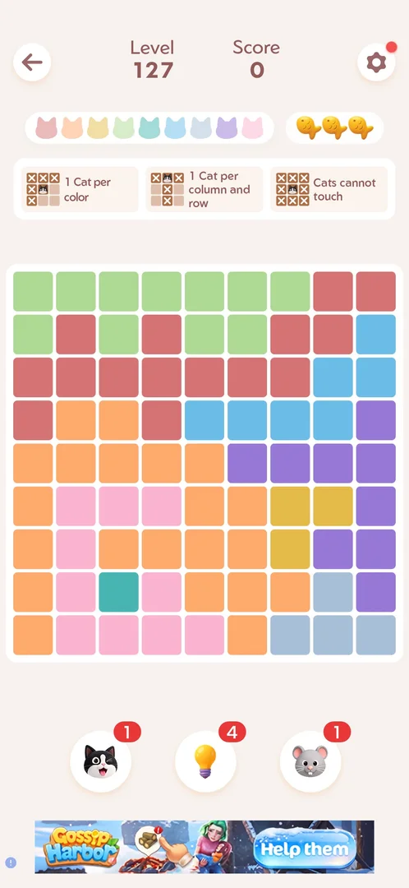
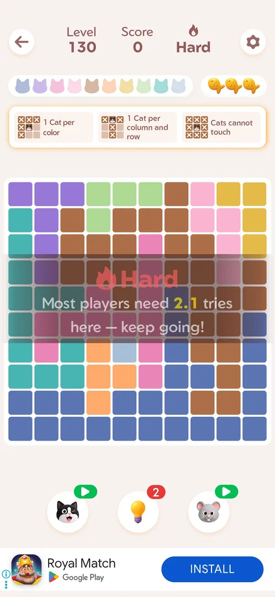

# Banner ad under the level board

A strip of advertising across the bottom of a [main level](level.md), under the three boosters. It shows
while the board is being played, has no close cross and gives nothing; once the last cat is placed it is gone
[^s1] [^s2] [^s3].
No other screen seen carries it [^s4].

## Why it appeared

On every main level seen, from Level 127 (the first level played on this account) to Level 130, from the
level's start; on 2026-10-05 it was there at the first view of Level 130's board
[^s1] [^s5] [^s6].
Hypothesis: it is shown on every main level from the first, or from some level before 127; earlier levels
were not seen, not verified.

## Where to find it

Inside a [main level](level.md): the bottom edge of the screen, under the cat, bulb and mouse boosters
[^s1]. Starting any level puts it there [^s6].
[Home](home.md) carries no banner: its bottom edge, under the Level 130 and Daily Challenge buttons and the
"players joined today" line, is empty [^s7]. Neither do the leaderboard, the
Daily Streak screen or the win screen [^s4].

 [^s1]
*Level 127 at its start: an image banner for another game across the bottom, under the three boosters; a small i badge at its left*

## What it looks like

 [^s6]
*Level 130, Hard: the banner under the cat, bulb and mouse boosters is an install card for another game: its icon, its name, "Google Play" and a blue INSTALL button*

 [^s2]
*Level 128: the same form for another advertiser*

Two forms were seen, both for other games, both in English
[^s1] [^s2]:

- An image banner with the game's art and a call to action ("Help them", "Play now"), narrower than the
  screen [^s1] [^s8].
- A full-width install card: the game's icon, its name, "Google Play" and a blue INSTALL button
  [^s2] [^s5] [^s6].

Both carry a small i badge (AdChoices) at the left edge [^s1]
[^s6]. No close cross [^s2].

## How it works

- Shown while the board is played; on the solved board of Level 127 and of Level 128 the strip was empty
  [^s3] [^s9].
- It came up a moment after the level opened, not with the board [^s6].
- On every level board, with no cadence: no level seen skipped it [^s4].
- The ad changes within a level: Level 128 opened with an image banner and showed an install card about 45 s
  later [^s8] [^s2].
- After the interstitial that followed Level 130, the banner was back on the board of Level 131
  [^s4].
- Reward: none [^s2].
- The banner was never tapped; the i badge was not tapped.

Version 1.19.1.

## Cases

| Case | What was done | Result | Source |
|---|---|---|---|
| Banner (an app install card with INSTALL button) under the boosters at the bottom of the level screen <!-- case:chk-screen --> | Seen on Levels 127 to 130; frame marked on Level 128 | ✅ | [^s2] |
| Banner at the bottom of the level screen <!-- case:chk-kind --> | Read from the level frames | ✅ | [^s2] |
| Not a rewarded placement: gives nothing <!-- case:chk-reward --> | Nothing given while it showed | ✅ | [^s2] |
| No close cross; it stays while the level is open <!-- case:chk-close --> | No cross on either form; the strip empty on the solved board | ✅ | [^s2] |
| Home carries no banner ad: under Level 130 (Hard), Daily Challenge and the players-joined line the bottom edge is empty <!-- case:home-none --> | Home looked at after launch, frame marked | ✅ | [^s7] |
| Why it appeared: on every level board from the first level seen (127); present on Level 130 at the first view of the board <!-- case:chk-appeared --> | Level 130 opened from Home after launch | ✅ | [^s6] |
| Where to find it: start any level; the banner sits under the boosters, not on Home <!-- case:chk-entry --> | Level 130 opened from Home | ✅ | [^s6] |
| How often it shows: on every level board, no cadence <!-- case:chk-frequency --> | Levels 127 to 131 looked at | ✅ | [^s4] |
| Banner at the bottom of the level board: an install card for Royal Match with an Install button <!-- case:banner-shown --> | Level 130 opened, frame marked | ✅ | [^s6] |
| Only on the level board: absent on Home, the leaderboard, the Daily Streak and the win screen <!-- case:banner-absent-win --> | Level 130 won, each screen after it looked at | ✅ | [^s4] |

## Not verified

- Whether levels before 127 show it (only Levels 127 to 131 were seen)
- Whether the Daily Challenge board carries a banner
- What a tap on the banner or on its i badge opens
- How often the ad in it changes within a level

[^s1]: session 20261003-201915-chrono-2FYKPJ, step 2 — [video at 0:55](https://youtu.be/ffhYgQE4LvU?t=55)
[^s2]: session 20261003-201915-chrono-2FYKPJ, step 15 — [video at 4:54](https://youtu.be/ffhYgQE4LvU?t=294)
[^s3]: session 20261003-201915-chrono-2FYKPJ, step 3 — [video at 1:28](https://youtu.be/ffhYgQE4LvU?t=88)
[^s4]: session 20261005-003925-chrono-2FYKPJ, step 14 — [video at 4:04](https://youtu.be/CkktBjH7fAI?t=244)
[^s5]: session 20261003-202631-chrono-2FYKPJ, step 1 — [video at 0:31](https://youtu.be/3-USmjAyOV8?t=31)
[^s6]: session 20261005-003925-chrono-2FYKPJ, step 5 — [video at 1:08](https://youtu.be/CkktBjH7fAI?t=68)
[^s7]: session 20261003-235107-chrono-2FYKPJ, step 0
[^s8]: session 20261003-201915-chrono-2FYKPJ, step 11 — [video at 4:10](https://youtu.be/ffhYgQE4LvU?t=250)
[^s9]: session 20261003-201915-chrono-2FYKPJ, step 17 — [video at 5:37](https://youtu.be/ffhYgQE4LvU?t=337)
