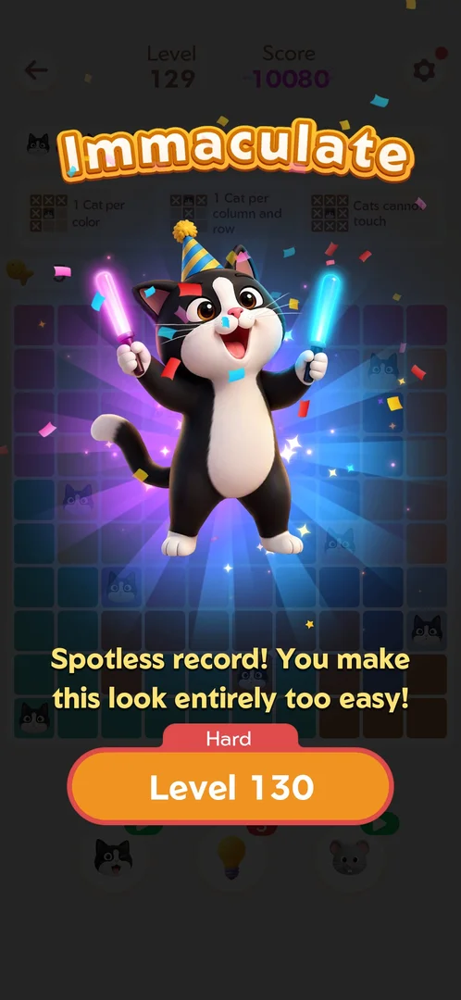
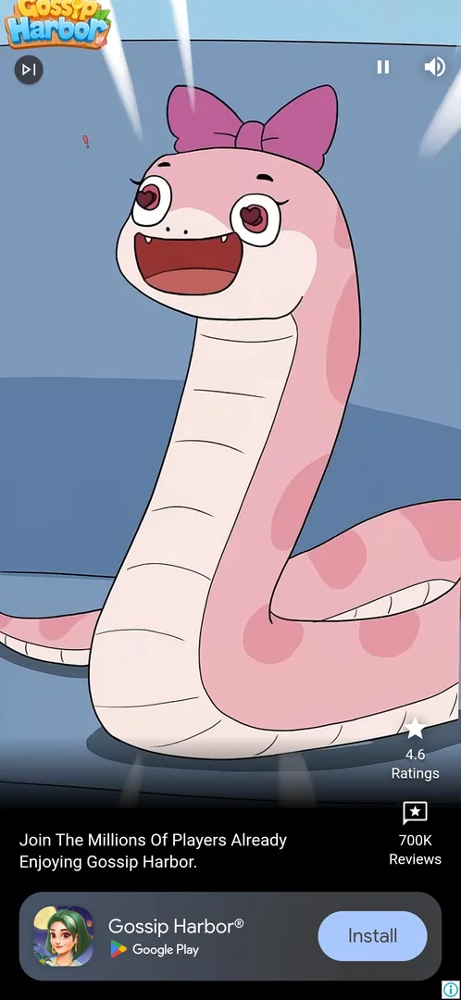
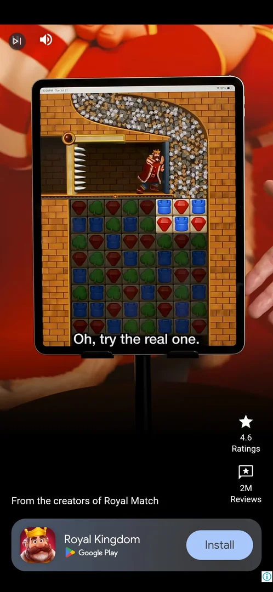
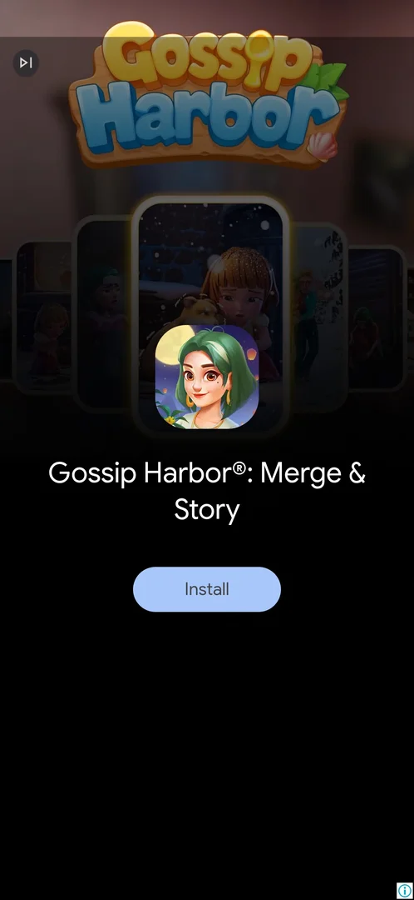

# Interstitial ad at level start

A full-screen ad the player does not choose. It played when a [main level](level.md) was started from the
win screen's next-level button, and when the level was restarted from the Out of Fishes loss screen. It gives
nothing [^s1] [^s2]
[^s3] [^s4].

## Why it appeared

Tapping Level 128 on the win screen of Level 127: a full-screen video and playable ad, a 9 s countdown, then
the cross [^s1]. The same after Level 129 (Level 130 button) and after Level 130
(Skip to Level 131) [^s2] [^s4].

## Where to find it

It is not opened by the player. It came after these taps:

- The next-level button on the win screen: Level 128 after Level 127, Level 130 after Level 129, Skip to
  Level 131 after Level 130 [^s1] [^s2]
  [^s4].
- Restart on the Out of Fishes screen, on Level 130 [^s3].

 [^s5]
*The win screen of Level 129: a tap on the Level 130 button played the interstitial before the level opened*

## What it looks like

 [^s6]
*The interstitial after Level 130's win: a third-party game's video; a skip icon top left, pause and sound top right, an install bar at the bottom*

 [^s2]
*The interstitial after Level 129's win: the same layout for another advertiser*

A full-screen video for another game: a skip icon top left, pause and sound (or mute) controls, ratings and
reviews on the right, a line of ad copy and an install bar at the bottom
[^s2] [^s6]. After Level 127 the video showed a
9 s countdown, then a close cross top right, and then a playable ad [^s1].

### End card

 [^s6]
*The end card after about 30 s of video: the game's icon and name and an Install button; no close cross was seen*

After Level 130 the video ran for about 30 s and ended on a card with the game's icon, name and an Install
button; a skip icon top left, no close cross [^s6].

## How it works

- When it showed (version 1.19.1, one account):
  - Win screen > next level: 3 of 3 times [^s1]
    [^s2] [^s4]; on 6 October, the Level 134 button on Level 133's win screen brought one too, the
    player waited about 25 s on it [^s13]. Skip to Level 135 on Level 134's win screen showed the board
    in the frame taken a second later, with the banner and no interstitial [^s14].
  - Out of Fishes > Restart: 1 of 1 [^s3].
  - Not seen: Level 130 opened from the Home button after launch went straight to the board
    [^s7]; reopening the same unfinished level from Home twice gave no ad
    [^s4]. Level 129 opened from the Home button with no ad
    [^s8]. Settings > Restart reopened the board with no ad
    [^s9]. The back arrow went straight to Home with no ad
    [^s10].
- Length: the cross after a 9 s countdown after Level 127 [^s1]; a video of
  about 30 s and then an end card after Level 130 [^s6].
- Closing: the playable part after Level 127 and the end card after Level 130 did not close cleanly. Each
  time the player relaunched the app, and the next level was open with an empty board; after Level 130 the
  banner was on Level 131's board [^s11] [^s12]
  [^s4].
- A tap at the top left (where the level's back arrow is) while the ad after Restart was on screen opened a
  Play Store sheet for the advertised game [^s3]. On 6 October, the control top left of the interstitial
  after Level 133 (where a skip icon sits) also opened the Play Store, not a close; launching the game again
  returned to it [^s15] [^s16].
- Reward: none [^s1].

Version 1.19.1.

## Cases

| Case | What was done | Result | Source |
|---|---|---|---|
| Full-screen video ad, then a playable ad; 9 s countdown before the cross top right <!-- case:chk-screen --> | Level 128 started from the win screen | ✅ | [^s1] |
| Interstitial (video, then a playable end card) shown when the next level starts <!-- case:chk-kind --> | Levels 128, 130 and 131 started from the win screen | ✅ | [^s1] [^s4] |
| 9 s countdown, then the cross; the playable part did not close cleanly, the app was relaunched to get out <!-- case:chk-close --> | App relaunched | ✅ | [^s11] |
| Not a rewarded placement: gives nothing <!-- case:chk-reward --> | Nothing given after it | ✅ | [^s1] |
| An interstitial video also plays after Out of Fishes > Restart; a tap at the top left hit the ad and opened a Play Store sheet <!-- case:after-retry --> | Restart on Out of Fishes, then the back arrow's spot tapped | ✅ | [^s3] |
| Why it appeared: tapping the next level on the win screen <!-- case:chk-appeared --> | After tapping Level 128 on the win screen | ✅ | [^s1] |
| Where to find it: the next level after a win (Skip to Level N, or the Level N button on the win screen) <!-- case:chk-entry --> | Skip to Level 131 tapped on Level 130's win screen | ✅ | [^s4] |
| How often it shows: after a win and the next level (Level 130 to 131); not on reopening the same level; whether every win or every Nth needs more levels <!-- case:chk-frequency --> | Level 130 opened twice from Home, then won and Skip to Level 131 | ✅ | [^s4] |
| Level start after launch showed no interstitial on Level 130 (Home straight to the board) <!-- case:no-ad-on-first-start --> | Level 130 tapped on Home | ✅ | [^s7] |
| Skip to Level 131 from the win screen: a video interstitial (about 30 s), then an end card with Install; a relaunch returned to Level 131's board with the banner <!-- case:after-win-next-level --> | Skip to Level 131 tapped, the ad waited out, the app relaunched | ✅ | [^s4] |
| Reopening the same unfinished level from Home (twice) gave no interstitial; the ad only after a win and the next level <!-- case:repeat-open-no-ad --> | Back to Home and Level 130 again, twice | ✅ | [^s4] |
| The control top left of the interstitial after the Level 133 win opened the Play Store, not a close; a launch returned to the game <!-- case:skip-icon --> | The top-left control tapped after a wait of about 25 s | ✅ | [^s15] |

## Not verified

- Whether it plays after every win or every Nth level: no run of several wins with the next-level button was counted
- How the end card closes without a relaunch: the control top left opens the Play Store (Level 133, 6 October); the close was not found
- Whether Skip to Level 135 skipped the interstitial or it came after the frame a second later (6 October)

[^s1]: session 20261003-201915-chrono-2FYKPJ, step 10 — [video at 3:22](https://youtu.be/ffhYgQE4LvU?t=202)
[^s2]: session 20261003-202631-chrono-2FYKPJ, step 7 — [video at 1:41](https://youtu.be/3-USmjAyOV8?t=101)
[^s3]: session 20261003-202631-chrono-2FYKPJ, step 19 — [video at 6:13](https://youtu.be/3-USmjAyOV8?t=373)
[^s4]: session 20261005-003925-chrono-2FYKPJ, step 14 — [video at 4:04](https://youtu.be/CkktBjH7fAI?t=244)
[^s5]: session 20261003-202631-chrono-2FYKPJ, step 6 — [video at 1:30](https://youtu.be/3-USmjAyOV8?t=90)
[^s6]: session 20261005-003925-chrono-2FYKPJ, step 13 — [video at 2:55](https://youtu.be/CkktBjH7fAI?t=175)
[^s7]: session 20261005-003925-chrono-2FYKPJ, step 5 — [video at 1:08](https://youtu.be/CkktBjH7fAI?t=68)
[^s8]: session 20261003-202631-chrono-2FYKPJ, step 1 — [video at 0:31](https://youtu.be/3-USmjAyOV8?t=31)
[^s9]: session 20261003-202631-chrono-2FYKPJ, step 15 — [video at 5:11](https://youtu.be/3-USmjAyOV8?t=311)
[^s10]: session 20261003-202631-chrono-2FYKPJ, step 21 — [video at 6:52](https://youtu.be/3-USmjAyOV8?t=412)
[^s11]: session 20261003-201915-chrono-2FYKPJ, step 11 — [video at 4:10](https://youtu.be/ffhYgQE4LvU?t=250)
[^s12]: session 20261003-202631-chrono-2FYKPJ, step 8 — [video at 2:06](https://youtu.be/3-USmjAyOV8?t=126)

[^s13]: session 20261006-010939-chrono-2FYKPJ, step 27 — [video at 4:44](https://youtu.be/hWdnTswKtkU?t=284)
[^s14]: session 20261006-010939-chrono-2FYKPJ, step 33 — [video at 6:29](https://youtu.be/hWdnTswKtkU?t=389)
[^s15]: session 20261006-010939-chrono-2FYKPJ, step 28 — [video at 5:41](https://youtu.be/hWdnTswKtkU?t=341)
[^s16]: session 20261006-010939-chrono-2FYKPJ, step 29 — [video at 5:53](https://youtu.be/hWdnTswKtkU?t=353)
