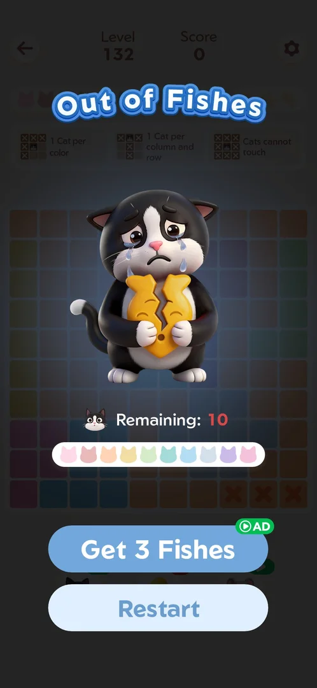
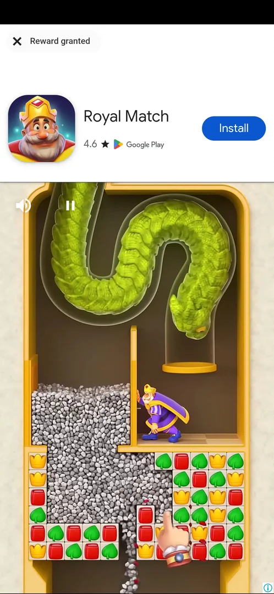
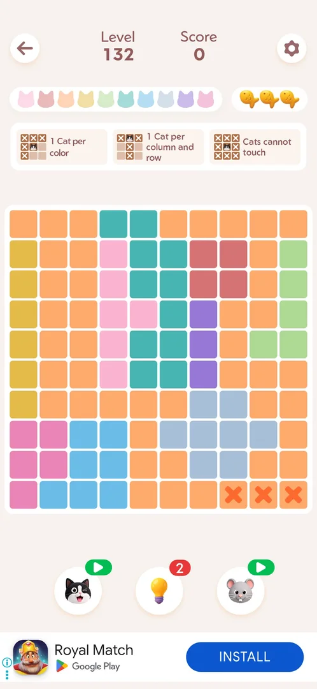

# Rewarded video (streak restore, booster refill)

An ad the player chooses to watch for a reward. Four offers were seen. A booster at zero charges shows a
green video icon, and a tap on it plays the ad for one charge. Out of Fishes offers Get 3 Fishes: three fish
and the same board. The Daily Streak popup offers Restore for a broken streak. A cleared Daily Challenge
offers Retry: the same board again [^s1] [^s4] [^s6] [^s5] [^s12].

## Why it appeared

Restore button on the Daily Streak interrupted popup after the first win of the day; booster badges turn into a video icon at 0 [^s1].

## Where to find it

- On the Out of Fishes loss screen, after the third wrong cat in a level: the blue Get 3 Fishes button with a
  green AD badge, above Restart [^s2].
- In a level: the [Cat booster](booster-cat.md) and the [Mouse booster](booster-mouse.md) under the board,
  when their badge is a green video icon (zero charges). A tap starts the ad at once, with no offer screen
  [^s8] [^s9] [^s10].
- On the Daily Streak popup after a broken streak: Restore, with a video icon [^s1].
- On Challenge Cleared after a [Daily Challenge](daily-challenge.md) clear: Retry, with a green AD badge,
  next to Continue [^s13].

 [^s2]
*Out of Fishes on Level 132: Get 3 Fishes, the blue button with the green AD badge, above Restart*

 [^s8]
*Level 130: the cat booster (bottom left) and the mouse booster (bottom right) at zero show a green video icon; the bulb still has a count (the banner ad is blacked out)*

## What it looks like

 [^s3]
*The Get 3 Fishes ad at its end: the close cross with "Reward granted" top left, a store card for another game with Install, the video below with mute and pause*

A full-screen ad for another game. The Get 3 Fishes ad ran about 40 s; at its end a close cross labelled
"Reward granted" showed top left, and the cross returned to the level [^s3] [^s5]. The booster ads were
other games' videos with a Google Play install bar, followed by an end card (START and BACK on the cat
booster's playable ad) [^s9] [^s10].

 [^s9]
*The ad played by the cat booster at zero: a third-party game's video, then a playable end card (START, BACK, an install bar); no close cross showed*

## What you can do

| Tab or button | What it does |
|---|---|
| [Get 3 Fishes](#get-3-fishes) | Out of Fishes: an ad for three fish, the board kept |
| [Booster video icon](#booster-video-icon) | A booster at zero: one ad gives one charge |
| [Restore](#restore) | Daily Streak popup: an ad to restore a broken streak |
| [Retry](#retry) | Challenge Cleared: an ad to replay the same daily board |

### Get 3 Fishes

 [^s4]
*Out of Fishes on Level 130: Get 3 Fishes carries a green AD badge; Restart under it*

The loss screen after the third wrong cat offers Get 3 Fishes with an AD badge [^s4] [^s2]. On Level 132 it
was tapped and the ad watched to the end: after the close cross the game was back on the same board, the
three wrong cats still crossed out, the fish counter full at three, the score unchanged [^s5]. See
[Main level](level.md#out-of-fishes).

#### Result

 [^s5]
*Back on Level 132 after the ad: the three wrong cells in the bottom row stay crossed out, three fish top right*

### Booster video icon

 [^s6]
*Back from the ad on Level 130: the cat booster (bottom left) shows a red 1 where the video icon was (the banner ad is blacked out)*

A tap on a booster's video icon starts the ad at once. On Level 130 (cat booster) the player left the ad by
relaunching the app about 100 s later, and the badge read 1 [^s9] [^s6]. On Level 131 (mouse booster) the
ad was a video of about 20 s, then an end card; back in the level the mouse's badge read 1 [^s10]. See
[Cat booster](booster-cat.md) and [Mouse booster](booster-mouse.md).

### Restore

 [^s1]
*The Daily Streak popup after a broken 2-day streak: "Watch a video to restore them", Restore (a video icon) and Give up*

After the day's first win, a broken streak brought up the [Daily Streak](daily-streak.md) popup: 2 to 0,
"Watch a video to restore them", Restore with a video icon and Give up [^s1]. Give up was chosen, so the
Restore ad was not watched.

### Retry

 [^s13]
*Challenge Cleared after the 10/06 daily: Retry, with the green AD badge, under Continue*

 [^s11]
*The Retry ad at its end: "Reward granted" and the close X top right*

The Retry button on Challenge Cleared plays a rewarded video. On 6 October it was tapped after the 10/06
daily was cleared in 00:22; after about 8 s the ad showed "Reward granted" with a close X, this time top
right [^s11]. Closing it returned to the same 10/06 board, rebuilt and empty: Score 0, three fish, the
stopwatch from 00:00 [^s14]. The retry, cleared with one wrong cat, ended on Challenge Cleared with "Time
00:38" and Retry (AD) offered again; no trial skin came up [^s12]. See
[Daily Challenge](daily-challenge.md#retry).

 [^s14]
*Back from the Retry ad: the same 10/06 board, empty, with three fish (the banner ad is blacked out)*

## How it works

- Rewards: one booster charge per ad (cat booster once, mouse booster once) [^s6] [^s10]; Get 3 Fishes: three
  fish, the board and its crosses kept [^s5]. Retry: the same daily board, emptied, with three fish and the
  stopwatch reset [^s14]. Restore: not watched.
- Closing: the Get 3 Fishes ad showed a close cross with "Reward granted" after about 40 s [^s5]; the
  Retry ad showed it top right after about 8 s [^s11]. No close
  cross was seen on the cat booster's ad in about 60 s; leaving it by relaunching the app still gave the
  charge [^s7] [^s6].
- Frequency: only the player starts it. The mouse booster's ad and the Get 3 Fishes ad played back to back
  within 5 minutes, both with their reward; no cooldown or cap was met [^s5]. The
  [interstitial](ad-interstitial.md) ads are separate.
- Inferred: the booster charge is given when the ad starts or when the player leaves it, not only after a
  full watch. Not verified.

Version 1.19.1.

## Cases

| Case | What was done | Result | Source |
|---|---|---|---|
| Rewarded video: the Restore button on the Daily Streak interrupted popup; the green video icon on a booster at 0 <!-- case:chk-kind --> | Both offers seen | ✅ | [^s1] |
| Daily Streak popup: 2 to 0, "Watch a video to restore them", Restore (video icon) and Give up <!-- case:chk-screen --> | Popup seen after the day's first win; Give up tapped | ✅ | [^s1] |
| Offers: a booster at 0 (no offer screen) gives 1 charge; Out of Fishes Get 3 Fishes; Daily Streak Restore (not watched) <!-- case:chk-reward --> | The cat booster's ad played; the badge read 1 after | ✅ | [^s6] |
| The cat booster's ad (a video, then a START/BACK end card) showed no close cross in about 60 s; leaving by relaunch still gave the charge <!-- case:chk-close --> | Ad left by relaunching the app | ✅ | [^s7] |
| Why it appeared: the trigger that brought it up (the first launch, a level won, a threshold, a timer, a loss): a fact with its frame, or a hypothesis to test <!-- case:chk-appeared --> | Restore on the Daily Streak popup, the video icon on boosters | ✅ | [^s1] |
| Where to find it: Get 3 Fishes on Out of Fishes, the video icon on the cat and mouse boosters at 0, Restore on the Daily Streak popup <!-- case:chk-entry --> | Get 3 Fishes and the mouse's video icon tapped | ✅ | [^s5] |
| Frequency: started by the player only; no cooldown seen, two ads back to back within 5 minutes both played <!-- case:chk-frequency --> | Mouse booster ad, then Get 3 Fishes | ✅ | [^s5] |
| Get 3 Fishes, watched in full, gives 3 fish and keeps the same board <!-- case:get3-fishes-reward --> | Three wrong cats on Level 132, Get 3 Fishes, ad watched, close cross | ✅ | [^s5] |
| Daily Challenge Retry (AD) after a clear: an ad of about 8 s, then the close X; the same board again with the cats cleared, the stopwatch and fish reset <!-- case:daily-retry --> | Retry tapped on the 10/06 Challenge Cleared, ad closed after Reward granted, the retry played and cleared with two fish | ✅ | [^s12] |

## Not verified

- What Restore gives after a full watch (a streak break did not come up again)
- Whether the hint booster at zero or a shop offers a video too
- A daily cap: no more than two rewarded ads were watched in one session
- Which best time the Daily Challenge keeps after a slower retry (00:22 first clear, 00:38 retry)

[^s1]: session 20261003-201915-chrono-2FYKPJ, step 4 — [video at 1:45](https://youtu.be/ffhYgQE4LvU?t=105)
[^s2]: session 20261005-123456-chrono-2FYKPJ, step 9 — [video at 3:36](https://youtu.be/rWZh07EjEAM?t=216)
[^s3]: session 20261005-123456-chrono-2FYKPJ, step 10 — [video at 3:55](https://youtu.be/rWZh07EjEAM?t=235)
[^s4]: session 20261003-202631-chrono-2FYKPJ, step 17 — [video at 5:46](https://youtu.be/3-USmjAyOV8?t=346)
[^s5]: session 20261005-123456-chrono-2FYKPJ, step 11 — [video at 4:50](https://youtu.be/rWZh07EjEAM?t=290)
[^s6]: session 20261003-202631-chrono-2FYKPJ, step 13 — [video at 4:46](https://youtu.be/3-USmjAyOV8?t=286)
[^s7]: session 20261003-202631-chrono-2FYKPJ, step 12 — [video at 4:27](https://youtu.be/3-USmjAyOV8?t=267)
[^s8]: session 20261003-202631-chrono-2FYKPJ, step 8 — [video at 2:06](https://youtu.be/3-USmjAyOV8?t=126)
[^s9]: session 20261003-202631-chrono-2FYKPJ, step 11 — [video at 2:43](https://youtu.be/3-USmjAyOV8?t=163)
[^s10]: session 20261005-123456-chrono-2FYKPJ, step 4 — [video at 2:07](https://youtu.be/rWZh07EjEAM?t=127)
[^s11]: session 20261006-021434-chrono-2FYKPJ, step 30 — [video at 8:29](https://youtu.be/Xj5RUsVHvCc?t=509)
[^s12]: session 20261006-021434-chrono-2FYKPJ, step 33 — [video at 9:27](https://youtu.be/Xj5RUsVHvCc?t=567)
[^s13]: session 20261006-021434-chrono-2FYKPJ, step 29 — [video at 7:57](https://youtu.be/Xj5RUsVHvCc?t=477)
[^s14]: session 20261006-021434-chrono-2FYKPJ, step 31 — [video at 8:37](https://youtu.be/Xj5RUsVHvCc?t=517)
