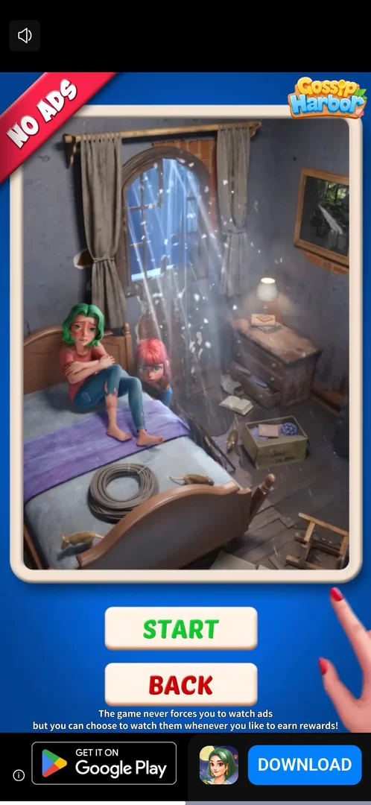

# Rewarded video (streak restore, booster refill)

An ad the player chooses to watch for a reward. Three offers were seen. A booster at zero charges shows a
green video icon, and a tap on it plays the ad for one charge. Out of Fishes offers Get 3 Fishes. The Daily
Streak popup offers Restore for a broken streak [^s1] [^s4] [^s5].

## Why it appeared

Restore button on the Daily Streak interrupted popup after the first win of the day; booster badges turn into a video icon at 0 [^s1].

## Where to find it

- In a level: the [Cat booster](booster-cat.md) and the [Mouse booster](booster-mouse.md) under the board,
  when their badge is a green video icon (zero charges). A tap starts the ad at once, with no offer screen
  [^s2] [^s3].
- On the Out of Fishes loss screen: the blue Get 3 Fishes button with a green AD badge [^s4].
- On the Daily Streak popup after a broken streak: Restore, with a video icon [^s1].

 [^s2]
*Level 130: the cat booster (bottom left) and the mouse booster (bottom right) at zero show a green video icon; the bulb still has a count (the banner ad is blacked out)*

## What it looks like

 [^s3]
*The ad played by the cat booster at zero: a third-party game's video, then a playable end card (START, BACK, an install bar); no close cross showed*

The ad from the cat booster ran full screen. It was a video for another game, followed by a playable end
card with START and BACK, a mute button and an install bar. No close cross had appeared after about 60 s
[^s3] [^s6].

## What you can do

| Tab or button | What it does |
|---|---|
| [Booster video icon](#booster-video-icon) | A booster at zero: one ad gives one charge |
| [Get 3 Fishes](#get-3-fishes) | Out of Fishes: an ad for three fish |
| [Restore](#restore) | Daily Streak popup: an ad to restore a broken streak |

### Booster video icon

 [^s5]
*Back from the ad on Level 130: the cat booster (bottom left) shows a red 1 where the video icon was (the banner ad is blacked out)*

A tap on the cat booster's video icon on Level 130 started the ad at once. The player left the ad by
relaunching the app about 100 s later, and the booster's badge read 1 [^s3] [^s5]. See
[Cat booster](booster-cat.md).

### Get 3 Fishes

 [^s4]
*Out of Fishes: Get 3 Fishes carries a green AD badge; Restart under it*

The loss screen after the third wrong cat offers Get 3 Fishes with an AD badge [^s4]. It was not tapped: what
it gives (three fish with the board kept, or a restart) is not verified. See
[Main level](level.md#out-of-fishes).

### Restore

 [^s1]
*The Daily Streak popup after a broken 2-day streak: "Watch a video to restore them", Restore (a video icon) and Give up*

After the day's first win, a broken streak brought up the [Daily Streak](daily-streak.md) popup: 2 to 0,
"Watch a video to restore them", Restore with a video icon and Give up [^s1]. Give up was chosen, so the
Restore ad was not watched.

## How it works

- Reward: one booster charge per ad (seen once, for the cat booster) [^s5]. Get 3 Fishes and Restore: not
  watched.
- Closing: no close cross was seen on the cat booster's ad. Leaving it by relaunching the app still gave
  the charge [^s6] [^s5].
- Inferred: the charge is given when the ad starts or when the player leaves it, not only after a full
  watch. Not verified.

Version 1.19.1.

## Cases

| Case | What was done | Result | Source |
|---|---|---|---|
| Rewarded video: the Restore button on the Daily Streak interrupted popup; the green video icon on a booster at 0 <!-- case:chk-kind --> | Both offers seen | ✅ | [^s1] |
| Daily Streak popup: 2 to 0, "Watch a video to restore them", Restore (video icon) and Give up <!-- case:chk-screen --> | Popup seen after the day's first win; Give up tapped | ✅ | [^s1] |
| Offers: a booster at 0 (no offer screen) gives 1 charge; Out of Fishes Get 3 Fishes (not watched); Daily Streak Restore (not watched) <!-- case:chk-reward --> | The cat booster's ad played; the badge read 1 after | ✅ | [^s5] |
| The cat booster's ad (a video, then a START/BACK end card) showed no close cross in about 60 s; leaving by relaunch still gave the charge <!-- case:chk-close --> | Ad left by relaunching the app | ✅ | [^s6] |
| Why it appeared: the trigger that brought it up (the first launch, a level won, a threshold, a timer, a loss): a fact with its frame, or a hypothesis to test <!-- case:chk-appeared --> | Restore on the Daily Streak popup, the video icon on boosters | ✅ | [^s1] |

## Not verified

- Where to find it: every place that offers it; three were seen (booster at zero, Get 3 Fishes, Restore), and whether the hint booster or a shop offers one too is not seen <!-- case:chk-entry -->
- How often it can be watched: a daily cap or a cooldown on the booster refill <!-- case:chk-frequency -->
- What Get 3 Fishes and Restore give after a full watch

[^s1]: session 20261003-201915-chrono-2FYKPJ, step 4 — [video at 1:45](https://youtu.be/ffhYgQE4LvU?t=105)
[^s2]: session 20261003-202631-chrono-2FYKPJ, step 8 — [video at 2:06](https://youtu.be/3-USmjAyOV8?t=126)
[^s3]: session 20261003-202631-chrono-2FYKPJ, step 11 — [video at 2:43](https://youtu.be/3-USmjAyOV8?t=163)
[^s4]: session 20261003-202631-chrono-2FYKPJ, step 17 — [video at 5:40](https://youtu.be/3-USmjAyOV8?t=340)
[^s5]: session 20261003-202631-chrono-2FYKPJ, step 13 — [video at 4:40](https://youtu.be/3-USmjAyOV8?t=280)
[^s6]: session 20261003-202631-chrono-2FYKPJ, step 12 — [video at 4:22](https://youtu.be/3-USmjAyOV8?t=262)
