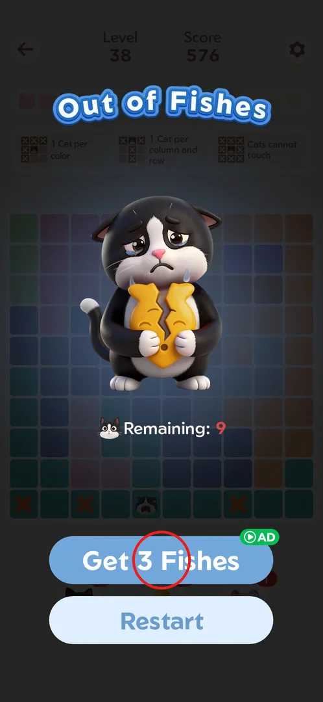
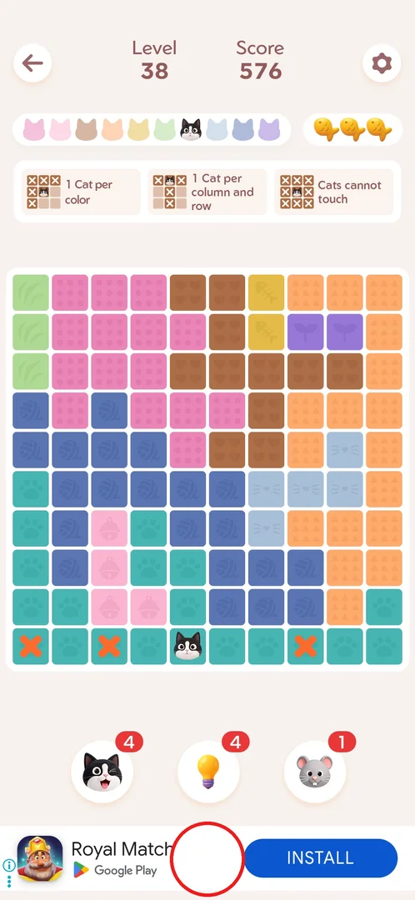
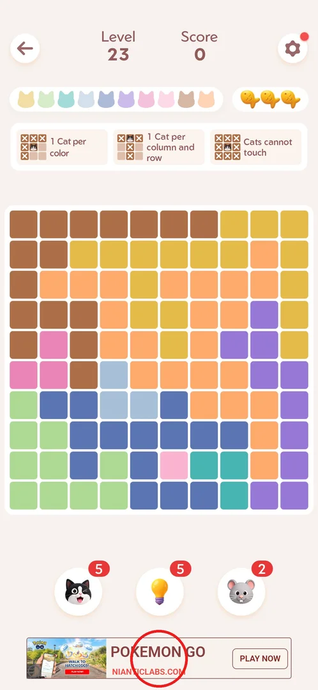
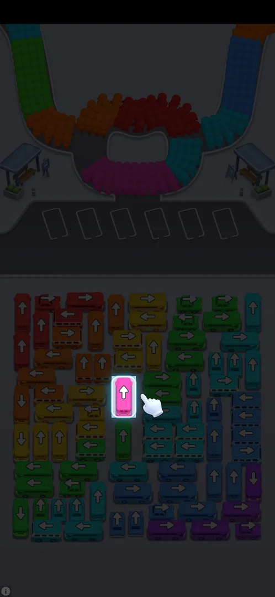
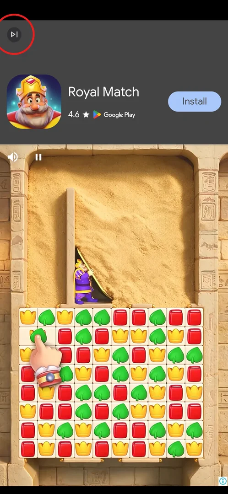
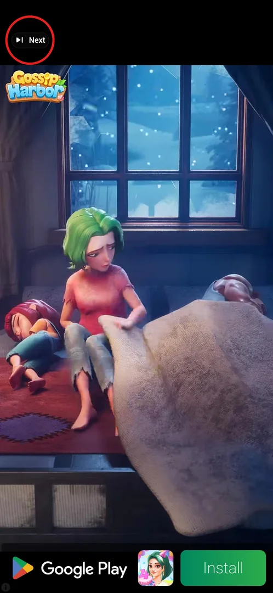
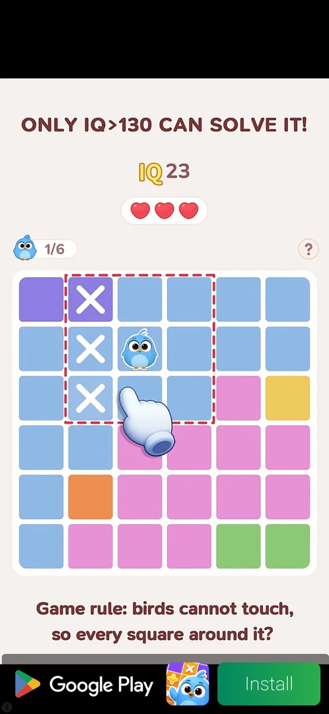

# Ads

Meowdoku is free and pays for itself with three kinds of ads: a banner under the board in most levels
from level 23 (levels 30 and 36 showed none) [^s15] [^s16], full-screen interstitials that play when a level starts or restarts, and one rewarded
ad the player chooses to watch, "Get 3 Fishes", to keep playing a level after losing all three
fish [^s3] [^s8] [^s6]. No remove-ads purchase was found [^s12].

## Where to find it

The only ad the player opens on purpose is behind **Get 3 Fishes** (green "AD" badge) on the
"Out of Fishes" popup, which comes after the third wrong cat in a level; Restart sits below it [^s1].
The other ads come by themselves: the banner from level 23 on [^s3], interstitials on level start,
on Restart in the level settings and before the Daily Challenge [^s8] [^s4] [^s9].

 [^s1]

## What it looks like

In a level the banner takes the strip under the three boosters (cat, bulb, mouse); the board, the
fish and the rule cards stay above it [^s3]. This frame is level 38 right after the rewarded ad: the
3 fish are back, and the placed cat, the orange X marks and the score 576 are kept [^s2].

 [^s2]

## What you can do

| Tab or button | What it does |
|---|---|
| [Banner](#banner) | At the bottom of most levels from level 23 (none on levels 30 and 36); nothing to do with it [^s3] [^s15] [^s16] |
| [Interstitial playable](#interstitial-playable) | A full-screen mini-game ad at level start with no close button [^s5] [^s8] |
| [Interstitial video](#interstitial-video) | A full-screen video ad at level start with a skip icon at the top left [^s7] |
| [Restart](#restart) | Restart in the level settings plays a video interstitial, then restarts the level [^s4] |
| [Get 3 Fishes](#get-3-fishes) | Rewarded ad on "Out of Fishes": watch it and the level goes on with 3 fish [^s6] [^s2] |

### Banner

From level 23 a banner appears at the bottom of the level screen, under the boosters; it was there in
most later levels and in the Daily Challenge, but not on levels 30 and 36 [^s3] [^s9] [^s15] [^s16]. The advertised game changes (Pokemon GO
here, Royal Match in level 38) [^s3] [^s2].

 [^s3]

### Interstitial playable

Starting a level can bring up a full-screen playable ad (a bus jam puzzle, Google Play label) with no
close button: Back did not close it, and neither did playing it with dozens of taps [^s8] [^s11]. The
player got back only by relaunching the game, which returned to the level [^s10].
The first one, before level 23, cost about 4 minutes [^s10].

 [^s5]

### Interstitial video

The interstitial at level start can also be a video (Royal Match here) with a small skip icon at the
top left; relaunching the game dismissed it as well [^s7].

 [^s7]

### Restart

Restart in the in-level settings (gear) plays a video interstitial with a "Next" skip button at the
top left, then restarts the level: the board is reset, fish back to 3, score 0 [^s4].

 [^s4]

### Get 3 Fishes

After three wrong cats the "Out of Fishes" popup offers **Get 3 Fishes** (rewarded ad) and Restart
[^s1]. The rewarded ad was a playable of about 30 s (a bird queens puzzle) with no usable close; after
~30 s the player relaunched the game and was back in the level with 3 fish, the board and the score
kept [^s6] [^s2].

 [^s6]

## How it works

Version 1.18.0.

- Banner: in most levels from level 23 (not on levels 30 and 36), at the bottom of the level screen,
  Daily Challenge included [^s3] [^s9] [^s15] [^s16].
- Interstitials: on level start, on Restart in the level settings and before entering the Daily
  Challenge [^s8] [^s4] [^s9]; how often they come is unknown. Two formats: a playable with no close
  button and a video with a skip icon [^s5] [^s7].
- Rewarded: only "Get 3 Fishes" on the "Out of Fishes" popup; the reward is 3 fish and the level goes
  on where it stopped [^s6] [^s2].
- No remove-ads offer on Home, in the home settings or in the level settings [^s12] [^s14]. The
  in-game support center (Settings → Feedback) lists an article about closing an ad [^s13].

## Cases

| Case | What was done | Result | Source |
|---|---|---|---|
| Banner | Played levels from 23 | Banner at the bottom of most level screens; none on levels 30 and 36 | [^s3] [^s15] [^s16] |
| Interstitial | Level start, Restart, Daily Challenge | Playables with no close button (taps and Back ignored; relaunch returns to the level) or videos with a skip icon | [^s8] [^s7] [^s4] [^s9] |
| Rewarded | Lost all 3 fish in level 38, tapped Get 3 Fishes | ~30 s playable; back in the level with 3 fish, board and score kept | [^s6] [^s2] |
| Remove ads | Looked on Home and in both settings popups | Not found | [^s12] |
| How often interstitials come per level start | — | not verified | |

## Not verified

- A remove-ads purchase anywhere (none on Home or in either settings popup; no shop was seen).
- How often interstitials come per level start.
- Whether closing the rewarded ad early still gives the fish, and whether Restart on the
  "Out of Fishes" popup shows an ad.

[^s1]: session 20261001-022624-chrono-2FYKPJ, step 40
[^s2]: session 20261001-022624-chrono-2FYKPJ, step 42
[^s3]: session 20261001-013526-chrono-2FYKPJ, step 15 — [video at 5:23](https://youtu.be/T86pLfervRE?t=323)
[^s4]: session 20261001-013526-chrono-2FYKPJ, step 84 — [video at 17:03](https://youtu.be/T86pLfervRE?t=1023)
[^s5]: session 20261001-022624-chrono-2FYKPJ, step 18
[^s6]: session 20261001-022624-chrono-2FYKPJ, step 41
[^s7]: session 20261001-022624-chrono-2FYKPJ, step 55
[^s8]: session 20261001-013526-chrono-2FYKPJ, step 10 — [video at 2:07](https://youtu.be/T86pLfervRE?t=127)
[^s9]: session 20261001-013526-chrono-2FYKPJ, step 100 — [video at 20:43](https://youtu.be/T86pLfervRE?t=1243)
[^s10]: session 20261001-013526-chrono-2FYKPJ, step 20 — [video at 5:58](https://youtu.be/T86pLfervRE?t=358)
[^s11]: session 20261001-013526-chrono-2FYKPJ, step 12 — [video at 3:15](https://youtu.be/T86pLfervRE?t=195)
[^s12]: session 20261001-022624-chrono-2FYKPJ, step 74
[^s13]: session 20261001-022624-chrono-2FYKPJ, step 23
[^s14]: session 20261001-022624-chrono-2FYKPJ, step 67
[^s15]: session 20261001-013526-chrono-2FYKPJ, step 69 — [video at 14:30](https://youtu.be/T86pLfervRE?t=870)
[^s16]: session 20261001-022624-chrono-2FYKPJ, step 11
