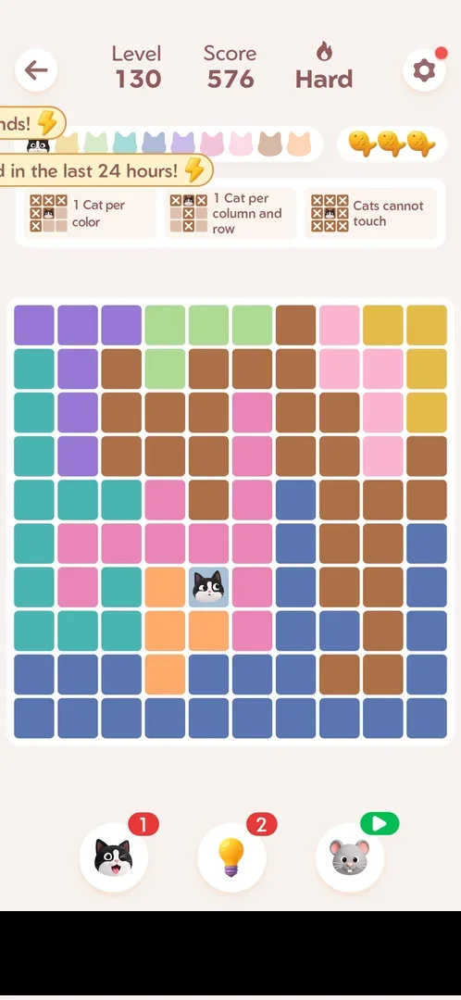
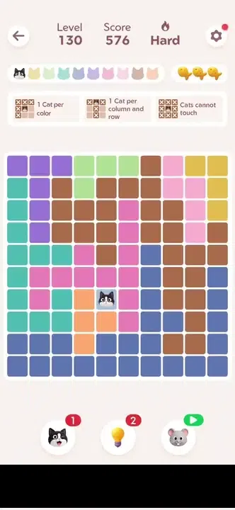
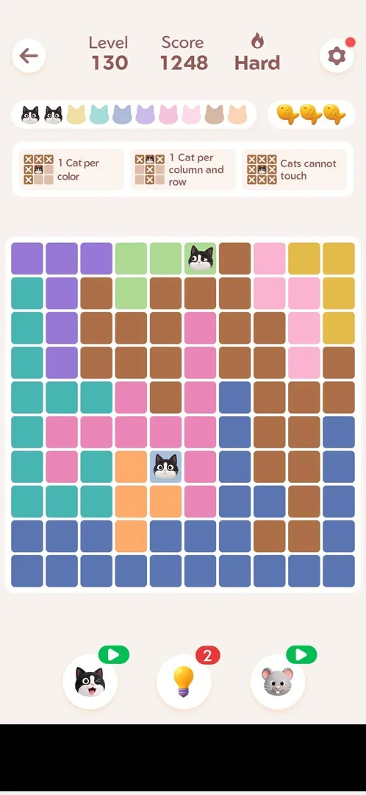
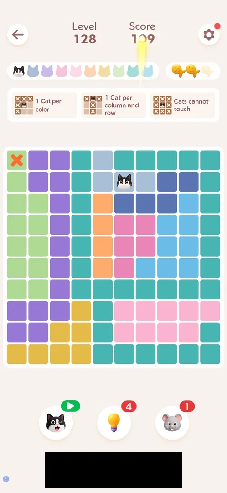

# Cat booster

The first of the three boosters under the board of a [main level](level.md). One tap places one correct cat
on the board. The button has a red count badge. At zero the badge turns into a green video icon, and a tap
plays a rewarded ad that gives one more [^s3] [^s4] [^s5].

## Why it appeared

On the level HUD at level 127, count 1 [^s1].

## Where to find it

Inside a [main level](level.md): the winking cat button is the left one of the three round boosters under
the board [^s2]. Its badge shows the count, or a green video icon when the count is zero
[^s5].

 [^s2]
*Level 127: the winking cat button, left of the three boosters under the board, count 1*

 [^s5]
*Level 130, back from the rewarded ad: the cat button (bottom left) shows 1 again (the banner ad at the bottom is blacked out)*

## What it looks like

<!-- no-screen: the booster has no screen of its own; one tap acts on the board at once -->

The booster has no screen of its own. One tap placed a cat on the board at once, with no confirmation, on
Level 128 and again on Level 130 [^s3] [^s5].

 [^s5]
*Clip 3.4 s · [original on YouTube from 4:37](https://youtu.be/3-USmjAyOV8?t=277)*

### Result

 [^s5]
*Level 130 after one Cat booster: the new cat in the green region (top row), the second cat head in the bar turned black, score 1248, the badge back to a video icon (the banner ad is blacked out)*

 [^s3]
*Level 128 right after the Cat booster: a cat in the pale-blue region (second row), the matching cat head in the top row turned black, the badge now a green video icon (the banner ad at the bottom is blacked out)*

## How it works

- One use places one cat on a cell of the solution. On Level 128 it went into the pale-blue region (second
  row, sixth column) [^s3]. On Level 130 it went into the green region (top row, sixth column) while one cat
  was already on the board [^s5]. How it picks the region was not verified.
- The cat head of that colour in the bar above the board turns from pale to black [^s3]
  [^s5].
- Score: on Level 130 it went from 576 to 1248 (+672) for the booster's cat [^s5].
  The first cat on that board, placed by the [Hint booster](booster-hint.md), gave +576
  [^s6]. Inferred: the booster's cat scores like any placed cat, and each cat
  is worth more than the one before. Not verified.
- No fish lost: the fish box kept all three fish on Level 130 [^s5].
- Count: it was 1 on Levels 127 and 128 before use, then 0 after the one use [^s3]. It stayed at 0 (the video
  icon) through the wins of Levels 128 and 129 [^s7] [^s8].
- At 0, a tap on the video icon played a rewarded ad (a video, then a playable ad). The app was relaunched
  to leave it about 100 s later, and the badge read 1 [^s4]
  [^s5]. One ad gives one charge.
- Restarting the level (Settings > Restart) did not give the spent charge back: the badge stayed a video icon
  [^s9].

Version 1.19.1.

## Cases

| Case | What was done | Result | Source |
|---|---|---|---|
| Places one correct cat at once, no confirmation; +672 score on Level 130 (576 to 1248); no fish cost <!-- case:chk-effect --> | Tapped with 1 charge on Level 128 and on Level 130 | ✅ | [^s3] [^s5] |
| Count on a red badge; 1 at Levels 127-128; at 0 a green video icon <!-- case:chk-balance --> | Badge read before and after each use | ✅ | [^s5] |
| At 0 a tap plays a rewarded ad <!-- case:chk-empty --> | Video icon tapped on Level 130 | ✅ | [^s4] |
| Where to find it: the left booster under the board in a level <!-- case:chk-entry --> | The winking cat button tapped | ✅ | [^s2] [^s5] |
| No screen of its own: one tap places the cat <!-- case:chk-screen --> | Tapped twice in two levels | ✅ | [^s5] |
| Sources: the rewarded ad at 0 gives 1 charge; two level wins gave none <!-- case:chk-sources --> | Ad played and left by relaunching the app | ✅ | [^s6] |
| Sinks: spent only by a use in a level <!-- case:chk-sinks --> | Two uses; Restart did not refund | ✅ | [^s9] |
| Refill: by the ad only (1 charge); no timer seen <!-- case:chk-refill --> | Count watched over Levels 128-130 | ✅ | [^s5] |
| Why it appeared: the trigger that brought it up (the first launch, a level won, a threshold, a timer, a loss): a fact with its frame, or a hypothesis to test <!-- case:chk-appeared --> | On the level HUD from the first level seen | ✅ | [^s1] |

## Not verified

- Whether the ad gives the charge when it is watched to its end rather than left by relaunching the app (the
  charge came either way here)
- Whether the Daily Streak gift or the event rewards pay cats
- Whether the count refills by itself over a longer time (no timer was shown)

[^s1]: session 20261003-200440-chrono-2FYKPJ, step 3 — [video at 1:05](https://youtu.be/Pqx4QY-FpBA?t=65)
[^s2]: session 20261003-201915-chrono-2FYKPJ, step 3 — [video at 1:28](https://youtu.be/ffhYgQE4LvU?t=88)
[^s3]: session 20261003-201915-chrono-2FYKPJ, step 13 — [video at 4:28](https://youtu.be/ffhYgQE4LvU?t=268)

[^s4]: session 20261003-202631-chrono-2FYKPJ, step 11 — [video at 2:43](https://youtu.be/3-USmjAyOV8?t=163)
[^s5]: session 20261003-202631-chrono-2FYKPJ, step 13 — [video at 4:40](https://youtu.be/3-USmjAyOV8?t=280)
[^s6]: session 20261003-202631-chrono-2FYKPJ, step 12 — [video at 4:22](https://youtu.be/3-USmjAyOV8?t=262)
[^s7]: session 20261003-202631-chrono-2FYKPJ, step 5 — [video at 1:06](https://youtu.be/3-USmjAyOV8?t=66)
[^s8]: session 20261003-202631-chrono-2FYKPJ, step 9 — [video at 2:23](https://youtu.be/3-USmjAyOV8?t=143)
[^s9]: session 20261003-202631-chrono-2FYKPJ, step 15 — [video at 5:05](https://youtu.be/3-USmjAyOV8?t=305)
