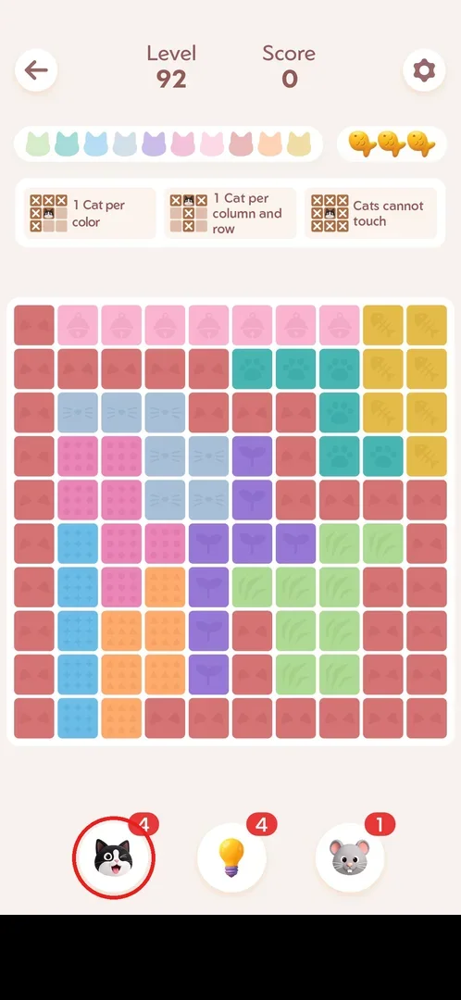
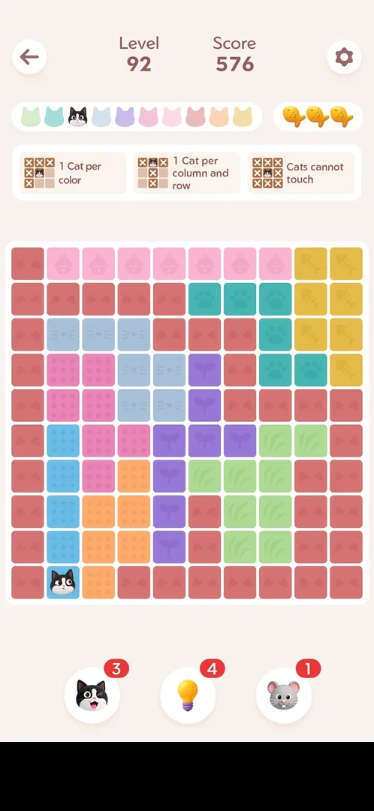
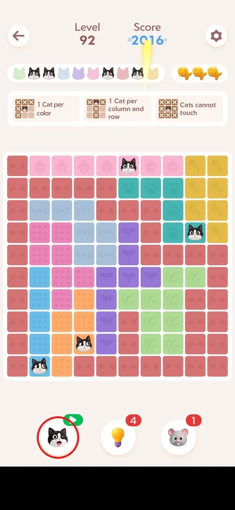
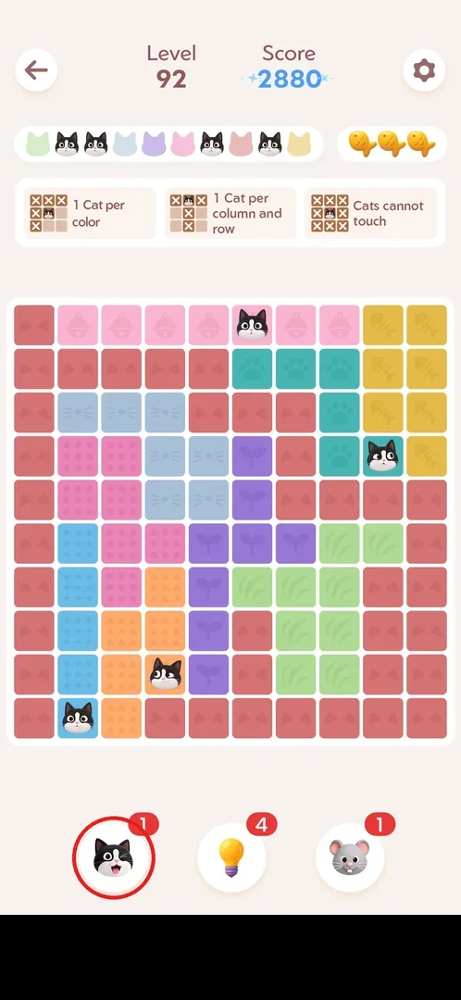

# Cat booster

The cat booster is the strongest of the three in-level helpers in Meowdoku: one tap puts a correct cat
on the board at once, with no preview and no confirmation, and takes one charge off its counter [^s2] [^s4].
A fresh game starts with 5 charges [^s1]. When the charges run out, the button turns into a rewarded
ad that gives one charge back [^s7] [^s8].

## Where to find it

The booster lives in every level, not in a menu: it is the left of the three round buttons under the
board (cat, lightbulb [hint](hint.md), mouse [booster-lv21](booster-lv21.md)), with its charges in the red
badge [^s1] [^s3]. It was the same in the Daily Challenge and on a Golden Fish board [^s9] [^s10].

 [^s3]

## What it looks like

A round white button with a winking black-and-white cat face; the red badge at its top right shows the
charges left [^s3]. After a tap a cat appears in one cell, its colour lights up in the cat strip at the
top, and the score goes up (0 → 576 for the first cat in levels 31 and 92) [^s2] [^s4].

 [^s4]

## What you can do

| Tab or button | What it does |
|---|---|
| [At zero](#at-zero) | With no charges left the red counter becomes a green play badge [^s6] |
| [Rewarded ad](#rewarded-ad) | Tapping it at zero starts a rewarded ad at once, no dialog [^s7] |
| [Reward granted](#reward-granted) | After two ads (~40 s) the ad says "Reward granted"; X closes it [^s7] [^s8] |
| [Refilled](#refilled) | Back in the level the booster has 1 charge; it is not used by itself [^s8] |

### At zero

In level 92 the booster was tapped four times, from 4 to 0; each tap placed one more correct cat. At
0 the red counter is replaced by a green badge with a play triangle — the sign of a rewarded ad [^s6].

 [^s6]

### Rewarded ad

The fifth tap, at zero, opened no refill dialog: a full-screen rewarded ad started straight away,
labelled "Ad 1 of 2" [^s7]. See also [Ads](ads.md).

 [^s7]

### Reward granted

After "Ad 1 of 2" and "Ad 2 of 2" (about 40 s in all) the ad shows "Reward granted" with an X at the
top left that closes it [^s8].

 [^s7]

### Refilled

Closing the ad returns to the same level: the booster shows 1 charge, and no cat is placed until the
player taps it again [^s8].

 [^s8]

## How it works

Version 1.18.0.

- Stock: 5 charges at level 1 of a fresh install [^s1]. Charges carry over between levels: after one use
  in level 31 the counter stayed at 4 in the following levels, the Daily Challenge and Golden Fish [^s2] [^s9] [^s10].
- Effect: one tap = one correct cat, placed immediately, no preview or Apply step (unlike the
  [hint](hint.md), which previews a cell and needs Apply) [^s2].
- Restarting a level does not refund charges used in it [^s11].
- Using it does not spoil the win title: level 92 won with 4 booster cats and 0 mistakes still got
  "Perfect" [^s12].
- At 0 charges: tap → two rewarded ads (~40 s) → +1 charge [^s8].

## Cases

| Case | What was done | Result | Source |
|---|---|---|---|
| Use | Tapped the booster in level 31 | Places a correct cat at once, no preview; 5 → 4, score +576 | [^s2] |
| Use to zero | Tapped it 4 times in level 92 | 4 correct cats, 4 → 0, badge becomes a green play icon | [^s6] |
| Tap at zero | Tapped it at 0 | Rewarded ad "Ad 1 of 2" starts at once, no dialog | [^s7] |
| Watch the ad | Watched both ads, closed with X | "Reward granted"; counter 1, not applied by itself | [^s8] |
| Restart after use | Restart in the level settings | Board reset, charges not refunded (4/4/1) | [^s11] |

## Not verified

- Whether the booster can be bought for coins or earned in other ways (daily rewards, events); no
  shop was seen.
- Whether the ad refill can be repeated without limit, and whether the ad is always two ads long.
- How the booster chooses which cat to place (the cells were in different regions each time).
- The score per booster cat beyond the first (+576 in both levels seen).

[^s1]: session 20260930-233055-chrono-2FYKPJ, step 10 — [video at 2:20](https://youtu.be/kfHedtB_k4Q?t=140)
[^s2]: session 20261001-013526-chrono-2FYKPJ, step 79 — [video at 16:08](https://youtu.be/T86pLfervRE?t=968)
[^s3]: session 20261001-115413-chrono-2FYKPJ, step 51
[^s4]: session 20261001-115413-chrono-2FYKPJ, step 52
[^s6]: session 20261001-115413-chrono-2FYKPJ, step 55
[^s7]: session 20261001-115413-chrono-2FYKPJ, step 56
[^s8]: session 20261001-115413-chrono-2FYKPJ, step 57

[^s9]: session 20261001-013526-chrono-2FYKPJ, step 100 — [video at 20:43](https://youtu.be/T86pLfervRE?t=1243)
[^s10]: session 20261001-093348-chrono-2FYKPJ, step 1
[^s11]: session 20261001-013526-chrono-2FYKPJ, step 85 — [video at 17:28](https://youtu.be/T86pLfervRE?t=1048)
[^s12]: session 20261001-115413-chrono-2FYKPJ, step 59
