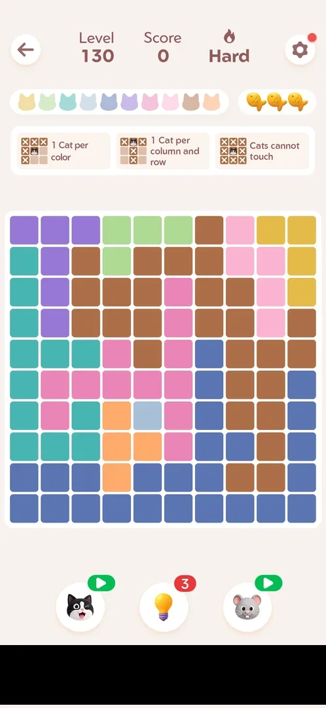
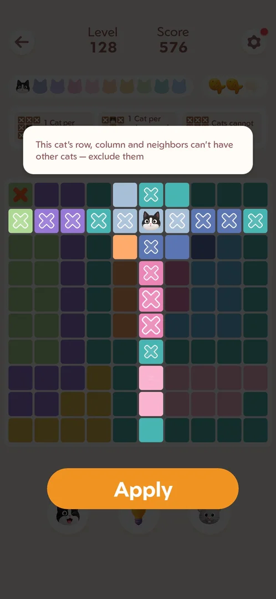
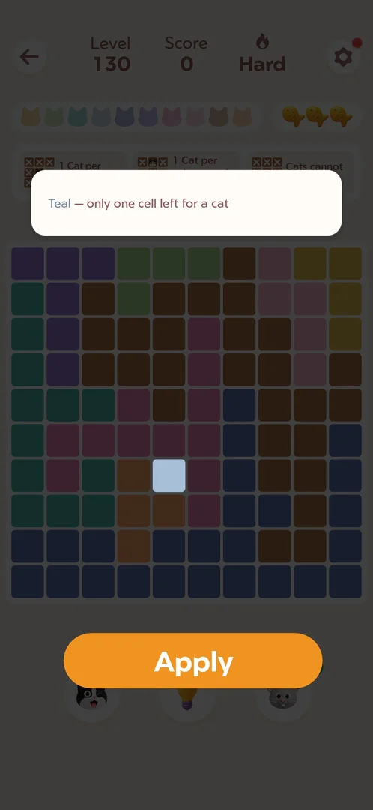
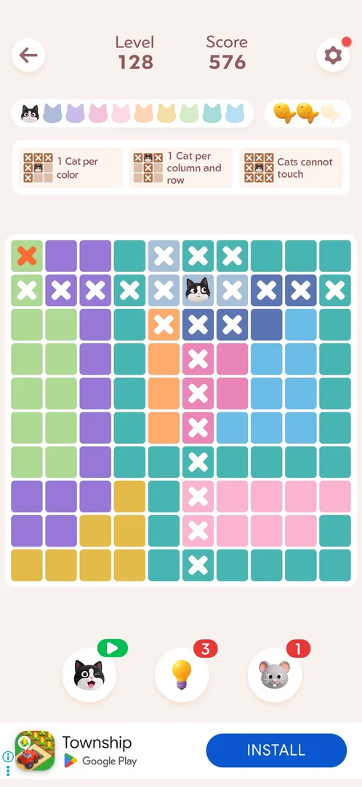
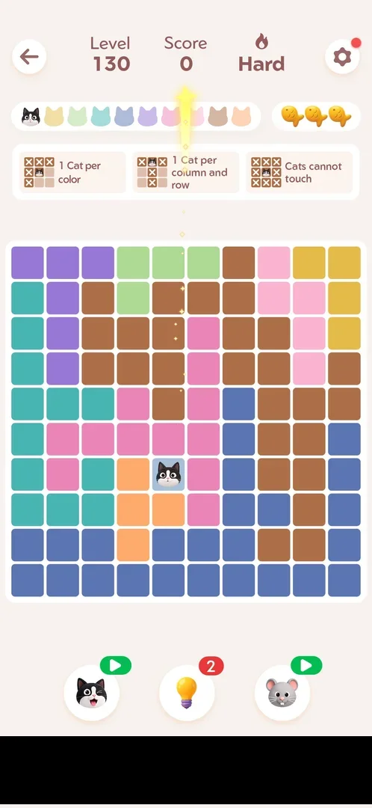
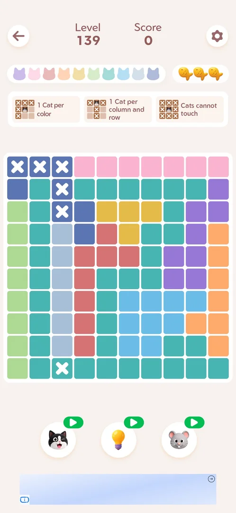
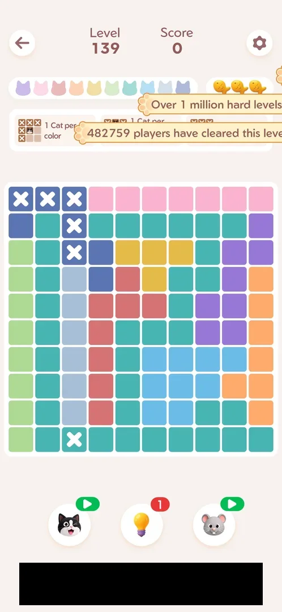
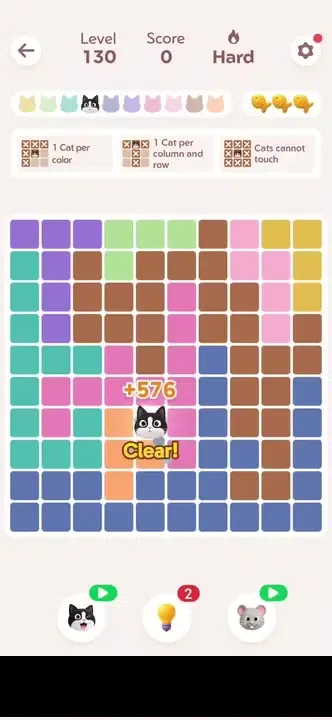

# Hint booster (bulb)

The middle of the three boosters under the board of a [main level](level.md). It explains one deduction on
the board in a single sentence, and Apply carries it out. An exclusion hint crosses out cells; a hint that
finds the only possible cell places the cat there. Each use takes one from its count [^s3] [^s4]
[^s5]. At 0 the count turns into a video badge, and a tap on it plays a rewarded ad that gives one hint
back [^s11] [^s12].

## Why it appeared

On the level HUD at level 127, count 4 [^s1].

## Where to find it

Inside a [main level](level.md): the light-bulb button is the middle one of the three round boosters under
the board, with a red count badge [^s2] [^s6].

 [^s2]
*Level 127: the light-bulb button, middle of the three boosters under the board, count 4*

 [^s6]
*Level 130 (Hard) before any move: the light-bulb button in the middle, count 3 (the banner ad at the bottom is blacked out)*

## What it looks like

A tap on the bulb darkens the board except the cells the hint is about. It shows a white tip box above the
board and an orange Apply button over the boosters [^s3] [^s6]. Two kinds of tip
were seen:

- Exclusion (Level 128, one cat on the board): "This cat's row, column and neighbors can't have other cats —
  exclude them". It lights the cat's row, its column and the cells touching it, each with an outlined cross
  [^s3].
- Single cell (Level 130, empty board): "Teal — only one cell left for a cat". It lights one cell, the only
  cell of the region the tip names [^s6]. The game calls this pale grey-blue
  region "Teal".
- One colour confined to a line (Level 139, empty board): "Light Pink candidates all in row 1 — exclude other
  colors" lit row 1 and put outlined crosses on its three dark-blue cells; the second use, "Teal candidates
  all in col 3 — exclude other colors", lit column 3 and crossed its two dark-blue cells and its bottom teal
  cell [^s13] [^s14]. "Teal" again named the pale grey-blue region.

 [^s3]
*The exclusion hint on Level 128: the cat's row, column and neighbouring cells lit with outlined crosses, the tip above the board, Apply below it*

 [^s6]
*The single-cell hint on Level 130: only the one cell of the region is lit; the tip above the board, Apply over the boosters*

### Result

 [^s4]
*After Apply on the exclusion hint: the outlined crosses became solid crosses on the board; the bulb's badge went from 4 to 3*

 [^s5]
*After Apply on the single-cell hint: a cat on the cell, a star flying to the cat bar, the badge 3 to 2 (the banner ad is blacked out)*

### At zero

 [^s11]
*Level 139 with no hints left: the bulb's badge is a green play icon, the same as on the cat and mouse boosters*

After the second Apply on Level 139 the bulb's red badge (2, then 1) became a green video-play badge
[^s11]. A tap on the bulb then started a rewarded video ad at once, with no offer popup in between:
a playable ad for another game, then its Play Store page. About 90 s after the tap the game was back on the
same Level 139 board, the crosses still in place, and the bulb's badge read 1 [^s15]
[^s12].

 [^s12]
*Back from the rewarded ad: the bulb's badge reads 1; the toasts "Over 1 million hard levels…" and "482759 players have cleared this level" slide in at the top (the banner ad is blacked out)*

 [^s5]
*Clip 3 s · [original on YouTube from 2:30](https://youtu.be/3-USmjAyOV8?t=150)*

## How it works

- The hint picks a deduction from the current board. On Level 128 its tip was about the only cat on the board
  [^s3]. On the empty Level 130 board it was about a one-cell region [^s6].
  Which deduction it picks when several apply was not verified.
- Apply does what the tip says. An exclusion hint turns the outlined crosses into solid crosses, the same
  marks the player can place [^s4]. A single-cell hint places the cat [^s5].
- Score: the exclusion hint scored nothing (576 before and after) [^s3] [^s4]. The cat a hint placed
  scored +576 (0 to 576) [^s7].
- No fish lost on either use [^s4] [^s5].
- Count: 4 at Levels 127 and 128, 3 after one use [^s4]. It was still 3 at the start of Levels 129 and 130,
  and 2 after one use on Level 130 [^s8] [^s6]
  [^s5]. Inferred: the count carries over between levels, and the wins of
  Levels 128 and 129 added none.
- A win adds no hints: the badge read 1 when Level 139 was won, 1 at the start of Level 140, still 1 at the
  start of Level 141 after Level 140 was won without the hint, and 1 at the start of Level 143 after three
  wins in a row on 6 October [^s17] [^s18] [^s19].
- Restarting the level (Settings > Restart) kept the count at 2: the charge spent before the restart was not
  given back [^s9].
- On 6 October the count was 2 at the start of Level 139; two Applies took it to 1 and 0, neither scored
  (score 0 throughout) [^s16] [^s11].
- At 0: one rewarded video ad gives +1 [^s12]. No shop or purchase for hints was seen.

Version 1.19.1.

## Cases

| Case | What was done | Result | Source |
|---|---|---|---|
| The overlay: the board dimmed, the cells of one deduction lit, a one-line tip, an Apply button <!-- case:chk-screen --> | Bulb tapped on Level 128 and Level 130 | ✅ | [^s3] [^s6] |
| Apply carries the hint out. Two kinds: a single-cell tip whose Apply places the cat (count 3 to 2, score +576, no fish cost), and an exclusion tip whose Apply turns the crosses around a cat solid (count 4 to 3, no score, no fish cost) <!-- case:chk-effect --> | Apply tapped on each kind: Level 130 (single cell), Level 128 (exclusion) | ✅ | [^s5] [^s4] |
| Count on a red badge, carried between levels and over a restart: 4 at Level 127, 3 at Levels 129 and 130, 2 after the Level 130 use and after Restart <!-- case:chk-balance --> | Badge read at each level start and after each use | ✅ | [^s5] [^s9] |
| Where to find it: the middle booster under the board in a level <!-- case:chk-entry --> | The bulb tapped | ✅ | [^s2] [^s6] |
| Sinks: one charge per Apply <!-- case:chk-sinks --> | Two Applies | ✅ | [^s5] |
| Sources: a rewarded video ad from the 0 badge gives one hint (the tap starts the ad at once: a playable ad, then a Play Store page; back in the level the badge reads 1). The starting stock was 4 at Level 127; no shop or purchase seen <!-- case:chk-sources --> | Bulb tapped at 0 on Level 139, the ad watched | ✅ | [^s12] |
| At 0 the red count badge turns into a green video-play badge, like the cat and mouse boosters <!-- case:chk-empty --> | Two Applies on Level 139, 2 to 0 | ✅ | [^s11] |
| Refill: a rewarded video at 0 gives +1 (Level 139); no refill from a level change or Restart (Levels 127 to 130) or from a win (the badge stayed 1 from the end of Level 139 through the starts of Levels 140, 141 and 143) <!-- case:chk-refill --> | Badge read at each level start over four wins without the hint | ✅ | [^s12] [^s9] [^s17] [^s18] [^s19] |
| Why it appeared: the trigger that brought it up (the first launch, a level won, a threshold, a timer, a loss): a fact with its frame, or a hypothesis to test <!-- case:chk-appeared --> | On the level HUD from the first level seen | ✅ | [^s1] |

## Not verified

- Refill: a rewarded ad at 0 gives +1 (Level 139); the count did not change with a level change, a restart
  (Levels 127 to 130) or a win (Levels 139 to 142) [^s12] [^s9] [^s19]. Not checked: whether the count refills on a new day or by itself over time (it was 1 after
  four wins on 6 October; the date did not change during the session).
- Sources: whether a shop, the Daily Streak gift or the event rewards give hints.
- Sinks: whether closing the overlay without Apply still spends one.
- At 0 again: whether a second ad in a row gives another hint, and whether an ad closed early gives nothing.

[^s1]: session 20261003-200440-chrono-2FYKPJ, step 3 — [video at 1:05](https://youtu.be/Pqx4QY-FpBA?t=65)
[^s2]: session 20261003-201915-chrono-2FYKPJ, step 3 — [video at 1:28](https://youtu.be/ffhYgQE4LvU?t=88)
[^s3]: session 20261003-201915-chrono-2FYKPJ, step 14 — [video at 4:38](https://youtu.be/ffhYgQE4LvU?t=278)
[^s4]: session 20261003-201915-chrono-2FYKPJ, step 15 — [video at 4:48](https://youtu.be/ffhYgQE4LvU?t=288)

[^s5]: session 20261003-202631-chrono-2FYKPJ, step 10 — [video at 2:32](https://youtu.be/3-USmjAyOV8?t=152)
[^s6]: session 20261003-202631-chrono-2FYKPJ, step 9 — [video at 2:23](https://youtu.be/3-USmjAyOV8?t=143)
[^s7]: session 20261003-202631-chrono-2FYKPJ, step 12 — [video at 4:22](https://youtu.be/3-USmjAyOV8?t=262)
[^s8]: session 20261003-202631-chrono-2FYKPJ, step 5 — [video at 1:06](https://youtu.be/3-USmjAyOV8?t=66)
[^s9]: session 20261003-202631-chrono-2FYKPJ, step 15 — [video at 5:05](https://youtu.be/3-USmjAyOV8?t=305)
[^s10]: session 20261003-202631-chrono-2FYKPJ, step 23 — [video at 7:11](https://youtu.be/3-USmjAyOV8?t=431)

[^s11]: session 20261006-071212-chrono-2FYKPJ, step 11 — [video at 1:37](https://youtu.be/rwKHO-fD0pA?t=97)
[^s12]: session 20261006-071212-chrono-2FYKPJ, step 13 — [video at 3:06](https://youtu.be/rwKHO-fD0pA?t=186)
[^s13]: session 20261006-071212-chrono-2FYKPJ, step 8 — [video at 1:17](https://youtu.be/rwKHO-fD0pA?t=77)
[^s14]: session 20261006-071212-chrono-2FYKPJ, step 10 — [video at 1:27](https://youtu.be/rwKHO-fD0pA?t=87)
[^s15]: session 20261006-071212-chrono-2FYKPJ, step 12 — [video at 1:44](https://youtu.be/rwKHO-fD0pA?t=104)
[^s16]: session 20261006-071212-chrono-2FYKPJ, step 9 — [video at 1:24](https://youtu.be/rwKHO-fD0pA?t=84)

[^s17]: session 20261006-101030-chrono-2FYKPJ, step 5 — [video at 0:45](https://youtu.be/FuAwbQouw6Q?t=45)
[^s18]: session 20261006-101030-chrono-2FYKPJ, step 9 — [video at 2:07](https://youtu.be/FuAwbQouw6Q?t=127)
[^s19]: session 20261006-101030-chrono-2FYKPJ, step 16 — [video at 3:39](https://youtu.be/FuAwbQouw6Q?t=219)
