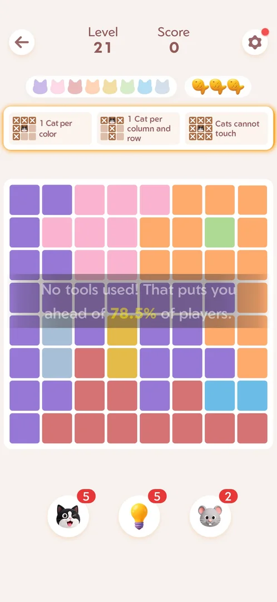

# Mouse booster

The right booster slot shows a lock and "Lv.21" from level 1; at level 21 it becomes a mouse with 2
charges, with no unlock popup [s:20260930-233055-chrono-2FYKPJ#10] [s:20260930-233055-chrono-2FYKPJ#113].

## Cases
| Case | What was done | Result | Source |
|---|---|---|---|
| Unlock | Reached level 21 | Mouse x2 | [s:20260930-233055-chrono-2FYKPJ#113] |
| Use | Tapped on level 31 | X marks on cells that cannot hold a cat, no confirmation; 2 → 1 | [s:20261001-013526-chrono-2FYKPJ#80] [s:20261001-013526-chrono-2FYKPJ#81] |
