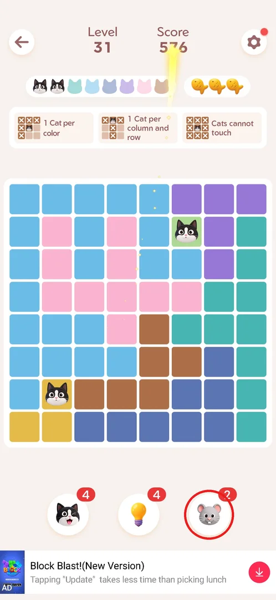
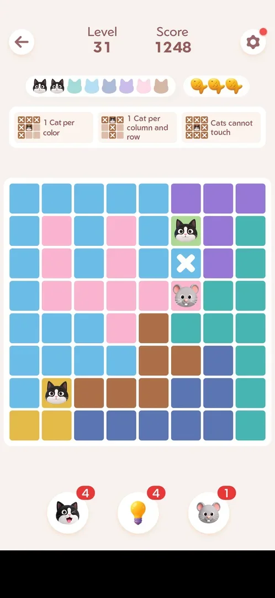
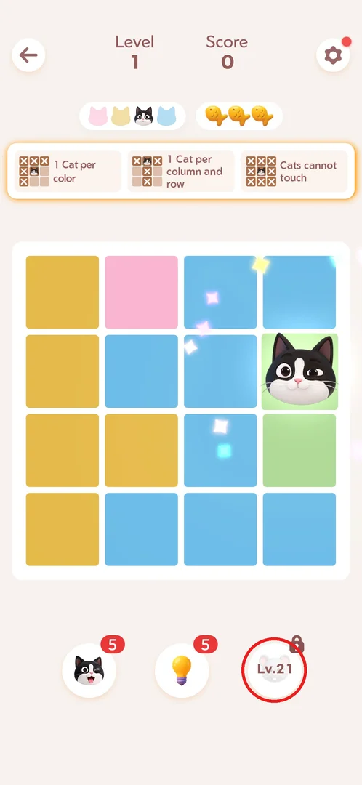
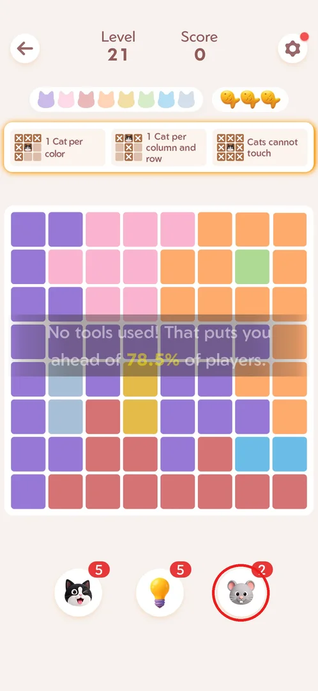
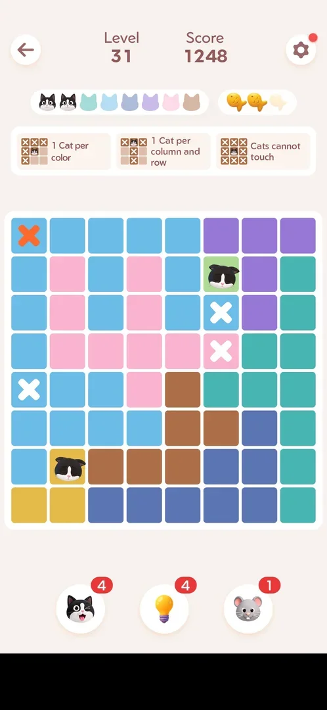

# Mouse booster

The mouse booster is the third in-level helper in Meowdoku, after the [cat booster](booster-cat.md) and
the [hint](hint.md). It does not place a cat: one tap crosses out cells that cannot hold a cat, which
narrows the board for the player [^s1] [^s2].
Its slot is locked with "Lv.21" from level 1; at level 21 it opens with 2 charges, with no unlock
popup [^s3] [^s4].

## Where to find it

The booster lives in every level, not in a menu: it is the right of the three round buttons under the
board (cat, lightbulb, mouse), with its charges in the red badge [^s5].
The same three buttons were there in the Daily Challenge and on a Golden Fish board
[^s6] [^s7].

 [^s5]

## What it looks like

A round white button with a grey mouse face; the red badge at its top right shows the charges left
[^s5]. Right after a tap a mouse icon appears in one cell for a moment,
with a white X on a cell next to it; the counter drops by one and the score goes up (576 → 1248, +672)
[^s1].

 [^s1]

## What you can do

| Tab or button | What it does |
|---|---|
| [Locked](#locked) | Before level 21 the slot is a greyed mouse with "Lv.21" and a padlock [^s3] |
| [Unlocked](#unlocked) | At level 21 the slot becomes the mouse booster with 2 charges [^s4] |
| [After use](#after-use) | A tap leaves white X marks on cells that cannot hold a cat; 2 → 1 [^s2] |

### Locked

From level 1 of a fresh install the right slot shows a faded mouse with "Lv.21" and a padlock, next to
the cat and bulb boosters with 5 charges each [^s3]. Tapping it was not
tried.

 [^s3]

### Unlocked

On reaching level 21 the slot is simply a mouse with a red "2" badge: no unlock popup or tutorial was
shown. The toast on the board ("No tools used! That puts you ahead of 78.5% of players.") is the usual
level-start message, not part of the unlock [^s4].

 [^s4]

### After use

There is no preview or confirmation: the tap acts at once. A moment later the mouse icon is gone and
white X marks stay on cells that cannot hold a cat: here row 3 col 6, row 4 col 6 (where the mouse sat)
and row 5 col 1 [^s2]. All three are empty in the level's solution
[^s8]. The orange X at the top left of this frame is a separate deliberate
wrong tap, which cost a fish (see [Lives](lives-fish.md)), not the booster [^s2].

 [^s2]

## How it works

Version 1.18.0.

- Unlock: level 21, with 2 charges, no popup [^s4].
- Effect: one tap = white X marks on a few cells that cannot hold a cat (three in the one use seen); it
  places no cat [^s2]. Score +672 for that use [^s1].
- Charges carry over between levels: after the one use in level 31 the counter stayed at 1 in the Daily
  Challenge, on a Golden Fish board and at level 92 [^s6]
  [^s7] [^s9].
- Restarting a level does not refund it: after Restart the boosters stayed at 4/4/1
  [^s10].

## Cases

| Case | What was done | Result | Source |
|---|---|---|---|
| Locked | Started level 1 of a fresh install | Slot shows "Lv.21" and a padlock | [^s3] |
| Unlock | Reached level 21 | Mouse x2, no unlock popup | [^s4] |
| Use | Tapped it on level 31 | X marks on cells that cannot hold a cat, no confirmation; 2 → 1, score +672 | [^s1] [^s2] |
| Restart after use | Restart in the level settings | Charges not refunded (4/4/1) | [^s10] |

## Not verified

- How many cells one use crosses out, and how it picks them (one use seen, three cells).
- What happens when the mouse is tapped at 0 charges (likely a rewarded ad, as with the
  [cat booster](booster-cat.md) — inferred, not seen).
- Whether tapping the locked slot before level 21 shows anything.
- Whether the booster can be bought or earned in other ways.

[^s1]: session 20261001-013526-chrono-2FYKPJ, step 80 — [video at 16:21](https://youtu.be/T86pLfervRE?t=981)
[^s2]: session 20261001-013526-chrono-2FYKPJ, step 81 — [video at 16:34](https://youtu.be/T86pLfervRE?t=994)
[^s3]: session 20260930-233055-chrono-2FYKPJ, step 10 — [video at 2:20](https://youtu.be/kfHedtB_k4Q?t=140)
[^s4]: session 20260930-233055-chrono-2FYKPJ, step 113 — [video at 23:02](https://youtu.be/kfHedtB_k4Q?t=1382)
[^s5]: session 20261001-013526-chrono-2FYKPJ, step 79 — [video at 16:08](https://youtu.be/T86pLfervRE?t=968)
[^s6]: session 20261001-013526-chrono-2FYKPJ, step 100 — [video at 20:43](https://youtu.be/T86pLfervRE?t=1243)
[^s7]: session 20261001-093348-chrono-2FYKPJ, step 1
[^s8]: session 20261001-013526-chrono-2FYKPJ, step 87 — [video at 17:53](https://youtu.be/T86pLfervRE?t=1073)
[^s9]: session 20261001-115413-chrono-2FYKPJ, step 57
[^s10]: session 20261001-013526-chrono-2FYKPJ, step 85 — [video at 17:28](https://youtu.be/T86pLfervRE?t=1048)
