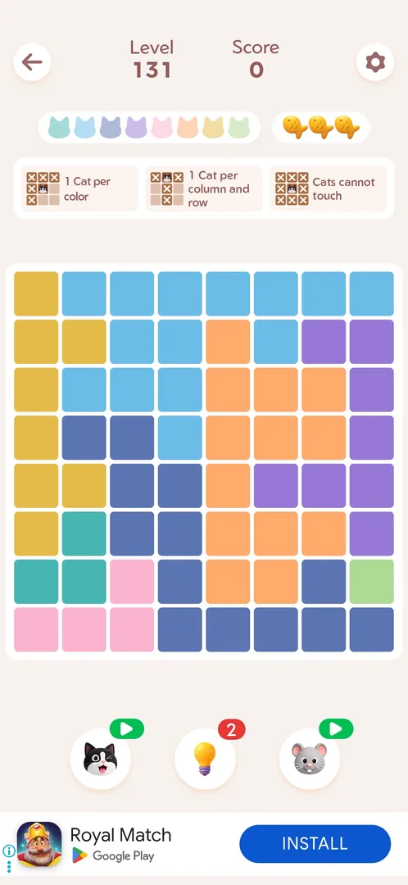
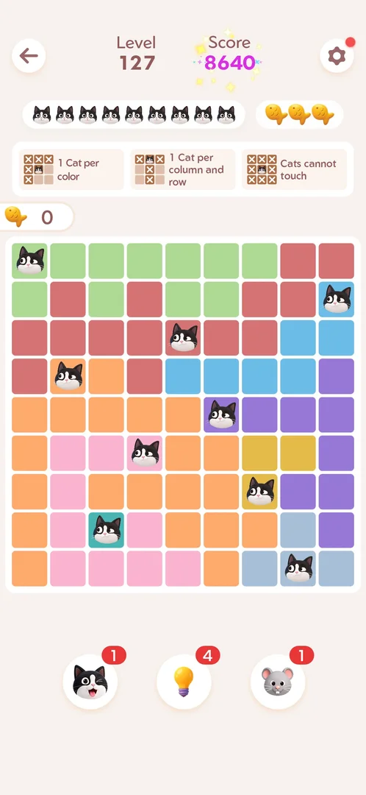
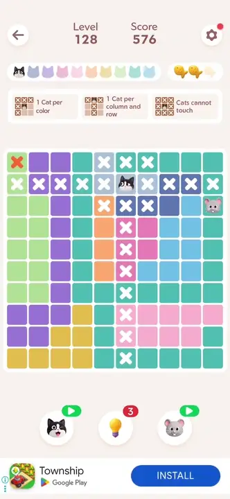
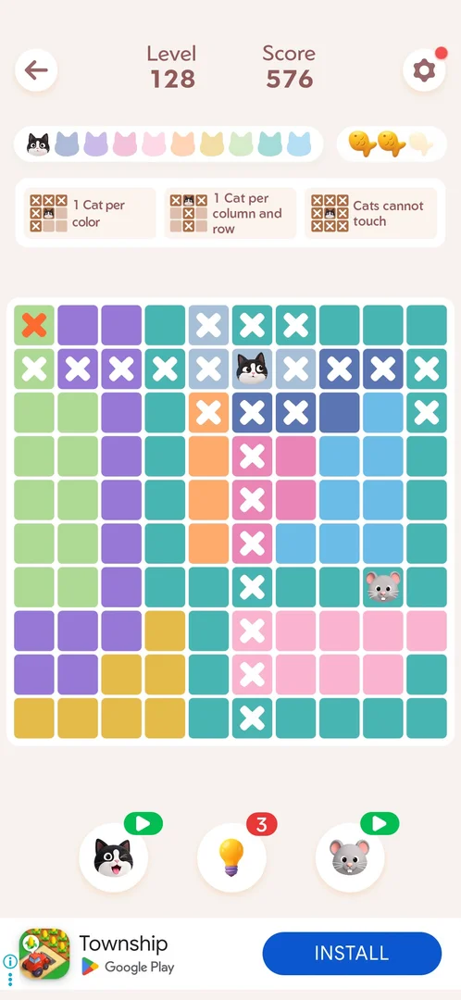

# Mouse booster

The last of the three boosters under the board of a [main level](level.md): a mouse hops over the board and
crosses out empty cells that cannot hold a cat. It shows a red count badge; at zero the badge turns into a
green video icon, and a tap on it plays a [rewarded video](ad-rewarded.md) for one charge [^s4] [^s3].

## Why it appeared

On the level HUD at level 127, count 1 [^s1].

## Where to find it

Inside a [main level](level.md): the mouse button, last (right) of the three round boosters under the board
[^s2]. With charges it carries a red count badge; at zero, a green video icon [^s5] [^s2].

 [^s2]
*Level 131: the mouse button, right of the three boosters under the board, at zero (green video icon); the banner at the bottom is an install ad*

 [^s5]
*Level 127: the mouse button with a count of 1*

## What it looks like

<!-- no-screen: the booster has no screen of its own; one tap starts the mouse on the board -->

The booster has no screen of its own: one tap set a mouse on the board, with no confirmation [^s4] [^s3].

 [^s4]
*Clip 3 s · [original on YouTube from 4:56](https://youtu.be/ffhYgQE4LvU?t=296)*

 [^s3]
*Level 131, a second after the tap: the mouse on the seventh row, its first cross on the row below; the badge is back to the video icon, the score still 0*

### Result

 [^s4]
*The mouse on a teal cell in the lower right; the mouse button's badge is now a green video icon (the banner ad at the bottom is an install ad)*

## How it works

- One use on Level 128 crossed out three empty cells, one after another: third row last column, seventh row
  ninth column, ninth row second column [^s4]. All three are cells without a cat in the solved board [^s6].
  On Level 131 the frame a second after the tap showed the first cross (eighth row, fifth column), also a
  cell without a cat in that level's solution [^s3]. Inferred: the mouse only crosses out cells that cannot
  hold a cat; three crosses per use was counted once only.
- No score or fish change: 576 and two fish on Level 128, 0 and three fish on Level 131, before and after
  [^s4] [^s3].
- Count: 1 on Level 127; after the one use on Level 128 the video icon. It was still at zero at the start of
  Level 131, so the count carries over between levels and two level wins did not add a charge [^s5] [^s7]
  [^s2].
- At zero a tap on the video icon starts a rewarded video at once, with no offer screen: about 20 s of a
  third-party game's video, then an end card. Back in the level the badge read 1 [^s3]. One use costs that
  charge and nothing else; the badge returns to the video icon [^s3].
- No refill timer was seen: over this session and the earlier ones the count rose only through the video
  [^s3].

Version 1.19.1.

## Cases

| Case | What was done | Result | Source |
|---|---|---|---|
| One use adds X marks on cells that cannot hold a cat (frame shows new X at r2c9, r6c8, r8c1); no score or fish change <!-- case:chk-effect --> | Tapped once on Level 128 | ✅ | [^s4] |
| Count badge on the mouse button in the level HUD; 1 at start <!-- case:chk-balance --> | Badge read before and after | ✅ | [^s4] |
| At 0 the badge becomes a green video icon <!-- case:chk-empty --> | Badge seen after the only unit was used | ✅ | [^s4] |
| Why it appeared: the trigger that brought it up (the first launch, a level won, a threshold, a timer, a loss): a fact with its frame, or a hypothesis to test <!-- case:chk-appeared --> | On the level HUD from the first level seen | ✅ | [^s1] |
| Where to find it: the level HUD, the right one of the three booster buttons <!-- case:chk-entry --> | The mouse button under the board tapped on Level 131 | ✅ | [^s3] |
| What it looks like: no screen of its own; the mouse runs onto a cell and puts a cross <!-- case:chk-screen --> | One tap on Level 131, frame a second later | ✅ | [^s3] |
| Sources: the rewarded video from the green icon at zero gives 1 charge; 1 at the first level seen <!-- case:chk-sources --> | Video icon tapped on Level 131, the ad played, the badge read 1 after | ✅ | [^s3] |
| Sinks: one charge per tap, no currency cost; the badge goes back to the video icon <!-- case:chk-sinks --> | The video charge used on Level 131 | ✅ | [^s3] |
| Refill timer: none seen; the count rose only through the video <!-- case:chk-refill --> | Count still 0 at Level 131, two days after the last use | ✅ | [^s3] |

## Not verified

- Whether the booster has any description (a long press, the first use)
- Whether the Daily Streak gift or the event rewards pay mice

[^s1]: session 20261003-200440-chrono-2FYKPJ, step 3 — [video at 1:03](https://youtu.be/Pqx4QY-FpBA?t=63)
[^s2]: session 20261005-123456-chrono-2FYKPJ, step 1 — [video at 0:27](https://youtu.be/rWZh07EjEAM?t=27)
[^s3]: session 20261005-123456-chrono-2FYKPJ, step 4 — [video at 2:07](https://youtu.be/rWZh07EjEAM?t=127)
[^s4]: session 20261003-201915-chrono-2FYKPJ, step 16 — [video at 5:04](https://youtu.be/ffhYgQE4LvU?t=304)
[^s5]: session 20261003-201915-chrono-2FYKPJ, step 3 — [video at 1:28](https://youtu.be/ffhYgQE4LvU?t=88)
[^s6]: session 20261003-201915-chrono-2FYKPJ, step 17 — [video at 5:31](https://youtu.be/ffhYgQE4LvU?t=331)
[^s7]: session 20261003-201915-chrono-2FYKPJ, step 18 — [video at 5:47](https://youtu.be/ffhYgQE4LvU?t=347)
