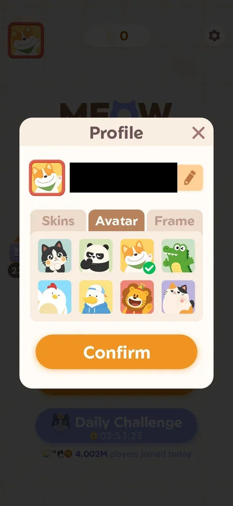
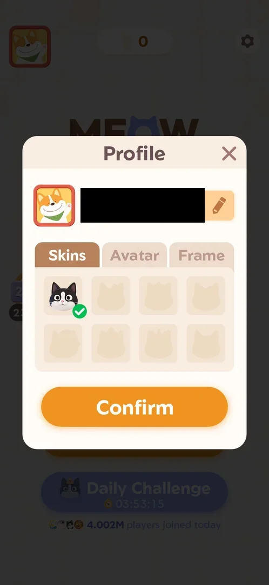
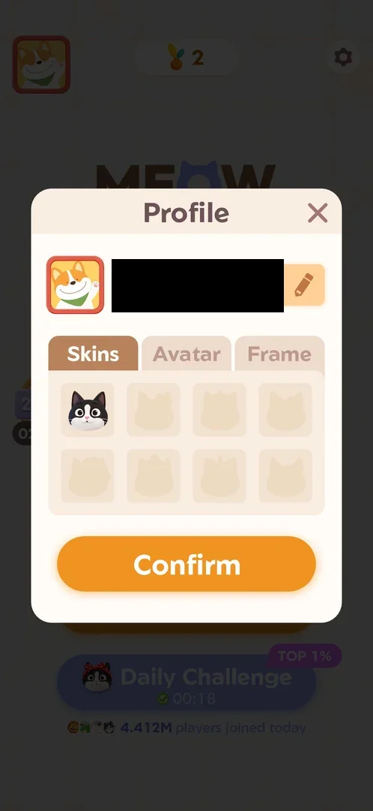
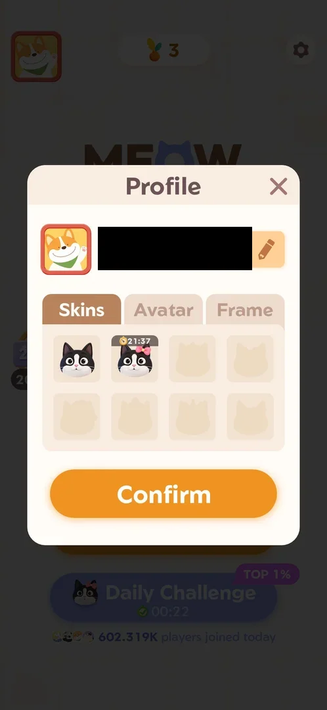
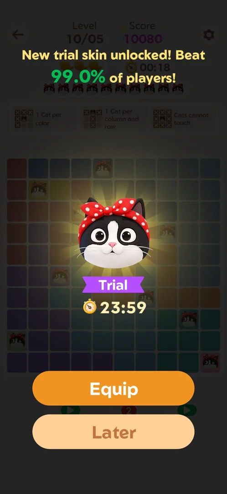

# Cat skins (7 locked)

The look of the cat the player places on the board. The Skins tab of [Profile](profile.md) holds eight
slots: one skin owned, seven locked silhouettes [^s1]. A trial skin from the [Daily Challenge](daily-challenge.md)
can take a slot for 24 hours, with a countdown on it [^s13].

## Why it appeared

Skins tab of Profile: 1 owned cat skin, 7 locked silhouettes [^s1].

## Where to find it

On [Home](home.md), the avatar top left opens Profile; in Profile, the Skins tab left of Avatar shows the
skins [^s2]. On 5 October the avatar on Home and the Skins tab both carried a red dot; opening the Skins tab
cleared both [^s9] [^s10]. On 6 October the red dot was back on the avatar and the Skins tab, with a trial skin
newly in the tab; it again cleared once the tab was opened [^s14] [^s13]. No other way to the skins was seen.

 [^s2]
*Profile popup: the Skins tab left of Avatar (the name field is blacked out)*

## What it looks like

 [^s1]
*Skins tab: the black-and-white cat with a check mark, seven greyed cat silhouettes*

- Slot 1: the black-and-white cat, with a green check mark (in use) [^s1].
- Slots 2 to 8: greyed cat silhouettes, each with a different head shape; no price, lock icon or condition is
  written on them [^s1].
- Under the grid, the Profile's Confirm button. No counter or bar: 1 of 8 slots filled [^s9].

 [^s9]
*Skins tab on 5 October, with the trial skin still in use on the board: the same eight slots, no bow cat*

 [^s13]
*Skins tab on 6 October: the second slot holds the trial bow cat with a clock and 21:37 left; six silhouettes remain*

- 6 October: slot 2 shows a black-and-white cat with a pink bow under a dark strip with a clock icon and 21:37;
  slots 3 to 8 are silhouettes. No green check mark shows on either filled slot in this frame [^s13].

## How it works

- Tapping a locked silhouette showed nothing: the screen did not change [^s3].
- When the [Daily Challenge](daily-challenge.md) board opens, a tooltip under its three fish reads
  "3-Fish clear unlocks a trial skin." [^s4]. Inferred: a trial skin is one
  of these locked skins lent for a time; not verified.
- A 3-fish clear of the Daily Challenge (5 October, 18 s) brought "New trial skin unlocked! Beat 99.0% of
  players!": a black and white cat with a red polka-dot bow, a purple "Trial" ribbon with 23:59, and Equip or
  Later [^s5]. After Equip, the cats placed on the next main level (Level 132) wore the bow
  [^s6]. The profile picture on Home then carried a red dot it did not have before [^s7]; what it
  marks (inferred: the new skin in Profile) is not verified.
- On 5 October at about 22:47, the bow cat was still the cat of the main level (on Level 133's pre-placed cat
  and first in its cat row) [^s11], but the Skins tab did not list it: only the black-and-white cat was owned,
  the seven silhouettes unchanged [^s9]. The red dot on the avatar and on the Skins tab cleared once the tab
  was opened [^s10]. Inferred: a trial skin is applied outside the Skins tab and is not one of its eight slots.
- Tapping a locked silhouette on 5 October again changed nothing [^s12].
- On 6 October at about 04:51 the Skins tab listed a trial skin in slot 2 with 21:37 left [^s13]. The 10/06
  trial skin (a cat with a pink bow) had been offered at about 02:29 the same night and passed over with Later
  (see [Daily Challenge](daily-challenge.md)); 23:59 minus the 2 h 22 min between the two moments is 21:37.
  Inferred: this is the 10/06 trial skin, its trial lasts 24 hours, and a skin passed over with Later still
  enters the Skins tab. The 10/05 trial skin (red polka-dot bow, equipped) was not in the tab on 5 October
  [^s9]; why one trial skin is listed and the other was not is not verified.
- The same bow cat is the picture on the Daily Challenge button on Home, before and after the clear
  [^s8] [^s7].
- Hypothesis: the locked skins are earned through the Daily Challenge (a 3-fish clear) or the event rewards,
  not verified.

 [^s5]
*The trial skin offered after a 3-fish Daily Challenge clear: the bow cat, "Trial" and 23:59, Equip and Later*

Version 1.19.1.

## Cases

| Case | What was done | Result | Source |
|---|---|---|---|
| Why it appeared: the trigger that brought it up (the first launch, a level won, a threshold, a timer, a loss): a fact with its frame, or a hypothesis to test <!-- case:chk-appeared --> | Skins tab opened in Profile | ✅ | [^s1] |
| Home avatar, then the Skins tab of Profile; the tab carries a red dot that clears once opened <!-- case:chk-entry --> | Avatar tapped, Skins tab tapped, Home checked after closing | ✅ | [^s9] |
| Skins tab: a 4 by 2 grid, one owned skin (the black-and-white cat) and 7 beige silhouettes, Confirm below <!-- case:chk-screen --> | Skins tab opened | ✅ | [^s9] |
| No bar or counter: 1 of 8 slots filled <!-- case:chk-progress --> | Skins tab opened | ✅ | [^s9] |
| The Daily Challenge trial skin (the bow cat) is in use on the Level 133 board but not among the Skins tab's slots: only the black-and-white cat is owned there <!-- case:trial-not-listed --> | Level 133 board and the Skins tab compared | ✅ | [^s9] |
| The items: every set, skin or tier, which are owned and which are locked, with their condition <!-- case:chk-items --> | 1 owned, 7 locked, no condition shown; on 6 October a trial skin in slot 2 with 21:37 left | not verified | [^s13] |
| How an item or a step is earned (wins, keys, a spin, a pack) <!-- case:chk-earn --> | A locked skin tapped: nothing shown | not verified | [^s3] |
| Using an item: equip a skin, open a chest, spin; what changes <!-- case:chk-use --> | Only one skin owned | not verified |  |
| Completing a set or the bar: the reward <!-- case:chk-complete --> | Not reached | not verified |  |
| A 3-fish Daily Challenge clear gives a trial skin (the bow cat, Trial 23:59, Equip or Later); after Equip the board's cats wear it <!-- case:trial-from-daily --> | 10/05 daily cleared in 18 s with 3 fish; Equip tapped; Level 132 played | ✅ | [^s5] |

## Not verified

- Where to find it: any other way to the skins (a shop, a reward screen)
- What it looks like: a skin's own preview
- The items: the unlock condition of each of the seven locked skins <!-- case:chk-items -->
- How a skin is earned: the Daily Challenge trial skin after a 3-fish clear <!-- case:chk-earn -->
- Using a skin: how it changes the cat on the board (the equipped trial skin showed on the cats of Levels 132 and 133 but not in the Skins tab) <!-- case:chk-use -->
- What happens when the trial's countdown runs out (about 02:29 on 7 October for the slot seen on 6 October; task daily-trial-skin-expiry)
- Whether the trial skin in the tab can be equipped from there (Confirm was not tapped), and why the 10/05 trial skin was not listed
- Completing the set: any reward <!-- case:chk-complete -->

[^s1]: session 20261003-200440-chrono-2FYKPJ, step 8 — [video at 1:49](https://youtu.be/Pqx4QY-FpBA?t=109)
[^s2]: session 20261003-200440-chrono-2FYKPJ, step 7 — [video at 1:41](https://youtu.be/Pqx4QY-FpBA?t=101)

[^s3]: session 20261003-200440-chrono-2FYKPJ, step 9 — [video at 1:57](https://youtu.be/Pqx4QY-FpBA?t=117)
[^s4]: session 20261003-200440-chrono-2FYKPJ, step 16 — [video at 2:52](https://youtu.be/Pqx4QY-FpBA?t=172)

[^s5]: session 20261005-143752-chrono-2FYKPJ, step 2 — [video at 0:47](https://youtu.be/K_i7fJ2MDQo?t=47)
[^s6]: session 20261005-143752-chrono-2FYKPJ, step 5 — [video at 1:55](https://youtu.be/K_i7fJ2MDQo?t=115)
[^s7]: session 20261005-143752-chrono-2FYKPJ, step 10 — [video at 3:00](https://youtu.be/K_i7fJ2MDQo?t=180)
[^s8]: session 20261005-143752-chrono-2FYKPJ, step 0 — [video at 0:00](https://youtu.be/K_i7fJ2MDQo?t=0)

[^s9]: session 20261005-223641-chrono-2FYKPJ, step 13 — [video at 2:27](https://youtu.be/VXzhl0TX66c?t=147)
[^s10]: session 20261005-223641-chrono-2FYKPJ, step 21 — [video at 3:43](https://youtu.be/VXzhl0TX66c?t=223)
[^s11]: session 20261005-223641-chrono-2FYKPJ, step 6 — [video at 1:17](https://youtu.be/VXzhl0TX66c?t=77)
[^s12]: session 20261005-223641-chrono-2FYKPJ, step 14 — [video at 2:38](https://youtu.be/VXzhl0TX66c?t=158)

[^s13]: session 20261006-044214-chrono-2FYKPJ, step 13 — [video at 2:18](https://youtu.be/0Is_yCgpg5I?t=138)
[^s14]: session 20261006-044214-chrono-2FYKPJ, step 1 — [video at 0:23](https://youtu.be/0Is_yCgpg5I?t=23)
