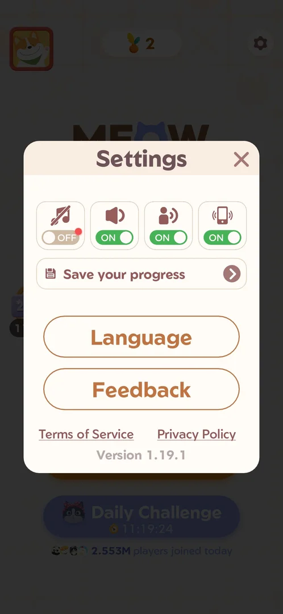
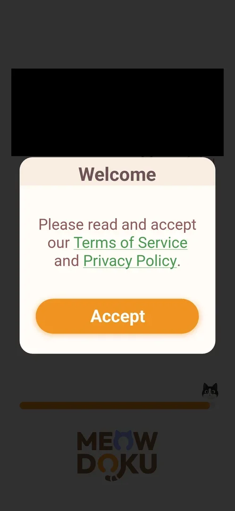

# Terms consent popup

A "Welcome" popup that asks the player to accept the Terms of Service and the Privacy Policy before the game
starts. It has one button, Accept; there is no decline button and no close cross [^s1]. It shows on the first
launch only; afterwards the two documents are reached from links at the bottom of [Settings](settings.md)
[^s2].

## Why it appeared

First launch, Welcome popup with Accept [^s1]. It came up over the loading screen on the first launch of a
fresh install, after the publisher's splash screen [^s1].

## Where to find it

No control opens the popup itself: it shows by itself on the first launch, over the loading screen (a loading
bar with a cat and a tip card signed by the game) [^s1]. It did not come back on later launches of the same
install [^s2].

The documents it links stay reachable: Home, the gear top right, then the Terms of Service and Privacy Policy
links at the bottom of the Settings popup, above the version line [^s2].

 [^s2]
*Settings (the gear top right on Home): the Terms of Service and Privacy Policy links at the bottom, above the version line*

## What it looks like

 [^s1]
*The Welcome popup over the loading screen: the Terms of Service and Privacy Policy links in the text, the orange Accept button*

- Title: "Welcome".
- One line of text with two green underlined links: Terms of Service and Privacy Policy.
- One orange button: Accept.

## How it works

- Accept closes the popup. Right after it, the Android system asked for permission to send notifications
  (a system dialog, not the game's); the player answered "Don't allow", and the game opened on Home with the
  event popup [Fish rank event](fish-event.md) on top [^s3] [^s4].
- Inferred: the notification request is tied to accepting the terms, since it came right after Accept; it
  was seen once only.
- The popup is shown once: on a progressed install it did not come back, and only the Settings links remain
  [^s2].

Version 1.19.1.

## Cases

| Case | What was done | Result | Source |
|---|---|---|---|
| Welcome popup: accept Terms of Service and Privacy Policy, one Accept button <!-- case:chk-screen --> | Frame marked on the first launch: title, text with two links, Accept | ✅ | [^s1] |
| Why it appeared: the trigger that brought it up (the first launch, a level won, a threshold, a timer, a loss): a fact with its frame, or a hypothesis to test <!-- case:chk-appeared --> | Fresh install launched: the Welcome popup showed over the loading screen | ✅ | [^s1] |
| Where to find it: first launch only; afterwards the Terms of Service and Privacy Policy links at the bottom of Settings <!-- case:chk-entry --> | Settings opened from the gear on Home of a progressed install | ✅ | [^s2] |
| Options: one Accept button and the two links; no decline <!-- case:chk-options --> | Accept tapped on the first launch; the Settings links seen, not opened | ✅ | [^s2] |
| Answers: only Accept exists, taken on the first launch; the popup does not return on later launches <!-- case:chk-answers --> | Later launches of the same install: no popup | ✅ | [^s2] |
| Links out (privacy, terms, help): where they lead (back to the game at once) <!-- case:chk-links --> | Not tapped | not verified |  |

## Not verified

- Links out (privacy, terms, help): where the Terms of Service and Privacy Policy links lead, in the popup or in Settings; not opened <!-- case:chk-links -->
- Whether a reinstall or cleared data brings the popup back

[^s1]: session 20261003-200440-chrono-2FYKPJ, step 0 — [video at 0:00](https://youtu.be/Pqx4QY-FpBA?t=0)
[^s2]: session 20261005-123456-chrono-2FYKPJ, step 14 — [video at 5:22](https://youtu.be/rWZh07EjEAM?t=322)
[^s3]: session 20261003-200440-chrono-2FYKPJ, step 1 — [video at 0:22](https://youtu.be/Pqx4QY-FpBA?t=22)
[^s4]: session 20261003-200440-chrono-2FYKPJ, step 2 — [video at 0:30](https://youtu.be/Pqx4QY-FpBA?t=30)
