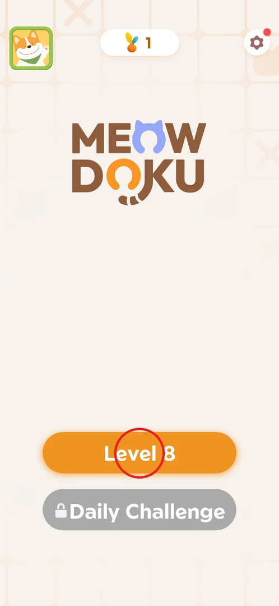
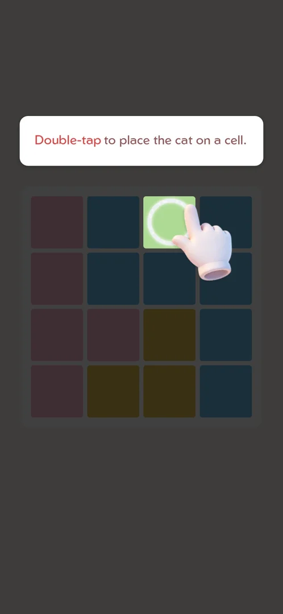
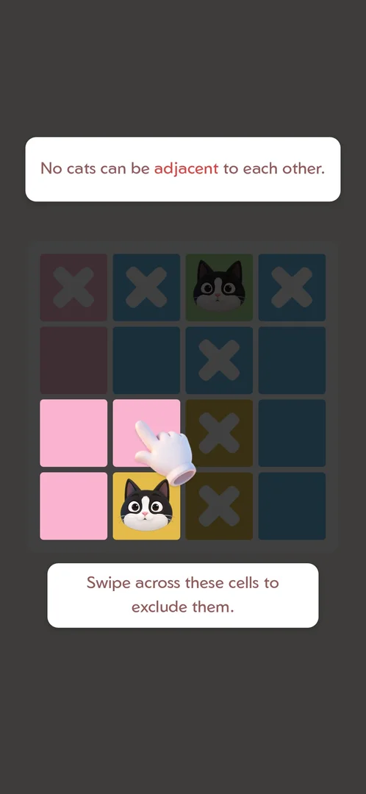
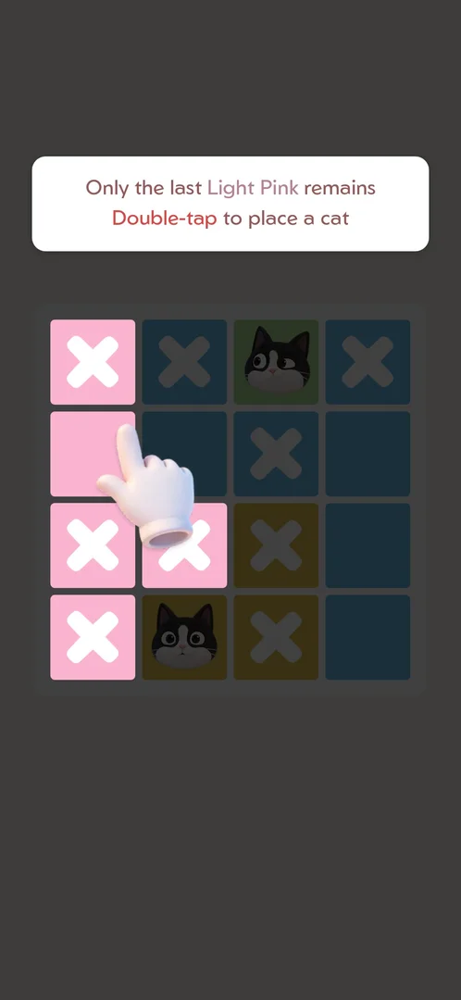
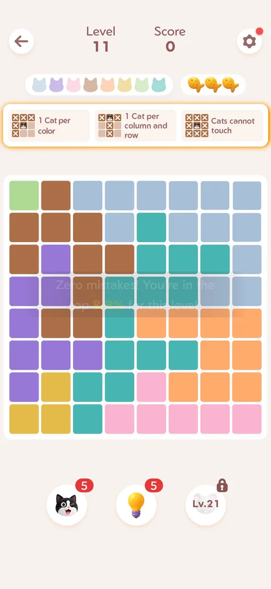
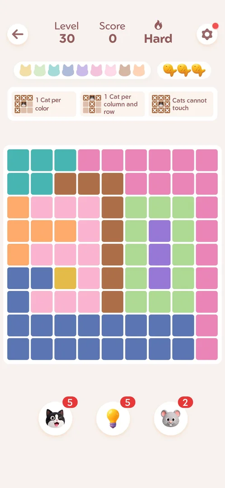

# Core puzzle: one cat per colour region, row and column (Queens-like)

Every level of Meowdoku is the same logic puzzle: an N×N board split into N colour regions, on which the
player places N cats — one per region, one per row, one per column, and no two cats touching, diagonals
included [^s9]. The player places a cat with a double-tap and crosses out cells that cannot hold one with a
tap or a swipe; the level is won when all N cats are in place [^s9]. This is the game's core loop: the
[boosters](booster-cat.md), [fish](lives-fish.md), [win titles](win-rank.md) and the
[Daily Challenge](daily-challenge.md) are all built around it.

## Where to find it

From the home screen: the orange button "Level N" (the next level) opens the level screen [^s1]. A
fresh install goes straight into the [tutorial](tutorial.md) board and then into level 1 [^s9]. After a
win, the win screen's "Level N+1" button opens the next level without going home [^s10].

 [^s1]

## What it looks like

The level screen, top to bottom [^s2]:

- a header with a back arrow, "Level N", "Score" and the [settings](settings.md) gear;
- a strip of cat heads, one per colour region; a region's head lights up when its cat is placed;
- 3 fish — the mistake allowance (see [Fish](lives-fish.md));
- the rules strip: "1 Cat per color", "1 Cat per column and row", "Cats cannot touch";
- the board;
- three booster buttons: [cat](booster-cat.md) (5), [hint](hint.md) (5) and a slot locked until level 21
  that becomes the [mouse booster](booster-lv21.md) [^s2] [^s11].

 [^s2]

## What you can do

| Tab or button | What it does |
|---|---|
| [Place a cat](#place-a-cat) | Double-tap a cell to put a cat on it [^s3] |
| [Exclude a cell](#exclude-a-cell) | Single-tap an empty cell to cross it out (an X) [^s4] |
| [Swipe to exclude](#swipe-to-exclude) | Swipe across several cells to cross them all out [^s5] |
| [Last cell](#last-cell) | When a region has one free cell left, the cat must go there [^s6] |
| [Level-start toast](#level-start-toast) | Some levels open with a toast comparing the player with others [^s7] |
| [Hard level](#hard-level) | From level 30 some levels are marked Hard; the rules are the same [^s10] |

### Place a cat

A double-tap puts a cat on a cell; the tutorial teaches it first, on a 4x4 board [^s3]. A double-tap with
a pause between the taps can fail to register; the player retried it [^s12].
A cat in a wrong cell is not kept: the cell gets an orange X, one fish is lost, and the cats on the board
close their eyes (see [Fish](lives-fish.md)) [^s13].

 [^s3]

### Exclude a cell

After the first cat the tutorial says "Cats can't be in the same row or column." and highlights the cat's
row and column: "Tap empty cells to exclude them." A tap puts an X on the cell; it is only a note for the
player and costs nothing [^s4].

 [^s4]

### Swipe to exclude

"No cats can be adjacent to each other." — the cells around a cat, diagonals included, are crossed out with
one swipe: "Swipe across these cells to exclude them." [^s5]

 [^s5]

### Last cell

The tutorial's main deduction: once the other cells of a region are crossed out, "Only the last Light Pink
remains. Double-tap to place a cat" [^s6]. The tutorial also shows the hint button and ends with "Start
Game" [^s9]. The early levels are solved the same way: a one-cell region is forced, then rows, columns and
adjacency leave one option at a time [^s12] [^s14].

 [^s6]

### Level-start toast

A level can open with a toast over the board that compares the player with others: level 11 — "Zero
mistakes! You're in the top 8.8% for this level" [^s7]; level 21 — "No tools used! That puts you ahead
of 78.5% of players." [^s11]. It fades by itself.

 [^s7]

### Hard level

From level 30 some levels are Hard. The previous level's win screen puts a red "Hard" tag on the
"Level 30" button [^s10]; the level itself shows a flame and "Hard" next to the score in the header [^s8].
The rules, the rules strip and the boosters are the same [^s8] [^s15].

 [^s8]

## How it works

Version 1.18.0.

- Rules: one cat per colour region, per row and per column; no two cats touch, diagonals included [^s9].
- Board size grows: 4x4 at level 1, 5x5 at level 2, 6x6 at level 3, 8x8 at level 5, 9x9 at level 9
  [^s12] [^s14] [^s16]
  [^s17] [^s18]; 10x10 from level 12
  [^s19]. After that, boards range from 8x8 to 10x10: levels 21 and 31 were 8x8 [^s11] [^s13];
  most other later levels were 9x9 or 10x10 [^s20] [^s21]. Sizes are not strictly growing: level 10 was 7x7
  [^s22].
- Levels 1–10 started with one cat already placed [^s2] [^s18]
  [^s22]; level 11, level 21 and the levels from 22 on that were seen started
  empty [^s7] [^s11] [^s20].

  > ⚠️ Previously (v1.18.0, 2026-10-01): "most levels have one cat already placed" — true only of the
  > early levels seen.
- Score: it grows with each correct cat and is shown in the header — level 1: 1675 after 3 cats, 2016 at
  the win [^s12] [^s23]; level 3: 3840
  [^s16]; level 12: 8640 [^s19]; level 29:
  10080 [^s10]. The formula is unknown.
- Mistakes: a wrong cat costs one of the 3 fish (see [Fish](lives-fish.md)) [^s13].
- Pattern Mode in the [settings](settings.md) adds an icon to every colour region (an aid for colour
  blindness, inferred) [^s24].
- From level 23 a banner ad sits under the board and interstitial ads can show when a level starts (see
  [Ads](ads.md)) [^s25].
- The [Daily Challenge](daily-challenge.md) is the same puzzle (10x10 on 10/01) with a stopwatch instead of
  the level number [^s26].

## Cases

| Case | What was done | Result | Source |
|---|---|---|---|
| Rules | Tutorial and levels 1–35 | One cat per colour region, per row and per column; cats never touch, diagonals included | [^s9] |
| Tutorial controls | Followed the tutorial | Double-tap places a cat, tap excludes a cell, swipe excludes several | [^s3] [^s4] [^s5] |
| Wrong cat | Double-tapped a wrong cell in level 31 | Orange X, fish 3 → 2, the cats close their eyes | [^s13] |
| Hard | Levels 30 and 40 | Flame + "Hard" in the header and a Hard tag on the next-level button; the same rules | [^s10] |
| Level-start toast | Levels 11 and 21 | Percentile toasts | [^s7] [^s11] |

## Not verified

- The score formula; what the level-start toasts depend on and when they show.
- Which levels are Hard (every tenth or at random) and whether Hard levels give more score or fish.
- Whether any level has more than one solution.

[^s1]: session 20260930-233055-chrono-2FYKPJ, step 34 — [video at 9:04](https://youtu.be/kfHedtB_k4Q?t=544)
[^s2]: session 20260930-233055-chrono-2FYKPJ, step 10 — [video at 2:20](https://youtu.be/kfHedtB_k4Q?t=140)
[^s3]: session 20260930-233055-chrono-2FYKPJ, step 2 — [video at 0:36](https://youtu.be/kfHedtB_k4Q?t=36)
[^s4]: session 20260930-233055-chrono-2FYKPJ, step 4 — [video at 1:07](https://youtu.be/kfHedtB_k4Q?t=67)
[^s5]: session 20260930-233055-chrono-2FYKPJ, step 6 — [video at 1:33](https://youtu.be/kfHedtB_k4Q?t=93)
[^s6]: session 20260930-233055-chrono-2FYKPJ, step 7 — [video at 1:46](https://youtu.be/kfHedtB_k4Q?t=106)
[^s7]: session 20260930-233055-chrono-2FYKPJ, step 51 — [video at 12:33](https://youtu.be/kfHedtB_k4Q?t=753)
[^s8]: session 20261001-013526-chrono-2FYKPJ, step 69 — [video at 14:30](https://youtu.be/T86pLfervRE?t=870)
[^s9]: session 20260930-233055-chrono-2FYKPJ, step 9 — [video at 2:06](https://youtu.be/kfHedtB_k4Q?t=126)
[^s10]: session 20261001-013526-chrono-2FYKPJ, step 67 — [video at 14:05](https://youtu.be/T86pLfervRE?t=845)

[^s11]: session 20260930-233055-chrono-2FYKPJ, step 113 — [video at 23:02](https://youtu.be/kfHedtB_k4Q?t=1382)
[^s12]: session 20260930-233055-chrono-2FYKPJ, step 14 — [video at 3:06](https://youtu.be/kfHedtB_k4Q?t=186)
[^s13]: session 20261001-013526-chrono-2FYKPJ, step 81 — [video at 16:34](https://youtu.be/T86pLfervRE?t=994)
[^s14]: session 20260930-233055-chrono-2FYKPJ, step 21 — [video at 4:28](https://youtu.be/kfHedtB_k4Q?t=268)
[^s15]: session 20261001-013526-chrono-2FYKPJ, step 74 — [video at 15:13](https://youtu.be/T86pLfervRE?t=913)
[^s16]: session 20260930-233055-chrono-2FYKPJ, step 23 — [video at 6:18](https://youtu.be/kfHedtB_k4Q?t=378)
[^s17]: session 20260930-233055-chrono-2FYKPJ, step 27 — [video at 7:27](https://youtu.be/kfHedtB_k4Q?t=447)
[^s18]: session 20260930-233055-chrono-2FYKPJ, step 42 — [video at 10:50](https://youtu.be/kfHedtB_k4Q?t=650)
[^s19]: session 20260930-233055-chrono-2FYKPJ, step 59 — [video at 15:09](https://youtu.be/kfHedtB_k4Q?t=909)
[^s20]: session 20261001-013526-chrono-2FYKPJ, step 3 — [video at 0:59](https://youtu.be/T86pLfervRE?t=59)
[^s21]: session 20261001-013526-chrono-2FYKPJ, step 73 — [video at 14:53](https://youtu.be/T86pLfervRE?t=893)
[^s22]: session 20260930-233055-chrono-2FYKPJ, step 45 — [video at 11:21](https://youtu.be/kfHedtB_k4Q?t=681)
[^s23]: session 20260930-233055-chrono-2FYKPJ, step 16 — [video at 3:47](https://youtu.be/kfHedtB_k4Q?t=227)
[^s24]: session 20261001-013526-chrono-2FYKPJ, step 85 — [video at 17:28](https://youtu.be/T86pLfervRE?t=1048)
[^s25]: session 20261001-013526-chrono-2FYKPJ, step 15 — [video at 5:23](https://youtu.be/T86pLfervRE?t=323)
[^s26]: session 20261001-013526-chrono-2FYKPJ, step 100 — [video at 20:43](https://youtu.be/T86pLfervRE?t=1243)
