# Daily Challenge

One extra board per day, named by its date, with the same rules as the [main level](level.md) on a larger
board and a stopwatch. A countdown on its Home button shows the time until the next day's board; at local
midnight a new dated board replaces it [^s1] [^s2] [^s15] [^s16]. The first clear of the day with all three
fish unlocks a trial cat skin for about 24 hours; after the clear the Home button shows the best time and a
percentile tag, and the same board can be replayed only through a rewarded video ad [^s6] [^s7] [^s17]
[^s19].

## Why it appeared

Button under Level on Home, timer 03:5x until reset; opens a dated 10x10 board with timer [^s1]. It was
there on the first launch's Home; no unlock condition was seen.

## Where to find it

On [Home](home.md), the blue Daily Challenge button under the Level button: a cat with a bow, "Daily
Challenge" and a countdown, with "N players joined today" under it. Tapping it opens today's board [^s8]
[^s9] [^s15] [^s16].

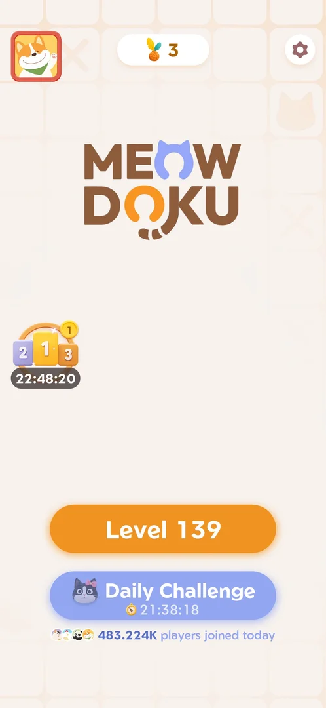 [^s15]
*Home on 6 October, about 02:22: the Daily Challenge button under Level 139 with a pink-bow cat and the countdown 21:38:18; "483.224K players joined today" under it*

On 6 October, the day after a clear, the button had its countdown back (21:38:18 at about 02:22), no tick, no
best time and no TOP tag, and its cat wore a pink bow; the day's trial skin was a cat with a pink bow [^s15]
[^s17]. On 5 October the button's cat had a red polka-dot bow, and that day's trial skin was a cat with a red
polka-dot bow [^s8] [^s6]. Inferred: the button shows the day's trial skin.

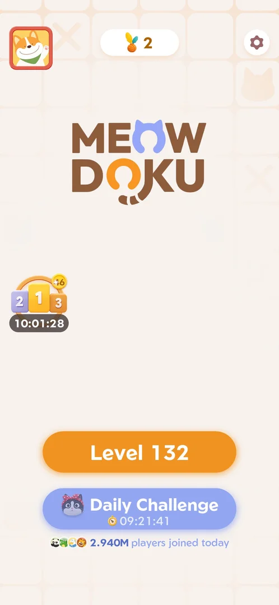 [^s8]
*Home on 5 October: the Daily Challenge button under Level 132, a red polka-dot bow cat, the countdown 09:21:41, "2.940M players joined today" under it*

An earlier frame of the same button (3 October, countdown 03:53:49) [^s2]:

 [^s2]
*Home screen on 3 October: the Daily Challenge button with the countdown 03:53:49*

## What it looks like

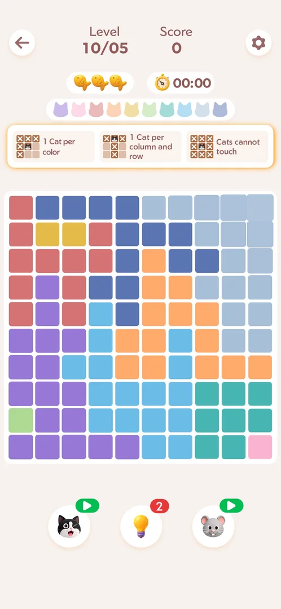 [^s9]
*The board of 5 October: "Level 10/05", Score 0, three fish and the stopwatch at 00:00, ten cat heads, the rules strip, the 10x10 board, the three boosters*

The screen is laid out like a main level, with these differences [^s3] [^s9] [^s16]:

- The level label is the date: "10/03", "10/05", "10/06" (month/day).
- A stopwatch next to the three fish, at 00:00; on the daily the fish box sits left of the stopwatch, on the
  main level it sits right of the cat heads.
- A 10x10 board in ten colour regions, and ten cat heads above the rules strip.
- The same rules strip and the same three boosters, with the same counters as the main level at the time:
  inferred, the booster stock is shared with the main levels.

During play the board shows a praise word and the points of each placed cat ("Great" +864, "Amazing" +1152,
"Unreal" +1344 on the last cats), then "Clear!"; a banner ad was at the bottom of the screen while playing
[^s6] [^s19].

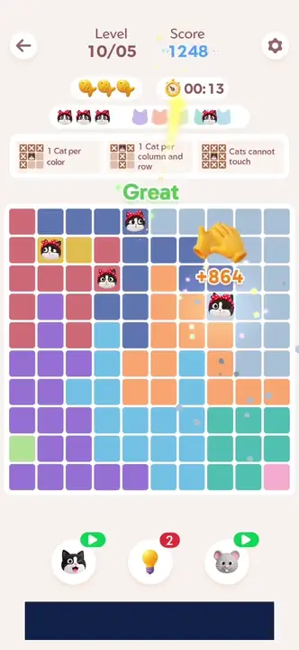 [^s6]
*Clip 7.7 s · [original on YouTube from 0:40](https://youtu.be/K_i7fJ2MDQo?t=40)*

### Trial skin tooltip

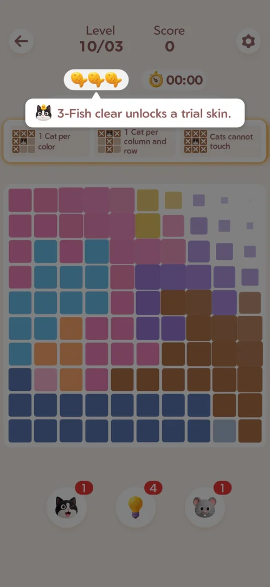 [^s1]
*As the board opens, a tooltip under the three fish: a 3-fish clear unlocks a trial skin*

When the board opens, a tooltip with a cat icon points at the three fish: "3-Fish clear unlocks a trial
skin." [^s1]. The board was still appearing behind it. The first tap on the back arrow closed the tooltip;
the board stayed [^s3].

## What you can do

| Tab or button | What it does |
|---|---|
| [Trial skin](#trial-skin) | After the day's first 3-fish clear: Equip puts the trial skin on; Later goes on to Challenge Cleared |
| [Challenge Cleared](#challenge-cleared) | The clear's result: Continue goes on to the main level; Retry (video ad) replays the same board |
| [Retry](#retry) | After the video: the same board, emptied, with three fish and the stopwatch from 00:00 |
| [Cleared button](#cleared-button) | The Home button after the clear: best time, a tick and a TOP 1% tag |
| [Try again?](#try-again) | The Home button after the clear opens this: Retry (video ad) or Close |

### Trial skin

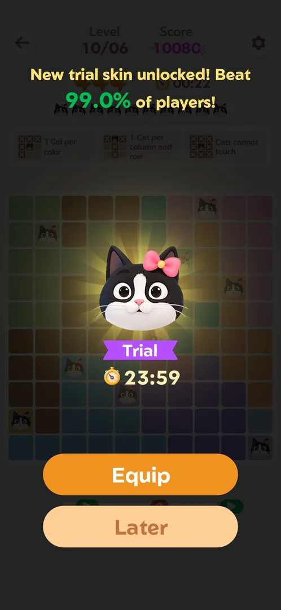 [^s17]
*6 October, right after the clear: "New trial skin unlocked! Beat 99.0% of players!", a cat with a pink bow, the purple "Trial" ribbon and 23:59, Equip and Later*

 [^s6]
*5 October: the same popup with a different skin, a cat with a red polka-dot bow*

The clear came straight to this popup, with no fish leaderboard before it [^s6] [^s17].
Over the board: "New trial skin unlocked! Beat 99.0% of players!", the skin, a "Trial" ribbon with a clock
reading 23:59, and two buttons: Equip (orange) and Later [^s6] [^s17]. The skin differs by day: a black and
white cat with a red polka-dot bow on 5 October, with a pink bow on 6 October [^s6] [^s17].

- Equip led to Challenge Cleared, and the equipped skin then showed on the cats of the next main level,
  Level 132 [^s10] [^s11].
- Later led to Challenge Cleared as well [^s21]. Whether the skin can still be equipped afterwards (from
  [Cat skins](cat-skins.md)) was not checked.

### Challenge Cleared

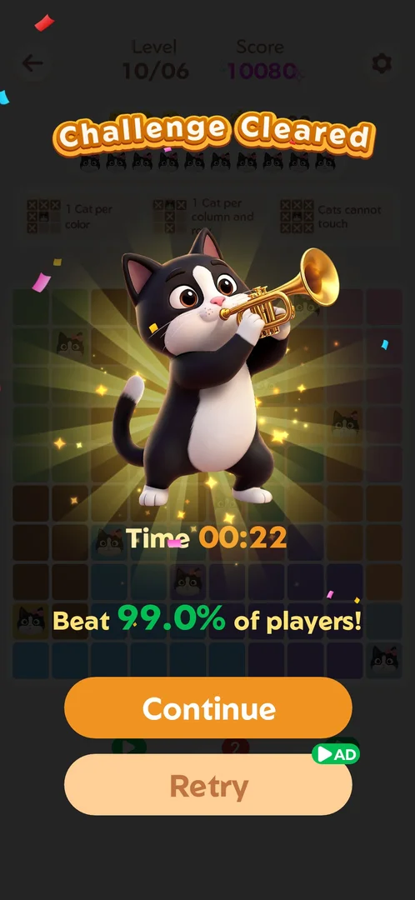 [^s18]
*6 October: "Challenge Cleared", "Time 00:22", "Beat 99.0% of players!", Continue and Retry with a green AD badge*

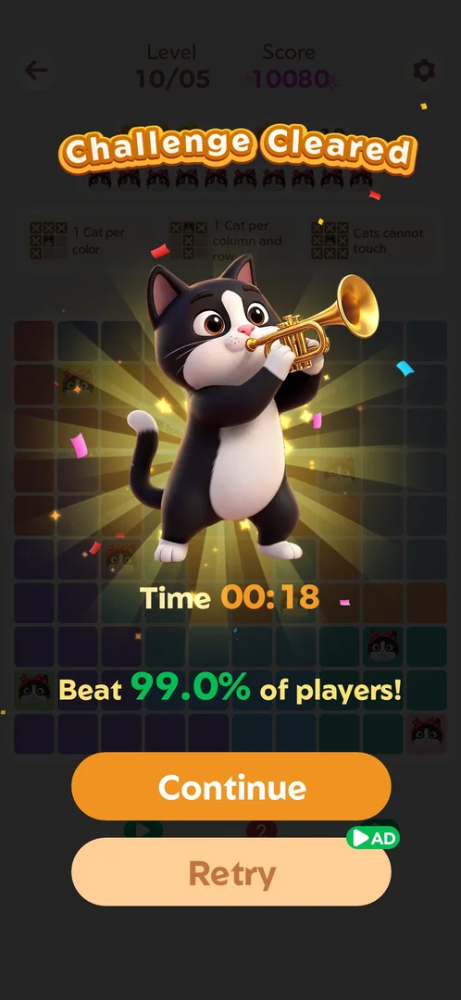 [^s10]
*5 October: the same screen with "Time 00:18"*

"Challenge Cleared" with an animated cat playing a trumpet and confetti, the time and the percentile ("Time
00:18" and "Beat 99.0% of players!" on 5 October, "Time 00:22" and 99.0% on 6 October); a few seconds later
the buttons Continue and Retry (with a green video "AD" badge) came up [^s10] [^s18]. Continue opened the
main level (Level 132), not Home [^s12]. Retry opened a rewarded video ad (see [Retry](#retry)) [^s22].

### Retry

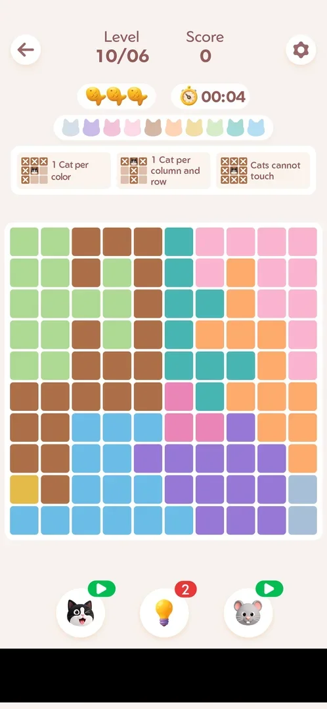 [^s19]
*After the Retry video: the same 10/06 board, empty, Score 0, three fish, the stopwatch at 00:04 (banner ad blacked out)*

Retry on Challenge Cleared played a [rewarded video](ad-rewarded.md); after about 8 s it showed "Reward
granted" and a close X, and closing it returned to the daily [^s22] [^s19]. The board was the same 10/06
layout, rebuilt tile by tile and empty, with Score 0, three fish and the stopwatch at 00:00, then running
(00:04 a few seconds later); no trial skin popup [^s19].

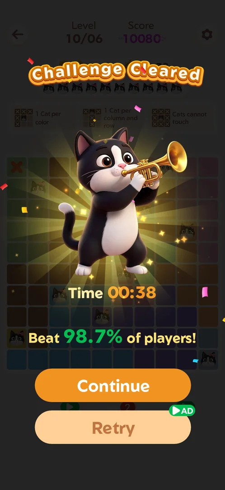 [^s20]
*The retry, cleared with one wrong cat (two fish kept): "Time 00:38", "Beat 98.7% of players!", Continue and Retry (AD) again*

The retry was played with one wrong cat on purpose, so two fish were left [^s23]. The clear went straight to
Challenge Cleared with "Time 00:38" and "Beat 98.7% of players!", with no trial skin popup, and Retry (AD)
was offered again [^s20]. Whether the Home button then shows the first clear's 00:22 or the retry's 00:38 was
not seen.

### Cleared button

 [^s13]
*Home after the clear: the Daily Challenge button shows a green tick and the best time 00:18 instead of the countdown, and a pink "TOP 1%" tag*

After the clear the button keeps the cat and the title, shows a green tick and the best time 00:18 in place
of the countdown, and carries a pink "TOP 1%" tag at its top right [^s13]. The
cat with the bow was on the button before the clear too [^s8]. The profile
picture top left of Home now had a red dot, which it did not have at the start of the session; what it
marks (inferred: the new skin) is not verified [^s13]. The next day the button was back to the countdown
[^s15].

### Try again?

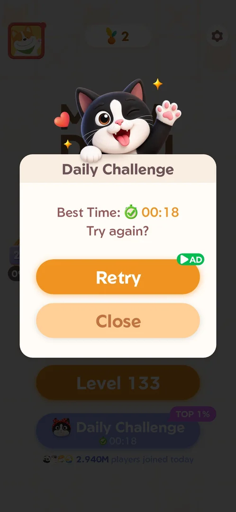 [^s7]
*Tapping the cleared button: "Daily Challenge", "Best Time: 00:18", "Try again?", Retry with an AD badge, Close*

Tapping the cleared button does not open the board: a popup titled "Daily Challenge" with a waving cat,
"Best Time: 00:18", "Try again?", Retry (with the green "AD" badge) and Close
[^s7]. Close returned to Home [^s14]. Inferred from the badge and from Retry on Challenge Cleared: Retry here
plays a rewarded video and reopens the board; this Retry was not tapped.

## How it works

- One board per date; the label carries the date [^s3] [^s9] [^s16].
- The countdown on the Home button read 03:53:49 at 20:06:17 local time [^s2], 00:08:28 at about
  23:51:33 the same day [^s5], 09:21:41 at about 14:38 on 5 October [^s8] and 21:38:18 at about 02:22 on
  6 October [^s15]: every reading puts its end at local midnight. On 6 October the button had lost the 5
  October clear's tick and best time and opened a new board, "10/06" [^s15] [^s16].
- The stopwatch still read 00:00 about nine seconds after the board opened, with no move made [^s3]. Inferred:
  it starts with the first move.
- The day's first clear with all three fish: 18 s and score 10080 on 5 October, 22 s and score 10080 on 6
  October; each gave a trial skin with a 23:59 trial timer and "Beat 99.0% of players" [^s6] [^s17]. The 5
  October clear tagged the button "TOP 1%" [^s13].
- A retry cleared with two fish (00:38, 98.7%) gave no trial skin [^s20]. Whether a day's first clear with
  fewer than three fish gives one was not seen.
- No fish leaderboard came up after a daily clear, unlike a main level win [^s6] [^s17].
  Inferred: the daily does not count for the [fish event](fish-event.md); not verified.
- Replays cost a rewarded video (about 8 s to "Reward granted"); a replay is the same board from the start,
  and Retry is offered again after it [^s22] [^s19] [^s20].
- After the clear, the Home button opens the Try again? popup instead of the board [^s7].
- Leaving an unplayed board: the second tap on the back arrow returned to Home with no confirmation
  [^s4].

Version 1.19.1.

## Cases

| Case | What was done | Result | Source |
|---|---|---|---|
| The countdown runs out at local midnight <!-- case:reset-time --> | Home countdown read four times: 03:53:49 at 20:06:17, 00:08:28 at about 23:51:33, 09:21:41 at about 14:38, 21:38:18 at about 02:22 | ✅ | [^s5] |
| Dated board (10/03, 10/05, 10/06), 10x10, stopwatch from 00:00, 3 fish, same three rules and boosters as the main level <!-- case:chk-screen --> | Opened from Home on three days, frames marked | ✅ | [^s3] |
| Why it appeared: the button on Home from the first launch <!-- case:chk-appeared --> | The Daily Challenge button on Home | ✅ | [^s1] |
| Home Daily Challenge button opens today's board <!-- case:chk-entry --> | Button tapped: the 10/05 and 10/06 boards opened | ✅ | [^s9] |
| Today's challenge: a 3-fish clear gives a trial skin (23:59), Challenge Cleared with Continue and Retry (video) <!-- case:chk-today --> | 10/05 board cleared in 18 s with 3 fish, score 10080; Equip tapped | ✅ | [^s6] |
| No calendar or task list: one dated board per day from the Home button; the only reward seen is the trial skin <!-- case:chk-calendar --> | Button tapped on three days: today's board each time | ✅ | [^s9] |
| The next day: renewed at local midnight: on 6 October the button had the countdown back and no tick or best time, and opened a new board 10/06; its first 3-fish clear again gave a trial skin <!-- case:chk-next-day --> | Home opened at about 02:22 the day after a clear; the 10/06 board cleared in 22 s with 3 fish, Later tapped | ✅ | [^s16] |
| A missed day: what is lost or reset <!-- case:chk-missed --> | Not seen | not verified |  |
| Played once: a win with the trial skin offer; reopening shows Best Time with Retry (video) or Close; loss not tested <!-- case:chk-play --> | 10/05 board solved in one go | ✅ | [^s10] |
| After a clear, Retry carries an AD badge, on Challenge Cleared and on the reopen popup <!-- case:retry-ad --> | Both screens seen | ✅ | [^s7] |
| Home button after the clear: green tick, best time 00:18, TOP 1% tag (the bow cat was there before the clear too) <!-- case:home-cleared --> | Home opened after the clear | ✅ | [^s13] |
| Retry (AD) watched: a rewarded video of about 8 s, then the same board emptied, three fish, stopwatch from 00:00; a 2-fish retry clear (00:38, 98.7%) gave no trial skin, Retry (AD) offered again <!-- case:retry-watched --> | Retry tapped on the 10/06 Challenge Cleared, video closed after Reward granted, retry played with one wrong cat | ✅ | [^s20] |

## Not verified

- A missed day: what is lost <!-- case:chk-missed -->
- A loss on the daily (three wrong cats), and a day's first clear with fewer than three fish: whether the trial skin still comes
- Which best time the Home button keeps after a slower retry (00:22 first clear, 00:38 retry)
- Whether a skin passed over with Later can still be equipped, and what happens when the trial skin's 23:59 runs out
- Whether the daily clear counts for the fish event

[^s1]: session 20261003-200440-chrono-2FYKPJ, step 16 — [video at 2:52](https://youtu.be/Pqx4QY-FpBA?t=172)
[^s2]: session 20261003-200440-chrono-2FYKPJ, step 4 — [video at 1:15](https://youtu.be/Pqx4QY-FpBA?t=75)
[^s3]: session 20261003-200440-chrono-2FYKPJ, step 17 — [video at 3:06](https://youtu.be/Pqx4QY-FpBA?t=186)

[^s4]: session 20261003-200440-chrono-2FYKPJ, step 18 — [video at 3:08](https://youtu.be/Pqx4QY-FpBA?t=188)
[^s5]: session 20261003-235107-chrono-2FYKPJ, step 0

[^s6]: session 20261005-143752-chrono-2FYKPJ, step 2 — [video at 0:47](https://youtu.be/K_i7fJ2MDQo?t=47)
[^s7]: session 20261005-143752-chrono-2FYKPJ, step 11 — [video at 3:06](https://youtu.be/K_i7fJ2MDQo?t=186)
[^s8]: session 20261005-143752-chrono-2FYKPJ, step 0 — [video at 0:00](https://youtu.be/K_i7fJ2MDQo?t=0)
[^s9]: session 20261005-143752-chrono-2FYKPJ, step 1 — [video at 0:28](https://youtu.be/K_i7fJ2MDQo?t=28)
[^s10]: session 20261005-143752-chrono-2FYKPJ, step 3 — [video at 0:59](https://youtu.be/K_i7fJ2MDQo?t=59)
[^s11]: session 20261005-143752-chrono-2FYKPJ, step 5 — [video at 1:55](https://youtu.be/K_i7fJ2MDQo?t=115)
[^s12]: session 20261005-143752-chrono-2FYKPJ, step 4 — [video at 1:18](https://youtu.be/K_i7fJ2MDQo?t=78)
[^s13]: session 20261005-143752-chrono-2FYKPJ, step 10 — [video at 3:00](https://youtu.be/K_i7fJ2MDQo?t=180)
[^s14]: session 20261005-143752-chrono-2FYKPJ, step 12 — [video at 3:15](https://youtu.be/K_i7fJ2MDQo?t=195)
[^s15]: session 20261006-021434-chrono-2FYKPJ, step 25 — [video at 6:41](https://youtu.be/Xj5RUsVHvCc?t=401)
[^s16]: session 20261006-021434-chrono-2FYKPJ, step 26 — [video at 6:45](https://youtu.be/Xj5RUsVHvCc?t=405)
[^s17]: session 20261006-021434-chrono-2FYKPJ, step 27 — [video at 7:07](https://youtu.be/Xj5RUsVHvCc?t=427)
[^s18]: session 20261006-021434-chrono-2FYKPJ, step 29 — [video at 7:57](https://youtu.be/Xj5RUsVHvCc?t=477)
[^s19]: session 20261006-021434-chrono-2FYKPJ, step 31 — [video at 8:37](https://youtu.be/Xj5RUsVHvCc?t=517)
[^s20]: session 20261006-021434-chrono-2FYKPJ, step 33 — [video at 9:08](https://youtu.be/Xj5RUsVHvCc?t=548)

[^s21]: session 20261006-021434-chrono-2FYKPJ, step 28 — [video at 7:43](https://youtu.be/Xj5RUsVHvCc?t=463)
[^s22]: session 20261006-021434-chrono-2FYKPJ, step 30 — [video at 8:16](https://youtu.be/Xj5RUsVHvCc?t=496)
[^s23]: session 20261006-021434-chrono-2FYKPJ, step 32 — [video at 8:56](https://youtu.be/Xj5RUsVHvCc?t=536)
