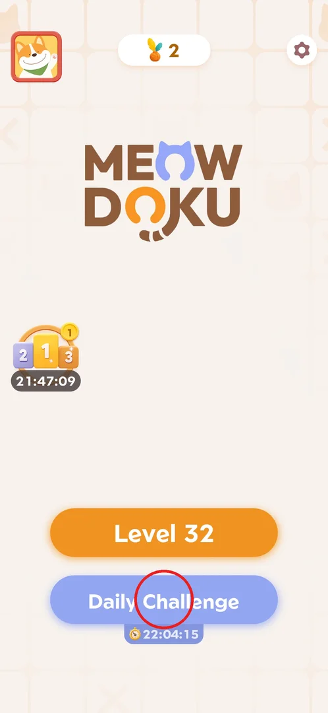
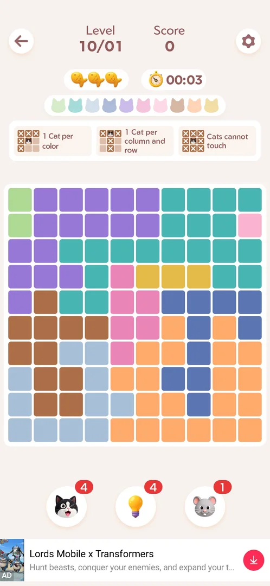
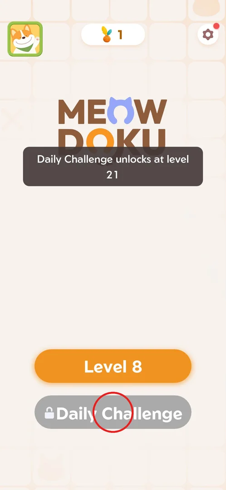
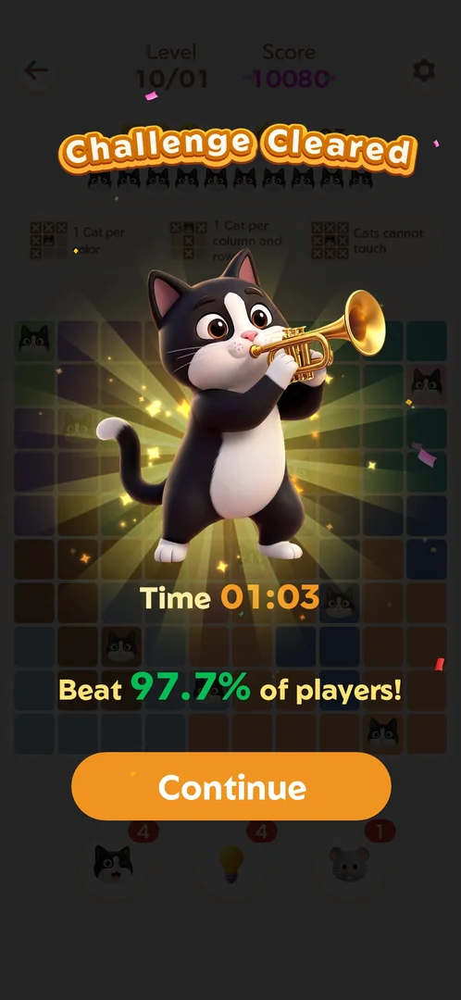
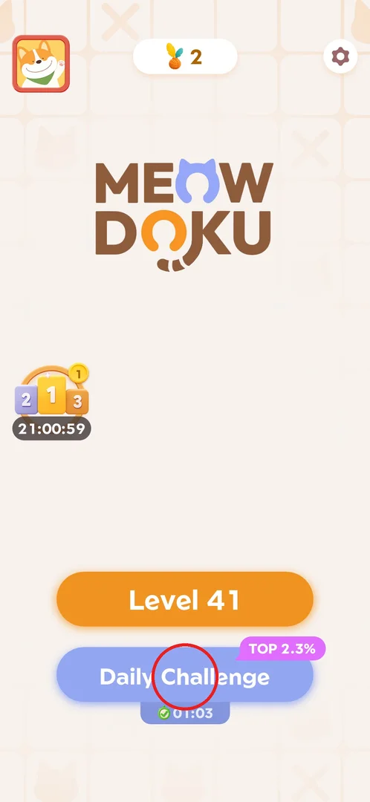

# Daily Challenge

One extra puzzle a day, separate from the numbered levels: the same cat-placing rules on a board
named after the date ("Level 10/01"), timed with a stopwatch. Clearing it shows your time and the
share of players you beat; no currency reward was seen. It unlocks at level 21 and can be played once
per day [^s3] [^s4] [^s6].

## Where to find it

On Home, the blue **Daily Challenge** button sits right under the orange "Level N" button. Under it, a
small tab with a stopwatch counts down to the next challenge (22:04:15, taken about 20 minutes after the session started at 01:35 local time, so it
probably ends at midnight — inferred) [^s1].

 [^s1]

## What it looks like

A normal level screen, except the header says **Level 10/01** (month/day) instead of a level number
[^s2]. Top row: back arrow, "Level 10/01", Score (0 at the start), settings gear. Below: 3 fish (the
lives), a stopwatch counting up from 00:00, the row of the board's 10 colors, and the three rule cards
"1 Cat per color", "1 Cat per column and row", "Cats cannot touch". The board was 10x10 with 10 color
regions; at the bottom are the same boosters as in the main levels (cat 4, hint 4, mouse 1 — shared
counts) and a banner ad [^s2]. An interstitial video ad was shown between tapping the button and the
board appearing [^s2].

 [^s2]

## What you can do

| Tab or button | What it does |
|---|---|
| [Locked](#locked) | Before level 21 the button is grey with a lock; a tap only shows the unlock level |
| [Challenge Cleared](#challenge-cleared) | The win screen: time, percentile, Continue |
| [Done for today](#done-for-today) | After clearing, the Home button shows your result and no longer opens anything |

### Locked

Before level 21 the button is grey with a padlock. Tapping it shows the toast "Daily Challenge unlocks
at level 21" and nothing opens [^s3].

 [^s3]

### Challenge Cleared

When the last cat is placed, a **Challenge Cleared** screen appears over the board: a cat with a
trumpet, **Time 01:03**, "Beat 97.7% of players!" and an orange **Continue** button. The score in the
header behind it was 10080. No coins, boosters or other reward were shown [^s4]. Continue led back to
the main levels (the next screen was Level 32) [^s7].

 [^s4]

### Done for today

Back on Home the same day, the button keeps its blue color but the countdown tab is replaced by a
green check with the clear time (01:03), and a pink **TOP 2.3%** badge sits on its corner (100 −
97.7 = 2.3, the same result as on the win screen). Tapping it twice did nothing: no board, no calendar,
no reward popup [^s5] [^s6].

 [^s5]

## How it works

Version 1.18.0.

- Unlock: level 21 [^s3].
- One challenge per day; once cleared it cannot be replayed that day [^s6].
- Rules are the same as the main levels (one cat per color, per row and per column, cats never touch)
  [^s2]. The 2026-10-01 board was 10x10 with 10 colors [^s2].
- Lives and boosters are shared with the main levels: 3 fish, cat/hint/mouse counts as in the levels
  [^s2].
- Scoring: a stopwatch time and a percentile of players beaten; 01:03 gave 97.7% (TOP 2.3%) and score
  10080 [^s4] [^s5].
- The in-game support article (Settings > Feedback) says: a new hand-crafted puzzle every day that
  resets at midnight, found on Home; trickier than regular levels (bigger boards, sneakier regions);
  coming back daily builds a "solve-streak"; same rules [^s8].

## Cases

| Case | What was done | Result | Source |
|---|---|---|---|
| Locked | Tapped the button before level 21 | Toast "Daily Challenge unlocks at level 21" | [^s3] |
| Play | Tapped the button on 2026-10-01 after level 21 | An interstitial video ad, then the board "Level 10/01", 3 fish, a stopwatch, shared boosters; cleared in 01:03, "Beat 97.7% of players!", score 10080, no currency reward | [^s2] [^s4] |
| Done state | Tapped the Home button twice after clearing | A check with 01:03 and TOP 2.3%; nothing opens | [^s5] [^s6] |
| Next day | — | not verified | |

## Not verified

- The next day's challenge: whether the board changes at midnight, any reward for finishing, a
  calendar or the "solve-streak" the support article mentions [^s8].
- Whether the countdown under the button ends at local midnight (inferred: 22:04:15 left at about 01:56).
- Whether boards are always bigger than the current main level, as the article claims.

[^s1]: session 20261001-013526-chrono-2FYKPJ, step 98 — [video at 19:57](https://youtu.be/T86pLfervRE?t=1197)
[^s2]: session 20261001-013526-chrono-2FYKPJ, step 100 — [video at 20:43](https://youtu.be/T86pLfervRE?t=1243)
[^s3]: session 20260930-233055-chrono-2FYKPJ, step 35 — [video at 9:18](https://youtu.be/kfHedtB_k4Q?t=558)
[^s4]: session 20261001-013526-chrono-2FYKPJ, step 106 — [video at 21:43](https://youtu.be/T86pLfervRE?t=1303)
[^s5]: session 20261001-022624-chrono-2FYKPJ, step 73
[^s6]: session 20261001-022624-chrono-2FYKPJ, step 74
[^s7]: session 20261001-013526-chrono-2FYKPJ, step 107
[^s8]: session 20261001-022624-chrono-2FYKPJ, step 27
