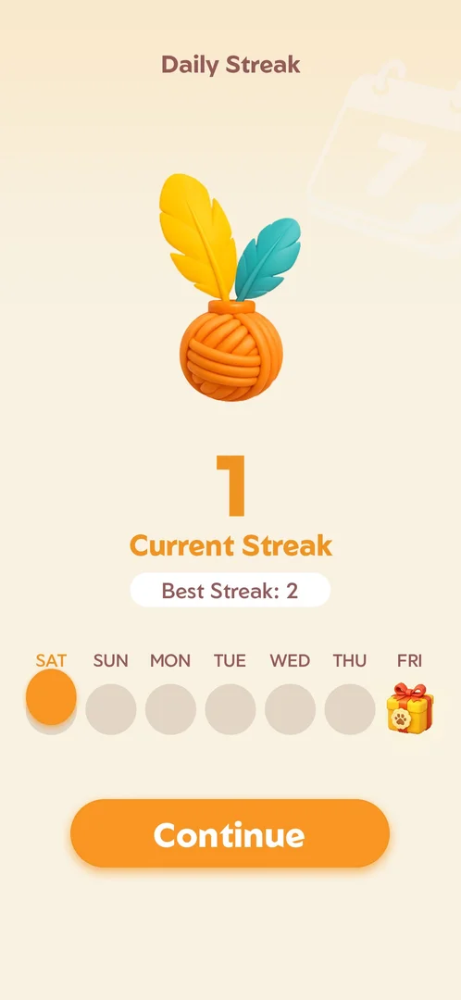
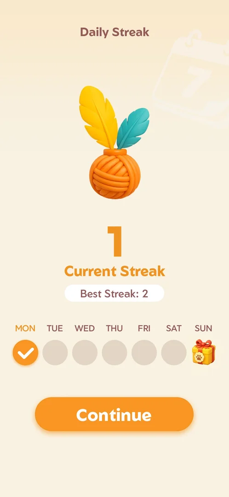
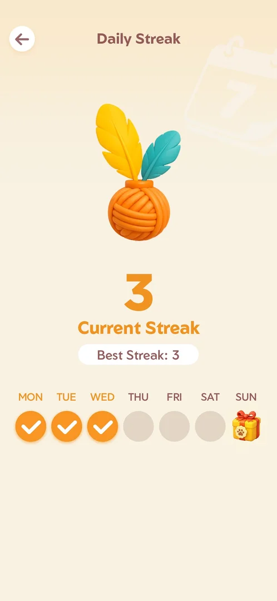
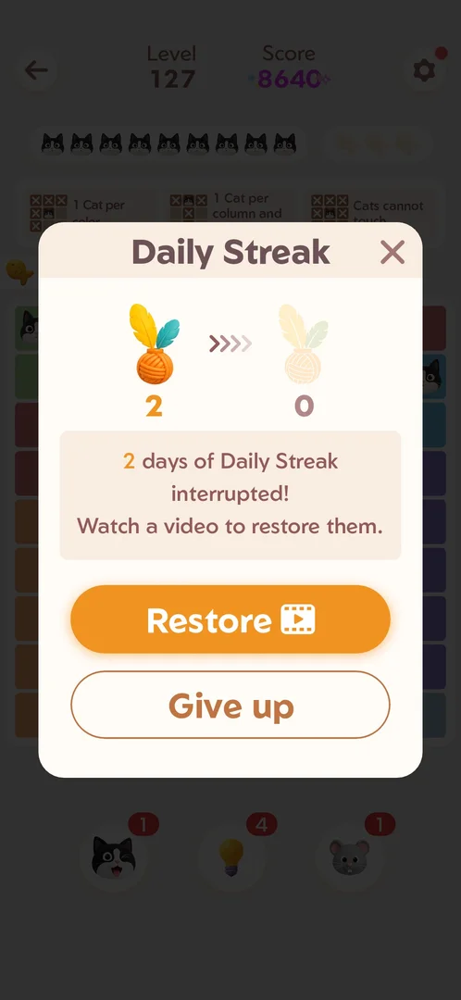
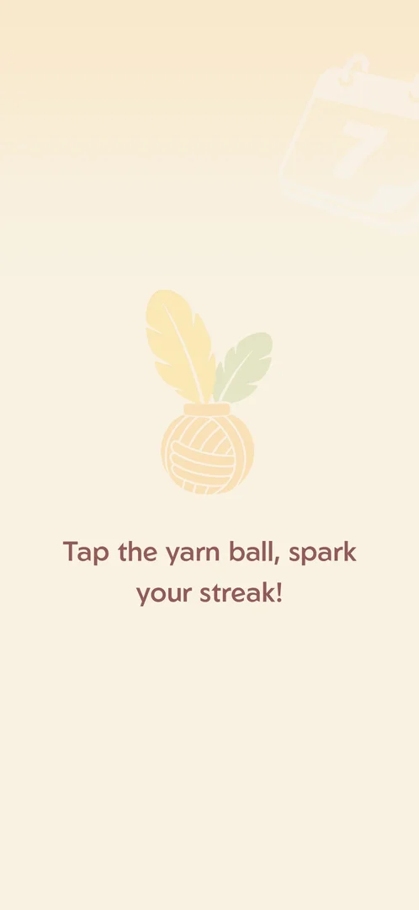

# Daily Streak

A count of consecutive days played, shown as a ball of yarn on [Home](home.md). The day's first won level
lights the day's ball; a missed day breaks the streak, and the next win offers to restore it for a video
[^s3] [^s4]. Its screen shows the current streak, the best streak and a seven-day row with a gift on the
seventh day [^s1].

## Why it appeared

Yarn counter at top of Home opens it; current 0, best 2, 7-day row with gift on day 7 [^s1].

## Where to find it

On [Home](home.md), the yarn counter at the top centre (a ball of yarn with feathers and the current streak:
0 on 3 October, 2 on 5 October, 3 on 6 October) opens Daily Streak [^s2] [^s13] [^s20]. It also comes up by itself after the
day's first won level, between the leaderboard and the win screen [^s3] [^s4].

 [^s14]
*Home screen: the yarn counter at the top centre (reading 2) opens Daily Streak*

## What it looks like

 [^s4]
*Daily Streak after the day's first win: an orange ball of yarn, "1 Current Streak", "Best Streak: 2", SAT lit orange, a gift on FRI, Continue*

A full screen titled "Daily Streak" [^s4]:

- A large ball of yarn with two feathers: pale while the day is not counted, orange once it is.
- The current streak and "Current Streak".
- "Best Streak: 2".
- A row of seven days with a gift box on the seventh.
- Continue (after a win) or a back arrow (from Home) [^s1].

Opened from Home with a streak of 0, the row ran WED to TUE, all empty [^s1]:

 [^s1]
*Daily Streak from Home before any win: a pale ball of yarn, "0 Current Streak", "Best Streak: 2", the days WED to TUE with a gift on TUE*

After the second break, the row started on the day of the new streak: MON to SUN on Monday 5 October, MON
ticked, the gift on SUN [^s12]:

 [^s12]
*Daily Streak after Give up on the second break: "1 Current Streak", "Best Streak: 2", MON ticked, a gift on SUN, Continue*

Opened from Home at about 14:41 the same Monday, the screen read "2 Current Streak", "Best Streak: 2", with
MON and TUE ticked, the gift on SUN and a back arrow [^s13]:

 [^s13]
*Daily Streak from Home on Monday 5 October at about 14:41: an orange ball of yarn, "2 Current Streak", "Best Streak: 2", MON and TUE ticked, a gift on SUN*

Opened from Home at about 10:11 on Tuesday 6 October, the screen read "3 Current Streak", "Best Streak: 3",
with MON, TUE and WED ticked and the gift on SUN [^s20]. Opened again at about 12:22 the same day, before
that session's wins, it showed the same: 3, best 3, MON to WED ticked [^s25]:

 [^s20]
*Daily Streak from Home on Tuesday 6 October: "3 Current Streak", "Best Streak: 3", MON to WED ticked, a gift on SUN*

Tapping the gift on SUN changed nothing on screen [^s15]. Android Back returned to Home
[^s16].

### Streak interrupted

 [^s3]
*The popup after the leaderboard of the day's first win: the lit ball "2" and the pale ball "0", Restore (a video icon) and Give up*

"2 days of Daily Streak interrupted! Watch a video to restore them." Restore (with a video icon), Give up and a
close cross [^s3].

### Spark your streak

 [^s5]
*After Give up: a pale ball of yarn and "Tap the yarn ball, spark your streak!"*

 [^s4]
*Clip 3.6 s · [original on YouTube from 2:15](https://youtu.be/ffhYgQE4LvU?t=135)*

The tap lights the ball, the screen switches to the streak of 1, and the first day of the row gets a tick
[^s4].

## How it works

- A day counts with the day's first won main level: Level 127 won on Saturday turned the streak from 0 to 1
  [^s3] [^s4]. The second win that day (Level 128) went from the leaderboard straight to the win screen, with
  no streak screen [^s6].
- A break: the streak had been 2 days and was 0 on this day (the session ran on Saturday 3 October); the next
  win offered to restore the 2 days for a rewarded video [^s3]. Give up kept the best streak at 2 and started
  a new streak at 1 [^s4].
- The row: from Home at a streak of 0 it ran WED to TUE [^s1]; after the new streak began on Saturday it ran
  SAT to FRI, with SAT lit [^s4]; after the next break it began on Monday and ran MON to SUN, MON ticked
  [^s12]. Inferred: the row starts on the first day of the current streak.
- A second break: no level was won on Sunday 4 October; on Monday 5 October the day's first win (Level 130)
  brought the same popup, again "2 days of Daily Streak interrupted" with Restore (video) and Give up,
  although the streak had restarted at 1 on Saturday. Give up led to "Tap the yarn ball", then current 1,
  best 2 [^s12]. Inferred: the number on the popup is not the streak that was just lost; what it counts is
  not verified.
- Same-day count: on Monday 5 October the streak was 1 (MON ticked) after the win shortly after 00:39
  [^s12]; at about 14:38 the Home counter already read 2, before any win in that session, and the screen
  showed MON and TUE ticked [^s17] [^s13]. A session ran between them (about 12:34) whose wins did not
  record a streak screen. So the streak went from 1 to 2 within one calendar day. Inferred: the TUE tick
  marks the streak's second day, not the weekday; why a second day counted on the same date is not
  verified (hypothesis: the streak day does not end at local midnight).
- The next day: on Tuesday 6 October, after Level 139 was won at about 07:16, the screen at about 10:11 showed
  current 3 and best 3, with three ticks (MON, TUE, WED) on a Tuesday [^s20]. The best streak rose with the
  current one. Inferred: the ticks count the days of the current streak from the row's first slot, not the
  weekdays; the 6 October win added the third day. The step from 2 to 3 itself was not seen.
- The day's later wins show nothing: Levels 140 and 142, won after the day's first win on 6 October, went
  from the leaderboard to the win screen with no streak popup or screen [^s21] [^s22]. So did Levels 143 and
  145, won at about 12:23 and 12:25 that day [^s26] [^s27]. Before that, the clean Level 132 win at about 14:40 went from the leaderboard to the
  win screen with no streak screen [^s18] [^s19].
- The gift on the seventh day: tapping it shows nothing; its content was not seen [^s15].
- Restore was not tapped: what the video gives back is not verified.
- Opened from Home, the back arrow returned to Home; after a win, Continue led to the win screen [^s7] [^s4].

Version 1.19.1.

## Cases

| Case | What was done | Result | Source |
|---|---|---|---|
| Daily Streak screen: current streak 0, best streak 2, a Wed-Tue week row with a gift on the 7th day <!-- case:chk-screen --> | Opened from the yarn counter, frame marked | ✅ | [^s1] |
| Yarn counter at the top of Home (0) opens it; it counts consecutive days (current 0, best 2) <!-- case:chk-counter --> | Yarn counter tapped | ✅ | [^s1] |
| Why it appeared: the trigger that brought it up (the first launch, a level won, a threshold, a timer, a loss): a fact with its frame, or a hypothesis to test <!-- case:chk-appeared --> | The yarn counter on Home | ✅ | [^s1] |
| The yarn counter at the top of Home opens the Daily Streak screen; it also comes up by itself after the day's first win <!-- case:chk-entry --> | Yarn counter tapped on two days | ✅ | [^s13] |
| The rewards: only the day-7 gift box (SUN) is shown; tapping it does nothing; its content not shown <!-- case:chk-rewards --> | The gift tapped | ✅ | [^s15] |
| What shows during a level while the streak runs: nothing; the level HUD has Level, Score, the cat bar, the fish, the rule cards and the boosters, no yarn counter or streak sign <!-- case:chk-in-level --> | Level screens of Levels 127, 128 and 140 to 143 looked at | ✅ | [^s6] [^s23] [^s24] |
| What breaks it (a loss, a quit, a missed day) and what the break costs <!-- case:chk-break --> | A 2-day streak found broken; Give up: streak 1, best 2 | ✅ | [^s3] |
| Offers to keep it after a break and their price (a video, coins) <!-- case:chk-save --> | Restore for a rewarded video offered after the win; Give up chosen | ✅ | [^s3] |
| Win under Daily Streak: as the base, or what differs <!-- case:under-win --> | Day's first win: the streak popup and screen between the leaderboard and the win screen; second win: none | ✅ | [^s4] |
| Restart under Daily Streak: as the base <!-- case:under-restart --> | Settings > Restart on Level 130: the board cleared, no popup from the event or the streak | ✅ | [^s8] |
| Quit under Daily Streak: as the base <!-- case:under-quit --> | Back arrow on Level 130: straight to Home, no event or streak popup | ✅ | [^s9] |
| Exit the app under Daily Streak: as the base <!-- case:under-exit-app --> | Android Back on Home: the Quit popup, its cross cancelled | ✅ | [^s10] |
| Second break (Monday 5 October, the day's first win on Level 130): "2 days of Daily Streak interrupted", Restore (video) or Give up; Give up, then "Tap the yarn ball", then current 1, best 2, the row MON to SUN starting that day, a gift on day 7 <!-- case:second-break --> | Level 130 won after a day with no win; Give up, the yarn ball tapped | ✅ | [^s12] |
| Streak 2, best 2, MON and TUE ticked at about 14:41 on Monday 5 October, though it was 1 with MON ticked shortly after 00:39 that day; the cause of the 2 is not known <!-- case:count-shown --> | Screen opened from Home | not verified | [^s13] |
| Tuesday 6 October at about 12:22, before that session's wins: current 3, best 3, MON, TUE and WED ticked, the gift on SUN; that date already had wins in earlier sessions (the first, Level 133, about 01:10). The wins of Levels 143 to 145 brought no streak popup and left it at 3. The row counts streak days, not weekdays (WED ticked on a Tuesday) <!-- case:count-1006 --> | Screen opened from Home, then levels won | ✅ | [^s25] [^s26] [^s27] |
| Out of Fishes under Daily Streak: as the base <!-- case:under-out-of-fishes --> | Three wrong cats on Level 130: the Out of Fishes screen, no leaderboard or streak popup after the loss | ✅ | [^s11] |

## Not verified

- What the day-7 gift holds, and whether other days pay anything
- Whether a level played on a day the streak is at risk shows a warning (no such level was looked at)
- Why the streak read 2 on the same Monday it restarted at 1: when a streak day ends (local midnight or another boundary) <!-- case:count-shown -->
- Why the popup said "2 days" on the second break, when the streak had restarted at 1
- Whether the break happens at local midnight or after 24 h without a win; what Restore gives back (on
  6 October the streak was already counted for the day and not broken, so neither could be tested)

[^s1]: session 20261003-200440-chrono-2FYKPJ, step 19 — [video at 3:11](https://youtu.be/Pqx4QY-FpBA?t=191)
[^s2]: session 20261003-200440-chrono-2FYKPJ, step 4 — [video at 1:15](https://youtu.be/Pqx4QY-FpBA?t=75)
[^s3]: session 20261003-201915-chrono-2FYKPJ, step 4 — [video at 1:45](https://youtu.be/ffhYgQE4LvU?t=105)
[^s4]: session 20261003-201915-chrono-2FYKPJ, step 6 — [video at 2:19](https://youtu.be/ffhYgQE4LvU?t=139)
[^s5]: session 20261003-201915-chrono-2FYKPJ, step 5 — [video at 2:07](https://youtu.be/ffhYgQE4LvU?t=127)
[^s6]: session 20261003-201915-chrono-2FYKPJ, step 18 — [video at 5:47](https://youtu.be/ffhYgQE4LvU?t=347)
[^s7]: session 20261003-200440-chrono-2FYKPJ, step 20 — [video at 3:24](https://youtu.be/Pqx4QY-FpBA?t=204)

[^s8]: session 20261003-202631-chrono-2FYKPJ, step 15 — [video at 5:05](https://youtu.be/3-USmjAyOV8?t=305)
[^s9]: session 20261003-202631-chrono-2FYKPJ, step 21 — [video at 6:40](https://youtu.be/3-USmjAyOV8?t=400)
[^s10]: session 20261003-202631-chrono-2FYKPJ, step 22 — [video at 6:55](https://youtu.be/3-USmjAyOV8?t=415)
[^s11]: session 20261003-202631-chrono-2FYKPJ, step 17 — [video at 5:40](https://youtu.be/3-USmjAyOV8?t=340)

[^s12]: session 20261005-003925-chrono-2FYKPJ, step 11 — [video at 2:28](https://youtu.be/CkktBjH7fAI?t=148)

[^s13]: session 20261005-143752-chrono-2FYKPJ, step 13 — [video at 3:19](https://youtu.be/K_i7fJ2MDQo?t=199)
[^s14]: session 20261005-143752-chrono-2FYKPJ, step 10 — [video at 3:00](https://youtu.be/K_i7fJ2MDQo?t=180)
[^s15]: session 20261005-143752-chrono-2FYKPJ, step 14 — [video at 3:30](https://youtu.be/K_i7fJ2MDQo?t=210)
[^s16]: session 20261005-143752-chrono-2FYKPJ, step 15 — [video at 3:52](https://youtu.be/K_i7fJ2MDQo?t=232)
[^s17]: session 20261005-143752-chrono-2FYKPJ, step 0 — [video at 0:00](https://youtu.be/K_i7fJ2MDQo?t=0)
[^s18]: session 20261005-143752-chrono-2FYKPJ, step 5 — [video at 1:55](https://youtu.be/K_i7fJ2MDQo?t=115)
[^s19]: session 20261005-143752-chrono-2FYKPJ, step 6 — [video at 2:13](https://youtu.be/K_i7fJ2MDQo?t=133)

[^s20]: session 20261006-101030-chrono-2FYKPJ, step 1 — [video at 0:00](https://youtu.be/FuAwbQouw6Q?t=0)
[^s21]: session 20261006-101030-chrono-2FYKPJ, step 7 — [video at 1:26](https://youtu.be/FuAwbQouw6Q?t=86)
[^s22]: session 20261006-101030-chrono-2FYKPJ, step 14 — [video at 3:10](https://youtu.be/FuAwbQouw6Q?t=190)
[^s23]: session 20261006-101030-chrono-2FYKPJ, step 9 — [video at 2:07](https://youtu.be/FuAwbQouw6Q?t=127)

[^s24]: session 20261006-101030-chrono-2FYKPJ, step 15 — [video at 3:26](https://youtu.be/FuAwbQouw6Q?t=206)

[^s25]: session 20261006-122109-chrono-2FYKPJ, step 1 — [video at 0:03](https://youtu.be/dw0JCgXQwQQ?t=3)
[^s26]: session 20261006-122109-chrono-2FYKPJ, step 5 — [video at 1:01](https://youtu.be/dw0JCgXQwQQ?t=61)
[^s27]: session 20261006-122109-chrono-2FYKPJ, step 14 — [video at 1:41](https://youtu.be/dw0JCgXQwQQ?t=101)
