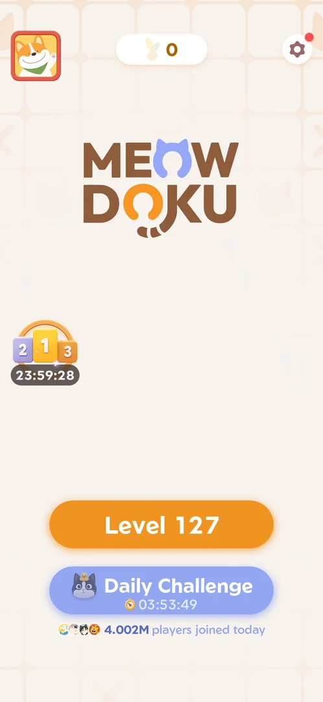

# Daily Streak

A count of consecutive days played, shown as a ball of yarn on [Home](home.md). The day's first won level
lights the day's ball; a missed day breaks the streak, and the next win offers to restore it for a video
[^s3] [^s4]. Its screen shows the current streak, the best streak and a seven-day row with a gift on the
seventh day [^s1].

## Why it appeared

Yarn counter at top of Home opens it; current 0, best 2, 7-day row with gift on day 7 [^s1].

## Where to find it

On [Home](home.md), the yarn counter at the top centre (it showed 0) opens Daily Streak [^s2]. It also comes
up by itself after the day's first won level, between the leaderboard and the win screen [^s3] [^s4].

 [^s2]
*Home screen: the yarn counter at the top centre opens Daily Streak*

## What it looks like

 [^s4]
*Daily Streak after the day's first win: an orange ball of yarn, "1 Current Streak", "Best Streak: 2", SAT lit orange, a gift on FRI, Continue*

A full screen titled "Daily Streak" [^s4]:

- A large ball of yarn with two feathers: pale while the day is not counted, orange once it is.
- The current streak and "Current Streak".
- "Best Streak: 2".
- A row of seven days with a gift box on the seventh.
- Continue (after a win) or a back arrow (from Home) [^s1].

Opened from Home with a streak of 0, the row ran WED to TUE, all empty [^s1]:

 [^s1]
*Daily Streak from Home before any win: a pale ball of yarn, "0 Current Streak", "Best Streak: 2", the days WED to TUE with a gift on TUE*

### Streak interrupted

 [^s3]
*The popup after the leaderboard of the day's first win: the lit ball "2" and the pale ball "0", Restore (a video icon) and Give up*

"2 days of Daily Streak interrupted! Watch a video to restore them." Restore (with a video icon), Give up and a
close cross [^s3].

### Spark your streak

 [^s5]
*After Give up: a pale ball of yarn and "Tap the yarn ball, spark your streak!"*

 [^s4]
*Clip 3.6 s · [original on YouTube from 2:15](https://youtu.be/ffhYgQE4LvU?t=135)*

The tap lights the ball, the screen switches to the streak of 1, and the first day of the row gets a tick
[^s4].

## How it works

- A day counts with the day's first won main level: Level 127 won on Saturday turned the streak from 0 to 1
  [^s3] [^s4]. The second win that day (Level 128) went from the leaderboard straight to the win screen, with
  no streak screen [^s6].
- A break: the streak had been 2 days and was 0 on this day (the session ran on Saturday 3 October); the next
  win offered to restore the 2 days for a rewarded video [^s3]. Give up kept the best streak at 2 and started
  a new streak at 1 [^s4].
- The row: from Home at a streak of 0 it ran WED to TUE [^s1]; after the new streak began on Saturday it ran
  SAT to FRI, with SAT lit [^s4]. Inferred: the row starts on the first day of the current streak.
- The gift on the seventh day: its content was not opened.
- Restore was not tapped: what the video gives back is not verified.
- Opened from Home, the back arrow returned to Home; after a win, Continue led to the win screen [^s7] [^s4].

Version 1.19.1.

## Cases

| Case | What was done | Result | Source |
|---|---|---|---|
| Daily Streak screen: current streak 0, best streak 2, a Wed-Tue week row with a gift on the 7th day <!-- case:chk-screen --> | Opened from the yarn counter, frame marked | ✅ | [^s1] |
| Yarn counter at the top of Home (0) opens it; it counts consecutive days (current 0, best 2) <!-- case:chk-counter --> | Yarn counter tapped | ✅ | [^s1] |
| Why it appeared: the trigger that brought it up (the first launch, a level won, a threshold, a timer, a loss): a fact with its frame, or a hypothesis to test <!-- case:chk-appeared --> | The yarn counter on Home | ✅ | [^s1] |
| Where to find it: the screen and the button that open it (mark --as entry --at X,Y) <!-- case:chk-entry --> | Yarn counter tapped; also shown by itself after the day's first win | ✅ | [^s2] |
| The reward for each step of the streak <!-- case:chk-rewards --> | Only the day-7 gift seen, not opened | not verified | [^s4] |
| What shows during a level while the streak runs <!-- case:chk-in-level --> | Nothing about the streak on the level screen of Levels 127 and 128 | not verified | [^s6] |
| What breaks it (a loss, a quit, a missed day) and what the break costs <!-- case:chk-break --> | A 2-day streak found broken; Give up: streak 1, best 2 | ✅ | [^s3] |
| Offers to keep it after a break and their price (a video, coins) <!-- case:chk-save --> | Restore for a rewarded video offered after the win; Give up chosen | ✅ | [^s3] |
| Win under Daily Streak: as the base, or what differs <!-- case:under-win --> | Day's first win: the streak popup and screen between the leaderboard and the win screen; second win: none | ✅ | [^s4] |
| Restart under Daily Streak: as the base <!-- case:under-restart --> | Settings > Restart on Level 130: the board cleared, no popup from the event or the streak | ✅ | [^s8] |
| Quit under Daily Streak: as the base <!-- case:under-quit --> | Back arrow on Level 130: straight to Home, no event or streak popup | ✅ | [^s9] |
| Exit the app under Daily Streak: as the base <!-- case:under-exit-app --> | Android Back on Home: the Quit popup, its cross cancelled | ✅ | [^s10] |
| Out of Fishes under Daily Streak: as the base <!-- case:under-out-of-fishes --> | Three wrong cats on Level 130: the Out of Fishes screen, no leaderboard or streak popup after the loss | ✅ | [^s11] |

## Not verified

- The reward for each day, and what the day-7 gift holds <!-- case:chk-rewards -->
- What shows during a level <!-- case:chk-in-level -->
- Whether the break happens at local midnight or after 24 h without a win; what Restore gives back

[^s1]: session 20261003-200440-chrono-2FYKPJ, step 19 — [video at 3:11](https://youtu.be/Pqx4QY-FpBA?t=191)
[^s2]: session 20261003-200440-chrono-2FYKPJ, step 4 — [video at 1:15](https://youtu.be/Pqx4QY-FpBA?t=75)
[^s3]: session 20261003-201915-chrono-2FYKPJ, step 4 — [video at 1:45](https://youtu.be/ffhYgQE4LvU?t=105)
[^s4]: session 20261003-201915-chrono-2FYKPJ, step 6 — [video at 2:19](https://youtu.be/ffhYgQE4LvU?t=139)
[^s5]: session 20261003-201915-chrono-2FYKPJ, step 5 — [video at 2:07](https://youtu.be/ffhYgQE4LvU?t=127)
[^s6]: session 20261003-201915-chrono-2FYKPJ, step 18 — [video at 5:47](https://youtu.be/ffhYgQE4LvU?t=347)
[^s7]: session 20261003-200440-chrono-2FYKPJ, step 20 — [video at 3:24](https://youtu.be/Pqx4QY-FpBA?t=204)

[^s8]: session 20261003-202631-chrono-2FYKPJ, step 15 — [video at 5:05](https://youtu.be/3-USmjAyOV8?t=305)
[^s9]: session 20261003-202631-chrono-2FYKPJ, step 21 — [video at 6:40](https://youtu.be/3-USmjAyOV8?t=400)
[^s10]: session 20261003-202631-chrono-2FYKPJ, step 22 — [video at 6:55](https://youtu.be/3-USmjAyOV8?t=415)
[^s11]: session 20261003-202631-chrono-2FYKPJ, step 17 — [video at 5:40](https://youtu.be/3-USmjAyOV8?t=340)
