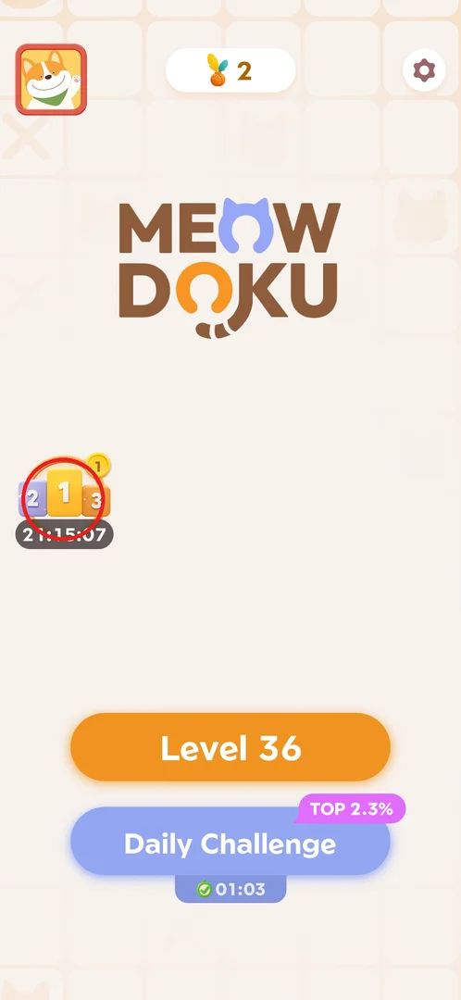
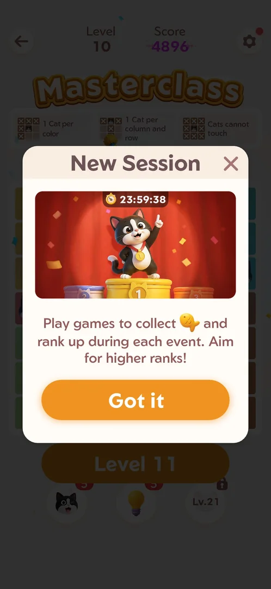
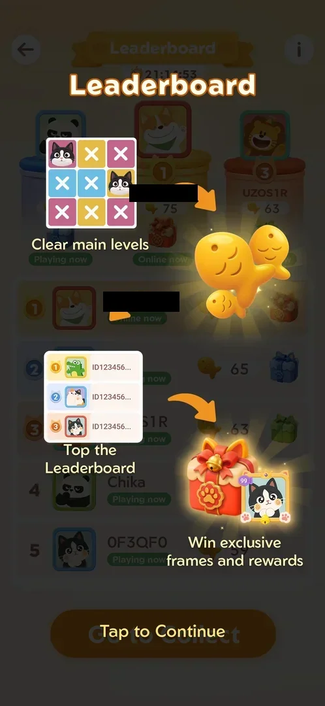
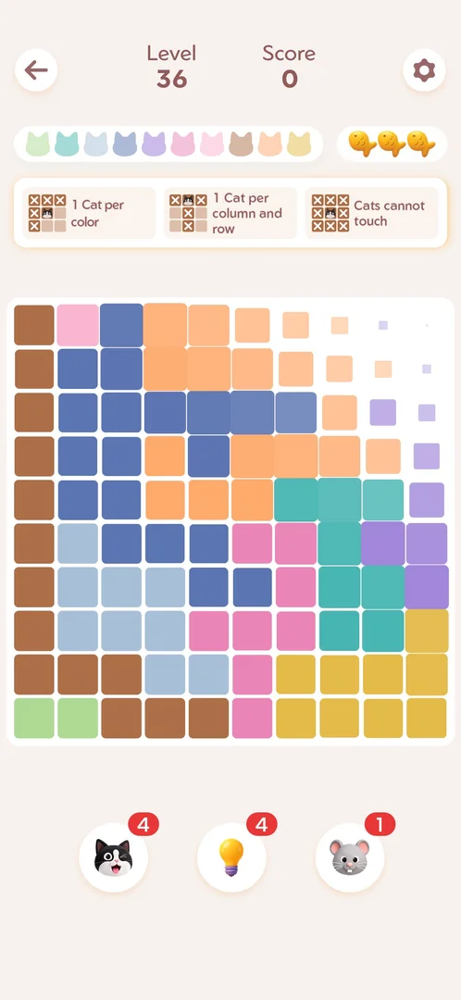
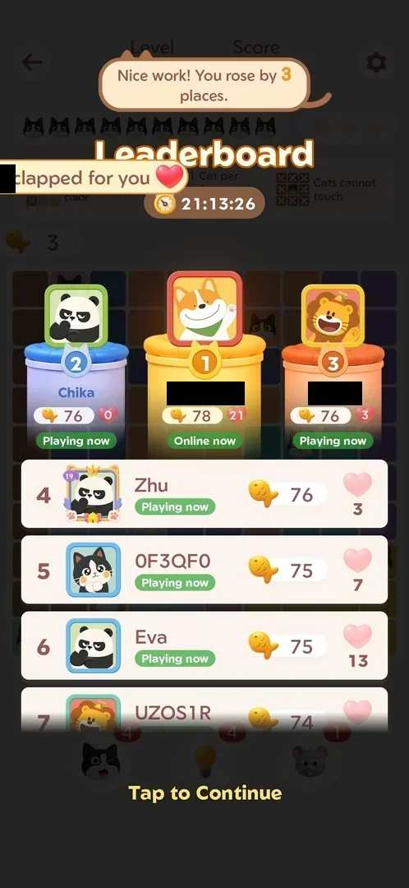
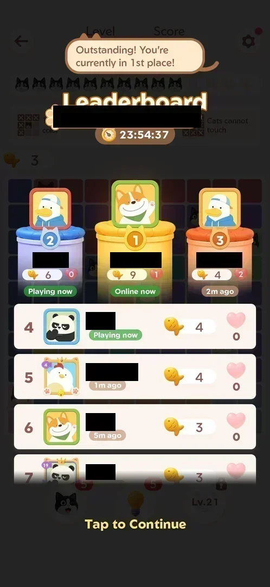

# Fish leaderboard event

A timed ranking event that opens after level 10. Each main level you win adds fish to your event score,
and you compete on a leaderboard with other players (or bots) for the top three places. Those places
show gift boxes, and the event promises "exclusive frames and rewards"[^s1][^s5]. The leaderboard shows
up after every win, and you can also open it at any time from the podium icon on the home screen[^s2][^s4].

## Where to find it

On the home screen, tap the **podium icon** (ranks 2-1-3, with the event countdown under it) on the
left, above the Level and Daily Challenge buttons[^s4]. The leaderboard also opens by itself after
every won main level, from level 11 on[^s2].

 [^s9]

## What it looks like

The screen is titled "Leaderboard" and shows the event countdown (21:15:04 here) under the title. The top
three players stand on a podium, each with an avatar, a name, a fish count and a gift box. Under each
of them is a status: "Playing now", "Online now" or "N m ago"[^s4][^s2]. Below the podium is a list
from rank 1 down, with a fish count for each player (ranks 1–3 again with their gift boxes). The back
arrow is at the top left, **(i)** at the top right, and **Go to Collect** at the bottom[^s4].

 [^s4]

## What you can do

| Tab or button | What it does |
|---|---|
| [New Session](#new-session) | The intro popup after the level 10 win; **Got it** closes it |
| [Info](#info) | **(i)** on the leaderboard: how the event works |
| [Go to Collect](#go-to-collect) | **Go to Collect** starts the next main level (it does not claim a reward) |
| [After a win](#after-a-win) | The leaderboard over a won level: places gained, cheers, **Tap to Continue** |
| [Hearts](#hearts) | Heart counters: cheers you get from other players |

### New Session

After the level 10 win, a **New Session** popup comes up. It has a 23:59:38 timer, a cat on a podium and
the text "Play games to collect fish and rank up during each event. Aim for higher ranks!". **Got it**
closes it, and the Profile popup (avatar, frame, nickname) opens next[^s1].

 [^s1]

### Info

**(i)** opens a three-step explainer: "Clear main levels" → fish → "Top the Leaderboard" → "Win
exclusive frames and rewards". The picture shows a gift box and a decorated avatar frame. **Tap to
Continue** closes it[^s5].

 [^s5]

### Go to Collect

**Go to Collect** goes straight into the next main level (Level 36 here, with 3 fish and score 0). It
starts play and does not claim anything[^s6].

 [^s6]

### After a win

From level 11 on, every win shows the leaderboard over the board before the win screen. It shows a
speech bubble ("Nice work! You rose by 3 places." / "Outstanding! You're currently in 1st place!"),
toasts from other players ("… clapped for you" / "… cheered for you"), and your fish going up by 3. **Tap
to Continue** goes on to the win screen[^s2][^s7]. In one case, the win took the fish from 75 to 78[^s7].

 [^s7]

### Hearts

Every leaderboard row has a heart counter. Hearts are cheers from other players: a toast "… cheered for
you" came up and your own counter went to 1. After 3 flawless wins you had 9 fish and were in 1st
place[^s3]. Later the counter grew to 10[^s8] and then 21[^s7]. Whether you can tap a heart to cheer
someone else was not checked.

 [^s3]

## How it works

Version 1.18.0.

- **Unlock:** after the level 10 win (New Session popup)[^s1].
- **Duration:** each event lasts about 24 h. The timer showed 23:59:38 at first show[^s1], and the home
  podium shows the same countdown[^s4].
- **Fish:** a won main level adds fish to your event score: +3 for a flawless win with all 3 fish
  left[^s2][^s7]. *Inferred:* the fish added are the fish left at the end of the level, and a mistake
  costs one of the level's 3 fish (see [Fish (3 mistake lives per level)](lives-fish.md)).
- **Ranks:** ranks 1–3 have gift boxes. The (i) page promises exclusive frames and rewards[^s5].
- **Other players:** marked "Playing now", "Online now" or "N m ago". They gain fish while you play
  (the scores rose from 3–6 to 59–76 over a few hours)[^s3][^s4][^s7].
- Seen once: 1st place with 39 fish and 10 hearts, a toast "jumped up 4 places", timer 22:00:39[^s8].

## Cases

| Case | What was done | Result | Source |
|---|---|---|---|
| Intro | Won level 10 | New Session popup with a 24 h timer, then the Profile popup | [^s1] |
| Leaderboard after a win | Won levels 11+ | The leaderboard comes up before the win screen: +3 fish, "You rose by N places", Tap to Continue | [^s2] |
| Leaderboard from home | Tapped the home podium | Ranks, fish, gift boxes for 1–3, (i), Go to Collect | [^s4] |
| Info | Tapped (i) | Clear main levels → top the leaderboard → frames and rewards | [^s5] |
| Go to Collect | Tapped Go to Collect | Level 36 started, no reward | [^s6] |
| Hearts | Watched after wins | Cheers from other players ("… cheered for you"), own counter 1 | [^s3] |
| Event end after 24 h: rank rewards | — | not verified | |

## Not verified

- The end of the event and the rank rewards (what the gift boxes hold, which frames are given).
- Whether the other players are bots. *Inferred:* they look like bots, because they are almost always
  "Playing now".
- Whether you can cheer other players by tapping a heart.
- How many fish a win with mistakes adds.

[^s1]: session 20260930-233055-chrono-2FYKPJ, step 49 — [video at 11:59](https://youtu.be/kfHedtB_k4Q?t=719)
[^s2]: session 20260930-233055-chrono-2FYKPJ, step 53 — [video at 13:08](https://youtu.be/kfHedtB_k4Q?t=788)
[^s3]: session 20260930-233055-chrono-2FYKPJ, step 72 — [video at 16:53](https://youtu.be/kfHedtB_k4Q?t=1013)
[^s4]: session 20261001-022624-chrono-2FYKPJ, step 8
[^s5]: session 20261001-022624-chrono-2FYKPJ, step 9
[^s6]: session 20261001-022624-chrono-2FYKPJ, step 11
[^s7]: session 20261001-022624-chrono-2FYKPJ, step 16
[^s8]: session 20261001-013526-chrono-2FYKPJ, step 22
[^s9]: session 20261001-022624-chrono-2FYKPJ, step 7
