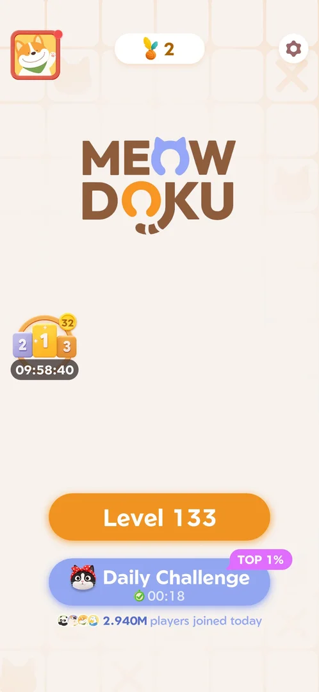
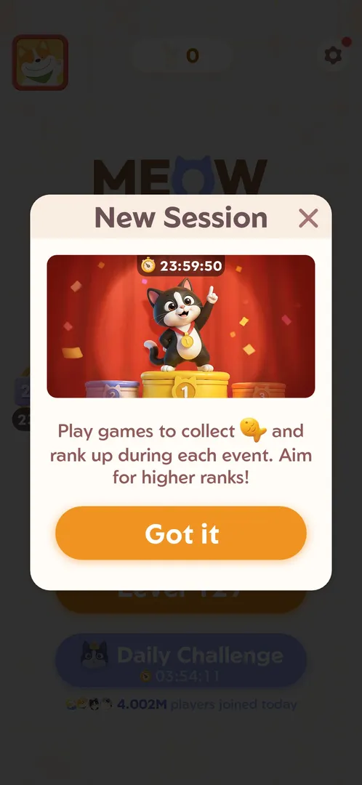
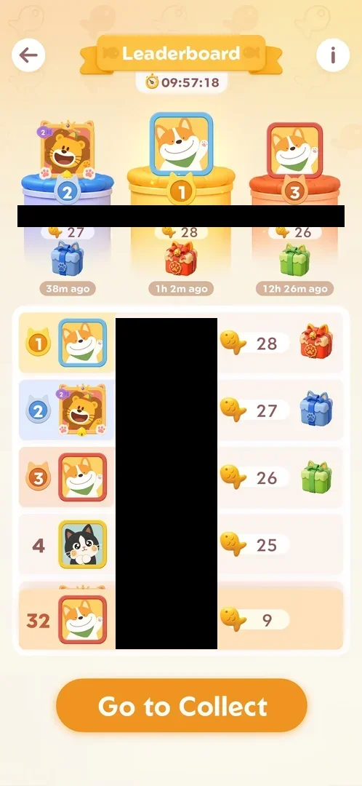

# Fish rank event (New Session)

A timed competition: clearing main levels earns fish, and players are ranked by fish on the
[Fish leaderboard](fish-leaderboard.md); the top ranks win gift boxes and exclusive avatar frames. An event
("session") runs for 24 hours [^s1] [^s4]. A main level pays up to three fish: each wrong cat costs one [^s8]
[^s7].

## Why it appeared

Popup on Home after launch, 23:59:50 timer, collect fish and rank up [^s1]. It showed over Home on the first
launch, right after the consent popup and the system notification request [^s1].

## Where to find it

On [Home](home.md), the podium icon with the event timer on the left edge opens the event's leaderboard [^s2].
On launch, the "New Session" popup announces the event by itself [^s1]. The icon carries a small yellow badge
with the player's rank: 32 on Home at 14:42 on 5 October, when the leaderboard showed the player 32nd
[^s17] [^s18].

 [^s17]
*Home screen: the podium icon on the left edge, its badge 32 (the player's rank) and the event timer 09:58:40*

## What it looks like

On launch, the "New Session" popup:

 [^s1]
*The "New Session" popup: a cat on a podium with a 23:59:50 timer, one line of rules, Got it*

Title "New Session", a cross top right, art of a cat with a medal on a 2-1-3 podium with the timer 23:59:50,
the line "Play games to collect [fish] and rank up during each event. Aim for higher ranks!", and the orange
Got it button [^s1]. Got it opened Level 127 directly, not Home [^s5].

### Leaderboard

 [^s18]
*The event leaderboard while the player has fish (names blacked out): the timer, the podium with 28, 27 and 26 fish and a gift box each, rank 4 with 25 and no box, the player's row at 32 with 9 fish, Go to Collect*

The event's screen is its leaderboard; it is described on [Fish leaderboard](fish-leaderboard.md) [^s3].
Opened from the podium icon, the list was blank for a moment under the title and the timer before the rows
came in [^s19]. With fish collected it showed: the timer (09:57:18), the top three on a podium, each
with its fish and a gift box (red for 1st, blue for 2nd, green for 3rd), the list from rank 1 with the same
boxes on ranks 1 to 3 and none from rank 4, and the player's own row pinned at the bottom (32nd, 9 fish,
"Online now") above Go to Collect [^s18]. Tapping the 1st place gift box changed nothing on screen
[^s20].

### Rules overlay

 [^s4]
*The rules overlay from the i button: Clear main levels, fish, Top the Leaderboard, Win exclusive frames and rewards; Tap to Continue*

The i button top right of the leaderboard opens a three-step picture: "Clear main levels" leads to fish,
fish lead to "Top the Leaderboard", the top leads to "Win exclusive frames and rewards" (a gift box and a
framed cat avatar). "Tap to Continue" closes it [^s4] [^s6].

### In a level

 [^s8]
*Level 128: the fish box (top right, under the gear) after one wrong cat: two orange fish and a grey one (the banner ad is blacked out)*

The [main level](level.md) shows a box of three fish right of the cat heads [^s5]. A wrong cat greys one
[^s8].

## How it works

- Fish come from clearing main levels [^s4]. A level starts with three fish in its box; each wrong cat greys
  one; the boosters do not [^s8] [^s7]. The fish left at the win are added to the player's leaderboard count:
  3 for a clean Level 127 (0 to 3), 2 for Level 128 with one wrong cat (3 to 5) [^s11] [^s7].
- After each won level the [Fish leaderboard](fish-leaderboard.md) comes up by itself before the win screen,
  showing the player's row move up [^s11] [^s7]. The win screen's title follows the fish kept: "Perfect" with
  3, "Brilliant" with 2 [^s9] [^s10].
- Timer: 23:59:50 on the launch popup at 20:05:50 local time [^s1], 23:59:28 on Home at 20:06:17 [^s2],
  23:58:25 on the leaderboard [^s3]; 23:44:36 and 23:40:27 at the two wins about 15 and 19 minutes later
  [^s11] [^s7]; 20:14:07 on the Home icon at about 23:51:33 [^s16]. All readings put the end at about
  20:05:40 on 4 October, 24 h after the first launch. Inferred: this event started when the app was first
  launched; whether every event is tied to the player's own start or to a global schedule is not verified.
- At about 23:51:33 the podium icon on Home carried a small yellow badge reading 27 at its top right [^s16].
  On 5 October it read 32 at 14:42 while the leaderboard showed the player 32nd [^s17] [^s18]:
  the badge is the player's rank (one matching reading).
- The next period: the timer read 10:01:28 on Home at about 14:38 on 5 October, 09:59:44 on the
  leaderboard after a win at about 14:40, and 09:57:18 at about 14:42 [^s21] [^s22] [^s18]: this
  period ends at about 00:40 on 6 October, 24 h after it began at the launch shortly after 00:39 on 5 October
  (see [Fish leaderboard](fish-leaderboard.md)).
- A clean win on Level 132 (3 fish kept): the leaderboard came up over the board with the player's row at 47,
  the fish count rising (8 in the frame, fish still flying into it); four minutes later the leaderboard showed
  9 fish and rank 32 [^s22] [^s18]. Inferred: +3 as for the earlier clean win; the rank rose by 15
  with no further win. In that overlay each row also had a heart with a number (the player's row 3), and a
  banner slid in at the top naming another player who "clapp…" (cut off) [^s22]. What the hearts count
  is not verified.
- A cleared [Daily Challenge](daily-challenge.md) brought no leaderboard [^s23]. Inferred: it does not
  pay event fish; not verified.
- Rewards: gift boxes for ranks 1 (red), 2 (blue) and 3 (green), and exclusive frames [^s3] [^s4]; no box from
  rank 4 down [^s18]. Tapping a box shows nothing; their contents were not seen [^s20].
- Go to Collect on the leaderboard was not tapped. Inferred: it leads to the next main level.

Version 1.19.1.

## Cases

| Case | What was done | Result | Source |
|---|---|---|---|
| Info: clear main levels to earn fish, top the leaderboard, win exclusive frames and rewards <!-- case:chk-rules --> | The i button on the leaderboard tapped | ✅ | [^s4] |
| Why it appeared: the trigger that brought it up (the first launch, a level won, a threshold, a timer, a loss): a fact with its frame, or a hypothesis to test <!-- case:chk-appeared --> | The New Session popup on the first launch | ✅ | [^s1] |
| Home podium icon opens the leaderboard; its badge shows the player's rank <!-- case:chk-entry --> | Podium icon on Home tapped on two days | ✅ | [^s19] |
| Leaderboard with timer, top-3 podium with red, blue and green gift boxes, the list, the own row, the i button, Go to Collect <!-- case:chk-screen --> | Opened with 9 fish collected, frame marked | ✅ | [^s18] |
| The event ends about 20:05:40 on 4 October, 24 h after the first launch <!-- case:end-time --> | Home podium icon read 20:14:07 at about 23:51:33 | ✅ | [^s16] |
| Its timer and schedule: a 24 h period; the Home icon carries the same timer as the leaderboard <!-- case:chk-timer --> | Timer read on Home and on the leaderboard in two periods (10:01:28 to 09:57:18 on 5 October) | ✅ | [^s18] |
| What shows during a level while it runs (a bar, a counter, collectibles) <!-- case:chk-in-level --> | Two levels played: the box of three fish; a wrong cat greys one | ✅ | [^s8] |
| Progress per level: the fish kept at a win are added (3 clean, 2 with one wrong cat); Level 132 clean took the player from rank 47 to 32 with 9 fish <!-- case:chk-progress --> | Three wins watched on the leaderboard; no loss checked | ✅ | [^s22] |
| The rewards per rank: gift boxes for ranks 1 (red), 2 (blue) and 3 (green), none from rank 4; contents not shown <!-- case:chk-rewards --> | Leaderboard read; the 1st place box tapped, nothing shown | ✅ | [^s20] |
| The end: the results screen and the reward paid (a follow-up at the timer's end) <!-- case:chk-end --> | Not reached | not verified |  |
| Win under Fish rank event (New Session): as the base, or what differs <!-- case:under-win --> | Two wins: the leaderboard comes up before the win screen; the title follows the fish kept | ✅ | [^s11] |
| Restart under Fish rank event (New Session): as the base <!-- case:under-restart --> | Settings > Restart on Level 130: the board cleared, no popup from the event or the streak | ✅ | [^s12] |
| Quit under Fish rank event (New Session): as the base <!-- case:under-quit --> | Back arrow on Level 130: straight to Home, no event or streak popup | ✅ | [^s13] |
| Exit the app under Fish rank event (New Session): as the base <!-- case:under-exit-app --> | Android Back on Home: the Quit popup, its cross cancelled | ✅ | [^s14] |
| Out of Fishes under Fish rank event (New Session): as the base <!-- case:under-out-of-fishes --> | Three wrong cats on Level 130: the Out of Fishes screen, no leaderboard or streak popup after the loss | ✅ | [^s15] |

## Not verified

- Whether a loss (Out of Fishes) takes fish from the event total: the total was not checked after the loss
- Whether the badge is always the rank (one matching reading)
- Fish after a loss, and whether time costs fish
- The contents of the gift boxes, and which ranks get frames
- What the hearts next to each row count, and the "clapp…" banner
- Whether the Daily Challenge pays event fish
- The end: the results screen and the reward paid <!-- case:chk-end -->

[^s1]: session 20261003-200440-chrono-2FYKPJ, step 2 — [video at 0:30](https://youtu.be/Pqx4QY-FpBA?t=30)
[^s2]: session 20261003-200440-chrono-2FYKPJ, step 4 — [video at 1:15](https://youtu.be/Pqx4QY-FpBA?t=75)
[^s3]: session 20261003-200440-chrono-2FYKPJ, step 12 — [video at 2:18](https://youtu.be/Pqx4QY-FpBA?t=138)
[^s4]: session 20261003-200440-chrono-2FYKPJ, step 13 — [video at 2:26](https://youtu.be/Pqx4QY-FpBA?t=146)

[^s5]: session 20261003-200440-chrono-2FYKPJ, step 3 — [video at 1:05](https://youtu.be/Pqx4QY-FpBA?t=65)
[^s6]: session 20261003-200440-chrono-2FYKPJ, step 14 — [video at 2:42](https://youtu.be/Pqx4QY-FpBA?t=162)
[^s7]: session 20261003-201915-chrono-2FYKPJ, step 17 — [video at 5:31](https://youtu.be/ffhYgQE4LvU?t=331)
[^s8]: session 20261003-201915-chrono-2FYKPJ, step 12 — [video at 4:18](https://youtu.be/ffhYgQE4LvU?t=258)
[^s9]: session 20261003-201915-chrono-2FYKPJ, step 7 — [video at 2:27](https://youtu.be/ffhYgQE4LvU?t=147)
[^s10]: session 20261003-201915-chrono-2FYKPJ, step 18 — [video at 5:47](https://youtu.be/ffhYgQE4LvU?t=347)
[^s11]: session 20261003-201915-chrono-2FYKPJ, step 3 — [video at 1:28](https://youtu.be/ffhYgQE4LvU?t=88)

[^s12]: session 20261003-202631-chrono-2FYKPJ, step 15 — [video at 5:05](https://youtu.be/3-USmjAyOV8?t=305)
[^s13]: session 20261003-202631-chrono-2FYKPJ, step 21 — [video at 6:40](https://youtu.be/3-USmjAyOV8?t=400)
[^s14]: session 20261003-202631-chrono-2FYKPJ, step 22 — [video at 6:55](https://youtu.be/3-USmjAyOV8?t=415)
[^s15]: session 20261003-202631-chrono-2FYKPJ, step 17 — [video at 5:40](https://youtu.be/3-USmjAyOV8?t=340)
[^s16]: session 20261003-235107-chrono-2FYKPJ, step 0

[^s17]: session 20261005-143752-chrono-2FYKPJ, step 10 — [video at 3:00](https://youtu.be/K_i7fJ2MDQo?t=180)
[^s18]: session 20261005-143752-chrono-2FYKPJ, step 18 — [video at 4:18](https://youtu.be/K_i7fJ2MDQo?t=258)
[^s19]: session 20261005-143752-chrono-2FYKPJ, step 16 — [video at 4:00](https://youtu.be/K_i7fJ2MDQo?t=240)
[^s20]: session 20261005-143752-chrono-2FYKPJ, step 19 — [video at 4:30](https://youtu.be/K_i7fJ2MDQo?t=270)
[^s21]: session 20261005-143752-chrono-2FYKPJ, step 0 — [video at 0:00](https://youtu.be/K_i7fJ2MDQo?t=0)
[^s22]: session 20261005-143752-chrono-2FYKPJ, step 5 — [video at 1:55](https://youtu.be/K_i7fJ2MDQo?t=115)
[^s23]: session 20261005-143752-chrono-2FYKPJ, step 2 — [video at 0:47](https://youtu.be/K_i7fJ2MDQo?t=47)
