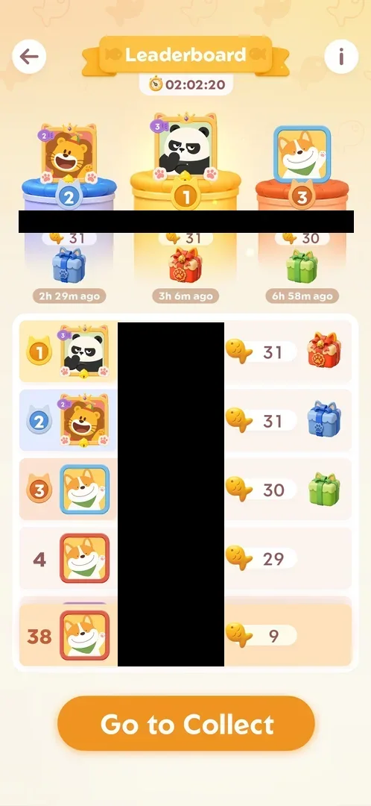
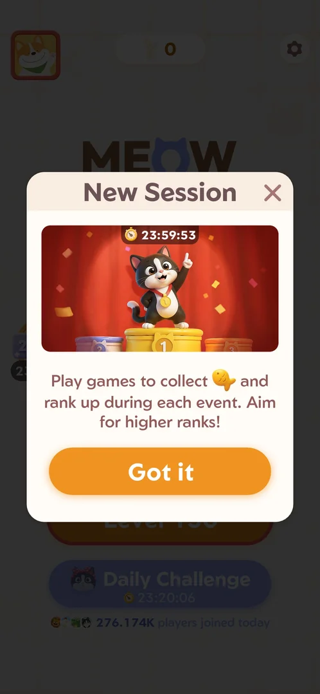
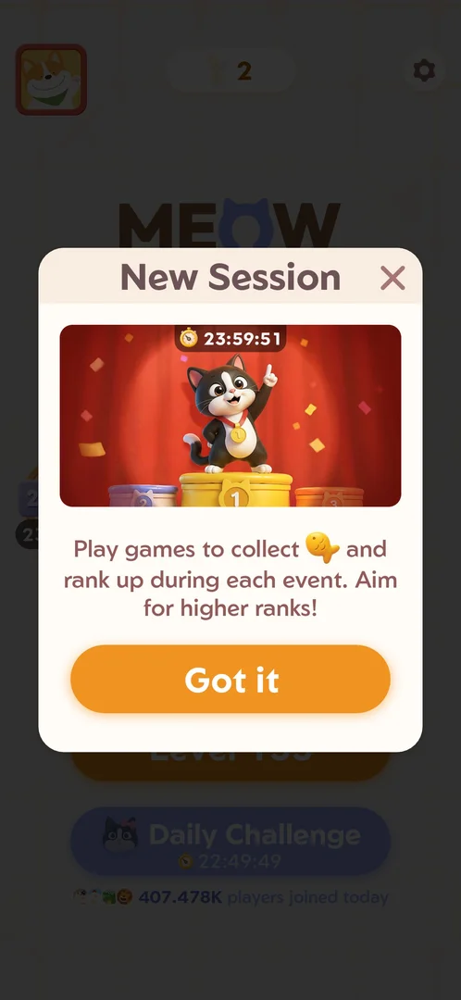
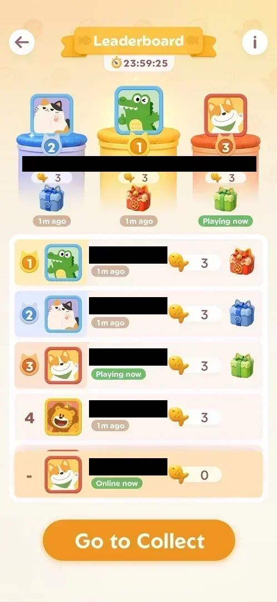

# Fish leaderboard

The ranking of the [Fish rank event](fish-event.md): players ordered by the fish they collected in the
current 24-hour event, the top three on a podium with gift boxes, and the player's own row highlighted
[^s1]. It opens from Home, and it comes up by itself after every won main
level, showing the player's row climb by the fish just earned [^s2]
[^s3]. When a period ends, the next launch shows a New Session popup and the
board starts again from zero [^s4] [^s5].

## Why it appeared

The event podium icon with its 24 h timer on Home opens it; it was first opened from there
[^s1].

## Where to find it

On [Home](home.md), the podium icon with the event timer on the left edge opens the Leaderboard
[^s6] [^s5]. After the last cat of a won
[main level](level.md), the leaderboard comes up over the board by itself [^s2].

 [^s6]
*Home screen: the podium icon with the event timer on the left edge*

## What it looks like

 [^s1]
*Leaderboard from Home (player names blacked out): the timer, the podium, the ranked list, the player's own row last, Go to Collect*

A full screen [^s1]:

- Top: the back arrow, the "Leaderboard" banner, the i button; under the banner the event timer (23:58:25).
- The podium: ranks 2, 1, 3, each with the player's avatar in its frame, the name, the fish count (3 each),
  a gift box (red for 1st, blue for 2nd, green for 3rd) and "1m ago".
- The list: rows 1 to 4, each with the rank, the avatar, the name, "1m ago", the fish count (3 each), and
  the gift box for ranks 1 to 3; rank 4 has no gift.
- The player's own row, pinned last: rank "-", "Online now", 0 fish.
- The orange Go to Collect button.

With fish collected (5 October, 9 fish), the player's row is pinned last with its rank (32) and "Online now";
the podium players had 28, 27 and 26 fish, rank 4 had 25 [^s14]:

 [^s14]
*The leaderboard with the player ranked: own row 32nd with 9 fish, gift boxes on ranks 1 to 3 only*

Two hours before the end of the same kind of period (5 October, 02:02:20 left), the podium players had 31, 31
and 30 fish, rank 4 had 29, and the player, still at 9 fish, had dropped to 38th [^s20]. Each row's status read
how long ago that player was last seen ("2h 29m ago", "55m ago"); the player's own row read "Online now". No
heart counters were shown on the rows of this board [^s21].

 [^s20]
*Late in a period: the player's row pinned at 38th with 9 fish while the top of the board reached 31*

### The list

Swiping up on the list scrolled the rows under the podium (ranks 7 to 10 came into view, at 26 to 25 fish);
the player's own row stayed pinned at the bottom [^s22]. Tapping a player's row did nothing: no profile, no
popup [^s23].

### Go to Collect

The orange Go to Collect button opened the next main level's board directly (Level 133, its first cat
already placed), without passing through Home; the back arrow of that board returned to Home [^s24] [^s21].

### After a win

 [^s2]
*After the clean Level 127 (names blacked out): the player's row, highlighted, climbs to rank 21 with 3 fish*

 [^s3]
*After Level 128 with one wrong cat (names and the toasts' names blacked out): rank 22, 5 fish, 2 hearts*

Over the dimmed level [^s2] [^s3]:

- "Leaderboard" and the event timer.
- The podium: the top three with their fish and a heart count, and "Playing now" or "Nm ago".
- A slice of the list around the player: rows with rank, avatar, name, status ("Playing now", "Online now",
  "15m ago"), fish and hearts. The player's row is highlighted, with an up arrow while it moves.
- After Level 128, two toasts at the top: "<a player> cheered for you" and "<a player> clap…".
- After Level 130, early in a new period, a toast "Nice work! You rose by 3 places." and the player's row at
  rank 6 with 3 fish (frame not shown: it carries other players' names and the account ID)
  [^s7].
- "Tap to continue" closes it; on the day's first win the [Daily Streak](daily-streak.md) comes next,
  otherwise the win screen [^s8] [^s9].

### Rules overlay

 [^s10]
*The overlay from the i button: Clear main levels, fish, Top the Leaderboard, Win exclusive frames and rewards*

The i button opens a three-step picture: "Clear main levels", fish, "Top the Leaderboard", "Win exclusive
frames and rewards"; "Tap to Continue" closes it [^s10]
[^s11]. The same picture came up on 5 October [^s25]. The "exclusive frames" are the Leaderboard frames on the
[Profile](profile.md) Frame tab, the first-place one locked with "Get first place in the challenge to get
this frame!" [^s26].

### New Session

 [^s4]
*The first launch after a period ended: New Session, the new period's timer at 23:59:53, Got it*

On the first launch after the previous period had ended with the game closed, a "New Session" popup came up
over Home: a picture of a cat on the winner's podium with the new timer (23:59:53), the line "Play games to
collect [fish] and rank up during each event. Aim for higher ranks!", an orange Got it button and a cross top
right [^s4]. After Got it, the board of Level 130 was open [^s12].

The same popup came up again on 6 October, at the launch at 01:09, after the period of 5 October had ended
with the game closed: timer 23:59:51, no results screen before it [^s27]. Got it, tapped on the button
itself (the Level button lies below it, outside the popup), opened the board of the next main level,
Level 133 [^s28]. Got it opens the next main level's board.

 [^s27]
*The second New Session, at the launch of 6 October: timer 23:59:51, Got it*

### The new period

 [^s5]
*The leaderboard just after New Session: a fresh timer, new rivals at 3 fish each, the player unranked with 0 fish*

Opened from Home right after New Session, the board had been reset: timer 23:59:25, a new set of players
at 3 fish each, and the player's row back at rank "-" with 0 fish. No results screen, rank or reward for the
ended period was shown, and the coin balance on Home was still 0 [^s5].

## How it works

- Points: fish, earned by clearing main levels [^s10]. The player's count rose
  by the fish the level kept: 0 to 3 after a clean Level 127, 3 to 5 after Level 128 with one wrong cat
  [^s2] [^s3]; 0 to 3 after Level 130
  [^s7].
- Rank: 21 with 3 fish, then 22 with 5 fish, because other players gained meanwhile
  [^s2] [^s3]. At least 23 ranks were on the
  board [^s3]. In a period about 2 minutes old, 3 fish gave rank 6
  [^s7].
- Other players' fish: 3 each about 1.5 minutes into the event [^s1]; the top
  three at 7 fish after about 15 minutes, at 8 to 10 after about 19 minutes
  [^s2] [^s3]. The same pattern in the new period:
  every rival at 3 fish half a minute in [^s5]. Inferred: other players gain
  fish over time; whether they are real or generated is not verified.
- Hearts: every row has a heart count; the player's went from 0 to 2 with the two toasts
  [^s3]. Inferred: hearts are cheers sent by other players; what they give is
  not verified.
- A player with 0 fish has no rank ("-") [^s1].
- The badge on the Home podium icon read 32 when the board showed the player 32nd [^s15] [^s14].
- A clean Level 132 win on 5 October: the overlay showed the player 47th, the count rising (8 in the frame);
  four minutes later the board showed 9 fish and rank 32 [^s16] [^s14].
- Period: 24 hours: 23:58:25 at the first opening, 23:44:36 and 23:40:27 at the two wins
  [^s1] [^s2] [^s3].
  A period that ended while the game was closed was followed, at the next launch, by a new 24 h period
  starting then (23:59:53 on the popup) [^s4]. That period read 10:01:28 on Home at about 14:38 and 09:57:18
  on the board at about 14:42 on 5 October: it ends at about 00:40 on 6 October, 24 h after the launch at
  00:39 that started it [^s17] [^s14]. The timer read 02:02:42 on Home and 02:02:20 on the board at about
  22:45 on 5 October, which again puts the end at about 00:45 on 6 October [^s21]. At the launch at 01:09 on 6 October that period
had ended and a new one began (23:59:51 on the New Session popup); its timer read 23:55:49 at 01:13, which puts
its end at about 01:09 on 7 October, 24 h after the launch [^s27] [^s29].
- The end of a period with the game closed: no results screen and no reward at the next launch; fish and rank
  start again at zero [^s5]. Seen twice: on 5 October and on 6 October [^s27].
- The back arrow returned to Home [^s13].
- Ranks drop while the player is away: 32nd with 9 fish at about 14:42, 38th with the same 9 fish at about
  22:45 on 5 October [^s14] [^s20].

Version 1.19.1.

## Cases

| Case | What was done | Result | Source |
|---|---|---|---|
| Leaderboard: 24h timer, podium top 3 with gift boxes, list of players with fish counts, the player's row at the bottom (0 fish, unranked), info button, Go to Collect <!-- case:chk-screen --> | Opened from the podium icon on Home, frame marked | ✅ | [^s1] |
| Fish are earned by clearing main levels (event info) <!-- case:chk-points --> | The i button tapped; two levels won: +3 and +2 | ✅ | [^s10] |
| Board: top-3 podium with fish and hearts, rows with rank, avatar, name, Online/Playing now or last seen, fish, hearts; the player at rank 21 with 3 fish, then 22 with 5; other players send cheers (hearts 0 to 2) <!-- case:chk-board --> | Two levels won; the overlay read after each | ✅ | [^s3] |
| Each row has a heart counter (own row 2, others 0): what gives hearts and whether tapping a heart likes a player <!-- case:hearts --> | Hearts seen on the post-win overlay, never tapped | not verified | [^s3] |
| Why it appeared: the podium icon on Home <!-- case:chk-appeared --> | The podium icon on Home | ✅ | [^s1] |
| The Home podium icon (with the rank badge and the period timer) opens it; the post-win overlay shows it too <!-- case:chk-entry --> | Podium icon on Home tapped on three occasions; shown by itself after each won level | ✅ | [^s18] |
| The period and its timer: 02:02:20 on the board and 02:02:42 on the Home podium at about 22:45 on 5 October; the period ends about 00:45 on 6 October, the same 24 h cycle started by the launch <!-- case:chk-period --> | Timer read on Home and on the board | ✅ | [^s21] |
| Board late in a period: podium 31/31/30, rank 4 at 29, the player 38th with 9 fish; the list scrolls with the own row pinned; a row tap does nothing; no hearts on the rows; Go to Collect opens the next level's board <!-- case:late-board --> | List swiped, a row tapped, Go to Collect tapped | ✅ | [^s24] |
| Rewards per rank: gift boxes on ranks 1 (red), 2 (blue), 3 (green), none from rank 4; the info says "Win exclusive frames and rewards"; a box tap shows no contents; no promotion or relegation seen <!-- case:chk-rewards --> | The 1st place box tapped; no reward after the period ended | ✅ | [^s19] |
| A 24 h period started by the launch: 10:01:28 at about 14:38 and 09:57:18 at about 14:42 on 5 October put its end at about 00:40 on 6 October, 24 h after the 00:39 launch <!-- case:period-24h --> | Timer read on Home and on the board | ✅ | [^s14] |
| A period that ends while the game is closed: at the next launch only the New Session popup (a new 24 h timer), the board reset (0 fish, unranked), no results, rank or reward, coins still 0 <!-- case:end-while-closed --> | Launched after the period had ended | ✅ | [^s5] |
| The end of a period: the results screen and the reward <!-- case:chk-end --> | The period ended with the game closed, twice (5 and 6 October): only New Session and a reset board, no results screen; the planned watch with the game open missed the end, which came before the session launched | not verified | [^s27] |

## Not verified

- Hearts: what gives them and whether tapping a heart cheers a player <!-- case:hearts -->
- Whether any route besides the Home podium icon and the post-win overlay opens it (the New Session popup)
- The period: whether it is a global schedule or a per-install cycle; every timer read so far fits a 24 h period started by the launch that follows the end of the previous one (00:39 on 5 October, 01:09 on 6 October)
- The rewards per rank: the gift box contents and the frames; nothing was given after a period ended with the game closed
- The end of a period with the game open: whether a results screen and a reward show (only seen with the game closed); the next end is expected at about 01:09 on 7 October <!-- case:chk-end -->
- The board: the number of players (at least 38 ranks) [^s20]

[^s1]: session 20261003-200440-chrono-2FYKPJ, step 12 — [video at 2:16](https://youtu.be/Pqx4QY-FpBA?t=136)
[^s2]: session 20261003-201915-chrono-2FYKPJ, step 3 — [video at 1:28](https://youtu.be/ffhYgQE4LvU?t=88)
[^s3]: session 20261003-201915-chrono-2FYKPJ, step 17 — [video at 5:37](https://youtu.be/ffhYgQE4LvU?t=337)
[^s4]: session 20261005-003925-chrono-2FYKPJ, step 0 — [video at 0:00](https://youtu.be/CkktBjH7fAI?t=0)
[^s5]: session 20261005-003925-chrono-2FYKPJ, step 3 — [video at 0:47](https://youtu.be/CkktBjH7fAI?t=47)
[^s6]: session 20261003-200440-chrono-2FYKPJ, step 4 — [video at 1:12](https://youtu.be/Pqx4QY-FpBA?t=72)
[^s7]: session 20261005-003925-chrono-2FYKPJ, step 8 — [video at 1:51](https://youtu.be/CkktBjH7fAI?t=111)
[^s8]: session 20261003-201915-chrono-2FYKPJ, step 4 — [video at 1:45](https://youtu.be/ffhYgQE4LvU?t=105)
[^s9]: session 20261003-201915-chrono-2FYKPJ, step 18 — [video at 5:53](https://youtu.be/ffhYgQE4LvU?t=353)
[^s10]: session 20261003-200440-chrono-2FYKPJ, step 13 — [video at 2:24](https://youtu.be/Pqx4QY-FpBA?t=144)
[^s11]: session 20261003-200440-chrono-2FYKPJ, step 14 — [video at 2:39](https://youtu.be/Pqx4QY-FpBA?t=159)
[^s12]: session 20261005-003925-chrono-2FYKPJ, step 1 — [video at 0:29](https://youtu.be/CkktBjH7fAI?t=29)
[^s13]: session 20261003-200440-chrono-2FYKPJ, step 15 — [video at 2:43](https://youtu.be/Pqx4QY-FpBA?t=163)

[^s14]: session 20261005-143752-chrono-2FYKPJ, step 18 — [video at 4:18](https://youtu.be/K_i7fJ2MDQo?t=258)
[^s15]: session 20261005-143752-chrono-2FYKPJ, step 10 — [video at 3:00](https://youtu.be/K_i7fJ2MDQo?t=180)
[^s16]: session 20261005-143752-chrono-2FYKPJ, step 5 — [video at 1:55](https://youtu.be/K_i7fJ2MDQo?t=115)
[^s17]: session 20261005-143752-chrono-2FYKPJ, step 0 — [video at 0:00](https://youtu.be/K_i7fJ2MDQo?t=0)
[^s18]: session 20261005-143752-chrono-2FYKPJ, step 16 — [video at 4:00](https://youtu.be/K_i7fJ2MDQo?t=240)
[^s19]: session 20261005-143752-chrono-2FYKPJ, step 19 — [video at 4:30](https://youtu.be/K_i7fJ2MDQo?t=270)

[^s20]: session 20261005-223641-chrono-2FYKPJ, step 1 — [video at 0:24](https://youtu.be/VXzhl0TX66c?t=24)
[^s21]: session 20261005-223641-chrono-2FYKPJ, step 7 — [video at 1:27](https://youtu.be/VXzhl0TX66c?t=87)
[^s22]: session 20261005-223641-chrono-2FYKPJ, step 2 — [video at 0:46](https://youtu.be/VXzhl0TX66c?t=46)
[^s23]: session 20261005-223641-chrono-2FYKPJ, step 3 — [video at 0:54](https://youtu.be/VXzhl0TX66c?t=54)
[^s24]: session 20261005-223641-chrono-2FYKPJ, step 6 — [video at 1:17](https://youtu.be/VXzhl0TX66c?t=77)
[^s25]: session 20261005-223641-chrono-2FYKPJ, step 4 — [video at 1:00](https://youtu.be/VXzhl0TX66c?t=60)
[^s26]: session 20261005-223641-chrono-2FYKPJ, step 17 — [video at 2:59](https://youtu.be/VXzhl0TX66c?t=179)

[^s27]: session 20261006-010939-chrono-2FYKPJ, step 0 — [video at 0:00](https://youtu.be/hWdnTswKtkU?t=0)
[^s28]: session 20261006-010939-chrono-2FYKPJ, step 1 — [video at 0:33](https://youtu.be/hWdnTswKtkU?t=33)
[^s29]: session 20261006-010939-chrono-2FYKPJ, step 33 — [video at 6:29](https://youtu.be/hWdnTswKtkU?t=389)
