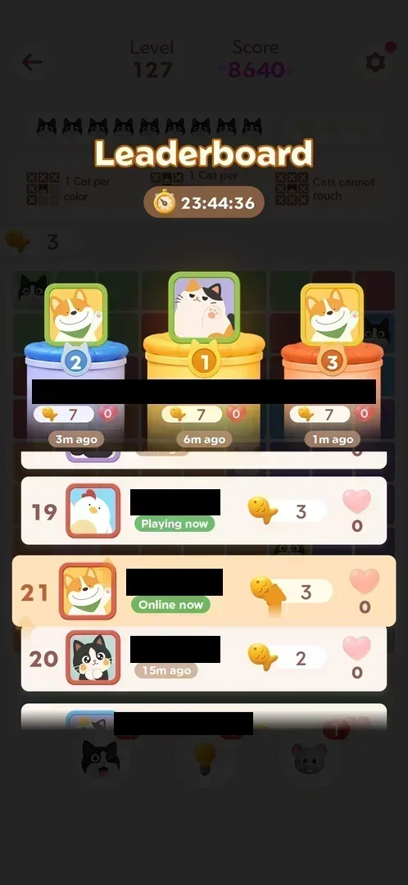
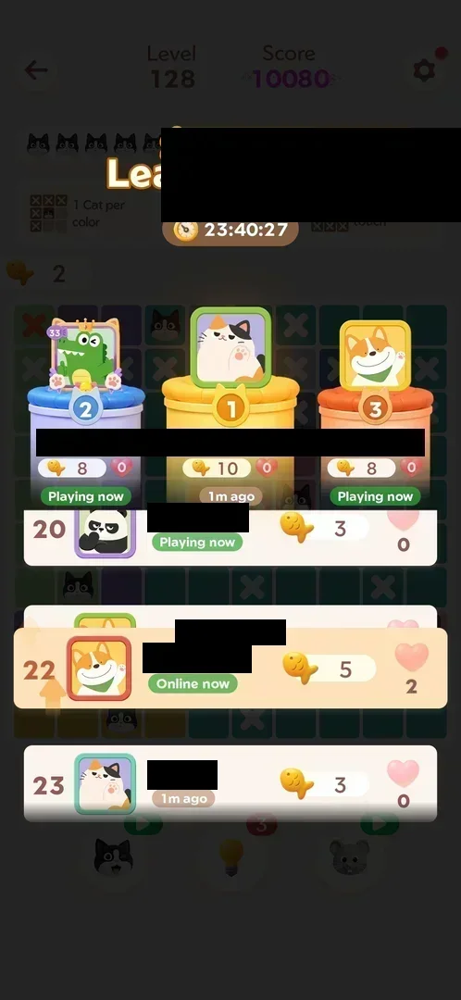
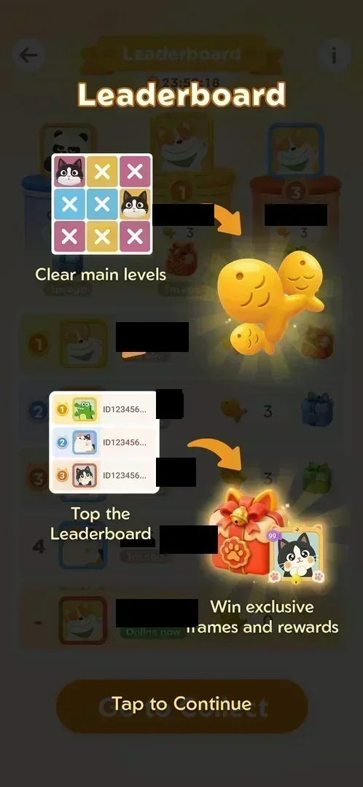

# Fish leaderboard

The ranking of the [Fish rank event](fish-event.md): players ordered by the fish they collected in the
current 24-hour event, the top three on a podium with gift boxes, and the player's own row highlighted
[^s1]. It opens from Home, and it comes up by itself after every won main level, showing the player's row
climb by the fish just earned [^s6] [^s7].

## Why it appeared

Event podium icon with 24h timer on Home opens it; first opened [^s1].

## Where to find it

On [Home](home.md), the podium icon with the event timer on the left edge opens the Leaderboard [^s2]. After
the last cat of a won [main level](level.md), the leaderboard comes up over the board by itself [^s6].

 [^s2]
*Home screen: the podium icon with the event timer on the left edge*

## What it looks like

 [^s1]
*Leaderboard from Home (player names blacked out): the timer, the podium, the ranked list, the player's own row last, Go to Collect*

A full screen [^s1]:

- Top: the back arrow, the "Leaderboard" banner, the i button; under the banner the event timer (23:58:25).
- The podium: ranks 2, 1, 3, each with the player's avatar in its frame, the name, the fish count (3 each),
  a gift box (red for 1st, blue for 2nd, green for 3rd) and "1m ago".
- The list: rows 1 to 4, each with the rank, the avatar, the name, "1m ago", the fish count (3 each), and
  the gift box for ranks 1 to 3; rank 4 has no gift.
- The player's own row, pinned last: rank "-", "Online now", 0 fish.
- The orange Go to Collect button.

### After a win

 [^s6]
*After the clean Level 127 (names blacked out): the player's row, highlighted, climbs to rank 21 with 3 fish*

 [^s7]
*After Level 128 with one wrong cat (names and the toasts' names blacked out): rank 22, 5 fish, 2 hearts*

Over the dimmed level [^s6] [^s7]:

- "Leaderboard" and the event timer.
- The podium: the top three with their fish and a heart count, and "Playing now" or "Nm ago".
- A slice of the list around the player: rows with rank, avatar, name, status ("Playing now", "Online now",
  "15m ago"), fish and hearts. The player's row is highlighted, with an up arrow while it moves.
- After Level 128, two toasts at the top: "<a player> cheered for you" and "<a player> clap…".
- "Tap to continue" closes it; on the day's first win the [Daily Streak](daily-streak.md) comes next,
  otherwise the win screen [^s8] [^s9].

### Rules overlay

 [^s3]
*The overlay from the i button: Clear main levels, fish, Top the Leaderboard, Win exclusive frames and rewards*

The i button opens a three-step picture: "Clear main levels", fish, "Top the Leaderboard", "Win exclusive
frames and rewards"; "Tap to Continue" closes it [^s3] [^s4].

## How it works

- Points: fish, earned by clearing main levels [^s3]. The player's count rose by the fish the level kept:
  0 to 3 after a clean Level 127, 3 to 5 after Level 128 with one wrong cat [^s6] [^s7].
- Rank: 21 with 3 fish, then 22 with 5 fish, because other players gained meanwhile [^s6] [^s7]. At least
  23 ranks were on the board [^s7].
- Other players' fish: 3 each about 1.5 minutes into the event [^s1]; the top three at 7 fish after about
  15 minutes, at 8 to 10 after about 19 minutes [^s6] [^s7]. Inferred: other players gain fish over time;
  whether they are real or generated is not verified.
- Hearts: every row has a heart count; the player's went from 0 to 2 with the two toasts [^s7]. Inferred:
  hearts are cheers sent by other players; what they give is not verified.
- A player with 0 fish has no rank ("-") [^s1].
- Period: the event's 24 hours: 23:58:25 at the first opening, 23:44:36 and 23:40:27 at the two wins [^s1]
  [^s6] [^s7].
- The back arrow returned to Home [^s5].

Version 1.19.1.

## Cases

| Case | What was done | Result | Source |
|---|---|---|---|
| Leaderboard: 24h timer, podium top 3 with gift boxes, list of players with fish counts, the player's row at the bottom (0 fish, unranked), info button, Go to Collect <!-- case:chk-screen --> | Opened from the podium icon on Home, frame marked | ✅ | [^s1] |
| Fish are earned by clearing main levels (event info); how many per level is not yet seen <!-- case:chk-points --> | The i button tapped; two levels won: +3 and +2 | ✅ | [^s3] |
| Why it appeared: the trigger that brought it up (the first launch, a level won, a threshold, a timer, a loss): a fact with its frame, or a hypothesis to test <!-- case:chk-appeared --> | The podium icon on Home | ✅ | [^s1] |
| Where to find it: the screen and the button that open it (mark --as entry --at X,Y) <!-- case:chk-entry --> | Podium icon tapped; also shown by itself after each won level | ✅ | [^s2] |
| Board: top-3 podium with fish and hearts, rows with rank, avatar, name, Online/Playing now or last seen, fish, hearts; the player at rank 21 with 3 fish, then 22 with 5; other players send cheers (hearts 0 to 2) <!-- case:chk-board --> | Two levels won; the overlay read after each | ✅ | [^s6] [^s7] |
| The period and its timer: when it resets <!-- case:chk-period --> | Timer seen from 23:58:25 to 23:40:27 | not verified | [^s7] |
| Rewards per rank, promotion and relegation <!-- case:chk-rewards --> | Gift boxes for ranks 1 to 3 seen, not opened | not verified | [^s1] |
| The end of a period: the results screen and the reward (a follow-up) <!-- case:chk-end --> | Not reached | not verified |  |

## Not verified

- The board: the number of players (at least 23 ranks), whether the list scrolls
- The period: what happens at the end of the timer <!-- case:chk-period -->
- The rewards per rank: the gift box contents and the frames <!-- case:chk-rewards -->
- The end of a period: the results screen and the reward <!-- case:chk-end -->
- Hearts: how they are sent and what they give

[^s1]: session 20261003-200440-chrono-2FYKPJ, step 12 — [video at 2:18](https://youtu.be/Pqx4QY-FpBA?t=138)
[^s2]: session 20261003-200440-chrono-2FYKPJ, step 4 — [video at 1:15](https://youtu.be/Pqx4QY-FpBA?t=75)
[^s3]: session 20261003-200440-chrono-2FYKPJ, step 13 — [video at 2:26](https://youtu.be/Pqx4QY-FpBA?t=146)
[^s4]: session 20261003-200440-chrono-2FYKPJ, step 14 — [video at 2:42](https://youtu.be/Pqx4QY-FpBA?t=162)
[^s5]: session 20261003-200440-chrono-2FYKPJ, step 15 — [video at 2:45](https://youtu.be/Pqx4QY-FpBA?t=165)
[^s6]: session 20261003-201915-chrono-2FYKPJ, step 3 — [video at 1:28](https://youtu.be/ffhYgQE4LvU?t=88)
[^s7]: session 20261003-201915-chrono-2FYKPJ, step 17 — [video at 5:31](https://youtu.be/ffhYgQE4LvU?t=331)
[^s8]: session 20261003-201915-chrono-2FYKPJ, step 4 — [video at 1:45](https://youtu.be/ffhYgQE4LvU?t=105)
[^s9]: session 20261003-201915-chrono-2FYKPJ, step 18 — [video at 5:47](https://youtu.be/ffhYgQE4LvU?t=347)
