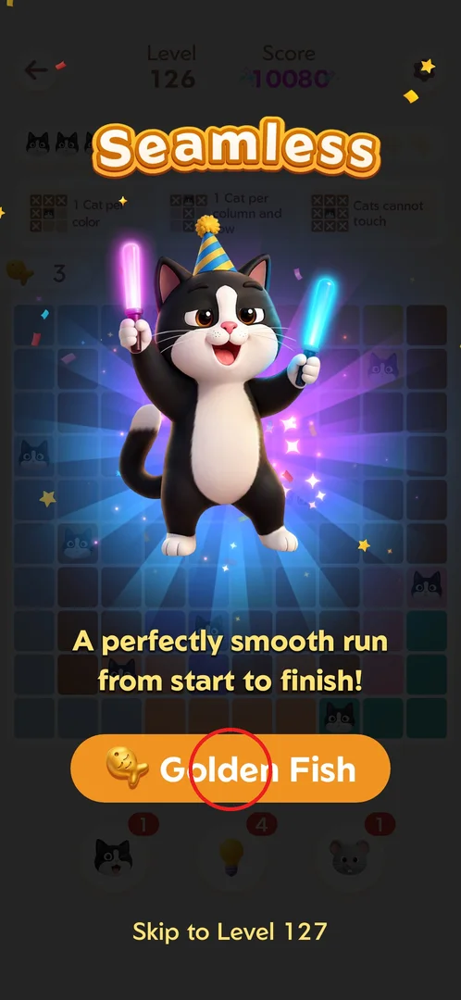
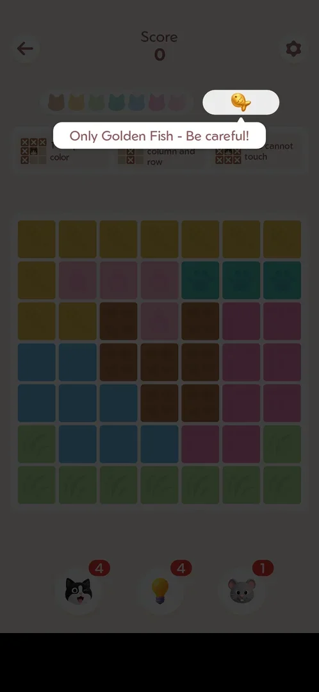
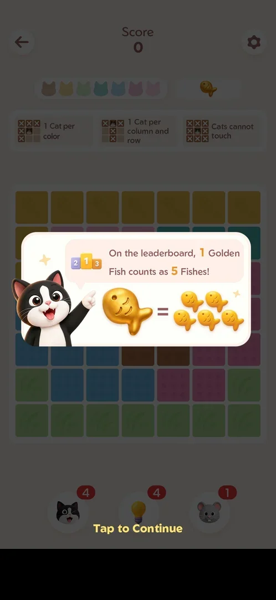
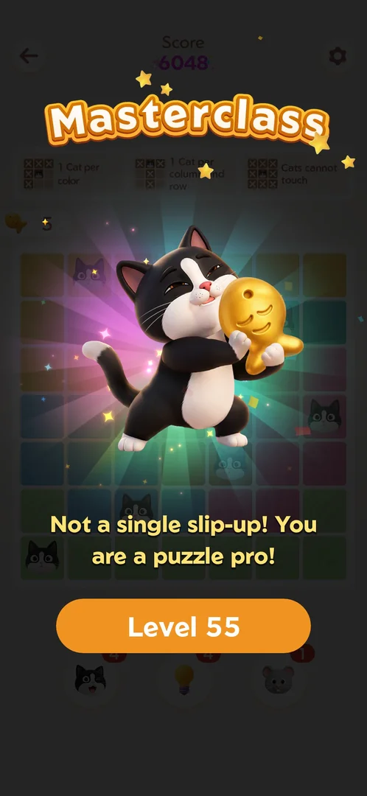
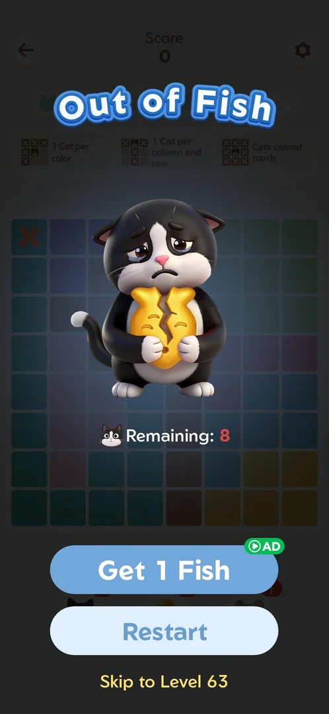
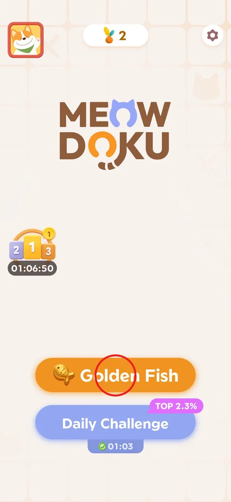
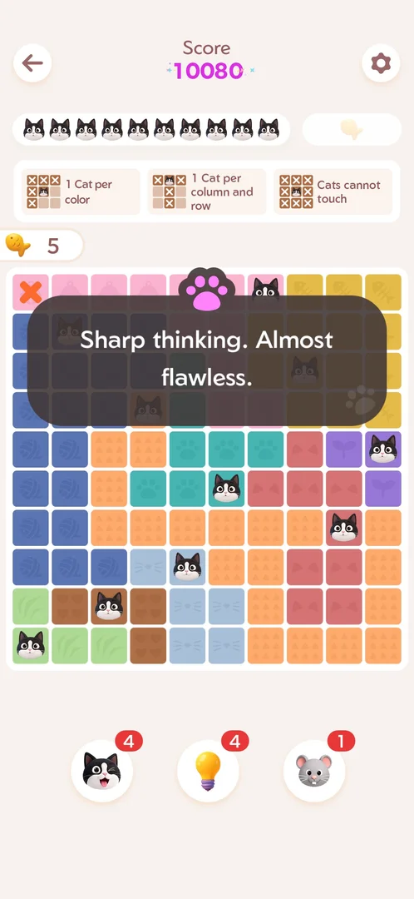

# Golden Fish bonus board

Golden Fish is an optional bonus board offered on the win screen every fourth level. It has no level
number and only one life, a golden fish, so a single wrong cat ends it. Winning it puts 5 fish on the
fish counter, because on the leaderboard one golden fish counts as five fishes [^s2] [^s3] [^s4]
[^s7].

## Where to find it

On the win screen of every fourth level (54, 58, 62 … 126) the orange main button reads "Golden Fish"
with a golden fish icon instead of "Level N"; a "Skip to Level N" link sits under it [^s1] [^s7]
[^s8] [^s9]. If the button is ignored, Home shows the same "Golden Fish" button in place of "Level N"
until the board is played (see [Golden Fish on Home](#golden-fish-on-home)) [^s6] [^s14].

 [^s1]

## What it looks like

A normal puzzle board without the "Level" number in the header, only "Score". The life bar on the right
holds a single golden fish instead of three fish; when the board opens a tip under it says "Only Golden
Fish - Be careful!". The rule cards and the three boosters are the same as on a normal level [^s2].
Boards seen were 7x7 (after level 54), 8x8 (after 62, 74, 86), 9x9 (opened from Home) and 10x10 (after
level 70) [^s2] [^s5] [^s10] [^s11] [^s12].

 [^s2]

## What you can do

| Tab or button | What it does |
|---|---|
| [Golden Fish explainer](#golden-fish-explainer) | The first board opens with an explainer: 1 golden fish = 5 fishes on the leaderboard |
| [Golden Fish win](#golden-fish-win) | Winning shows a win title with a golden fish and adds 5 to the fish counter |
| [Out of Fish](#out-of-fish) | A wrong cat ends the life: Get 1 Fish (ad), Restart or Skip to Level N |
| [Golden Fish on Home](#golden-fish-on-home) | An ignored Golden Fish stays on Home in place of Level N |
| [Skip to Level N](#skip-to-level-n) | The link under the win-screen button goes to the next level instead |

### Golden Fish explainer

The first time a Golden Fish board opened, an explainer covered it: a cat points at a golden fish equal
to five ordinary fish, with the text that on the leaderboard 1 Golden Fish counts as 5 Fishes, and "Tap
to Continue" [^s3]. This links the board to the [fish event](fish-event.md) leaderboard. Boards opened
later from Home showed no explainer [^s10].

 [^s3]

### Golden Fish win

A won board shows a win title with the cat hugging a golden fish, the score, and the fish counter at 5;
the button then leads to the next normal level ("Level 55" after the board of level 54) [^s4]. Titles
seen: Masterclass (7x7, score 6048) [^s4], Success (score 7296) [^s7], Spot On [^s13], Immaculate (8x8)
[^s15], and Persevered after a revival by ad [^s16]. A toast such as "Almost flawless" with +5 fish can
show on the win (9x9, score 8640) [^s17].

 [^s4]

### Out of Fish

One wrong cat costs the only golden fish and opens "Out of Fish" at once: a sad cat holding a broken
golden fish, "Remaining: N" (cats still to place), and three choices [^s5]:

- **Get 1 Fish** (marked AD) — a rewarded ad of about 25 s; the board then continues with 1 fish and the
  wrong mark kept [^s18].
- **Restart** — free, the board starts over [^s7].
- **Skip to Level N** — goes straight to the next level; no ad and no cost were seen [^s12].

 [^s5]

### Golden Fish on Home

If the win-screen Golden Fish button is not tapped (the game was closed and restarted), Home shows an
orange "Golden Fish" button in place of "Level N" [^s14] [^s6]. Tapping it opens the board directly,
with no ad and no explainer; after the board is won Home shows "Level N" again [^s10] [^s19]. The
pending button was still on Home about 12 minutes later [^s6].

 [^s6]

### Skip to Level N

The text link under the Golden Fish button on the win screen skips the board: a full-screen
interstitial ad plays, then the next level opens; nothing is charged [^s20]. The win screen with this
link is shown on the [win screen](win-rank.md#skip-to-level-n) page.

 [^s1]

## How it works

Version 1.18.0.

- **When it is offered:** every fourth level counting from 54 — seen on 54, 58, 62, 66, 70, 74, 78, 82,
  86, 90, 94 and 126 — whether or not the level had mistakes (level 58 had two) [^s7] [^s8] [^s13]
  [^s9] [^s1]. Levels 45–53 and 55–57 had the normal "Level N" button [^s8].
- **Life:** one golden fish instead of three fish; any wrong cat ends it [^s2] [^s5].
- **Reward:** +5 on the fish counter (1 golden fish = 5 fishes on the leaderboard) [^s3] [^s4].
- **Score:** not set by the board size alone. The 8x8 golden board after level 62 scored 7296, while
  the normal 8x8 level 61 (one cat already placed) and the 7x7 level 62 both scored 6048
  [^s22] [^s23]
  [^s24]. A 10x10 golden board scored 10080, the same as a normal 10x10
  level [^s25]. The scores seen fit the number of cats the player places
  (7 → 6048, 8 → 7296, 9 → 8640, 10 → 10080) better than a golden bonus; golden boards start with no
  cat placed. Not proven yet (task `golden-score-compare`).

  > ⚠️ Previously (v1.18.0, 2026-10-01): "The score follows the board size like a normal level (6048
  > on 7x7, 8640 on 9x9)."

   [^s25]
- **Ads:** the first board (after level 54) was preceded by a rewarded ad of about 20 s; the board
  after level 70 opened with no ad [^s2] [^s11]; the board after level 74 opened after a video
  interstitial of about 33 s [^s26] [^s27].
  From Home it opens with no ad [^s10].
- **The button takes the place of the next-level button.** On the win screen of every fourth level the
  Golden Fish button sits where "Level N" usually is (about y 1217–1245), so the usual next-level tap
  starts the golden board instead; "Skip to Level N" is lower, at about (365,1475)
  [^s26] [^s28]. Bench players met it after
  levels 98, 102, 106 and 110 as well [^s29]
  [^s28] [^s30] [^s31].

   [^s32]
- **Pending:** an ignored offer survives a restart of the game and at least about 12 minutes on Home
  [^s14] [^s6].

## Cases

| Case | What was done | Result | Source |
|---|---|---|---|
| What triggers the button | Watched the win screens of levels 45–126 | Every 4th level from 54, regardless of mistakes | ✅ [^s7] [^s9] [^s1] |
| Reward for a won board | Won the 7x7 board after level 54 | Masterclass, score 6048, fish counter 5 | ✅ [^s4] |
| One wrong move | Placed a wrong cat on the 8x8 board after level 62 | Out of Fish popup: Get 1 Fish (AD), Restart, Skip to Level 63 | ✅ [^s5] |
| Restart after Out of Fish | Tapped Restart | Free, the board starts over; then won | ✅ [^s7] |
| Get 1 Fish | Watched the ad on the board after level 70 | Board continues with 1 fish, wrong mark kept; title Persevered | ✅ [^s18] [^s16] |
| Skip from Out of Fish | Tapped Skip to Level 75 on the board after 74 | Next level at once, no ad, no cost | ✅ [^s12] |
| Skip on the win screen | Tapped Skip to Level 59 on the win screen of 58 | Interstitial ad, then level 59, free | ✅ [^s20] |
| Score of a golden board | Won golden 8x8 (after 62) and 10x10 (after 70) boards | 7296 and 10080: like a normal board where the player places 8 and 10 cats | ✅ [^s22] [^s25] |
| Ad before the board | Tapped Golden Fish after level 74 | A video interstitial of about 33 s, then the board | ✅ [^s27] |
| Golden Fish from Home | Tapped Golden Fish on Home | 9x9 board directly, no ad, no explainer | ✅ [^s10] |
| Ignored offer and restart | Left the win screen of 86 and of 126, restarted the game | Home shows Golden Fish instead of Level N | ✅ [^s14] [^s6] |
| Pending offer over time | Left Home open with Golden Fish pending | Still there after about 12 minutes | ✅ [^s6] |

## Not verified

- Whether a pending Golden Fish on Home expires the next day.
- Why an ad played before some boards (after 54 and 74) but not others (after 70, from Home).
- Whether the score depends only on the number of cats the player places (task `golden-score-compare`).
- Whether skipping the board changes the next level: level 91, reached by Skip to Level 91, started
  with one cat already placed, but a stray tap was not ruled out [^s21].

[^s1]: session 20261001-223249-chrono-2FYKPJ, step 7 — [video at 2:26](https://youtu.be/9EZzZahUrbk?t=146)
[^s2]: session 20261001-060942-chrono-2FYKPJ, step 105
[^s3]: session 20261001-060942-chrono-2FYKPJ, step 106
[^s4]: session 20261001-060942-chrono-2FYKPJ, step 109
[^s5]: session 20261001-082114-chrono-2FYKPJ, step 34
[^s6]: session 20261001-223249-chrono-2FYKPJ, step 8 — [video at 2:47](https://youtu.be/9EZzZahUrbk?t=167)
[^s7]: session 20261001-082114-chrono-2FYKPJ, step 53
[^s8]: session 20261001-082114-chrono-2FYKPJ, step 31
[^s9]: session 20261001-115413-chrono-2FYKPJ, step 67
[^s10]: session 20261001-093348-chrono-2FYKPJ, step 1
[^s11]: session 20261001-093348-chrono-2FYKPJ, step 42
[^s12]: session 20261001-093348-chrono-2FYKPJ, step 67
[^s13]: session 20261001-093348-chrono-2FYKPJ, step 113
[^s14]: session 20261001-115413-chrono-2FYKPJ, step 21
[^s15]: session 20261001-115413-chrono-2FYKPJ, step 24
[^s16]: session 20261001-093348-chrono-2FYKPJ, step 47
[^s17]: session 20261001-093348-chrono-2FYKPJ, step 6
[^s18]: session 20261001-093348-chrono-2FYKPJ, step 45
[^s19]: session 20261001-093348-chrono-2FYKPJ, step 16
[^s20]: session 20261001-082114-chrono-2FYKPJ, step 17
[^s21]: session 20261001-115413-chrono-2FYKPJ, step 48

[^s22]: session 20261001-082114-chrono-2FYKPJ, step 36 — [video at 10:04](https://youtu.be/9H-DeREITjo?t=604)
[^s23]: session 20261001-082114-chrono-2FYKPJ, step 30 — [video at 8:12](https://youtu.be/9H-DeREITjo?t=492)
[^s24]: session 20261001-082114-chrono-2FYKPJ, step 41 — [video at 11:25](https://youtu.be/9H-DeREITjo?t=685)
[^s25]: session 20261001-093348-chrono-2FYKPJ, step 46 — [video at 9:20](https://youtu.be/7NK9oKkmQkg?t=560)
[^s26]: session 20261001-093348-chrono-2FYKPJ, step 64 — [video at 13:51](https://youtu.be/7NK9oKkmQkg?t=831)
[^s27]: session 20261001-093348-chrono-2FYKPJ, step 65 — [video at 14:31](https://youtu.be/7NK9oKkmQkg?t=871)
[^s28]: session 20261001-181422-chrono-2FYKPJ, step 11 — [video at 3:04](https://youtu.be/q4m_SHCz7MA?t=184)
[^s29]: session 20261001-180616-chrono-2FYKPJ, step 13 — [video at 3:17](https://youtu.be/BxeCpmqo-xw?t=197)
[^s30]: session 20261001-182015-chrono-2FYKPJ, step 20 — [video at 4:12](https://youtu.be/PDdWO_nXrU4?t=252)
[^s31]: session 20261001-182810-chrono-2FYKPJ, step 10 — [video at 3:12](https://youtu.be/pcPdb-4z4nE?t=192)
[^s32]: session 20261001-093348-chrono-2FYKPJ, step 63 — [video at 13:39](https://youtu.be/7NK9oKkmQkg?t=819)
