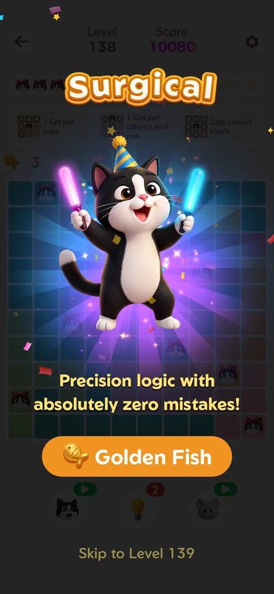
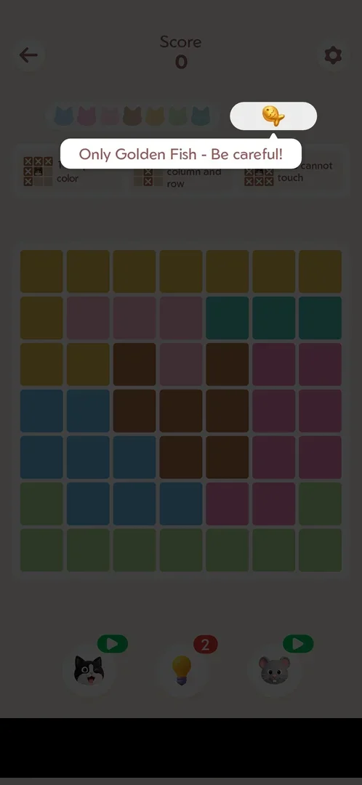
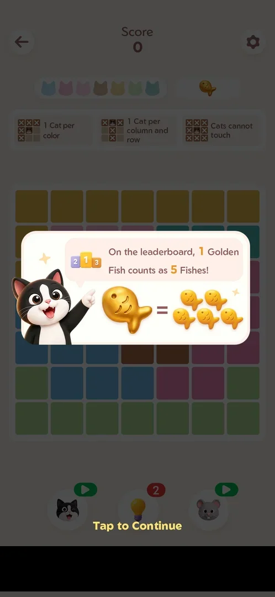
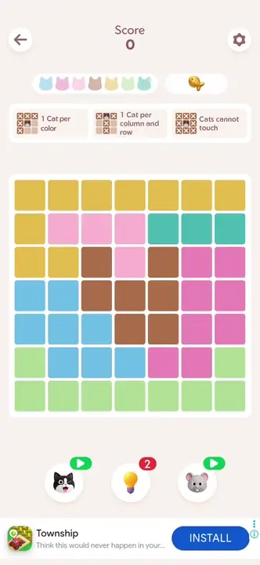
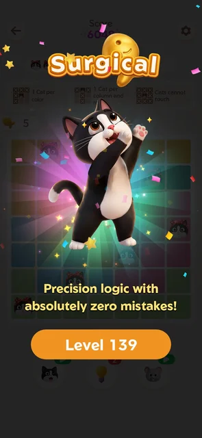

# Golden Fish bonus board

An optional extra board offered on the win screen of every fourth [main level](level.md). It has the main
level's rules on a smaller 7x7 board with no level number, and a single golden fish in place of the three
fish. Clearing it pays five fish to the [Fish rank event](fish-event.md) leaderboard; then the next main level
follows. It can be skipped from the same win screen [^s1] [^s2] [^s3] [^s4] [^s5].

## Why it appeared

On the win screen of every 4th main level (L134 this session; 54, 58 ... 126 earlier): a Golden Fish button
stands where the next-level button is, with Skip to Level N below [^s1]. It came up again on the win of Level
138, and not on the wins of Levels 135, 136 and 137 [^s2] [^s7].

## Where to find it

On the win screen of a main level whose number is a multiple of four, the orange button under the praise text
reads "Golden Fish" (with a golden fish icon) instead of "Level N+1"; under the boosters the plain text
"Skip to Level N+1" goes on to the next main level without the bonus board [^s2]. Tapping Golden Fish opened
the board [^s3].

 [^s2]
*Level 138 won: the orange "Golden Fish" button under the praise text; "Skip to Level 139" at the bottom*

## What it looks like

 [^s3]
*The board as it opens: "Score 0" with no level number, seven cat heads, one golden fish with the tooltip "Only Golden Fish - Be careful!", the 7x7 board (banner ad blacked out)*

The layout is the main level's, with these differences [^s3]:

- The header shows only "Score" between the back arrow and the gear: no "Level N".
- The fish box holds one golden fish instead of three fish; a tooltip pointing at it says "Only Golden Fish -
  Be careful!".
- The board is 7x7 in seven colour regions, with seven cat heads (main levels seen were 9x9 and 10x10).
- The same rules strip and the same three boosters with the same counters (hint 2) as on Level 138.
- A banner ad ran at the bottom, as on main levels.

No interstitial ad came between the Level 138 win screen and the board [^s3].

### Golden fish popup

 [^s4]
*After the tooltip: "On the leaderboard, 1 Golden Fish counts as 5 Fishes!", one golden fish = five fish, "Tap to Continue" (banner ad blacked out)*

A tap on the board after the tooltip brought a popup with a pointing cat and a podium icon: "On the
leaderboard, 1 Golden Fish counts as 5 Fishes!", drawn as one golden fish equal to five fish. "Tap to
Continue" closed it and the board could be played [^s4] [^s8]. This was the first golden board recorded on
this account; whether the popup comes again on later golden boards is not verified.

### Win

 [^s6]
*Clip 10.3 s · [original on YouTube from 5:23](https://youtu.be/Xj5RUsVHvCc?t=323)*

Each cat placed shows a praise word and its points ("Nice" +768, "Excellent" +960 and +1056); the seven cats
gave Score 6048. On the last cat the golden fish leaves the header box, fish fly from the board and a fish
counter slides in left of the board [^s6]. The counter then read 5 under the fish leaderboard overlay, where
the account's row had 23 fish and rank 1 (15 fish after Level 137, plus 3 for Level 138 and 5 for the golden
board, per the session's record) [^s6]. The leaderboard frame is not shown: it carries other players' names.

 [^s5]
*After the leaderboard: "Surgical" with a golden fish over the title, the orange "Level 139" button; no Skip line*

After Continue on the leaderboard: the praise screen "Surgical", with a golden fish over the title, the text
"Precision logic with absolutely zero mistakes!" and the orange "Level 139" button; there was no "Skip to
Level" line under it [^s5]. The golden board has no number of its own: Level 139 was the next main level
after Level 138 [^s2] [^s5]. Level 139 on that screen led to an interstitial video ad before the board
[^s9].

## How it works

- Offered on the win screen of every fourth main level: 54, 58 ... 126 (earlier sessions), 134, 138; not on
  135, 136, 137 [^s1] [^s2] [^s7].
- Optional: "Skip to Level N+1" on the same win screen goes on without it [^s2]. Whether a skipped offer comes
  back is not known.
- One golden fish instead of three fish [^s3]. Inferred from the single fish and the tooltip: one wrong cat
  ends the board; not tested.
- Reward: 1 golden fish = 5 fish on the fish leaderboard (the popup's text); the clear raised the counter to 5
  [^s4] [^s6].
- Score: 6048 for the seven cats of this board, with no mistakes [^s6].
- Ads: no interstitial before the golden board; a banner while playing; an interstitial before the next main
  level (Level 139) [^s3] [^s9].

Version 1.19.1.

## Outcomes

| Outcome | As the base or what differs | Frame |
|---|---|---|
| win <!-- case:under-win --> | Differs: the fish leaderboard gets 5 fish (one golden) instead of up to 3; the praise screen carries a golden fish and its button is the next main level, with no Skip line [^s5] |  |
| Out of fishes: the third wrong cat ends the level; Out of Fishes screen with Remaining N, Get 3 Fishes (rewarded ad) and Restart <!-- case:under-out-of-fishes --> | not verified | — |
| restart <!-- case:under-restart --> | not verified | — |
| quit <!-- case:under-quit --> | not verified | — |
| exit app <!-- case:under-exit-app --> | not verified | — |

## Cases

| Case | What was done | Result | Source |
|---|---|---|---|
| Why it appeared: the Golden Fish button on the win screen of every 4th main level <!-- case:chk-appeared --> | Level 134 won | ✅ | [^s1] |
| Where to find it: the orange Golden Fish button replaces the next-level button on the win screen, "Skip to Level N" below it <!-- case:chk-entry --> | Level 138 won, Golden Fish tapped | ✅ | [^s2] |
| What it looks like: 7x7, Score only (no level number), one golden fish instead of three, same rules and boosters, banner <!-- case:chk-screen --> | Board opened, frame marked | ✅ | [^s3] |
| How it is announced: only the button on the win screen; on the board the tooltip "Only Golden Fish - Be careful!" and the popup "1 Golden Fish counts as 5 Fishes", Tap to Continue <!-- case:chk-announce --> | Tooltip and popup tapped through | ✅ | [^s4] |
| What differs from the base level: smaller board, no level number, one golden fish, no interstitial before it <!-- case:chk-differs --> | One golden board played | ✅ | [^s3] |
| Its win: fish leaderboard with +5 fish, then Surgical with a golden fish and the Level N+1 button, no Skip <!-- case:chk-win --> | Board solved with no mistake | ✅ | [^s5] |
| Where and how often: every 4th main level (54, 58 ... 126, 134, 138; not 135-137) <!-- case:chk-frequency --> | Wins of Levels 134 to 138 | ✅ | [^s2] |
| Each loss: its fail screen and what the loss costs <!-- case:chk-loss --> | No loss played | not verified |  |
| Retry and continue offers after a loss and their price <!-- case:chk-retry --> | No loss played | not verified |  |

## Not verified

- Each loss: the fail screen after a wrong cat with only one golden fish, and what it costs <!-- case:chk-loss -->
- Retry and continue offers after a loss (whether Get 3 Fishes or Restart appear) <!-- case:chk-retry -->
- Out of fishes under the golden board: whether one wrong cat ends it, and its screen <!-- case:under-out-of-fishes -->
- Settings gear > Restart on the golden board: the same board or a new one <!-- case:under-restart -->
- The back arrow on the golden board: whether it goes Home and whether the offer is lost <!-- case:under-quit -->
- Android Back on Home after leaving a golden board (the Quit popup) <!-- case:under-exit-app -->
- Whether the "1 Golden Fish counts as 5 Fishes" popup shows on every golden board or only the first
- Whether a skipped offer comes back

[^s1]: session 20261006-010939-chrono-2FYKPJ, step 32 — [video at 6:32](https://youtu.be/hWdnTswKtkU?t=392)
[^s2]: session 20261006-021434-chrono-2FYKPJ, step 17 — [video at 4:28](https://youtu.be/Xj5RUsVHvCc?t=268)
[^s3]: session 20261006-021434-chrono-2FYKPJ, step 18 — [video at 4:40](https://youtu.be/Xj5RUsVHvCc?t=280)
[^s4]: session 20261006-021434-chrono-2FYKPJ, step 19 — [video at 5:05](https://youtu.be/Xj5RUsVHvCc?t=305)
[^s5]: session 20261006-021434-chrono-2FYKPJ, step 22 — [video at 5:54](https://youtu.be/Xj5RUsVHvCc?t=354)
[^s6]: session 20261006-021434-chrono-2FYKPJ, step 21 — [video at 5:33](https://youtu.be/Xj5RUsVHvCc?t=333)

[^s7]: session 20261006-021434-chrono-2FYKPJ, step 12 — [video at 3:25](https://youtu.be/Xj5RUsVHvCc?t=205)
[^s8]: session 20261006-021434-chrono-2FYKPJ, step 20 — [video at 5:21](https://youtu.be/Xj5RUsVHvCc?t=321)
[^s9]: session 20261006-021434-chrono-2FYKPJ, step 24 — [video at 6:32](https://youtu.be/Xj5RUsVHvCc?t=392)
