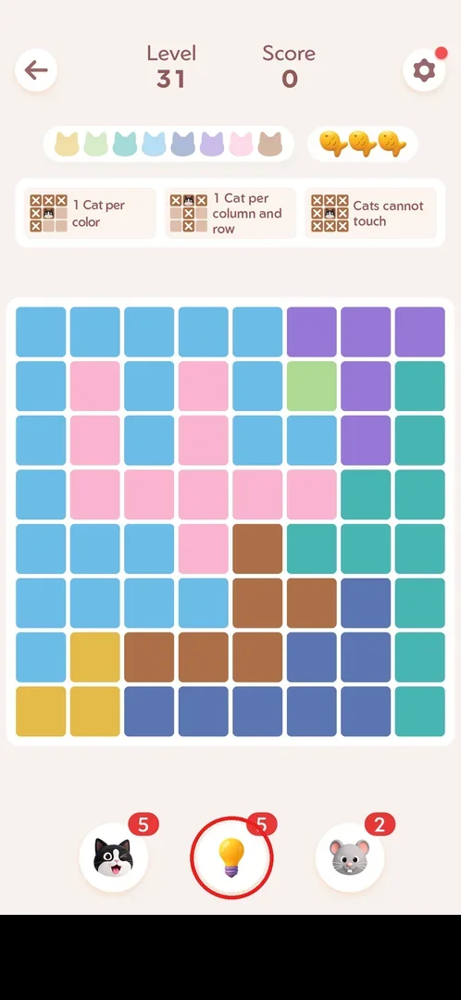
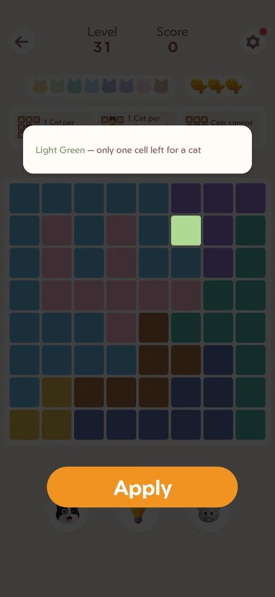
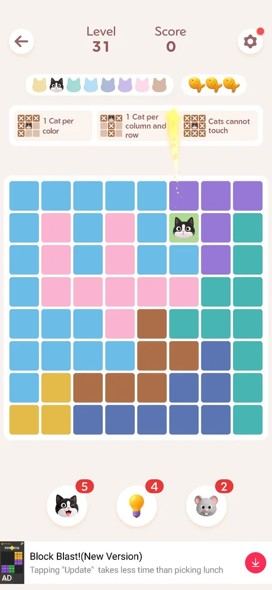

# Hint (lightbulb)

The hint is a booster that solves one cell for you: it dims the board, lights up the one cell where a
cat must go, explains why in one line ("Light Green — only one cell left for a cat"), and an Apply
button places the cat there. Each use costs one lightbulb from a stock shown on the button; the player
starts with 5 [^s1] [^s2].

## Where to find it

On the board of any level: the lightbulb is the middle of the three round buttons under the board
(cat booster on the left, lightbulb in the middle, mouse booster on the right). The red badge is the number of hints left [^s3].

 [^s3]

## What it looks like

One tap on the lightbulb opens the preview: everything is dimmed except one cell (here the single
light-green cell in row 2), a white card at the top names the colour and the reason ("Light Green —
only one cell left for a cat"), and a wide orange Apply button covers the booster row
[^s2].

 [^s2]

## What you can do

| Tab or button | What it does |
|---|---|
| [Apply](#apply) | Places a cat on the lit cell and spends one hint |

### Apply

Tapping Apply places a cat on the lit cell; the light-green cat in the colour bar at the top fills in,
and the lightbulb badge drops from 5 to 4. The score stayed 0 [^s4].

 [^s4]

## How it works

- Stock: 5 at the start of the game (v1.18.0) [^s1]; one use spends one
  (5 → 4) [^s4].
- The stock carries over between levels and sessions: a later session started with 4 hints
  [^s5] (inferred from the count; no hint was bought or earned in between).
- The hint gives a reason, not just a cell: the preview names the colour region and why the cat must go
  there [^s2].
- Unlike the cat booster, whose first placement added score (+576) [^s5],
  the applied hint left the score at 0 [^s4].

## Cases

| Case | What was done | Result | Source |
|---|---|---|---|
| First use | On level 31, tapped the lightbulb, then Apply | Preview with the lit cell and the reason; Apply placed the cat; stock 5 → 4 | [^s2] [^s4] |

## Not verified

- What happens at 0 hints (a refill offer or a rewarded ad, as with the cat booster at 0).
- Whether the preview can be closed without Apply, and whether that spends a hint.
- Whether using a hint changes the level's rating at the end.

[^s1]: session 20260930-233055-chrono-2FYKPJ, step 10 — [video at 2:20](https://youtu.be/kfHedtB_k4Q?t=140)
[^s2]: session 20261001-013526-chrono-2FYKPJ, step 77 — [video at 15:44](https://youtu.be/T86pLfervRE?t=944)
[^s3]: session 20261001-013526-chrono-2FYKPJ, step 76 — [video at 15:34](https://youtu.be/T86pLfervRE?t=934)
[^s4]: session 20261001-013526-chrono-2FYKPJ, step 78 — [video at 15:55](https://youtu.be/T86pLfervRE?t=955)
[^s5]: session 20261001-115413-chrono-2FYKPJ, step 57
