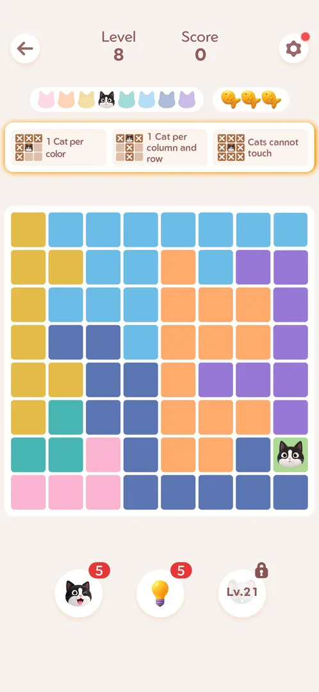
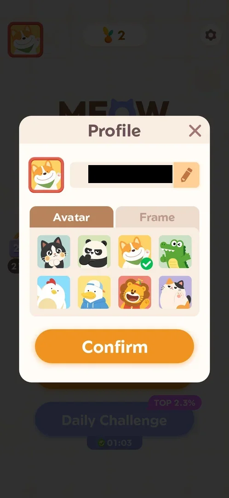
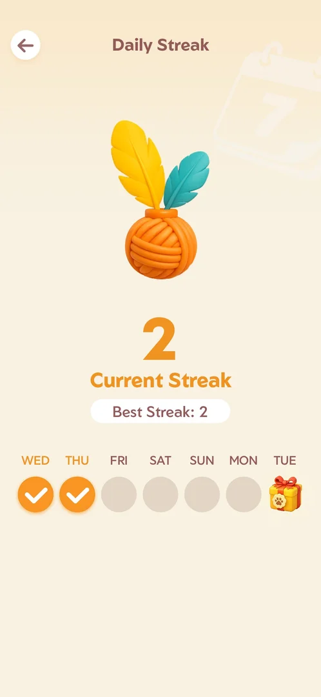
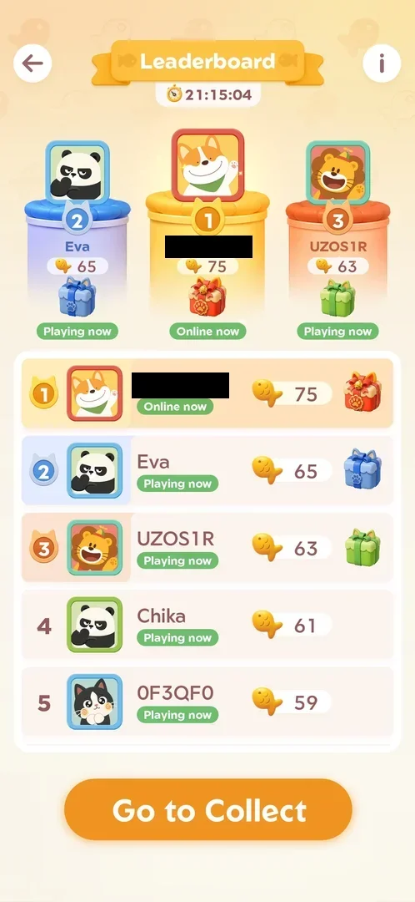
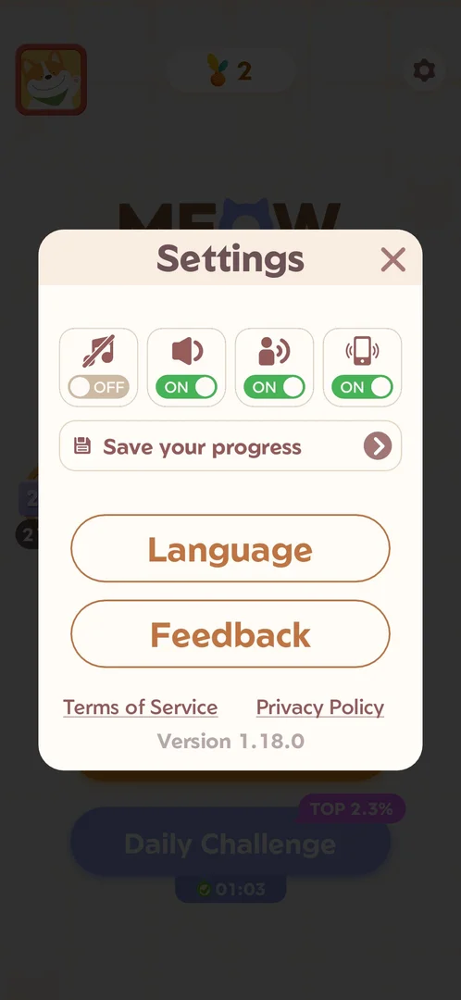
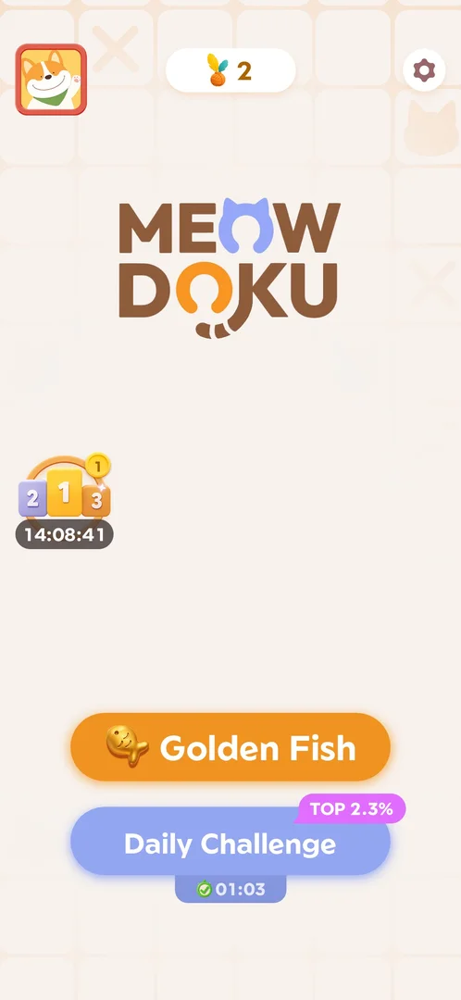
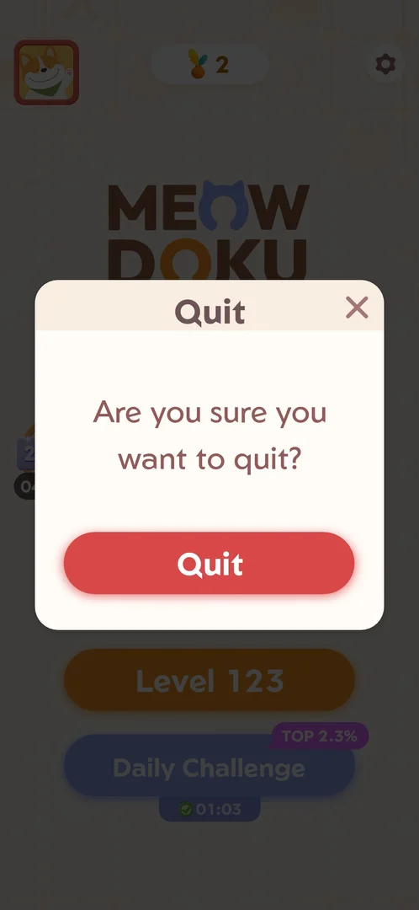

# Home screen

The main menu of Meowdoku. One big orange button starts the next main level ("Level N"), and a blue
button starts the Daily Challenge. Around them are the profile avatar, the yarn-ball streak counter,
the settings gear and the podium icon of the fish leaderboard event. Home has no shop, offers, mail
or currency counter [^s2].

## Where to find it

Home was the first screen after the app started [^s2]. From a level, the back arrow in the top-left
corner of the level screen leads back to Home [^s10]. The back arrow and the Android back key do
nothing on the win screen: from there only the "Level N" button goes on, to the next level [^s11].

 [^s1]

## What it looks like

From top to bottom (version 1.18.0) [^s2]:

- top row: the profile **avatar** (a corgi in a red frame) on the left, the **yarn ball** with the
  current streak (2) in the middle, the settings **gear** on the right;
- the MEOWDOKU logo;
- on the left, the **podium** icon (places 2-1-3) with a badge for your current rank (1) and the time
  left in the leaderboard event (21:16:15);
- the orange **Level 36** button: the next main level;
- the blue **Daily Challenge** button. Here it is already cleared for the day: a green check with the
  clear time 01:03 and a pink **TOP 2.3%** badge.

 [^s2]

Early in the game it is simpler. At level 8 Home had the avatar, the streak counter (1), a gear with a
red dot, a **Level 8** button and a grey, locked Daily Challenge. There was no podium yet: the fish
event starts after level 10 [^s10].

## What you can do

| Tab or button | What it does |
|---|---|
| [Level N](#level-n) | The orange "Level N" button starts the next main level |
| [Daily Challenge](#daily-challenge) | The blue button opens the puzzle of the day (from level 21, once per day) |
| [Avatar](#avatar) | The top-left avatar opens the Profile popup: name, avatar, frame |
| [Streak counter](#streak-counter) | The yarn ball opens the Daily Streak page |
| [Leaderboard](#leaderboard) | The podium icon opens the fish leaderboard event |
| [Settings](#settings) | The gear opens Settings: sound, save progress, language, feedback, legal links |
| [Golden Fish](#golden-fish) | When a golden board is pending, the orange button reads "Golden Fish" and opens it |
| [Quit dialog](#quit-dialog) | The Android back key on Home asks whether to quit the game |

### Level N

The orange button always names the next main level (Level 8, Level 36…). A tap starts that level
directly: the board with Level/Score, the 3 fish (lives), the three rule cards and the boosters
[^s3]. See [Core puzzle](core-puzzle.md).

On Home the button sits at about (365,1185) in the 730x1583 frame. A tap at (365,1245), where the
next-level button sits on the win screen, does nothing on Home [^s21]
[^s22].

 [^s3]

### Daily Challenge

Before level 21 the button is grey and locked; a tap only shows the toast "Daily Challenge unlocks at
level 21" [^s12]. After that, a tap showed an interstitial video ad and then the board of the day,
named after the date ("Level 10/01"), with a stopwatch [^s4]. Once it is cleared, the button shows
the time and the TOP % badge and does nothing when tapped until the next day [^s13]. See
[Daily Challenge](daily-challenge.md).

 [^s4]

### Avatar

The avatar opens the **Profile** popup. It has the auto-generated name with an edit pencil, two tabs
and a **Confirm** button. **Avatar** has 8 animal avatars (the corgi is selected) and **Frame** has 8
frame colors [^s5]. A red frame picked there and confirmed was then shown around the avatar on Home
[^s14].

 [^s5]

### Streak counter

The yarn ball with a number opens the **Daily Streak** page. It shows the current streak (2), the
best streak (2) and a week row (WED…TUE). Played days are checked and day 7 has a gift box. A back
arrow returns to Home [^s6] [^s15]. The gift cannot be tapped before day 7 [^s16]. See
[Streak](streak.md).

 [^s6]

### Leaderboard

The podium icon opens the **Leaderboard** of the fish event. It has the time left (21:15:04), a top-3
podium with gift boxes for places 1–3 and a list of players with their fish (here you are first with
75). There is an info (i) button and a **Go to Collect** button [^s7]. Go to Collect does not claim
anything: it starts the next main level [^s17]. See [Fish leaderboard event](fish-event.md).

 [^s7]

### Settings

The gear on Home opens **Settings**. It has four toggles (music, sound, voice, vibration), **Save your
progress** (sign in with Facebook or Google), **Language**, **Feedback**, **Terms of Service**,
**Privacy Policy** and the version (1.18.0) [^s8]. Settings opened from a level is different: it has
Pattern Mode and Restart but not Save your progress or Language [^s8] [^s18]. See
[Settings](settings.md).

 [^s8]

### Golden Fish

Sometimes the orange button reads **Golden Fish** (with a golden fish icon) instead of "Level N". This
happened after a win on level 66. A tap opened a 9x9 Golden Fish board directly, with no ad and no
explainer. After that board was won, Home showed "Level N" again [^s9] [^s19] [^s20].

 [^s9]

### Quit dialog

The Android back key on Home does not leave silently: it opens a **Quit** popup, "Are you sure you
want to quit?", with a red **Quit** button and an X in the top-right corner (621,535). The X closes it
and Home is back [^s23] [^s24]. Quit itself
was not tapped.

 [^s23]

## How it works

Version 1.18.0.

- Home has only the buttons above. There is no shop, offer, mail or currency [^s2].
- The orange button always leads to the next main level, or to a pending Golden Fish board instead
  [^s3] [^s20].
- The podium icon shows your rank in the event and the time left in it [^s2].
- The Daily Challenge button has three states: locked before level 21, a countdown to the next
  challenge, and done for today with the time and the TOP % badge [^s12] [^s13].

## Cases

| Case | What was done | Result | Source |
|---|---|---|---|
| What Home has | Looked at Home after launch | Avatar, yarn streak counter, gear, leaderboard podium with timer, Level N, Daily Challenge; no shop, offers or currency | ✅ [^s2] |
| Back to Home from a level | Tapped the back arrow on the Level 8 screen | Home opened | ✅ [^s10] |
| Streak counter | Tapped the yarn ball on Home | Daily Streak page with a back arrow | ✅ [^s15] |
| Avatar | Tapped the avatar | Profile popup (the corgi is the profile avatar, not a cross-promo) | ✅ [^s5] |
| Podium | Tapped the podium icon | Leaderboard of the fish event | ✅ [^s7] |
| Gear | Tapped the gear on Home | Settings without Pattern Mode or Restart | ✅ [^s8] |
| Golden Fish button | Tapped Golden Fish on Home | A 9x9 golden board started directly | ✅ [^s19] |
| Back on Home | Pressed the Android back key on Home, then the X | Quit popup "Are you sure you want to quit?"; X closed it | ✅ [^s23] [^s24] |
| Level button position | Tapped (365,1245) and then (365,1185) on Home | 1245 changed nothing; 1185 started the level | ✅ [^s21] [^s25] |

## Not verified

- Whether the Golden Fish button on Home expires after a day (still there after about 12 minutes
  [^s26]). It appears when the golden board offered on the win screen of
  every 4th level is skipped (see [Golden Fish level](golden-fish-level.md)).
- What Quit in the Quit popup does (expected: closes the app).
- What the red dot on the gear means (seen at level 8).
- Whether the avatar chosen in Profile also changes in the event leaderboard.

[^s1]: session 20260930-233055-chrono-2FYKPJ, step 33 — [video at 9:00](https://youtu.be/kfHedtB_k4Q?t=540)
[^s2]: session 20261001-022624-chrono-2FYKPJ, step 0
[^s3]: session 20260930-233055-chrono-2FYKPJ, step 36 — [video at 9:29](https://youtu.be/kfHedtB_k4Q?t=569)
[^s4]: session 20261001-013526-chrono-2FYKPJ, step 100 — [video at 20:43](https://youtu.be/T86pLfervRE?t=1243)
[^s5]: session 20261001-022624-chrono-2FYKPJ, step 1
[^s6]: session 20261001-022624-chrono-2FYKPJ, step 5
[^s7]: session 20261001-022624-chrono-2FYKPJ, step 8
[^s8]: session 20261001-022624-chrono-2FYKPJ, step 67
[^s9]: session 20261001-093348-chrono-2FYKPJ, step 0

[^s10]: session 20260930-233055-chrono-2FYKPJ, step 34 — [video at 9:04](https://youtu.be/kfHedtB_k4Q?t=544)
[^s11]: session 20261001-022624-chrono-2FYKPJ, step 63
[^s12]: session 20260930-233055-chrono-2FYKPJ, step 35 — [video at 9:18](https://youtu.be/kfHedtB_k4Q?t=558)
[^s13]: session 20261001-022624-chrono-2FYKPJ, step 74
[^s14]: session 20261001-013526-chrono-2FYKPJ, step 98 — [video at 19:57](https://youtu.be/T86pLfervRE?t=1197)
[^s15]: session 20261001-013526-chrono-2FYKPJ, step 94 — [video at 18:58](https://youtu.be/T86pLfervRE?t=1138)
[^s16]: session 20261001-022624-chrono-2FYKPJ, step 6
[^s17]: session 20261001-022624-chrono-2FYKPJ, step 11
[^s18]: session 20261001-022624-chrono-2FYKPJ, step 20
[^s19]: session 20261001-093348-chrono-2FYKPJ, step 1
[^s20]: session 20261001-093348-chrono-2FYKPJ, step 16

[^s21]: session 20261001-183504-chrono-2FYKPJ, step 1 — [video at 0:15](https://youtu.be/Ja2zbpj9-mo?t=15)
[^s22]: session 20261001-185238-chrono-2FYKPJ, step 10 — [video at 3:55](https://youtu.be/4EUOBVqgKMw?t=235)
[^s23]: session 20261001-185238-chrono-2FYKPJ, step 7 — [video at 2:24](https://youtu.be/4EUOBVqgKMw?t=144)
[^s24]: session 20261001-185238-chrono-2FYKPJ, step 9 — [video at 3:49](https://youtu.be/4EUOBVqgKMw?t=229)
[^s25]: session 20261001-183504-chrono-2FYKPJ, step 2 — [video at 0:21](https://youtu.be/Ja2zbpj9-mo?t=21)
[^s26]: session 20261001-223249-chrono-2FYKPJ, step 8 — [video at 2:47](https://youtu.be/9EZzZahUrbk?t=167)
