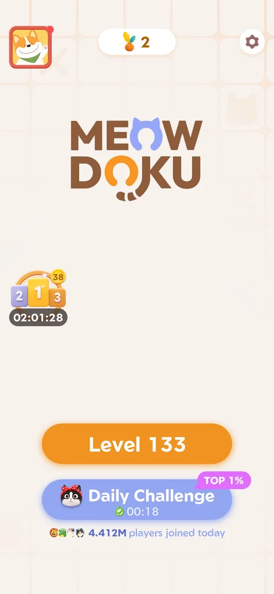
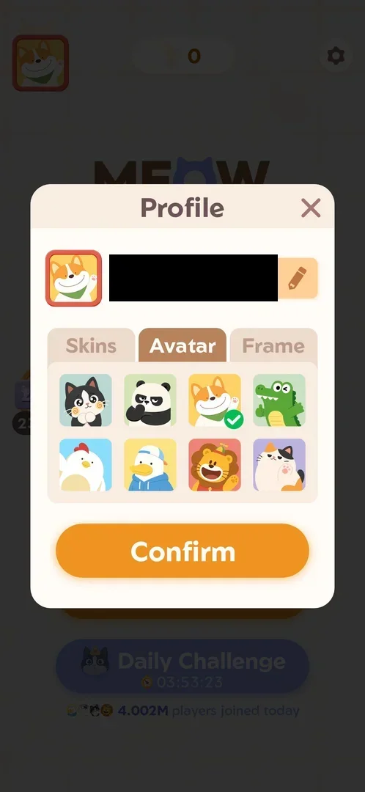
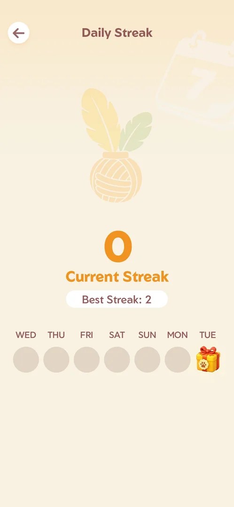
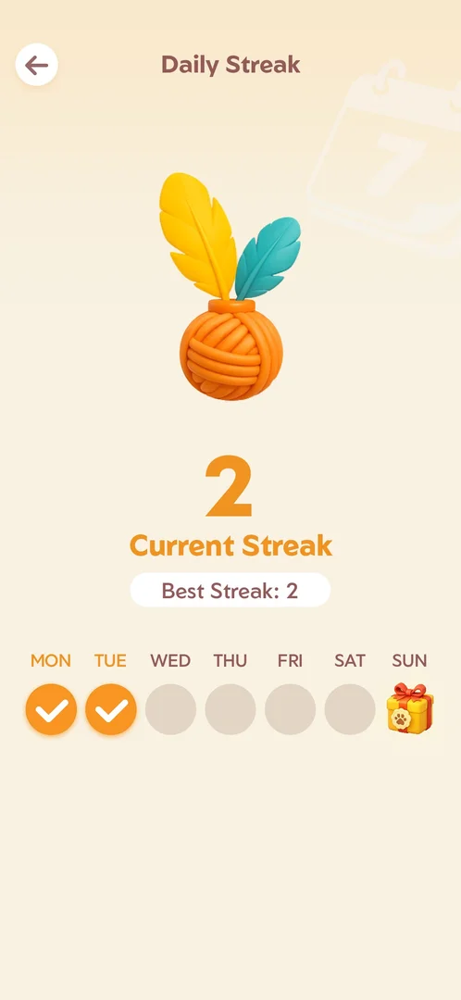
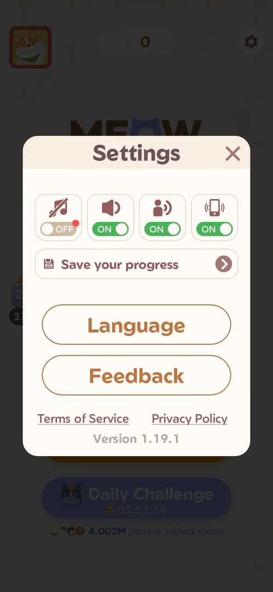
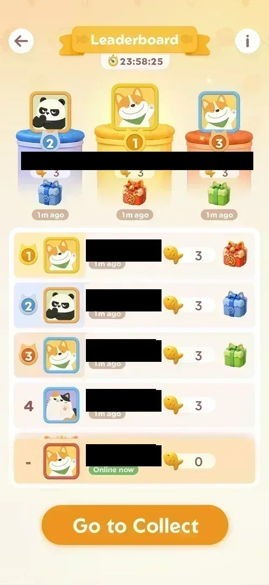
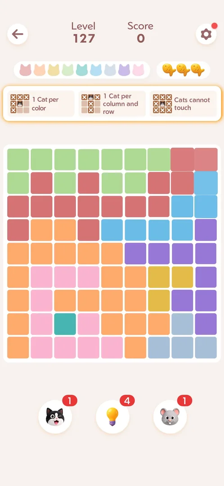
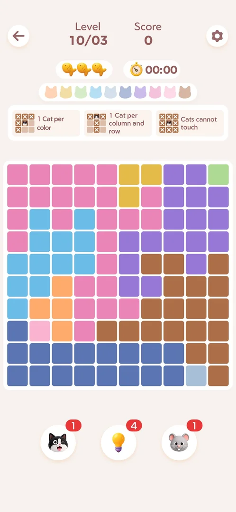

# Home screen

The game's hub: one static screen with the Meowdoku logo, the button to the next main level, the Daily
Challenge button and five other entry points (profile, daily streak, settings, the event leaderboard).
There is no level map [^s1].

## Why it appeared

After consent on first launch [^s1]. On the first launch it opened right after the consent popup and the
system notification request, with the event popup "New Session" on top of it [^s3].
The install already showed Level 127 on its first launch: no tutorial was seen [^s3].

## Where to find it

The game opens on Home after the Oakever splash [^s9]. From a level, the back arrow top left returns to it without
a confirmation (Level 127, no move made) [^s1]; the same arrow on the level board opened by the leaderboard's
Go to Collect returned to Home too [^s10]. The back arrow of Daily Streak and the cross of Settings and of Profile
return to it [^s11] [^s12] [^s13].

 [^s2]
*Level screen: the back arrow top left returns to Home*

 [^s10]
*Home reached with the back arrow from the Level 133 board: the podium icon on the left edge carries the rank badge 38*

## What it looks like

 [^s9]
*Home on 5 October: the avatar (red dot) top left, the yarn counter at 2, the gear top right, the podium with the rank badge 38 and its timer on the left, Level 133 and Daily Challenge (TOP 1%, cleared) at the bottom*

On a light background with the Meowdoku logo: three controls along the top (the avatar, the yarn counter, the
gear), the event podium on the left edge, and two wide buttons at the bottom, the orange Level button and
the blue Daily Challenge button, with a "players joined today" line under them [^s9].

 [^s1]
*Home on the first launch (3 October), for comparison: yarn 0, the red dot on the gear, Level 127*

## What you can do

| Tab or button | Where | What it opens |
|---|---|---|
| [Avatar](#avatar) | top left, a red dot when something in Profile is new | [Profile](profile.md) |
| [Yarn counter](#yarn-counter) | top centre, the streak count | [Daily Streak](daily-streak.md) |
| [Gear](#gear) | top right | [Settings](settings.md) |
| [Podium with timer](#podium-with-timer) | left edge, the rank badge and the period timer | [Fish leaderboard](fish-leaderboard.md) of the [Fish rank event](fish-event.md) |
| [Level button](#level-button) | orange button, the next level's number | the next [main level](level.md) |
| [Daily Challenge](#daily-challenge) | blue button under Level, a countdown or a check | [Daily Challenge](daily-challenge.md) |

### Avatar

 [^s4]
*Profile, opened from the avatar (the name field is blacked out)*

The player's selected avatar (a corgi) in a red frame; it opens the Profile popup [^s4]. On 5 October it
carried a red dot, matched by a red dot on the Profile's Skins tab; after the Skins tab was opened, the dot
was gone from Home [^s14] [^s13].

### Yarn counter

 [^s5]
*Daily Streak, opened from the yarn counter*

A ball of yarn with a number: the current daily streak (0 on the first launch, 2 on 5 October); it opens
the Daily Streak screen, which showed Current Streak 2, Best Streak 2, Monday and Tuesday checked and a gift
on Sunday [^s5] [^s15].

 [^s15]
*Daily Streak from the yarn counter: the number on the counter is the current streak*

### Gear

 [^s6]
*Settings, opened from the gear*

The gear carries a red dot; it opens the Settings popup, where the music toggle carries the same red dot
[^s6]. Inferred: the dot points at the music toggle being off. On 5 October the gear on Home had no dot,
while the music toggle inside Settings was off and still carried its red dot [^s16].

### Podium with timer

 [^s7]
*The event leaderboard, opened from the podium (player names blacked out)*

A 2-1-3 podium with a countdown under it (23:59:28 at the time of the frame); it opens the event leaderboard
[^s7]. A yellow badge on it shows the player's current rank on that board (38 on 5 October, the board showing
the player 38th) [^s9] [^s17].

### Level button

 [^s2]
*Level 127, the next main level*

The orange button names the next main level by number and opens it [^s2]: Level 127 on the first launch,
Level 133 on 5 October [^s9].

### Daily Challenge

 [^s8]
*The Daily Challenge board of 10/03*

The blue button with a cat icon and a countdown (03:53:49 at 20:06 local time) opens today's challenge
board [^s8]. Under it, a line with four avatars reads "4.002M players joined
today" [^s1]. With the day's challenge cleared (5 October), the button carried a pink "TOP 1%" tag and a green
check next to the countdown (00:18 at about 22:45), and the line read "4.412M players joined today" [^s9].

## How it works

- Every entry point on Home was open on this account; no locked button was seen [^s1]. On 5 October the
  avatar, the yarn counter, the gear and the podium were opened again, all without a lock [^s10].
- What changes with progress: the number on the Level button, the streak on the yarn counter, the rank badge
  on the podium (seen 21, 22, 32, then 38) and the state of Daily Challenge; between 3 and 5 October no button
  was added or removed [^s12].
- The two countdowns run independently: the event timer showed about 24 h left, the Daily Challenge timer
  about 3 h 54 min [^s1]. Inferred: the Daily Challenge countdown ends at local midnight (20:06 + 3:53:49).

Version 1.19.1.

## Cases

| Case | What was done | Result | Source |
|---|---|---|---|
| Home: avatar top-left, yarn streak counter top-center, settings gear with red dot top-right, event podium with 24h timer on the left, Level 127 button, Daily Challenge button with reset timer, players-joined-today counter <!-- case:chk-screen --> | Frame marked after the first launch | ✅ | [^s1] |
| Why it appeared: the trigger that brought it up (the first launch, a level won, a threshold, a timer, a loss): a fact with its frame, or a hypothesis to test <!-- case:chk-appeared --> | Opened after the consent popup on the first launch | ✅ | [^s1] |
| Home is the launch screen after the Oakever splash; the back arrow from a level or the leaderboard returns to it <!-- case:chk-entry --> | Launched; returned with the back arrow from the Level 133 board | ✅ | [^s10] |
| Entries: avatar (Profile), gear (Settings), yarn counter (Daily Streak), podium (Fish leaderboard), Level button, Daily Challenge; all open, none locked <!-- case:chk-entries --> | The controls tapped | ✅ | [^s10] |
| Badges: red dot on the avatar (Profile, Skins tab), yarn counter 2 = the daily streak, podium badge 38 = the leaderboard rank with the period timer, Level 133, Daily Challenge TOP 1% tag and a green check, 4.412M players joined; no dot on the gear (the dot sits on the Settings music toggle) <!-- case:chk-badges --> | Each badge's control opened and compared | ✅ | [^s12] |
| With progress: the Level button 127 to 133, the podium rank 21, 22, 32, 38, the streak 2; no button added <!-- case:chk-changes --> | Home compared across sessions | ✅ | [^s12] |

## Not verified

- Whether an entry point is added later in the game (none was added between Level 127 and Level 133)
- What cleared the red dot on the gear between 3 and 5 October, and what the players-joined line does when tapped

[^s1]: session 20261003-200440-chrono-2FYKPJ, step 4 — [video at 1:15](https://youtu.be/Pqx4QY-FpBA?t=75)
[^s2]: session 20261003-200440-chrono-2FYKPJ, step 3 — [video at 1:05](https://youtu.be/Pqx4QY-FpBA?t=65)

[^s3]: session 20261003-200440-chrono-2FYKPJ, step 2 — [video at 0:30](https://youtu.be/Pqx4QY-FpBA?t=30)
[^s4]: session 20261003-200440-chrono-2FYKPJ, step 7 — [video at 1:41](https://youtu.be/Pqx4QY-FpBA?t=101)
[^s5]: session 20261003-200440-chrono-2FYKPJ, step 19 — [video at 3:11](https://youtu.be/Pqx4QY-FpBA?t=191)
[^s6]: session 20261003-200440-chrono-2FYKPJ, step 5 — [video at 1:25](https://youtu.be/Pqx4QY-FpBA?t=85)
[^s7]: session 20261003-200440-chrono-2FYKPJ, step 12 — [video at 2:18](https://youtu.be/Pqx4QY-FpBA?t=138)
[^s8]: session 20261003-200440-chrono-2FYKPJ, step 16 — [video at 2:52](https://youtu.be/Pqx4QY-FpBA?t=172)

[^s9]: session 20261005-223641-chrono-2FYKPJ, step 0 — [video at 0:00](https://youtu.be/VXzhl0TX66c?t=0)
[^s10]: session 20261005-223641-chrono-2FYKPJ, step 7 — [video at 1:27](https://youtu.be/VXzhl0TX66c?t=87)
[^s11]: session 20261005-223641-chrono-2FYKPJ, step 9 — [video at 1:56](https://youtu.be/VXzhl0TX66c?t=116)
[^s12]: session 20261005-223641-chrono-2FYKPJ, step 11 — [video at 2:11](https://youtu.be/VXzhl0TX66c?t=131)
[^s13]: session 20261005-223641-chrono-2FYKPJ, step 21 — [video at 3:43](https://youtu.be/VXzhl0TX66c?t=223)
[^s14]: session 20261005-223641-chrono-2FYKPJ, step 12 — [video at 2:19](https://youtu.be/VXzhl0TX66c?t=139)
[^s15]: session 20261005-223641-chrono-2FYKPJ, step 8 — [video at 1:47](https://youtu.be/VXzhl0TX66c?t=107)
[^s16]: session 20261005-223641-chrono-2FYKPJ, step 10 — [video at 2:00](https://youtu.be/VXzhl0TX66c?t=120)
[^s17]: session 20261005-223641-chrono-2FYKPJ, step 1 — [video at 0:24](https://youtu.be/VXzhl0TX66c?t=24)
