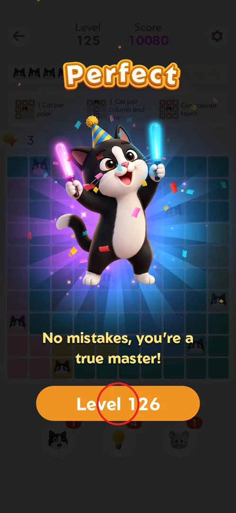
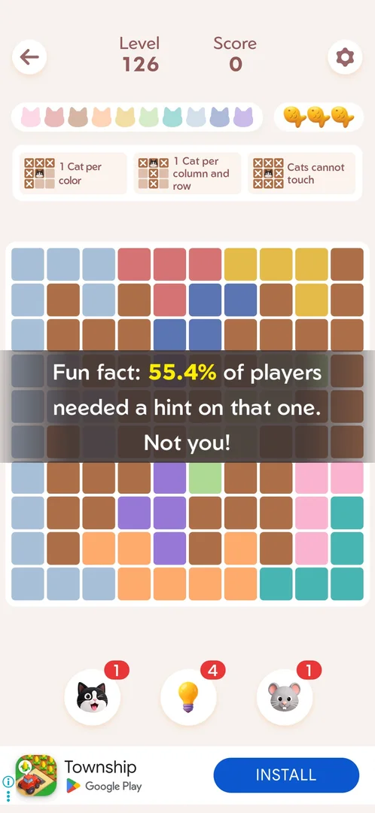
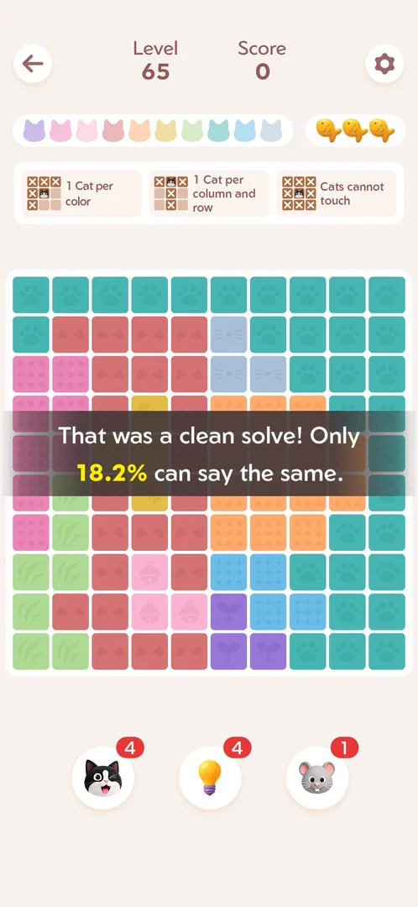

# Level start stat banner

Some levels open with a dark banner across the board that praises how the player did on the previous
level and compares it with other players, using a percentage in yellow. It is only feedback: it has no
buttons and fades by itself, and the board can be played as usual [^s2] [^s3]. The same kind of message
is described as the level-start toast on the [core puzzle](core-puzzle.md) page [^s4].

## Where to find it

There is no button for it. It appears when the next level starts, after the win screen's "Level N" button
is tapped (here "Level 126" on the win screen of level 125) [^s1] [^s2].

 [^s1]

## What it looks like

A semi-transparent dark band over the middle rows of the board, with two or three lines of white text;
the percentage is in yellow. The level number above still shows the new level and the score is 0 [^s2]
[^s3].

 [^s2]

## What you can do

| Tab or button | What it says |
|---|---|
| [Hint fun fact](#hint-fun-fact) | A share of players needed a hint on the previous level, but not you |
| [Clean solve](#clean-solve) | The previous level was a clean solve that only a small share of players matched |

### Hint fun fact

Seen at the start of level 126, right after level 125 was won with the title "Perfect" with no hint
and no mistakes. The banner starts with "Fun fact:", gives 55.4% as the share of players who needed a
hint "on that one", and ends with "Not you!" [^s2] [^s5]. It showed right after an interstitial ad
that played when the level started [^s2].

 [^s2]

### Clean solve

Seen at the start of level 65: the banner calls the previous level a clean solve and says only 18.2% of
players can say the same [^s3].

 [^s3]

## How it works

Version 1.18.0.

- The banner refers to the level just finished ("that one"), not to the level that is starting [^s2]
  [^s3].
- Variants seen so far: level 11, a zero-mistakes top-percentage message [^s4]; level 21, a
  no-tools-used message [^s6]; level 65, "clean solve", 18.2% [^s3]; level 126, "fun fact" about hints,
  55.4% [^s2].
- It does not show on every level: none appeared on levels 67–83 [^s7]. The rule that decides when it
  shows is not known; the sightings at levels 11, 65 and 126 followed wins without mistakes (an
  observation, not a tested rule).

## Cases

| Case | What was done | Result | Source |
|---|---|---|---|
| Hint variant | Won level 125 "Perfect" without hints, tapped Level 126 | "Fun fact" banner: 55.4% of players needed a hint, "Not you!" | ✅ [^s2] |
| Clean solve variant | Started level 65 after a flawless level 64 | Banner: clean solve, only 18.2% can say the same | ✅ [^s3] |
| Frequency | Played levels 67–83 | No banner seen | ✅ [^s7] |

## Not verified

- When the banner shows and how the game picks a variant.
- Whether a banner can appear after a win with mistakes or with a hint used.
- Whether the percentages change over time or per player.

[^s1]: session 20261001-223249-chrono-2FYKPJ, step 3 — [video at 1:17](https://youtu.be/9EZzZahUrbk?t=77)
[^s2]: session 20261001-223249-chrono-2FYKPJ, step 5 — [video at 1:41](https://youtu.be/9EZzZahUrbk?t=101)
[^s3]: session 20261001-082114-chrono-2FYKPJ, step 47
[^s4]: session 20260930-233055-chrono-2FYKPJ, step 51 — [video at 12:33](https://youtu.be/kfHedtB_k4Q?t=753)
[^s5]: session 20261001-223249-chrono-2FYKPJ, step 8 — [video at 2:47](https://youtu.be/9EZzZahUrbk?t=167)
[^s6]: session 20260930-233055-chrono-2FYKPJ, step 113 — [video at 23:02](https://youtu.be/kfHedtB_k4Q?t=1382)
[^s7]: session 20261001-093348-chrono-2FYKPJ, step 113
