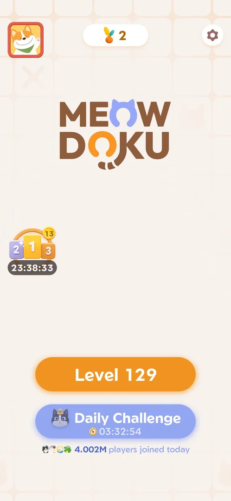
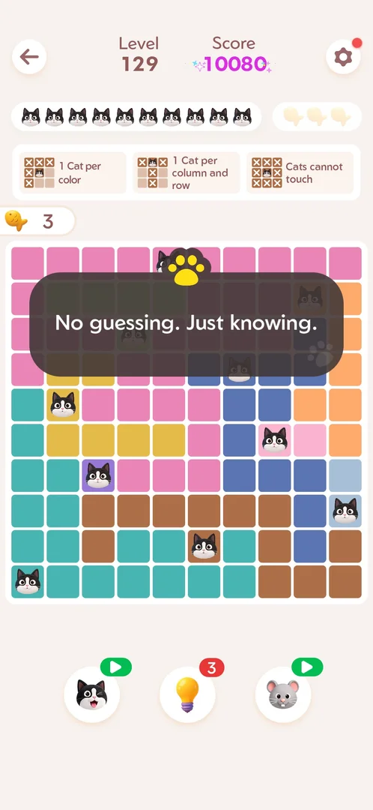
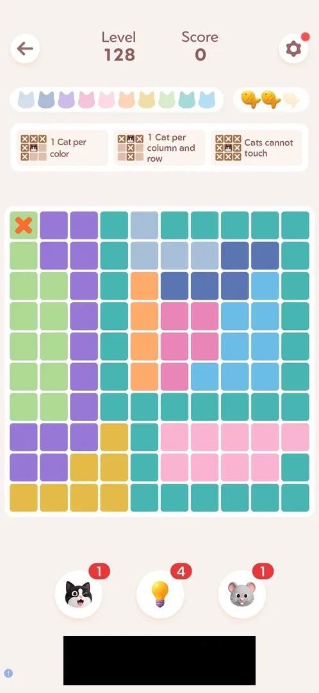
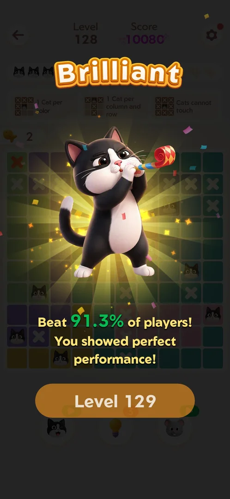
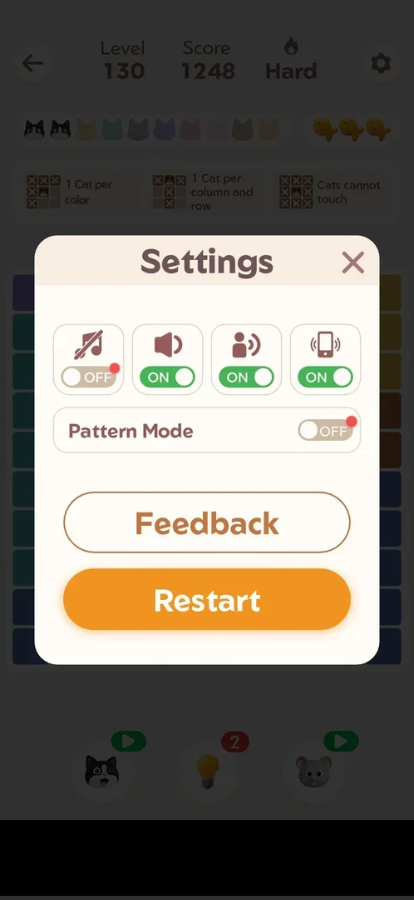
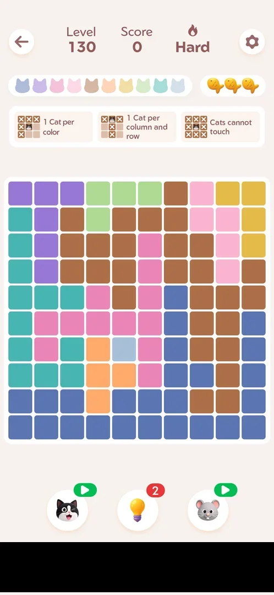
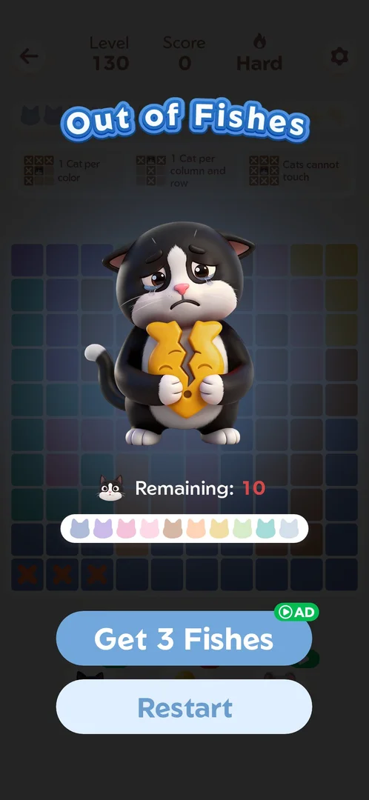
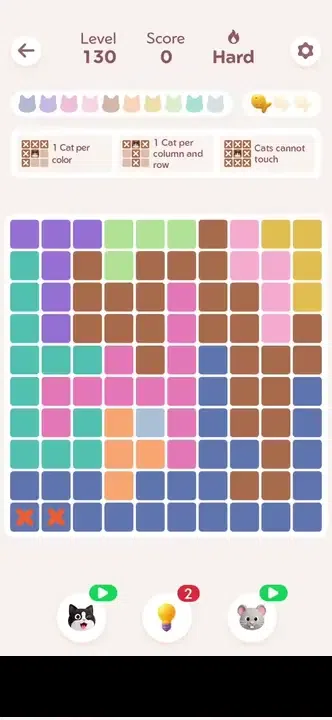
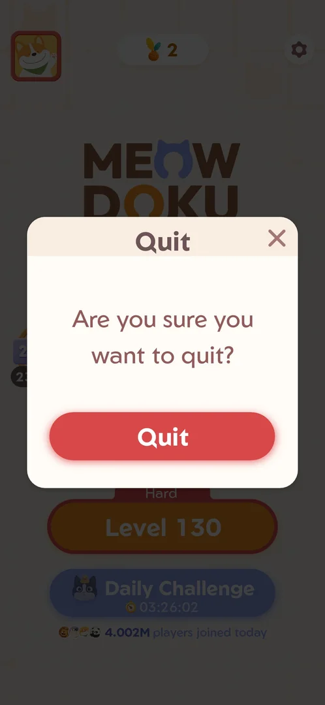
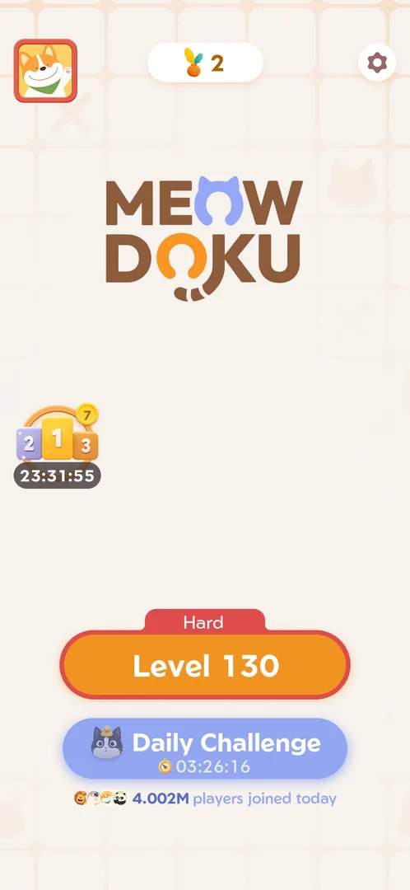

# Main level (cat placement board)

The game's core puzzle. A square board is split into colour regions, and the player places cats so that
each colour, each row and each column holds exactly one cat and no two cats touch. Main levels are numbered.
This account played Levels 127 (9x9), 128, 129 and 130 (10x10); Level 130 was marked Hard [^s1] [^s2]
[^s14]. A level starts with three fish. Each wrong cat costs one, and the third
wrong cat loses the level. The fish kept are paid to the [Fish rank event](fish-event.md) [^s2] [^s3]
[^s15].

## Why it appeared

Level button on Home (Level 127); the event popup's Got it also opened the level [^s1].

## Where to find it

On [Home](home.md), the orange Level button opens the next main level (it read Level 127, later Level 129)
[^s4] [^s5] [^s16]. A Hard level carries a red "Hard" tag on top of the button
[^s17]. On the first launch, Got it on the event popup "New Session" also opened
Level 127 [^s1]. The win screen's orange button opens the next level directly (Level 128, 129, 130) [^s6] [^s7]
[^s18].

 [^s16]
*Home screen: the orange Level 129 button (under the logo, above Daily Challenge) opens the next main level*

## What it looks like

 [^s1]
*Level 127 before the first move: the rules strip under the cat icons and fish, the 9x9 board, the three boosters at the bottom*

From top to bottom [^s1] [^s14]:

- The back arrow (top left), "Level 127", "Score 0", a flame with "Hard" on a Hard level, the gear with a red
  dot (top right).
- A row of pale cat heads, one per board colour (nine on Level 127, ten on Levels 128-130), and a box of three
  fish.
- The rules strip, three cards: "1 Cat per color", "1 Cat per column and row", "Cats cannot touch".
- The board: 9x9 or 10x10 cells in as many colour regions, empty.
- Three boosters with counters: a winking cat, a light bulb, a mouse.

A [banner ad](ad-banner.md) ran under the boosters on every level seen (127 to 130) while the board was
being played; once the last cat was placed it was gone [^s5] [^s8] [^s14] [^s3] [^s19].

### Solved board

 [^s19]
*Level 129 solved: one cat in every row, column and colour; every head in the cat bar black; score 10080; a counter with a fish and 3 left of the board; a toast over the board*

A placed cat turns its colour's head in the cat bar from pale to black [^s9]. On the last cat the score
glows, a toast shows over the board ("No guessing. Just knowing.") and a counter with a fish and the number
of fish kept slides in left of the board [^s19].

 [^s9]
*Level 127 solved: every cat head in the top row turned black; score 8640*

### Wrong cat

 [^s2]
*Level 128: a cat placed where it does not belong became an orange cross, and the third fish in the fish box went grey (the banner ad is blacked out)*

## What you can do

| Tab or button | What it does |
|---|---|
| [Win](#win) | The win screen after the last cat: a title by the fish kept and the next level's button |
| [Settings](#settings) | The gear (top right): sound toggles, Pattern Mode, Feedback and Restart |
| [Restart](#restart) | Restart in Settings: the same board again, empty, with three fish |
| [Out of Fishes](#out-of-fishes) | The loss screen after the third wrong cat: Get 3 Fishes (ad) or Restart |
| [Quit](#quit) | The back arrow leaves for Home at once; Android Back on Home asks before closing the app |

### Win

 [^s18]
*The win screen after Level 129 with no mistakes: "Immaculate", a line of praise, the orange Level 130 button with its "Hard" tag*

 [^s6]
*The win screen after a clean Level 127: "Perfect", a line of praise for no mistakes, the orange Level 128 button*

 [^s7]
*The win screen after Level 128 with one wrong cat: "Brilliant", "Beat 91.3% of players! You showed perfect performance!", the Level 129 button*

After the last cat, in this order [^s9] [^s11] [^s6] [^s19] [^s18]:

1. The [Fish leaderboard](fish-leaderboard.md) over the board, with the player's row moving up, a bubble
   (after Level 129: "Bravo! Your rank increased by 11 spots.") and "Tap to Continue".
2. On the day's first win only, the [Daily Streak](daily-streak.md) popup and screen [^s11].
3. The win screen: a title, a cat animation, a line of praise and the next level's button. Three titles were
   seen: "Perfect" (Level 127, 3 fish), "Brilliant" (Level 128, 2 fish), "Immaculate" (Level 129, 3 fish).
   Inferred: with 3 fish the title is picked from several; not verified.

The next tap on the next level's button played a full-screen interstitial video ad, after Level 127 and
again after Level 129 [^s12] [^s20]. Both times the app was relaunched to leave
it, and the next level opened with an empty board [^s13] [^s21].

 [^s10]
*After the first win only, the rating popup over the win screen: five stars, Rate Us, the close cross top right*

### Settings

 [^s22]
*The gear in the level opens Settings over the board: music, sound, voice and vibration toggles, Pattern Mode, Feedback, the orange Restart (the banner ad is blacked out)*

The gear (top right of the level) opens a Settings popup over the board [^s22]:

- Four toggles with icons: music (off), sound, voice, vibration (on).
- Pattern Mode, off, with a red dot on its switch.
- Feedback, a white button.
- Restart, an orange button; see [Restart](#restart).
- A close cross top right.

The toggles, Pattern Mode and Feedback were not tried in a level (see [Settings](settings.md) for the Home
version).

### Restart

 [^s23]
*Level 130 just after Settings > Restart: the same regions, no cats, score 0, the cat heads reordered, the bulb's badge still 2 (the banner ad is blacked out)*

Restart in Settings restarted the level at once, with no confirmation [^s23]:

- The same board (the same colour regions), all cats removed, score 1248 back to 0, three fish.
- The heads in the cat bar came back in a different order.
- Boosters spent before the restart stayed spent: the bulb kept 2, the cat stayed at its video icon.

### Out of Fishes

 [^s15]
*The loss screen after the third wrong cat: "Out of Fishes", how many cats were left to place, Get 3 Fishes (a rewarded ad) and Restart*

 [^s15]
*Clip 4.4 s · [original on YouTube from 5:37](https://youtu.be/3-USmjAyOV8?t=337)*

On the restarted Level 130, five taps along the bottom row left two orange crosses and one fish
[^s24]. A third wrong cat ended the level [^s15]:

- "Out of Fishes" with a crying cat, "Remaining: 10" and the ten pale cat heads.
- Get 3 Fishes, with a green AD badge: a rewarded ad. Not tried.
- Restart: it played a full-screen interstitial video ad, and after that Level 130 was open again with an
  empty board, score 0 and three fish [^s25] [^s26].

Only two of the five taps registered as cats [^s24]. Inferred: taps made while
a wrong cat's cross is still animating are ignored. Not verified.

### Quit

 [^s27]
*Android Back on Home opens "Quit" ("Are you sure you want to quit?"): the red Quit button closes the app, the cross top right cancels*

 [^s17]
*Home right after the back arrow (top left) in Level 130: no confirmation came; the Level 130 button keeps its red "Hard" tag*

- The back arrow (top left of the level) went straight to Home, with no confirmation and no cost seen. This
  was tried before any move on Level 127 and with the restarted Level 130 [^s4]
  [^s17]. Home then still offered Level 130 with its Hard tag.
- Android Back on Home opened the Quit popup. Its cross closed it back to Home
  [^s27] [^s28]. The red Quit button was not
  tapped.

## How it works

- Rules (from the rules strip): one cat per colour region, one cat per row and column, cats cannot touch
  [^s1].
- A wrong cat: a cat tapped onto a cell that is not in the solution shows at once as an orange cross, and
  one fish of three goes grey [^s2]. Inferred: the game checks each cat against its solution as it is
  placed. With fish left the level goes on [^s3]. The third wrong cat ends it: see
  [Out of Fishes](#out-of-fishes) [^s15].
- Boosters: [Cat booster](booster-cat.md) places a correct cat. [Hint booster](booster-hint.md) explains a
  deduction and carries it out. [Mouse booster](booster-mouse.md) crosses out empty cells. None of them costs
  a fish [^s3] [^s29].
- Fish paid: 3 for Levels 127 and 129 with no mistakes, 2 for Level 128 with one wrong cat. The
  [Fish leaderboard](fish-leaderboard.md) rose by the same number [^s9] [^s3]
  [^s19]. Whether time also costs fish was not tested (Level 127 took 121 s,
  Level 128 194 s, Level 129 about 110 s) [^s10] [^s7] [^s21].
- Score: counts per level from 0 (Level 127 ended at 8640, Levels 128 and 129 at 10080) [^s9] [^s3]
  [^s19]. On Level 130 the first cat gave +576 and the second +672
  [^s30] [^s29]. Inferred: each cat is worth more
  than the one before; the rule is not verified.
- Hard levels: Level 130 had a flame and "Hard" in the HUD and a red "Hard" tag on its button. Its board
  (10x10, ten colours) and its fish and boosters looked like those of other levels
  [^s18] [^s14]. What else Hard changes was not
  verified.
- Rate Us: tapping Level 128 on the first win screen brought up "Are you enjoying Meowdoku?" with five stars
  and Rate Us. The cross closed it back to the win screen [^s10] [^s12]. It did not come back after Level 129
  [^s20].
- Ads [^s12] [^s13] [^s8] [^s20] [^s25]:
  - Interstitial: a full-screen video ad after the next-level button on a win screen (twice), and after
    Restart on Out of Fishes (once). After Level 127 the video had a 9 s countdown, then a close cross, then a
    playable ad.
  - Banner: under the boosters on Levels 127 to 130 while the board is played, gone once it is solved
    (see [Banner ad](ad-banner.md)) [^s5] [^s3]. Tapping the back arrow while the ad after
    Restart was ending opened the Play Store instead [^s31]. Inferred: the tap
    landed on the ad.
  - Rewarded: Get 3 Fishes on Out of Fishes, and the video icon of a booster at 0 (see
    [Cat booster](booster-cat.md)).
  - No shop, offer or no-ads button was seen on the level screen or the win screens.

Version 1.19.1.

## Cases

| Case | What was done | Result | Source |
|---|---|---|---|
| Level 127: level number, score, 9 color-region cat icons, 3 fish, rules strip (1 cat per color; 1 cat per column and row; cats cannot touch), 9x9 board, boosters cat 1 / hint 4 / mouse 1, back and settings <!-- case:chk-screen --> | Opened from the event popup, frame marked | ✅ | [^s1] |
| Rules strip: 1 cat per color region, 1 cat per row and column, cats cannot touch <!-- case:chk-rules --> | Rules strip read | ✅ | [^s1] |
| Why it appeared: the trigger that brought it up (the first launch, a level won, a threshold, a timer, a loss): a fact with its frame, or a hypothesis to test <!-- case:chk-appeared --> | Got it on the event popup, and the Level button on Home | ✅ | [^s1] |
| Home: the Level N button; Level 130 carries a red Hard tag <!-- case:chk-entry --> | Level 127 and Level 129 buttons on Home tapped; the win screen's next-level button tapped | ✅ | [^s5] [^s16] |
| HUD: back arrow, Level, Score, the Hard flame, the gear, the cat bar, 3 fish, 3 rule cards, the cat, hint and mouse boosters, a banner ad <!-- case:chk-hud --> | Every control used; the gear opened | ✅ | [^s22] |
| Win: the leaderboard (rank up, Tap to Continue), then the win screen (Immaculate with 3 fish on Level 129) with the next level's button; the next level starts after an interstitial <!-- case:chk-win --> | Levels 127, 128 and 129 won | ✅ | [^s6] [^s18] |
| Lost by 3 wrong cats: the Out of Fishes screen (Get 3 Fishes ad / Restart) <!-- case:chk-loss --> | Three wrong cats placed on purpose on Level 130 | ✅ | [^s15] |
| Out of fishes: the third wrong cat ends the level; the Out of Fishes screen with Remaining N, Get 3 Fishes (rewarded ad) and Restart <!-- case:out-of-fishes --> | Three wrong cats placed on purpose; Restart tapped | ✅ | [^s15] |
| After a loss: Restart on Out of Fishes reopens the level with 3 fish and score 0, after an interstitial <!-- case:chk-retry --> | Restart tapped | ✅ | [^s25] |
| Restart: Settings > Restart replays the same board, cats cleared, score 0, spent boosters not refunded, no confirmation <!-- case:chk-restart --> | Restart tapped with two cats on the board | ✅ | [^s23] |
| Quit: the back arrow goes straight Home, no confirmation <!-- case:chk-quit --> | Back arrow before any move (Level 127) and after a restart (Level 130) | ✅ | [^s4] [^s17] |
| Exit the app: Android Back on Home opens the Quit popup; its cross cancels <!-- case:chk-exit-app --> | Back pressed on Home, cross tapped | ✅ | [^s27] |
| Level elements: none beyond colour regions on Levels 127-130; the in-level Settings holds sound toggles, Pattern Mode, Feedback, Restart <!-- case:chk-elements --> | Four levels played; the gear opened | ✅ | [^s22] |

## Not verified

- Get 3 Fishes on Out of Fishes: what it gives (three fish with the board kept, or a restart); not tapped
- Exit the app with cats on the board and come back: is the board kept (only tried during an ad, before any move)
- What the score counts per cat, and what Hard changes besides the tag
- Pattern Mode and the sound toggles inside a level

[^s1]: session 20261003-200440-chrono-2FYKPJ, step 3 — [video at 1:05](https://youtu.be/Pqx4QY-FpBA?t=65)
[^s2]: session 20261003-201915-chrono-2FYKPJ, step 12 — [video at 4:18](https://youtu.be/ffhYgQE4LvU?t=258)
[^s3]: session 20261003-201915-chrono-2FYKPJ, step 17 — [video at 5:31](https://youtu.be/ffhYgQE4LvU?t=331)
[^s4]: session 20261003-200440-chrono-2FYKPJ, step 4 — [video at 1:15](https://youtu.be/Pqx4QY-FpBA?t=75)
[^s5]: session 20261003-201915-chrono-2FYKPJ, step 2 — [video at 0:55](https://youtu.be/ffhYgQE4LvU?t=55)
[^s6]: session 20261003-201915-chrono-2FYKPJ, step 7 — [video at 2:27](https://youtu.be/ffhYgQE4LvU?t=147)
[^s7]: session 20261003-201915-chrono-2FYKPJ, step 18 — [video at 5:47](https://youtu.be/ffhYgQE4LvU?t=347)
[^s8]: session 20261003-201915-chrono-2FYKPJ, step 15 — [video at 4:48](https://youtu.be/ffhYgQE4LvU?t=288)
[^s9]: session 20261003-201915-chrono-2FYKPJ, step 3 — [video at 1:28](https://youtu.be/ffhYgQE4LvU?t=88)
[^s10]: session 20261003-201915-chrono-2FYKPJ, step 8 — [video at 2:45](https://youtu.be/ffhYgQE4LvU?t=165)
[^s11]: session 20261003-201915-chrono-2FYKPJ, step 4 — [video at 1:45](https://youtu.be/ffhYgQE4LvU?t=105)
[^s12]: session 20261003-201915-chrono-2FYKPJ, step 10 — [video at 3:16](https://youtu.be/ffhYgQE4LvU?t=196)
[^s13]: session 20261003-201915-chrono-2FYKPJ, step 11 — [video at 4:04](https://youtu.be/ffhYgQE4LvU?t=244)

[^s14]: session 20261003-202631-chrono-2FYKPJ, step 9 — [video at 2:23](https://youtu.be/3-USmjAyOV8?t=143)
[^s15]: session 20261003-202631-chrono-2FYKPJ, step 17 — [video at 5:40](https://youtu.be/3-USmjAyOV8?t=340)
[^s16]: session 20261003-202631-chrono-2FYKPJ, step 1 — [video at 0:31](https://youtu.be/3-USmjAyOV8?t=31)
[^s17]: session 20261003-202631-chrono-2FYKPJ, step 21 — [video at 6:40](https://youtu.be/3-USmjAyOV8?t=400)
[^s18]: session 20261003-202631-chrono-2FYKPJ, step 6 — [video at 1:30](https://youtu.be/3-USmjAyOV8?t=90)
[^s19]: session 20261003-202631-chrono-2FYKPJ, step 5 — [video at 1:06](https://youtu.be/3-USmjAyOV8?t=66)
[^s20]: session 20261003-202631-chrono-2FYKPJ, step 7 — [video at 1:41](https://youtu.be/3-USmjAyOV8?t=101)
[^s21]: session 20261003-202631-chrono-2FYKPJ, step 8 — [video at 2:06](https://youtu.be/3-USmjAyOV8?t=126)
[^s22]: session 20261003-202631-chrono-2FYKPJ, step 14 — [video at 4:56](https://youtu.be/3-USmjAyOV8?t=296)
[^s23]: session 20261003-202631-chrono-2FYKPJ, step 15 — [video at 5:05](https://youtu.be/3-USmjAyOV8?t=305)
[^s24]: session 20261003-202631-chrono-2FYKPJ, step 16 — [video at 5:26](https://youtu.be/3-USmjAyOV8?t=326)
[^s25]: session 20261003-202631-chrono-2FYKPJ, step 18 — [video at 5:56](https://youtu.be/3-USmjAyOV8?t=356)
[^s26]: session 20261003-202631-chrono-2FYKPJ, step 20 — [video at 6:21](https://youtu.be/3-USmjAyOV8?t=381)
[^s27]: session 20261003-202631-chrono-2FYKPJ, step 22 — [video at 6:55](https://youtu.be/3-USmjAyOV8?t=415)
[^s28]: session 20261003-202631-chrono-2FYKPJ, step 23 — [video at 7:11](https://youtu.be/3-USmjAyOV8?t=431)
[^s29]: session 20261003-202631-chrono-2FYKPJ, step 13 — [video at 4:40](https://youtu.be/3-USmjAyOV8?t=280)
[^s30]: session 20261003-202631-chrono-2FYKPJ, step 12 — [video at 4:22](https://youtu.be/3-USmjAyOV8?t=262)
[^s31]: session 20261003-202631-chrono-2FYKPJ, step 19 — [video at 6:01](https://youtu.be/3-USmjAyOV8?t=361)
