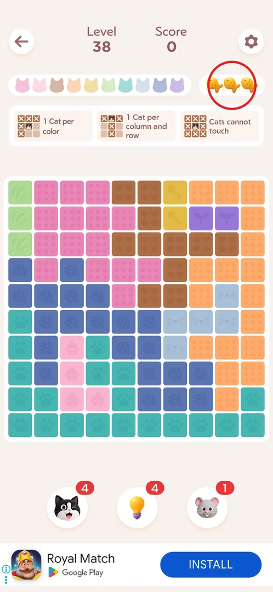
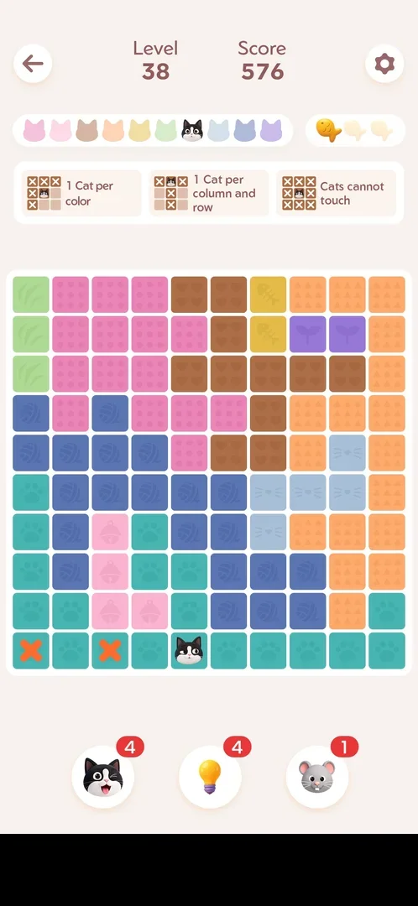
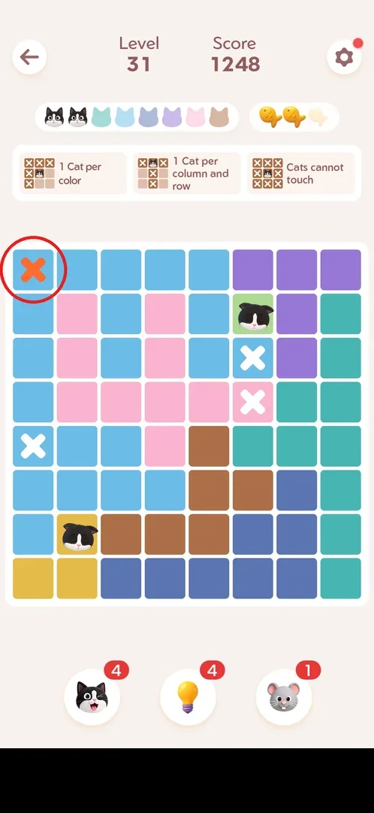
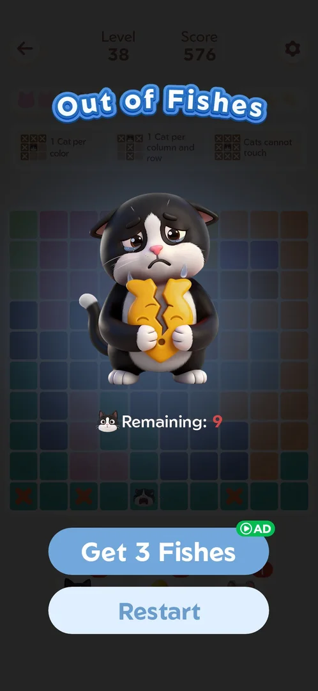
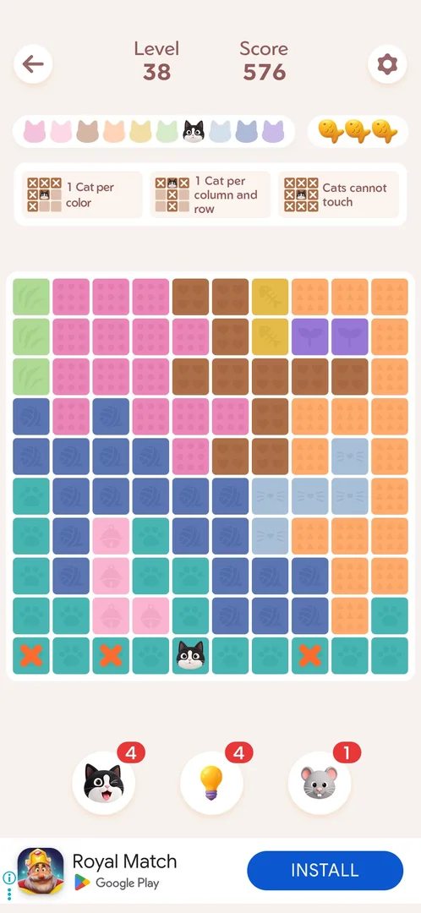
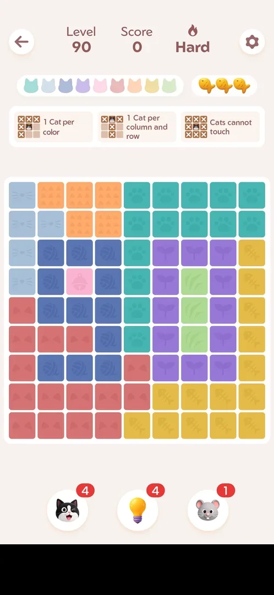

# Fish (3 mistake lives per level)

Fish are the mistake lives of a level: every level starts with three, each wrong cat costs one, and at
zero the level stops with the "Out of Fishes" popup, where a rewarded ad gives the fish back or the
level restarts [^s3] [^s4]. Fish left at the end of a level also count: a flawless win adds the
three remaining fish to the [leaderboard event](fish-event.md) score [^s6].

## Where to find it

Start any level (Level N on home): the three fish sit in the level header, to the right of the bar
of cat heads (one per colour), under Level and Score [^s1].

 [^s1]

## What it looks like

Three fish icons: a gold fish is a life left, a pale fish is a life lost. The frame shows level 38
after two wrong cats: one gold fish, two pale, an orange X on each wrong cell [^s2].

 [^s2]

## What you can do

| Tab or button | What it does |
|---|---|
| [Wrong cat](#wrong-cat) | Placing a cat on a wrong cell costs one fish |
| [Out of Fishes](#out-of-fishes) | The popup at zero fish: Get 3 Fishes (AD) or Restart |
| [Get 3 Fishes](#get-3-fishes) | Watch a rewarded ad and continue the same board with 3 fish |
| [Restart on Out of Fishes](#restart-on-out-of-fishes) | Start the level again on a new board, free |

### Wrong cat

A double tap places a cat; on a cell that cannot hold one, the cell gets an orange X instead, one
fish turns pale (3 → 2) and the cats already placed close their eyes [^s3]. The orange X stays on the
board [^s5].

 [^s3]

### Out of Fishes

The third wrong cat opens the "Out of Fishes" popup over the dimmed board: a crying cat holding a
broken fish, "Remaining: 9" (the cats still to place), the button **Get 3 Fishes** with a green
AD badge and the button **Restart** [^s4].

 [^s4]

### Get 3 Fishes

The button plays a rewarded ad, a playable of about 30 s with no usable close button; relaunching the
game returned to the level [^s7] [^s5]. Back in the level, all three fish are gold
again and the board is kept: the placed cat, the orange X marks and the score 576 [^s5].

 [^s5]

### Restart on Out of Fishes

**Restart** (365,1398) on the popup keeps the level number but deals a **new board**: on Hard level 90
the 9×9 board came back with different colour regions, 3 fish, the Hard tag and the boosters as they
were (4/4/1). No ad played and nothing was charged; the new board was then won with no mistakes
[^s11] [^s12] [^s13].

 [^s12]

## How it works

Version 1.18.0.

- 3 fish per level; one wrong cat = −1 fish; 0 fish = "Out of Fishes" [^s3] [^s4].
- Get 3 Fishes refills all 3 fish for a rewarded ad and keeps the board and score [^s5].
- Restart on the Out of Fishes popup is free and gives a new board for the same level
  [^s12].
- Restart from the in-level settings resets the board, fish back to 3, score 0; boosters spent are
  not refunded [^s8].
- Lost fish do not change the level score: 1 mistake on a 9×9 board and 2 mistakes on a 10×10 board
  gave the same scores as flawless wins (8640 and 10080); they change only the
  [win title](win-rank.md) (1 mistake: Brilliant, 2 mistakes: Awesome) [^s9].
- A flawless win adds the 3 fish left to the [leaderboard event](fish-event.md) score [^s6].
- The Golden Fish challenge has a single fish: one wrong cat opens "Out of Fish" at once, with
  "Get 1 Fish" (AD), Restart and a "Skip to Level N" link [^s10].

## Cases

| Case | What was done | Result | Source |
|---|---|---|---|
| Wrong cat | Double tap on a wrong cell | Orange X on the cell, fish 3 → 2, placed cats close their eyes | [^s3] |
| Zero fish | Three wrong cats in one row (level 38) | "Out of Fishes": Remaining 9, Get 3 Fishes (AD), Restart | [^s4] |
| Refill | Get 3 Fishes | A ~30 s rewarded playable; after relaunching the game: 3 fish, the board and score kept | [^s5] |
| Restart from settings | Settings → Restart in a level | Board reset, 3 fish, score 0, boosters not refunded | [^s8] |
| Restart on Out of Fishes | Three wrong cats on Hard level 90, then Restart | Same level, a new board, 3 fish, no ad or cost; won with 0 mistakes | ✅ [^s12] [^s13] |

## Not verified

- Whether the fish count carries over between levels (each level seen started with 3).

[^s1]: session 20261001-022624-chrono-2FYKPJ, step 37
[^s2]: session 20261001-022624-chrono-2FYKPJ, step 39
[^s3]: session 20261001-013526-chrono-2FYKPJ, step 81 — [video at 16:34](https://youtu.be/T86pLfervRE?t=994)
[^s4]: session 20261001-022624-chrono-2FYKPJ, step 40
[^s5]: session 20261001-022624-chrono-2FYKPJ, step 42
[^s6]: session 20260930-233055-chrono-2FYKPJ, step 53 — [video at 13:08](https://youtu.be/kfHedtB_k4Q?t=788)
[^s7]: session 20261001-022624-chrono-2FYKPJ, step 41
[^s8]: session 20261001-013526-chrono-2FYKPJ, step 85 — [video at 17:28](https://youtu.be/T86pLfervRE?t=1048)
[^s9]: session 20261001-082114-chrono-2FYKPJ, step 53
[^s10]: session 20261001-082114-chrono-2FYKPJ, step 34

[^s11]: session 20261001-115413-chrono-2FYKPJ, step 42 — [video at 15:00](https://youtu.be/ATvMZzri7O8?t=900)
[^s12]: session 20261001-115413-chrono-2FYKPJ, step 43 — [video at 15:13](https://youtu.be/ATvMZzri7O8?t=913)
[^s13]: session 20261001-115413-chrono-2FYKPJ, step 44 — [video at 15:54](https://youtu.be/ATvMZzri7O8?t=954)
