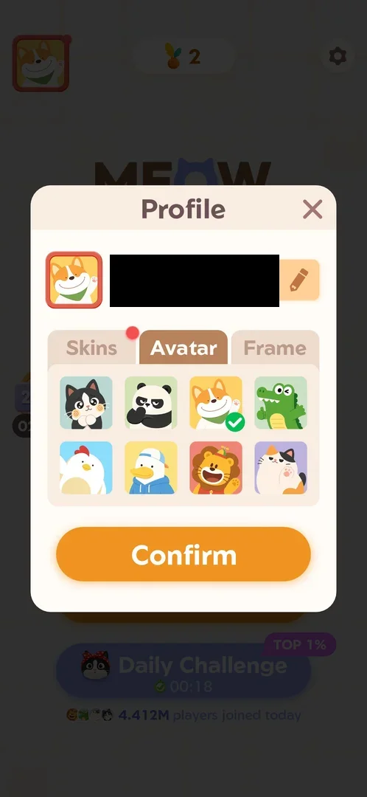
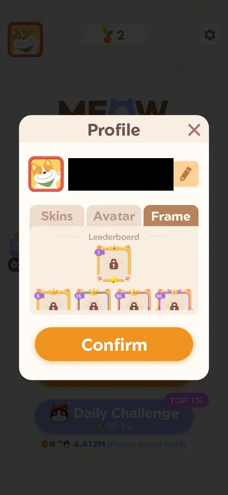
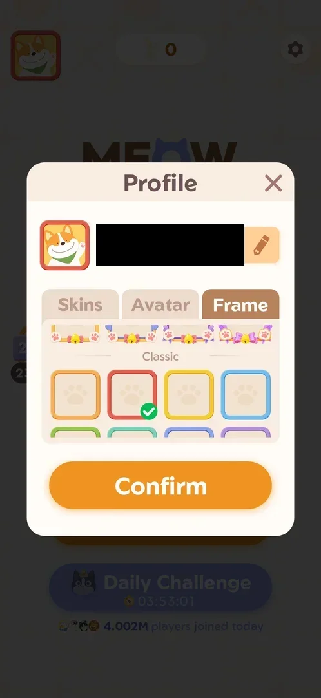

# Profile (name, avatar, frame, skins)

A popup where the player sets how they appear: the name, the avatar picture, the avatar's frame, and the
skin of the cat placed on the board. The avatar and frame chosen here are the ones shown on Home and on the
[Fish leaderboard](fish-leaderboard.md) [^s1]. Some frames are not bought or chosen freely: the Leaderboard
frames are locked until the player places on the event board [^s8].

## Why it appeared

Avatar button top-left of Home [^s1].

## Where to find it

On [Home](home.md), the avatar button top left opens the Profile popup [^s1]. On 5 October the avatar
carried a red dot, as did the Skins tab inside; after the Skins tab was opened, both dots were gone
[^s9] [^s10] [^s11]. On 6 October both dots were back, with a trial skin newly in the Skins tab, and cleared
again when that tab was opened [^s17] [^s18].
No other screen was seen to open Profile.

 [^s2]
*Home screen: the avatar button top left opens Profile*

## What it looks like

 [^s1]
*Profile: the current avatar in its frame, the name field with a pencil (blacked out: the account's name), the tabs Skins, Avatar, Frame, and Confirm*

At the top: the current avatar in its frame, and the player's name in a field with a pencil button. The
default name is a six-character code [^s1]. Below: three tabs and the orange Confirm button; a cross closes
the popup [^s5]. It opens on the Avatar tab [^s1] [^s9]. There is no
progress bar or collection counter anywhere in the popup [^s10].

## What you can do

| Tab or button | What it does |
|---|---|
| [Skins](#skins) | the cat skins: 1 owned, 7 locked; a trial skin can fill a slot for 24 hours |
| [Avatar](#avatar) | 8 avatar pictures, all selectable |
| [Frame](#frame) | the Leaderboard frames (locked) and the Classic frames (owned) |
| [Locked frame tooltip](#locked-frame-tooltip) | the condition of a Leaderboard frame, with GO: the same text on every locked frame tried |

Confirm applies the choice; the cross closes the popup and drops an unconfirmed choice
[^s11]. The pencil next to the name (to rename) and Confirm were not tapped.

### Skins

 [^s10]
*Skins tab on 5 October (the name field blacked out): the black-and-white cat owned, seven greyed silhouettes*

Eight slots: the black-and-white cat used on the board, owned, and seven cat silhouettes that are locked
[^s3] [^s10]. Tapping a locked silhouette showed nothing: no price, no condition,
on both 3 and 5 October [^s6] [^s12]. On 6 October the second slot held a trial skin from the Daily Challenge,
a bow cat with a clock and 21:37 left, and six silhouettes remained [^s18]. How they unlock is on
[Cat skins](cat-skins.md).

 [^s18]
*Skins tab on 6 October: a trial skin with its countdown in the second slot*

### Avatar

 [^s9]
*Avatar tab on 5 October (the name field blacked out): eight pictures, the corgi checked; the red dot on the Skins tab*

Eight pictures in two rows: a black-and-white cat, a panda, a corgi (selected, green check), a crocodile, a
chicken, a duck in a cap, a lion, a calico cat [^s1]. None is locked [^s1] [^s9].

### Frame

 [^s13]
*Frame tab, top of the list (the name field blacked out): the Leaderboard section, five crowned frames, all locked*

A scrolling list in two sections [^s13]:

- **Leaderboard**: five decorated frames with crowns, paws and bells, each with a padlock and a purple tag:
  1 (alone in the first row), then 5, 15, 30 and 50. All locked.
- **Classic**: plain frames in colours, all owned; the red one selected (the frame around the avatar on
  Home) [^s4]. Eight colours were counted on 3 October [^s4]; the 5 October session recorded twelve or more
  [^s11].

 [^s4]
*Frame tab on 3 October: the Classic set below the decorated frames, the red frame selected*

Tapping an owned Classic frame (yellow) moved the green check to it and showed it around the avatar at the
top of the popup; the cross then closed Profile without Confirm, and Home still showed the red frame
[^s14] [^s11].

### Locked frame tooltip

 [^s8]
*Tapping the locked frame tagged 1: a dark tooltip with its condition and an orange GO button*

Tapping the locked frame tagged 1 opened a dark tooltip over the tabs: "Get first place in the challenge to
get this frame!" and an orange GO button [^s8]. A tap on the frame tagged 5
left the same tooltip on screen [^s15]. GO closed the tooltip and stayed on the
Frame tab: it led nowhere [^s16].

 [^s19]
*6 October: the frame tagged 50 tapped, with the list scrolled to the frames tagged 5 to 50: the same tooltip as for the frame tagged 1*

On 6 October, with the tooltip dismissed between taps (a tap on the Profile title), the frames tagged 5, 30
and 50 each showed the same text as the frame tagged 1: "Get first place in the challenge to get this
frame!" with GO [^s20] [^s19] [^s21]. While a tooltip is open, a tap on another frame leaves it unchanged
(the frames tagged 15 and 50 tapped over it) [^s22]. The frame tagged 15 was not tapped with the tooltip
closed.

## How it works

- Choice of avatar and frame: all eight avatars and the Classic frames are open [^s1] [^s4]
  [^s13].
- A choice is a preview until Confirm: the check mark and the avatar at the top of the popup change, Home does
  not; closing with the cross discards it [^s11]. Inferred: Confirm applies it
  to Home and the leaderboard (Confirm was not tapped).
- Skins: one of eight owned on this account; locked skins show no condition [^s3]
  [^s12].
- Leaderboard frames: the frame tagged 1 is earned by first place "in the challenge"
  [^s8]; the frames tagged 5, 30 and 50 show the same "first place" text [^s19] [^s21]. The
  [Fish leaderboard](fish-leaderboard.md) rules name "exclusive frames" as a reward [^s7]. What the numbers
  5, 15, 30 and 50 mean is not explained on screen. That they are placement tiers (top 5, top 15 and so on)
  is not supported by the tooltips; after the leaderboard period rolled over on 6 October all five
  Leaderboard frames were still locked, and the account's final place in that period is not known [^s19].
- No collection bar, counter or completion reward [^s10].

Version 1.19.1.

## Cases

| Case | What was done | Result | Source |
|---|---|---|---|
| Profile popup: editable name, avatar, tabs Skins / Avatar / Frame, Confirm <!-- case:chk-screen --> | Opened from the avatar on Home, frame marked | ✅ | [^s1] |
| Why it appeared: the avatar button on Home <!-- case:chk-appeared --> | The avatar button on Home | ✅ | [^s1] |
| The avatar button top left of Home opens Profile; the red dot on it and on the Skins tab clears after the tab is viewed <!-- case:chk-entry --> | Avatar tapped, Skins tab opened, Home checked after closing | ✅ | [^s9] |
| No bar or counter in the profile; Skins shows 1 of 8 slots owned <!-- case:chk-progress --> | Every tab opened | ✅ | [^s10] |
| Avatars: 8, all owned (corgi selected). Skins: 1 owned, 7 locked silhouettes with no condition, a tap does nothing. Frames: Classic all owned (red selected); Leaderboard 5 locked crowned frames tagged 1, 5, 15, 30, 50 <!-- case:chk-items --> | Every tab opened, the Frame list scrolled | ✅ | [^s8] |
| The locked frame tagged 1: "Get first place in the challenge to get this frame!" with GO; GO only closed the tooltip; the skins' condition is not shown <!-- case:chk-earn --> | Locked frames and a locked skin tapped, GO tapped | ✅ | [^s16] |
| An owned frame tapped: the check moves and the avatar at the top previews it; closing with the cross discards it (Home kept the red frame) <!-- case:chk-use --> | Yellow Classic frame tapped, Profile closed with the cross | ✅ | [^s11] |
| Completing a set: does not apply, no set or bar; avatars and Classic frames all owned, no completion reward <!-- case:chk-complete --> | Every tab opened | ✅ | [^s13] |

## Not verified

- Confirm: whether it applies the avatar and frame to Home and the leaderboard at once; renaming with the pencil
- The Leaderboard frames tagged 5, 15, 30 and 50: what the number means (each tooltip tried says first place), and whether any is given at the end of a period (exp-frame-rank-tiers was inconclusive: all still locked after the 6 October rollover); the frame tagged 15's own tooltip
- Which challenge "first place in the challenge" means (the fish leaderboard is inferred) and when the frame is given
- The unlock condition of each locked skin (see [Cat skins](cat-skins.md))

[^s1]: session 20261003-200440-chrono-2FYKPJ, step 7 — [video at 1:41](https://youtu.be/Pqx4QY-FpBA?t=101)
[^s2]: session 20261003-200440-chrono-2FYKPJ, step 4 — [video at 1:15](https://youtu.be/Pqx4QY-FpBA?t=75)
[^s3]: session 20261003-200440-chrono-2FYKPJ, step 8 — [video at 1:49](https://youtu.be/Pqx4QY-FpBA?t=109)
[^s4]: session 20261003-200440-chrono-2FYKPJ, step 10 — [video at 2:04](https://youtu.be/Pqx4QY-FpBA?t=124)

[^s5]: session 20261003-200440-chrono-2FYKPJ, step 11 — [video at 2:13](https://youtu.be/Pqx4QY-FpBA?t=133)
[^s6]: session 20261003-200440-chrono-2FYKPJ, step 9 — [video at 1:57](https://youtu.be/Pqx4QY-FpBA?t=117)
[^s7]: session 20261003-200440-chrono-2FYKPJ, step 13 — [video at 2:26](https://youtu.be/Pqx4QY-FpBA?t=146)

[^s8]: session 20261005-223641-chrono-2FYKPJ, step 17 — [video at 2:59](https://youtu.be/VXzhl0TX66c?t=179)
[^s9]: session 20261005-223641-chrono-2FYKPJ, step 12 — [video at 2:19](https://youtu.be/VXzhl0TX66c?t=139)
[^s10]: session 20261005-223641-chrono-2FYKPJ, step 13 — [video at 2:27](https://youtu.be/VXzhl0TX66c?t=147)
[^s11]: session 20261005-223641-chrono-2FYKPJ, step 21 — [video at 3:43](https://youtu.be/VXzhl0TX66c?t=223)
[^s12]: session 20261005-223641-chrono-2FYKPJ, step 14 — [video at 2:38](https://youtu.be/VXzhl0TX66c?t=158)
[^s13]: session 20261005-223641-chrono-2FYKPJ, step 16 — [video at 2:52](https://youtu.be/VXzhl0TX66c?t=172)
[^s14]: session 20261005-223641-chrono-2FYKPJ, step 20 — [video at 3:27](https://youtu.be/VXzhl0TX66c?t=207)
[^s15]: session 20261005-223641-chrono-2FYKPJ, step 18 — [video at 3:04](https://youtu.be/VXzhl0TX66c?t=184)
[^s16]: session 20261005-223641-chrono-2FYKPJ, step 19 — [video at 3:15](https://youtu.be/VXzhl0TX66c?t=195)

[^s17]: session 20261006-044214-chrono-2FYKPJ, step 1 — [video at 0:23](https://youtu.be/0Is_yCgpg5I?t=23)
[^s18]: session 20261006-044214-chrono-2FYKPJ, step 13 — [video at 2:18](https://youtu.be/0Is_yCgpg5I?t=138)
[^s19]: session 20261006-044214-chrono-2FYKPJ, step 9 — [video at 1:40](https://youtu.be/0Is_yCgpg5I?t=100)
[^s20]: session 20261006-044214-chrono-2FYKPJ, step 4 — [video at 0:49](https://youtu.be/0Is_yCgpg5I?t=49)
[^s21]: session 20261006-044214-chrono-2FYKPJ, step 11 — [video at 1:58](https://youtu.be/0Is_yCgpg5I?t=118)
[^s22]: session 20261006-044214-chrono-2FYKPJ, step 7 — [video at 1:27](https://youtu.be/0Is_yCgpg5I?t=87)
