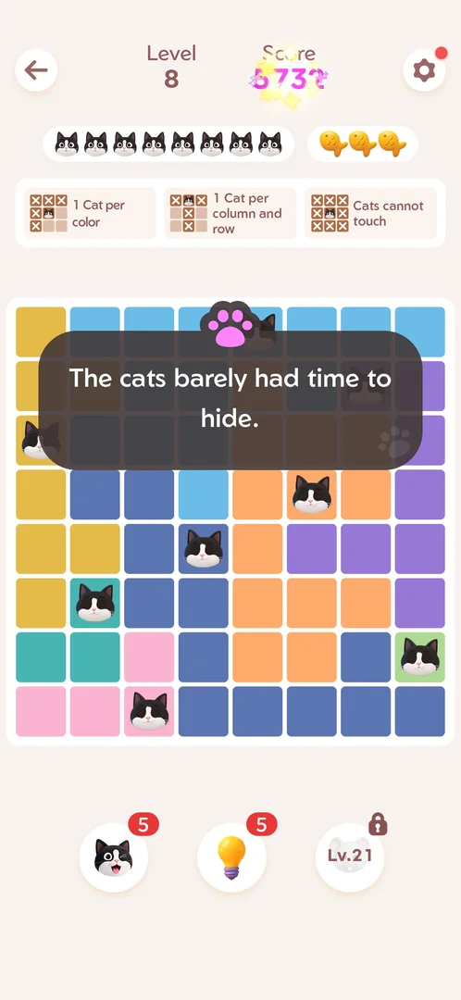
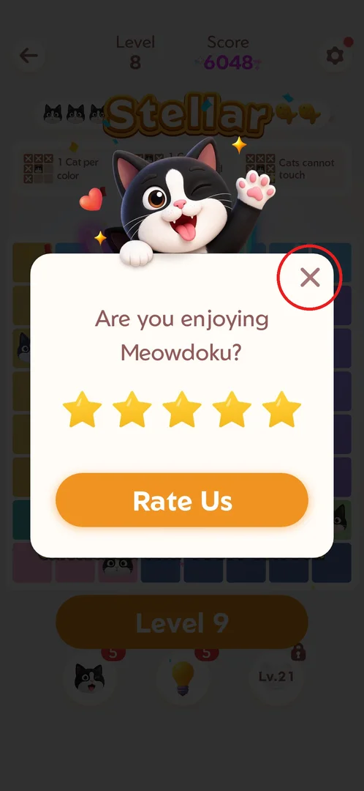
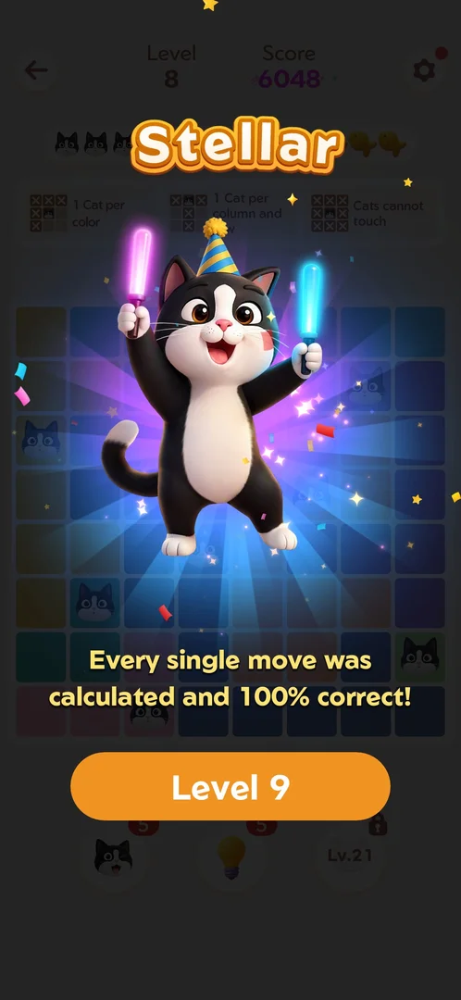

# Rate Us popup

A one-time popup that asks the player to rate the game. No button opens it: it came up by itself
right after the level 8 win, and closing it led back to that win screen [^s1] [^s2].

## Where to find it

It showed up during the level 8 win: once the last cat was placed on the board, the popup covered
the win screen a moment later [^s1]. It was shown only once in the session: it did not come back on
any later win, up to level 43 [^s1] [^s2].

 [^s1]

## What it looks like

A white card over the dimmed level 8 win screen (rating "Stellar"), with the waving tuxedo cat on
top. It asks "Are you enjoying Meowdoku?" and shows five yellow stars (all lit), an orange
**Rate Us** button and a close **X** in the top-right corner [^s1].

 [^s1]

## What you can do

| Tab or button | What it does |
|---|---|
| [Close (X)](#close-x) | Closes the popup without rating [^s2] |
| [After closing](#after-closing) | The level 8 win screen, with the Level 9 button [^s2] |

The five stars and the **Rate Us** button were not tried (see [Not verified](#not-verified)).

### Close (X)

The X in the top-right corner of the card. Tapping it closed the popup; nothing else opened (no
store page, no feedback form) [^s2].

 [^s1]

### After closing

The level 8 win screen comes back: "Stellar", the cat with glow sticks, "Every single move was
calculated and 100% correct!" and the **Level 9** button to go on [^s2].

 [^s2]

## How it works

- v1.18.0: shown once, after the level 8 win; after it was closed with X it did not appear again
  through level 43 [^s1] [^s2].
- No reward was offered for rating [^s1].

## Cases

| Case | What was done | Result | Source |
|---|---|---|---|
| Appear | Won level 8 | The popup once; closed with X; not again through level 43 | [^s1] [^s2] |
| Pick fewer stars: feedback form vs store | — | not verified | |

## Not verified

- Low and high stars, and what **Rate Us** opens (store page or in-game feedback form): needs the
  popup again, probably a fresh install.
- Whether the popup comes back after a later milestone when it was closed with X.

[^s1]: session 20260930-233055-chrono-2FYKPJ, step 38 — [video at 10:07](https://youtu.be/kfHedtB_k4Q?t=607)
[^s2]: session 20260930-233055-chrono-2FYKPJ, step 39 — [video at 10:26](https://youtu.be/kfHedtB_k4Q?t=626)
