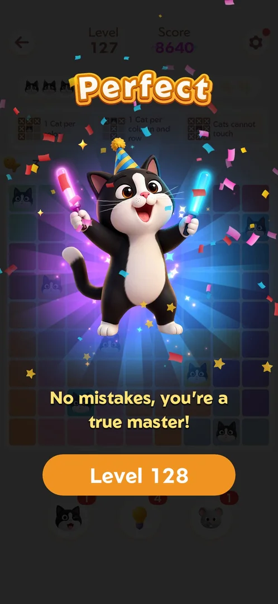
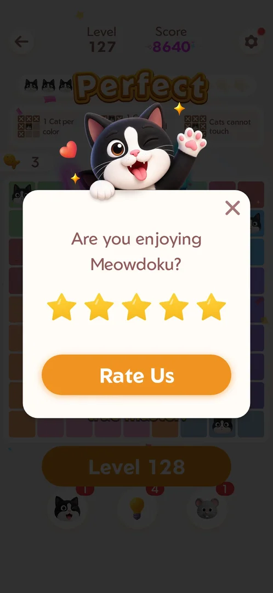

# Rate Us popup

A popup that asks the player to rate the game. It came up once, over the win screen of a
[main level](level.md), with five stars, a Rate Us button and a close cross [^s1].

## Why it appeared

After winning Level 127, on the tap of the win screen's Level 128 button [^s2] [^s1]. It was the first win
seen on this account; inferred: it is tied to a win count or the first win of a session, not verified.

## Where to find it

It is not opened by the player. On the win screen of Level 127, the orange Level 128 button brought it up
over the win screen instead of opening the next level [^s2] [^s1].

 [^s2]
*The win screen of Level 127 ("Perfect"): the orange Level 128 button under the dancing cat brought up the popup*

## What it looks like

 [^s1]
*The popup over the dimmed win screen: a waving cat on top, "Are you enjoying Meowdoku?", five gold stars, Rate Us, the cross top right*

A white card over the dimmed win screen, with a waving cat peeking over its top edge [^s1]:

- "Are you enjoying Meowdoku?"
- A row of five stars, all gold.
- The orange Rate Us button.
- A close cross, top right.

## What you can do

| Tab or button | What it does |
|---|---|
| [Close cross](#close-cross) | Closes the popup back to the win screen |
| [Rate Us](#rate-us) | Not tapped |

### Close cross

<!-- no-frame: the win screen it returns to is the entry frame above -->

The cross closed the popup and left the win screen of Level 127 with its Level 128 button; the next tap on
that button started Level 128 (after an [interstitial ad](ad-interstitial.md)) [^s7] [^s4].

### Rate Us

<!-- no-frame: not tapped -->

Not tapped: whether it opens the Play Store review sheet or the store page, and whether the stars change
anything before it, is not verified.

## How it works

- Shown once in three wins seen: after Level 127, not after Level 128 (the session ended on Home) nor after
  Level 129 (the Level 130 button went straight to an interstitial) [^s1] [^s5] [^s6].
- Closing it with the cross did not bring it back in the next two wins [^s5] [^s6].
- Inferred: the five stars are preset gold; tapping one was not tried.

Version 1.19.1.

## Cases

| Case | What was done | Result | Source |
|---|---|---|---|
| "Are you enjoying Meowdoku?" with 5 stars, Rate Us button, a close cross top right <!-- case:chk-screen --> | Level 128 tapped on the Level 127 win screen; frame marked | ✅ | [^s1] |
| Why it appeared: the trigger that brought it up (the first launch, a level won, a threshold, a timer, a loss): a fact with its frame, or a hypothesis to test <!-- case:chk-appeared --> | After the Level 127 win, on the next-level tap | ✅ | [^s1] |
| Where to find it: the screen and the button that open it <!-- case:chk-entry --> | Came up by itself once; no way to open it by hand found | not verified | [^s2] |
| Every option or button and what it changes <!-- case:chk-options --> | Only the cross tapped | not verified | [^s7] |
| For a prompt: what each answer does and whether it comes back <!-- case:chk-answers --> | Cross: back to the win screen, not shown after the next two wins | not verified | [^s7] [^s6] |
| Links out: where they lead <!-- case:chk-links --> | Rate Us not tapped | not verified |  |

## Not verified

- Where to find it: what triggers it (a win count, the first win of a session, a day) and whether Settings has a rating entry <!-- case:chk-entry -->
- Every option: what tapping a star does, and what Rate Us does <!-- case:chk-options -->
- What each answer does: whether a low rating leads elsewhere than a high one, and when the popup comes back after the cross <!-- case:chk-answers -->
- Links out: where Rate Us leads (Play Store review sheet or store page) <!-- case:chk-links -->

[^s1]: session 20261003-201915-chrono-2FYKPJ, step 8 — [video at 2:45](https://youtu.be/ffhYgQE4LvU?t=165)
[^s2]: session 20261003-201915-chrono-2FYKPJ, step 7 — [video at 2:27](https://youtu.be/ffhYgQE4LvU?t=147)
[^s4]: session 20261003-201915-chrono-2FYKPJ, step 10 — [video at 3:16](https://youtu.be/ffhYgQE4LvU?t=196)
[^s5]: session 20261003-201915-chrono-2FYKPJ, step 18 — [video at 5:47](https://youtu.be/ffhYgQE4LvU?t=347)
[^s6]: session 20261003-202631-chrono-2FYKPJ, step 7 — [video at 1:41](https://youtu.be/3-USmjAyOV8?t=101)

[^s7]: session 20261003-201915-chrono-2FYKPJ, step 9 — [video at 3:02](https://youtu.be/ffhYgQE4LvU?t=182)
