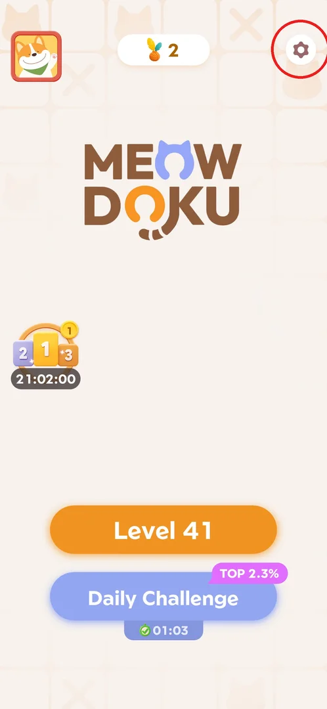
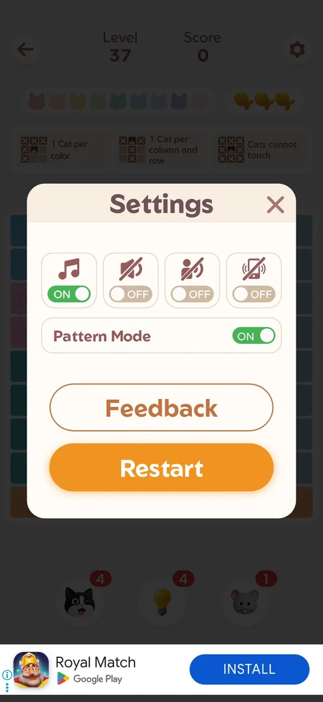
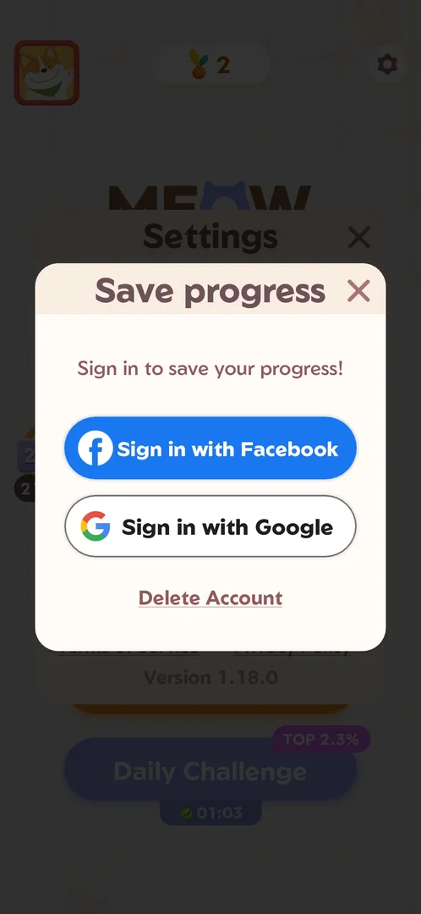
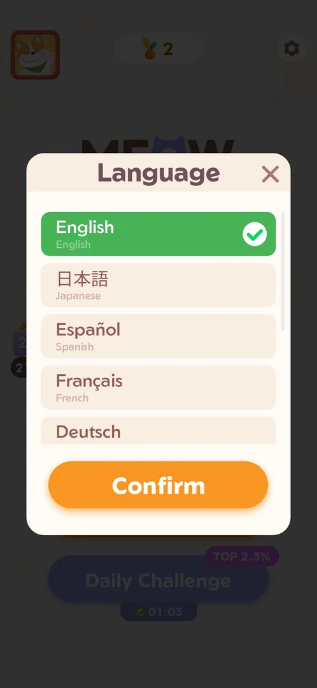
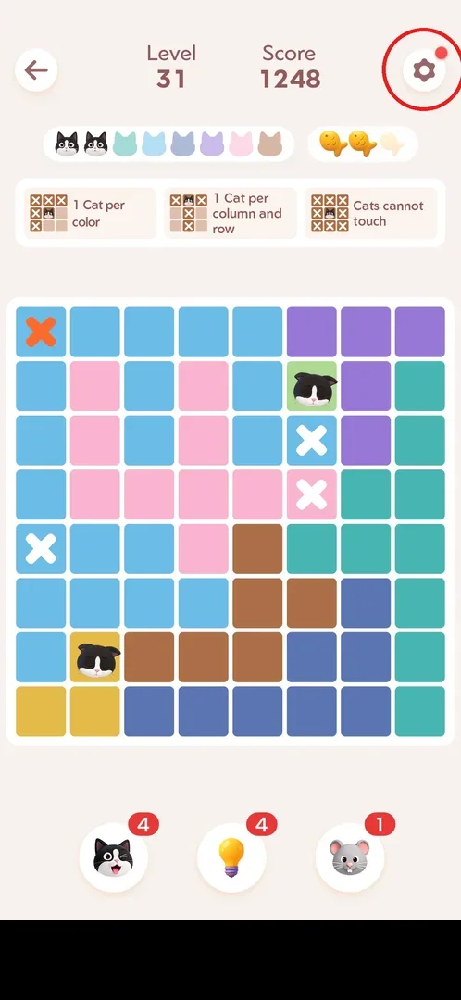
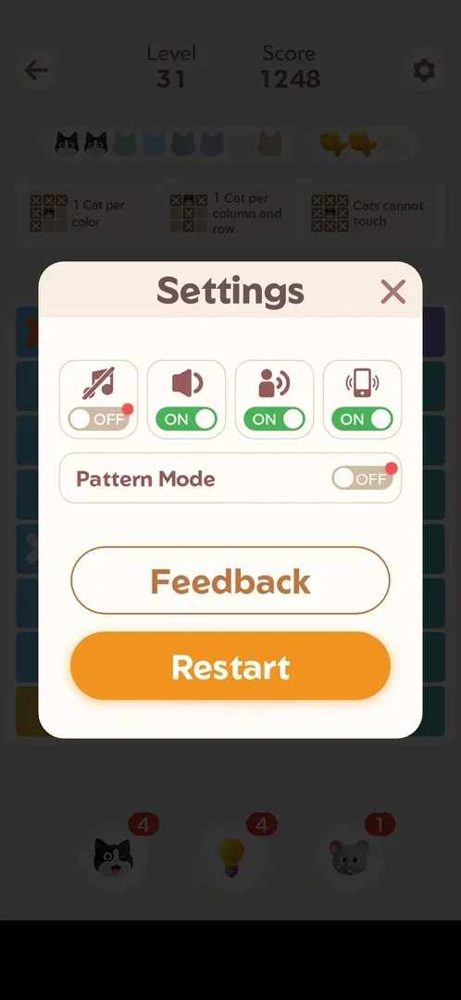
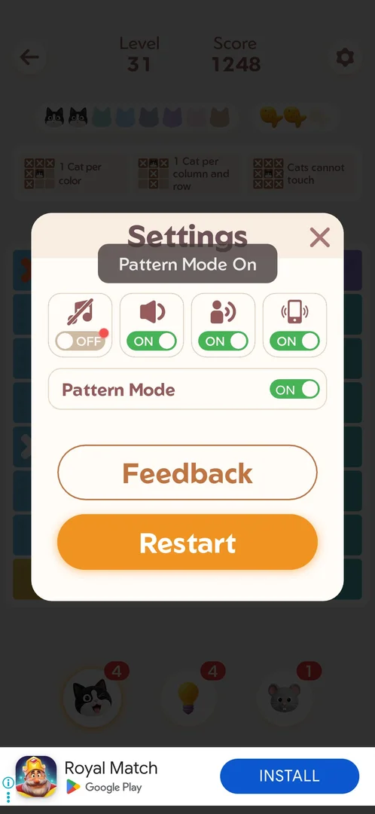
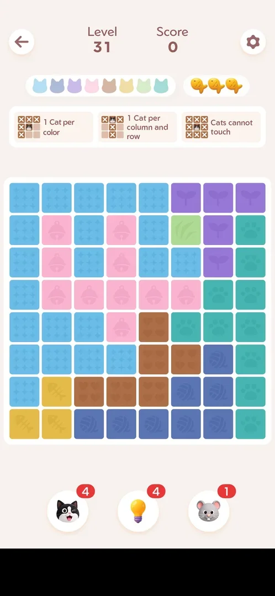

# Settings

Settings is a small popup behind the gear icon. It switches music, sound, voice and vibration on or off.
Opened from Home, it also leads to saving progress with an account, the language choice, the support
centre and the legal links. Opened from a level, it has Pattern Mode (an icon on every colour region)
and Restart for the current level instead [^s2] [^s4].

## Where to find it

The gear at the top right of Home opens the Home version of the
popup [^s2].

 [^s1]

The same gear is at the same place in every level. It opens the in-level version (see [Settings in a level](#settings-in-a-level)) [^s4].

## What it looks like

A cream popup titled "Settings" with a close X at the top right. At the top is a row of four toggles:
music, sound, voice and vibration. On version 1.18.0, music is OFF and the other three are ON by default.
Below the toggles are "Save your progress" (with an arrow), the outlined buttons Language and Feedback,
the links Terms of Service and Privacy Policy, and "Version 1.18.0". The Home version has no Pattern Mode
and no Restart [^s2].

 [^s2]

## What you can do

| Tab or button | What it does |
|---|---|
| [Toggles](#toggles) | Music, sound, voice and vibration switch ON/OFF at once (Home and level) |
| [Save your progress](#save-your-progress) | Home only: sign in with Facebook or Google, or delete the account |
| [Language](#language) | Home only: pick the game language and confirm |
| [Feedback](#feedback) | Opens the in-app support centre "Meowdoku Support" (Home and level) |
| [Gear in a level](#gear-in-a-level) | The gear inside a level opens the in-level popup |
| [Settings in a level](#settings-in-a-level) | The level version: the toggles, Pattern Mode, Feedback and Restart |
| [Pattern Mode](#pattern-mode) | Level only: draws an icon on every colour region |
| [Restart](#restart) | Level only: an interstitial ad, then the level starts over |

### Toggles

There are four toggles: music (a note), sound (a speaker), voice (a speaking person) and vibration (a
phone). Each one switches ON/OFF as soon as it is tapped, and when it is OFF its icon is crossed out
[^s7] [^s12]. Music is OFF by default and has a red dot. The dot goes away after the first toggle [^s12].
Screenshots cannot show whether the sound or vibration actually changed [^s12].

 [^s7]

### Save your progress

"Save your progress" opens a "Save progress" popup ("Sign in to save your progress!") with "Sign in with
Facebook", "Sign in with Google" and a "Delete Account" link. None of them was tried [^s10].

 [^s10]

### Language

Language opens a list. English was selected (green, with a check mark). Below it are
Japanese, Spanish, French, Deutsch and more further down, plus a Confirm button. The player closed it
without changing the language [^s9].

 [^s9]

### Feedback

Feedback opens "Meowdoku Support", an in-app page powered by Helpshift. It has an article search and the tabs
Popular articles, Get Started, General, Account and Settings. Among the articles are How do I play Meowdoku?,
How do I close an ad?, What's the point of the Streak?, How do I place a cat vs. mark an X?, What is the
Daily Challenge? and How do I delete my account data?. At the bottom is a "Chat with us" button. No message
was sent [^s8] [^s13].

 [^s8]

### Gear in a level

Every level has the same gear at its top right. It carries a red dot while something inside is new
(Pattern Mode and the music toggle had dots) [^s3] [^s4].

 [^s3]

### Settings in a level

The level version has the same four toggles, then a Pattern Mode switch, Feedback, and an orange Restart
button. It has no Language, no Save your progress and no legal links [^s4].

 [^s4]

### Pattern Mode

When Pattern Mode is switched ON, a toast says "Pattern Mode On" [^s5]. After that, every colour region
of the board shows its own icon (stars, bells, paws, hearts, yarn, fish bones, sprouts, grass), and the
colours stay [^s11] [^s14]. This is probably meant for colour-blind players (inferred). With Pattern Mode ON the 9×9 level 37 was
played and won as usual [^s14].

 [^s5]

 [^s11]

### Restart

Restart first shows an interstitial video ad with a "Next" button at the top left [^s6]. Then the level
starts over: the board is reset, there are 3 fish and the score is 0. Boosters spent in the level are not
refunded (the counters stayed 4/4/1) [^s11]. See [Ads](ads.md).

 [^s6]

## How it works

- Version 1.18.0. The Home popup has the four toggles, Save your progress, Language, Feedback, Terms of
  Service, Privacy Policy and the version line [^s2].
- The in-level popup has the four toggles, Pattern Mode, Feedback and Restart [^s4].
- Defaults: music OFF; sound, voice and vibration ON; Pattern Mode OFF [^s4] [^s12].
- The red dot on a new option disappears after the first toggle [^s12].
- Restart costs an interstitial ad and does not refund spent boosters [^s6] [^s11].

## Cases

| Case | What was done | Result | Source |
|---|---|---|---|
| Open | The gear on Home and in a level | The Home and level versions as above | [^s2] [^s4] |
| Toggles | All four toggles flipped, then restored | They flip at once; the music dot goes away | [^s12] |
| Pattern Mode | Switched ON in level 31 | Toast "Pattern Mode On"; an icon on every region | [^s5] [^s11] |
| Playing with Pattern Mode | Level 37 (9×9) with Pattern Mode ON | Won as usual; the icons do not change the rules | [^s14] |
| Restart | In-level Restart | Interstitial, then a reset board, 3 fish and score 0; boosters not refunded | [^s11] |
| Feedback | Opened from the level popup | The Helpshift "Meowdoku Support" page; nothing sent | [^s13] |
| Language | Opened from Home, closed | The list of languages; nothing changed | [^s9] |
| Save your progress | Opened from Home, closed | Facebook / Google sign-in, Delete Account; not used | [^s10] |

## Not verified

- What the Terms of Service and Privacy Policy links open.
- Whether the sound, voice and vibration toggles really change the audio and vibration (screenshots cannot
  show it).
- Whether Feedback in the Home popup opens the same page as in a level.

[^s1]: session 20261001-022624-chrono-2FYKPJ, step 66
[^s2]: session 20261001-022624-chrono-2FYKPJ, step 67
[^s3]: session 20261001-013526-chrono-2FYKPJ, step 81 — [video at 16:34](https://youtu.be/T86pLfervRE?t=994)
[^s4]: session 20261001-013526-chrono-2FYKPJ, step 82 — [video at 16:46](https://youtu.be/T86pLfervRE?t=1006)
[^s5]: session 20261001-013526-chrono-2FYKPJ, step 83 — [video at 16:57](https://youtu.be/T86pLfervRE?t=1017)
[^s6]: session 20261001-013526-chrono-2FYKPJ, step 84 — [video at 17:03](https://youtu.be/T86pLfervRE?t=1023)
[^s7]: session 20261001-022624-chrono-2FYKPJ, step 21
[^s8]: session 20261001-022624-chrono-2FYKPJ, step 23
[^s9]: session 20261001-022624-chrono-2FYKPJ, step 68
[^s10]: session 20261001-022624-chrono-2FYKPJ, step 70
[^s11]: session 20261001-013526-chrono-2FYKPJ, step 85 — [video at 17:28](https://youtu.be/T86pLfervRE?t=1048)
[^s12]: session 20261001-022624-chrono-2FYKPJ, step 30
[^s13]: session 20261001-022624-chrono-2FYKPJ, step 27
[^s14]: session 20261001-022624-chrono-2FYKPJ, step 35
