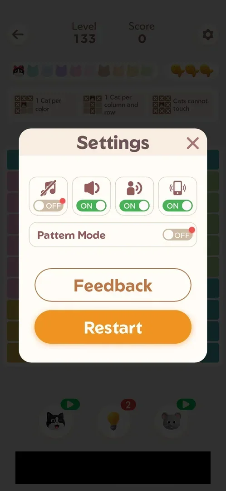
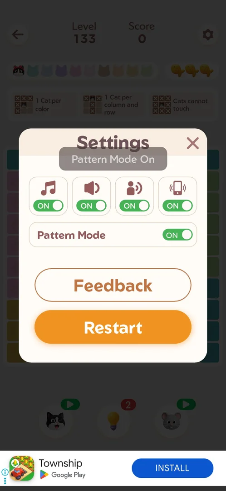
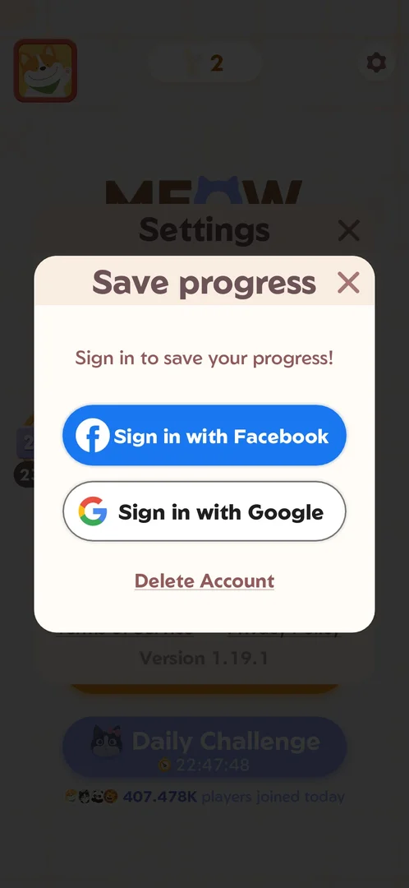
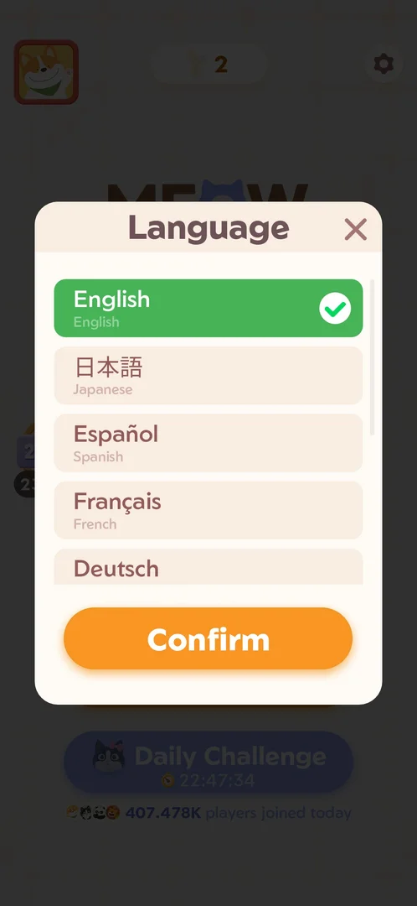
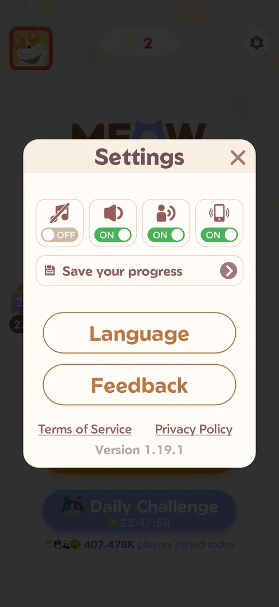

# Settings

A popup with the game's options. Opened from Home, it holds four audio and vibration toggles, a "Save your
progress" row, the Language and Feedback buttons, links to the Terms of Service and the Privacy Policy, and
the version number [^s1]. Opened from a level, it holds the same four toggles, a Pattern Mode toggle, Feedback
and Restart [^s3].

## Why it appeared

Gear icon on Home, top right, red dot [^s1].

## Where to find it

On [Home](home.md), the gear icon top right (it carried a red dot on a fresh install) opens Settings [^s1]
[^s12]. On the level screen the gear icon top right opens the in-level variant
of Settings [^s3].

 [^s2]
*Home screen: the gear icon top right (with a red dot) opens Settings*

## What it looks like

 [^s1]
*Settings from Home: four toggles (music off with a red dot), Save your progress, Language, Feedback, the two links and the version*

What is on the popup opened from Home, top to bottom [^s1]:

- Four toggles: music (a note; crossed out when off), sound (a speaker), voice (a speaking person),
  vibration (a vibrating phone). On a fresh install music was OFF with a red dot, the other three ON.
- "Save your progress", a row with an arrow.
- Two buttons: Language, Feedback.
- Two links: Terms of Service, Privacy Policy.
- "Version 1.19.1" at the bottom.
- The cross top right closes the popup and returns to Home [^s4].

The popup opened from a level is described under [Settings in a level](#settings-in-a-level).

## What you can do

| Tab or button | What it does |
|---|---|
| [Sound toggles](#sound-toggles) | Music, sound, voice, vibration: each switches ON/OFF; all four were switched and set back [^s8] |
| [Settings in a level](#settings-in-a-level) | The in-level variant: the four toggles, Pattern Mode, Feedback, Restart [^s3] |
| [Pattern Mode](#pattern-mode) | In-level toggle; switching it on shows the toast "Pattern Mode On" [^s6] |
| [Feedback](#feedback) | Opens the "Meowdoku Support" help center [^s5] |
| [Save your progress](#save-your-progress) | Opens the "Save progress" popup: sign in with Facebook or Google, Delete Account [^s7] |
| [Language](#language) | Opens the language list with a Confirm button [^s9] |
| [Terms of Service and Privacy Policy](#terms-of-service-and-privacy-policy) | Each opens the web page in Chrome on oakevergames.com [^s10] [^s13] |

### Settings in a level

 [^s3]
*Settings opened from the gear on the level screen (level 133): no Save your progress, Language or links; Pattern Mode and Restart instead*

The gear top right of the level screen opens a shorter Settings popup [^s3]:

- The same four toggles (music OFF with a red dot; sound, voice, vibration ON).
- A "Pattern Mode" row with its toggle, OFF with a red dot.
- Two buttons: Feedback, Restart (orange). Restart was not tapped.
- No Save your progress row, no Language button, no Terms of Service or Privacy Policy links, no version.

The cross top right closes it and returns to the level [^s14].

### Pattern Mode

 [^s6]
*After tapping the music toggle and the Pattern Mode toggle: both ON, the toast "Pattern Mode On" over the title, the red dots gone*

Tapping the Pattern Mode toggle switches it ON and shows a grey toast "Pattern Mode On" under the title [^s6].
The red dots on the music and Pattern Mode toggles disappeared once they were tapped [^s6]. Pattern Mode was
set back to OFF [^s8]. What Pattern Mode changes on the board was not seen: the board stayed behind the popup.

### Feedback

 [^s5]
*Feedback opens "Meowdoku Support" (powered by Helpshift)*

Feedback opens a help center titled "Meowdoku Support", powered by Helpshift [^s5]:

- A search field "Search for articles"; search and chat icons top right.
- Tabs: Popular articles, Get Started, General, Account, Settings. The Settings tab was tapped
  [^s15].
- Popular articles: six questions (how to play, how to close an ad, the Streak, placing a cat vs. marking an X,
  the Daily Challenge, deleting account data).
- "Need more help?" with a "Chat with us" button (not tapped).

The cross top left closes the help center and returns to Settings [^s16].

### Save your progress

 [^s7]
*"Save progress" over Settings: "Sign in to save your progress!", the two sign-in buttons and the Delete Account link*

The "Save your progress" row opens a "Save progress" popup over Settings [^s7]: the line "Sign in to save
your progress!", "Sign in with Facebook", "Sign in with Google" and a "Delete Account" link. None of them was
tapped. The cross closes it back to Settings [^s11].

### Language

 [^s9]
*Language: English (checked, green) at the top of a scrolling list, Confirm under it*

The Language button opens a scrolling list; each row gives the language's own name and its English name [^s9].
The list seen in 1.19.1: English (checked), Japanese, Spanish, French, German, Russian, Portuguese, Korean,
Turkish [^s9] [^s17]. The orange Confirm button is under the list; no other
language was confirmed. The cross closes the list back to Settings [^s18].

### Sound toggles

 [^s12]
*Settings from Home on 6 October: the four toggles as found (music OFF, the others ON), the red dots gone*

Four toggles in a row at the top of both variants of Settings: music (a note, crossed out when OFF), sound (a
speaker), voice (a speaking person), vibration (a vibrating phone) [^s1] [^s3]. Each tap switches a toggle
between a grey OFF and a green ON [^s6]. Music was switched OFF→ON→OFF, sound, voice and vibration OFF and back
ON; all were left as found [^s8]. Their effect on the game's audio was not checked (no sound is recorded).

### Terms of Service and Privacy Policy

<!-- no-frame: the links open another app (Chrome) -->

Two links under the buttons of Settings opened from Home [^s1]. Each opened its page in Chrome on
oakevergames.com, outside the game [^s10] [^s13]; the frames are not shown (another app). Launching the game
again returned to Home with Settings still open [^s19].

## How it works

- Music was OFF on a fresh install and its toggle carried a red dot, as did the gear on Home [^s1]. In a
  level, the Pattern Mode toggle carried a red dot too [^s3]. Both dots disappeared once the toggles were
  tapped [^s6], and on Home the gear and the music toggle no longer had them
  [^s12]. Inferred: a red dot marks an option not yet touched.
- Every toggle was switched and set back to its first state; music stays OFF [^s8].
- The Terms of Service and Privacy Policy links leave the game for Chrome; on returning to the game,
  Settings is still open [^s10] [^s19].
- Settings is not a prompt: it asks nothing, and the cross only closes it [^s4] [^s11].

Version 1.19.1.

## Cases

| Case | What was done | Result | Source |
|---|---|---|---|
| Settings popup: music/sound/voice/vibration toggles, Save your progress, Language, Feedback, Terms of Service, Privacy Policy, version 1.19.1 <!-- case:chk-screen --> | Opened from the gear on Home, frame marked | ✅ | [^s1] |
| Why it appeared: the gear on Home, top right, with a red dot <!-- case:chk-appeared --> | Gear on Home seen and tapped | ✅ | [^s1] |
| Where to find it: the gear top right on Home and on the level screen <!-- case:chk-entry --> | Gear tapped on the level screen and on Home; the in-level variant has Pattern Mode and Restart instead of Save your progress, Language and the links | ✅ | [^s3] |
| Every option and what it changes <!-- case:chk-options --> | Music OFF→ON→OFF, Pattern Mode OFF→ON (toast "Pattern Mode On")→OFF, sound, voice and vibration off and on; Feedback, Save your progress and Language opened | ✅ All toggles respond and were restored; Feedback opens the Helpshift help center; Save your progress opens Facebook/Google sign-in and Delete Account (not tapped); Language lists the languages with Confirm; Restart not tapped | [^s8] |
| Settings is not a prompt <!-- case:chk-answers --> | Closed with the cross | ✅ Nothing to answer; the cross only closes it | [^s11] |
| Links out: Terms of Service and Privacy Policy <!-- case:chk-links --> | Each link tapped, then the game launched again | ✅ Each opens Chrome on oakevergames.com; back in the game Settings is still open | [^s10] |

## Not verified

- What Pattern Mode changes on the board.
- What Restart does from in-level Settings.
- Sign in with Facebook or Google, Delete Account, Chat with us, and confirming another language: not tapped.
- Whether the language list goes on past Turkish (the player's record says 10 languages; 9 were seen in the frames).

[^s1]: session 20261003-200440-chrono-2FYKPJ, step 5 — [video at 1:23](https://youtu.be/Pqx4QY-FpBA?t=83)
[^s2]: session 20261003-200440-chrono-2FYKPJ, step 4 — [video at 1:12](https://youtu.be/Pqx4QY-FpBA?t=72)
[^s3]: session 20261006-010939-chrono-2FYKPJ, step 2 — [video at 0:47](https://youtu.be/hWdnTswKtkU?t=47)
[^s4]: session 20261003-200440-chrono-2FYKPJ, step 6 — [video at 1:37](https://youtu.be/Pqx4QY-FpBA?t=97)
[^s5]: session 20261006-010939-chrono-2FYKPJ, step 6 — [video at 1:23](https://youtu.be/hWdnTswKtkU?t=83)
[^s6]: session 20261006-010939-chrono-2FYKPJ, step 4 — [video at 1:00](https://youtu.be/hWdnTswKtkU?t=60)
[^s7]: session 20261006-010939-chrono-2FYKPJ, step 12 — [video at 2:22](https://youtu.be/hWdnTswKtkU?t=142)
[^s8]: session 20261006-010939-chrono-2FYKPJ, step 5 — [video at 1:14](https://youtu.be/hWdnTswKtkU?t=74)
[^s9]: session 20261006-010939-chrono-2FYKPJ, step 14 — [video at 2:36](https://youtu.be/hWdnTswKtkU?t=156)
[^s11]: session 20261006-010939-chrono-2FYKPJ, step 13 — [video at 2:31](https://youtu.be/hWdnTswKtkU?t=151)
[^s10]: session 20261006-010939-chrono-2FYKPJ, step 17 — [video at 2:57](https://youtu.be/hWdnTswKtkU?t=177)

[^s12]: session 20261006-010939-chrono-2FYKPJ, step 11 — [video at 2:13](https://youtu.be/hWdnTswKtkU?t=133)
[^s13]: session 20261006-010939-chrono-2FYKPJ, step 19 — [video at 3:08](https://youtu.be/hWdnTswKtkU?t=188)
[^s14]: session 20261006-010939-chrono-2FYKPJ, step 9 — [video at 1:58](https://youtu.be/hWdnTswKtkU?t=118)
[^s15]: session 20261006-010939-chrono-2FYKPJ, step 7 — [video at 1:44](https://youtu.be/hWdnTswKtkU?t=104)
[^s16]: session 20261006-010939-chrono-2FYKPJ, step 8 — [video at 1:49](https://youtu.be/hWdnTswKtkU?t=109)
[^s17]: session 20261006-010939-chrono-2FYKPJ, step 15 — [video at 2:44](https://youtu.be/hWdnTswKtkU?t=164)
[^s18]: session 20261006-010939-chrono-2FYKPJ, step 16 — [video at 2:53](https://youtu.be/hWdnTswKtkU?t=173)
[^s19]: session 20261006-010939-chrono-2FYKPJ, step 20 — [video at 3:18](https://youtu.be/hWdnTswKtkU?t=198)
