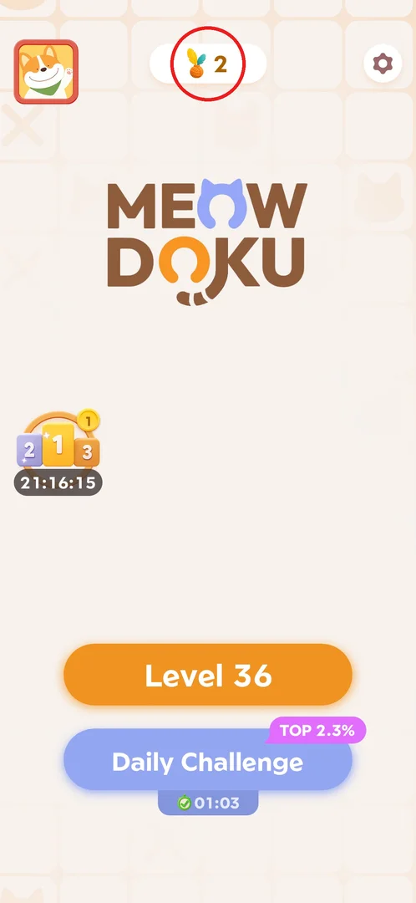
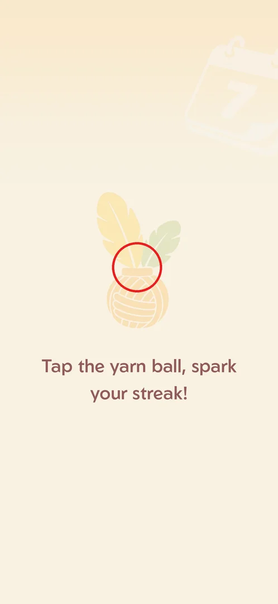
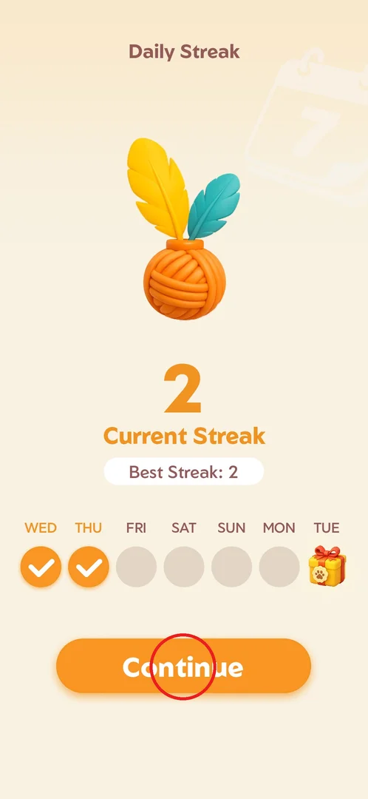
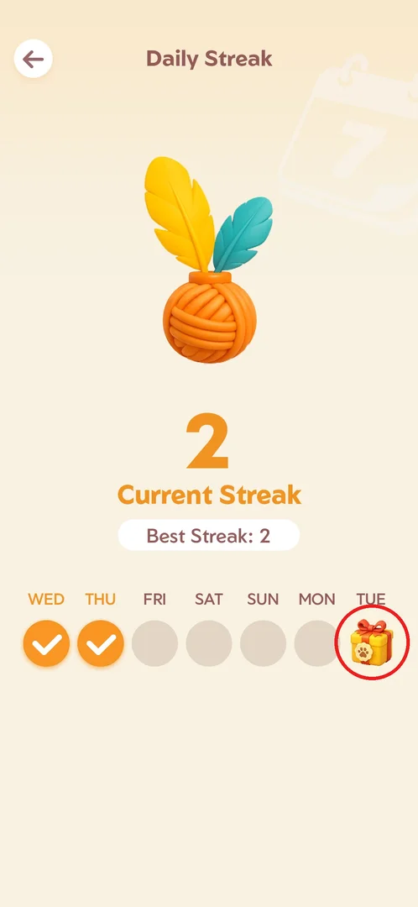
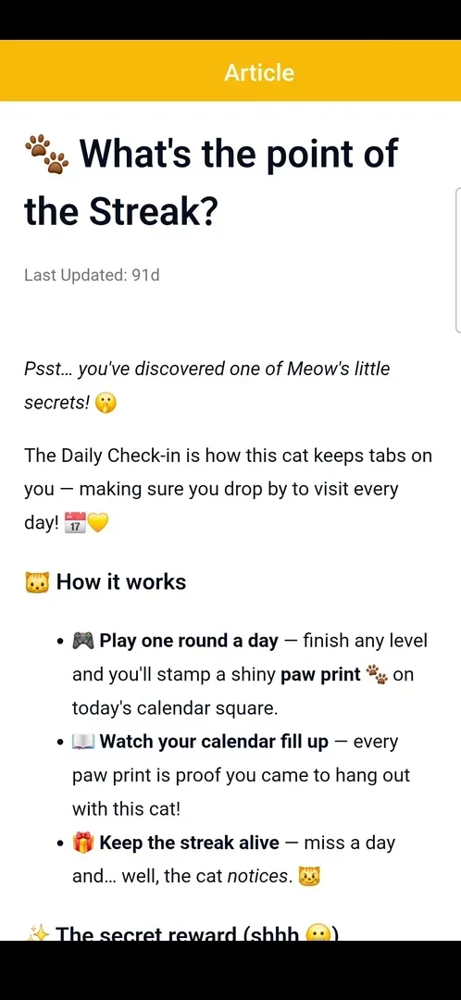

# Daily streak (yarn ball)

The daily streak counts the days in a row on which the player wins at least one level. The first win
of each day stamps that day on a seven-day calendar row and raises "Current Streak"; the best run so
far is kept as "Best Streak", and the seventh day of the row holds a gift box [^s4] [^s5]. The game's
support article describes the gift as a "mysterious reward" for seven days in a row [^s9].

## Where to find it

There are two ways in:

- **Home → the yarn-ball counter** at the top centre of the screen (the yarn ball with feathers and
  the current streak number, between the avatar and the settings gear). It opens the Daily Streak page
  with a back arrow [^s8] [^s2].
- **Automatically after the first win of the day**: the game shows the yarn-ball prompt and then the
  same page with a Continue button instead of the back arrow [^s3] [^s5].

 [^s1]

## What it looks like

A full-screen page titled "Daily Streak" on a cream background with a faint "7" calendar in the
corner. From top to bottom: a big yarn ball with a yellow and a teal feather, the current streak
number with "Current Streak" under it, a white "Best Streak: N" pill, and a row of seven day circles
labelled with weekdays. The row starts on the weekday the streak began (WED..TUE here, the first win
was on a Wednesday); done days are orange circles with a check mark, the seventh circle is a gift box
with a paw-print seal [^s2] [^s4]. Opened from Home, the page has a back arrow top-left and no button
at the bottom [^s2].

 [^s2]

## What you can do

| Tab or button | What it does |
|---|---|
| [First-win prompt](#first-win-prompt) | After the first win of the day: tap the yarn ball to stamp the day |
| [Day 1](#day-1) | The first stamp: the streak starts at 1 |
| [Continue](#continue) | Closes the post-win streak page (day 2 shown) |
| [Day-7 gift](#day-7-gift) | The reward circle; does nothing before day 7 |
| [Support article](#support-article) | Settings → Feedback → "What's the point of the Streak?": the rules in the game's own words |

### First-win prompt

After the first level won that day the screen fades to the yarn ball with "Tap the yarn ball, spark
your streak!". Tapping the ball opens the Daily Streak page [^s3] [^s4].

 [^s3]

### Day 1

On the first day the stamp drops onto the first circle (WED) with an animation; Current Streak 1,
Best Streak 1, and a Continue button at the bottom [^s4].

 [^s4]

### Continue

On the next day the first win brought the same page up again: Current Streak 2, Best Streak 2, WED
and THU checked. Continue closes it [^s5].

 [^s5]

### Day-7 gift

The gift box on the seventh circle cannot be tapped early: on day 2 a tap changed nothing and showed
no tooltip [^s6]. What it contains is not known yet.

 [^s6]

### Support article

The in-game support center (Settings → Feedback) has the article "What's the point of the Streak?":
finish any level once a day to stamp a paw print on today's calendar square; miss a day "and… well,
the cat notices"; logging in for 7 days in a row unlocks a "mysterious reward" [^s7] [^s9].

 [^s7]

## How it works

Version 1.18.0.

- What counts: the first level won in a day. The streak page follows that win once a day [^s4] [^s5].
- The row has seven days starting from the weekday of day 1; day 7 is a gift [^s4].
- Current and best streak are shown separately; on days 1 and 2 they were equal (1/1, 2/2) [^s4] [^s5].
- The yarn counter on Home shows the current streak (1 after day 1, 2 after day 2) and opens the page
  [^s8] [^s1].
- The day-7 gift is not tappable before day 7 [^s6].
- Missing a day: the support article hints the streak breaks ("the cat notices"); not checked in play
  [^s9].

## Cases

| Case | What was done | Result | Source |
|---|---|---|---|
| Day 1 | Won the first level of 2026-09-30 and tapped the yarn ball | Streak 1, best 1, WED stamped, gift on day 7 | [^s4] |
| Day 2 popup | Won the first level of 2026-10-01 | The page came up with current 2, best 2, WED and THU checked | [^s5] |
| Counter on Home | Tapped the yarn counter on Home | The same page with a back arrow instead of Continue | [^s8] |
| Gift tapped early | Tapped the day-7 gift on day 2 | Nothing happened, no tooltip | [^s6] |
| Gift on day 7 | — | not verified | |
| A missed day | — | not verified | |

## Not verified

- What the day-7 gift contains and how it is claimed.
- What happens to Current and Best Streak after a missed day (the article only hints).
- Whether the row moves on to a new week after day 7.

[^s1]: session 20261001-022624-chrono-2FYKPJ, step 0
[^s2]: session 20261001-022624-chrono-2FYKPJ, step 5
[^s3]: session 20260930-233055-chrono-2FYKPJ, step 14 — [video at 3:06](https://youtu.be/kfHedtB_k4Q?t=186)
[^s4]: session 20260930-233055-chrono-2FYKPJ, step 15 — [video at 3:33](https://youtu.be/kfHedtB_k4Q?t=213)
[^s5]: session 20261001-013526-chrono-2FYKPJ, step 7 — [video at 1:32](https://youtu.be/T86pLfervRE?t=92)
[^s6]: session 20261001-022624-chrono-2FYKPJ, step 6
[^s7]: session 20261001-022624-chrono-2FYKPJ, step 24
[^s8]: session 20261001-013526-chrono-2FYKPJ, step 94 — [video at 18:58](https://youtu.be/T86pLfervRE?t=1138)
[^s9]: session 20261001-022624-chrono-2FYKPJ, step 25
