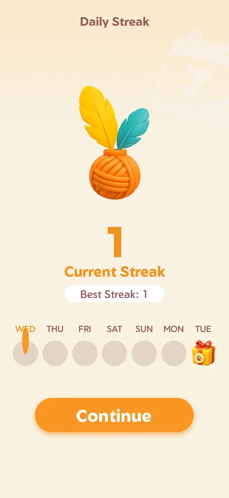

# Daily streak (yarn ball)

## How it works
- After the first win of the day: "Tap the yarn ball, spark your streak!", then the Daily Streak
  screen: current and best streak, a WED..TUE row and a gift on day 7 [s:20260930-233055-chrono-2FYKPJ#14] [s:20260930-233055-chrono-2FYKPJ#15].
- The yarn counter on Home opens the same page with a back arrow [s:20261001-013526-chrono-2FYKPJ#94].
- The day-7 gift cannot be tapped early [s:20261001-022624-chrono-2FYKPJ#6]. The support article calls it a "mysterious
  reward" [s:20261001-022624-chrono-2FYKPJ#25].

## Cases
| Case | What was done | Result | Source |
|---|---|---|---|
| Day 1 | First win | Streak 1 | [s:20260930-233055-chrono-2FYKPJ#15] |
| Day 2 popup | First win on 2026-10-01 | Popup with current 2, best 2 | [s:20261001-013526-chrono-2FYKPJ#7] |
| Counter on Home | Tapped the yarn counter | The same page with a back arrow | [s:20261001-013526-chrono-2FYKPJ#94] |

## Not verified
- The day-7 gift; a missed day.
