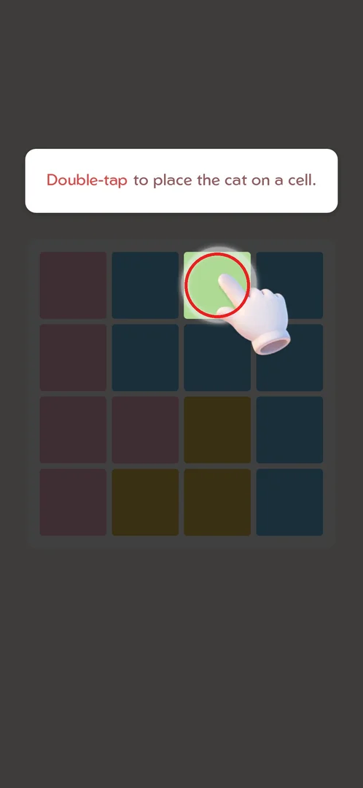
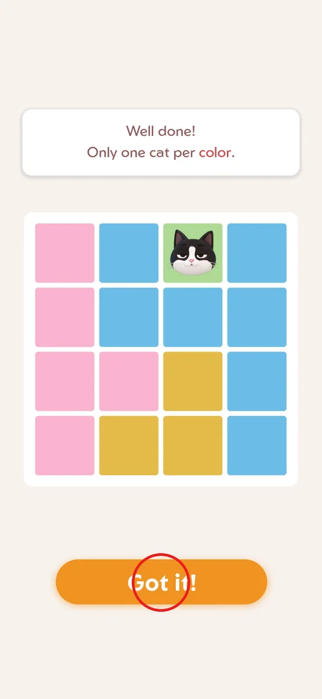
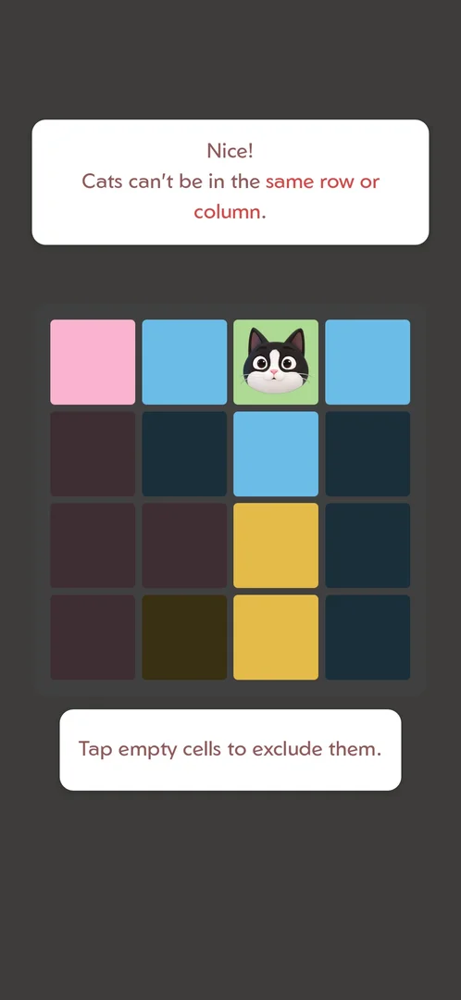
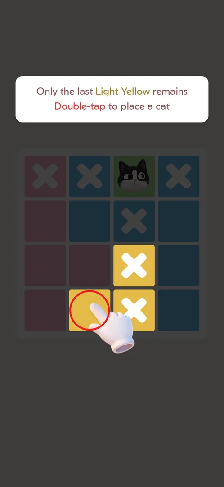
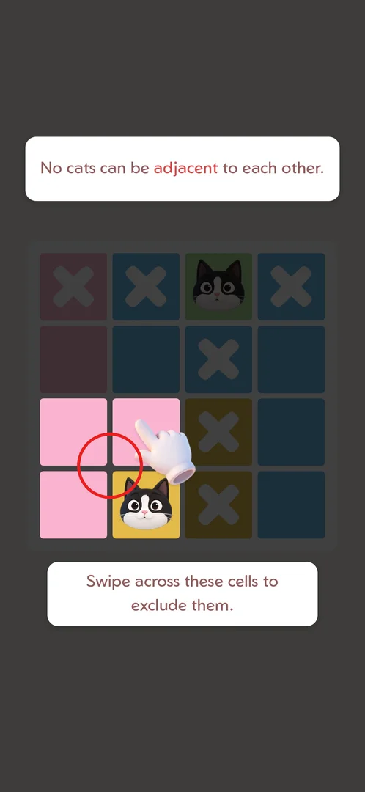
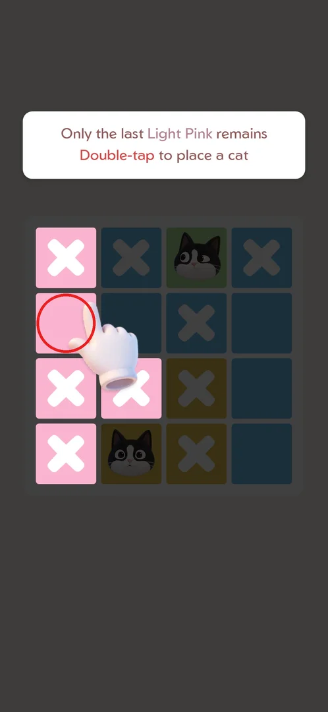
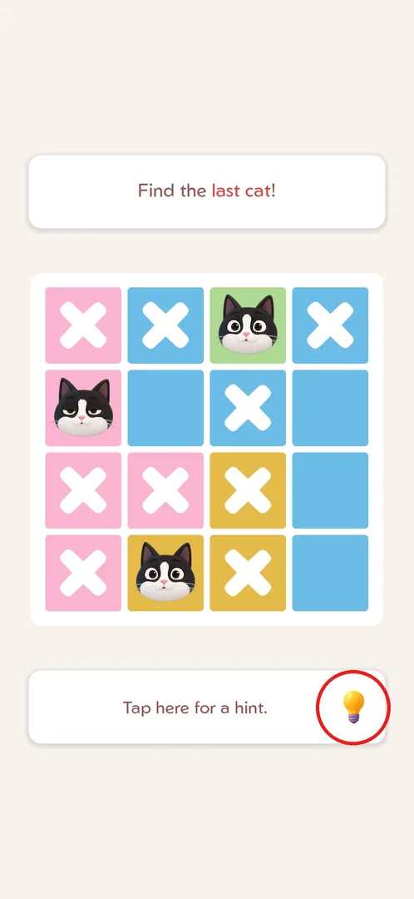
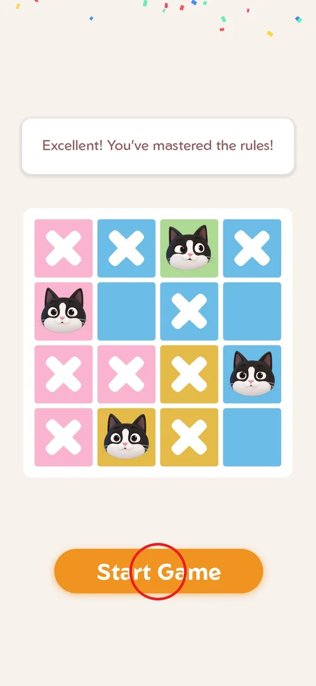
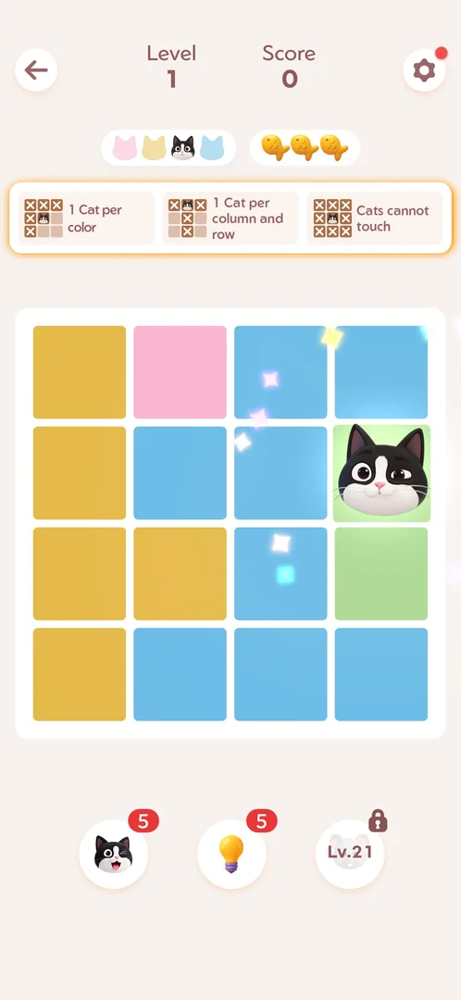

# FTUE tutorial

The first-time tutorial teaches the rules and the controls of the cat-placement puzzle on one guided
4x4 board: a double tap places a cat, a single tap marks a cell with an X, a swipe marks X on several
cells, and a light bulb gives a hint. It runs once on a fresh install and ends with a Start Game button
that opens level 1 [^s1] [^s8]. It was played from a fresh install on 2026-09-30 [^s1].

## Where to find it

There is no button. On the first launch Android first asks whether the game may send notifications
(the player chose "Don't allow"), then the loading screen shows a short in-game quote with a progress bar
and the MEOWDOKU logo; when loading ends, the tutorial board opens by itself [^s1]. Whether the tutorial
can be replayed later (from Settings, say) was not checked.

 [^s1]

## What it looks like

The screen is a 4x4 board of coloured regions (pink, blue, yellow, and one green cell) under a white
instruction bubble. Everything except the cells the current step needs is dimmed, and an animated hand
points at the cell to touch; a second bubble under the board names the gesture when the step needs one
[^s1] [^s3]. There is no header, no fish and no boosters, unlike a normal level [^s9].

 [^s1]

## What you can do

The tutorial is a fixed sequence of steps; each one accepts only the action it asks for.

| Tab or button | What it does |
|---|---|
| [Only one cat per color](#only-one-cat-per-color) | After the first double tap: states the colour rule; Got it! goes on |
| [Tap to exclude](#tap-to-exclude) | States the row/column rule; a single tap marks the lit cells with X |
| [Last Light Yellow](#last-light-yellow) | Double tap the only yellow cell left |
| [Swipe to exclude](#swipe-to-exclude) | States the adjacency rule; a swipe marks three cells with X |
| [Last Light Pink](#last-light-pink) | Double tap the only pink cell left |
| [Find the last cat](#find-the-last-cat) | "Find the last cat!" and shows where the hint button is |
| [Start Game](#start-game) | Fourth cat placed: the rules are done; Start Game opens level 1 |

### Only one cat per color

A double tap on the lit green cell puts a cat on it. The first double tap, with a pause between the taps,
did not register; a second one with no pause did [^s2]. The board lights up in full colour and the bubble
says "Well done! Only one cat per color."; the Got it! button (circled) goes to the next step [^s2] [^s3].

 [^s2]

### Tap to exclude

"Nice! Cats can't be in the same row or column." Only the cat's row and column stay lit, and the bubble
under the board says "Tap empty cells to exclude them." Single taps put an X on each lit cell [^s3] [^s4].

 [^s3]

### Last Light Yellow

With the row and column crossed out, one yellow cell is left: "Only the last Light Yellow remains /
Double-tap to place a cat", and the hand points at it (circled). A double tap places the second cat
[^s4] [^s5].

 [^s4]

### Swipe to exclude

"No cats can be adjacent to each other." The three pink cells that touch the new cat are lit, and the
bottom bubble says "Swipe across these cells to exclude them." One swipe across them marks all three
with X [^s5] [^s6].

 [^s5]

### Last Light Pink

After the swipe one pink cell is free: "Only the last Light Pink remains / Double-tap to place a cat".
A double tap on it (circled) places the third cat [^s6] [^s7].

 [^s6]

### Find the last cat

With three cats placed the board is no longer dimmed: "Find the last cat!", and a bubble under the board
says "Tap here for a hint." with a light bulb (circled) [^s7]. The player did not tap the bulb and
double-tapped the last blue cell instead, which finished the tutorial, so the hint is offered but not
required [^s8]. What a hint does is on the [Hint](hint.md) page.

 [^s7]

### Start Game

The fourth cat completes the board: confetti, "Excellent! You've mastered the rules!" and the Start Game
button (circled) [^s8]. Start Game opens level 1 of the [core puzzle](core-puzzle.md) [^s9].

 [^s8]

### Result

Level 1 is a normal level: a Level/Score header, the cat-colour progress, three fish, a strip repeating
the three rules (1 cat per color; 1 cat per column and row; cats cannot touch) and the boosters: cat x5,
hint x5 and a booster locked until level 21 [^s9].

 [^s9]

## How it works

Version 1.18.0.

- Order on a fresh install: the Android notification prompt → the loading quote → the tutorial board
  [^s1].
- One fixed 4x4 board with four colour regions; four cats in all: green, yellow, pink, blue [^s1] [^s8].
- It teaches three rules — one cat per colour, no two cats in a row or column, no two cats adjacent — and
  three controls: double tap = cat, single tap = X, swipe = X on several cells; plus where the hint button
  is [^s2] [^s3] [^s5] [^s7].
- No fish, score or boosters appear during the tutorial, and no reward was shown at its end [^s8].
- It ends with Start Game, which opens level 1 [^s8] [^s9].

## Cases

| Case | What was done | Result | Source |
|---|---|---|---|
| Steps | Played the tutorial from a fresh install, every step as asked | 4x4 board; double tap places a cat, single tap marks X, swipe marks X on several cells, hint button shown; ends with Start Game | ✅ [^s8] |
| Double tap with a pause | Double-tapped the first cell with a gap between the taps | Not registered; a double tap with no pause worked | ✅ [^s2] |
| Hint skipped | Did not tap the bulb at "Find the last cat!", placed the last cat directly | The tutorial finished normally | ✅ [^s8] |

## Not verified

- Whether the tutorial can be replayed (from Settings or anywhere else).
- What happens on a wrong action during the tutorial (a double tap on a non-lit cell, a tap outside).
- Whether tapping the bulb in the hint step costs one of the 5 hints.
- Whether allowing notifications changes anything in the flow.

[^s1]: session 20260930-233055-chrono-2FYKPJ, step 1 — [video at 0:09](https://youtu.be/kfHedtB_k4Q?t=9)
[^s2]: session 20260930-233055-chrono-2FYKPJ, step 3 — [video at 0:56](https://youtu.be/kfHedtB_k4Q?t=56)
[^s3]: session 20260930-233055-chrono-2FYKPJ, step 4 — [video at 1:07](https://youtu.be/kfHedtB_k4Q?t=67)
[^s4]: session 20260930-233055-chrono-2FYKPJ, step 5 — [video at 1:22](https://youtu.be/kfHedtB_k4Q?t=82)
[^s5]: session 20260930-233055-chrono-2FYKPJ, step 6 — [video at 1:33](https://youtu.be/kfHedtB_k4Q?t=93)
[^s6]: session 20260930-233055-chrono-2FYKPJ, step 7 — [video at 1:46](https://youtu.be/kfHedtB_k4Q?t=106)
[^s7]: session 20260930-233055-chrono-2FYKPJ, step 8 — [video at 1:55](https://youtu.be/kfHedtB_k4Q?t=115)
[^s8]: session 20260930-233055-chrono-2FYKPJ, step 9 — [video at 2:06](https://youtu.be/kfHedtB_k4Q?t=126)
[^s9]: session 20260930-233055-chrono-2FYKPJ, step 10 — [video at 2:20](https://youtu.be/kfHedtB_k4Q?t=140)
