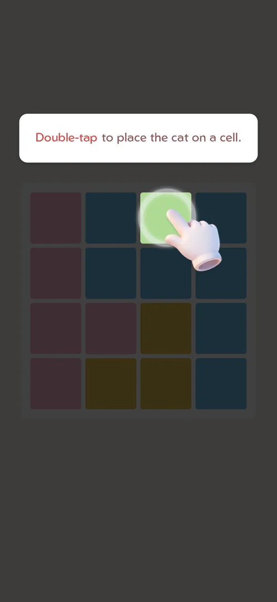

# FTUE tutorial

Played from a fresh install on 2026-09-30 [s:20260930-233055-chrono-2FYKPJ#1].

- Order: Android notification prompt → loading quote → a dimmed 4x4 board "Double-tap to place the
  cat on a cell" [s:20260930-233055-chrono-2FYKPJ#1].
- It teaches: a double tap places a cat, a single tap marks an X, a swipe marks X on several cells,
  and the hint button; it ends with Start Game [s:20260930-233055-chrono-2FYKPJ#9] [s:20260930-233055-chrono-2FYKPJ#10].

## Cases
| Case | What was done | Result | Source |
|---|---|---|---|
| Steps | Played it | As above | [s:20260930-233055-chrono-2FYKPJ#9] |
