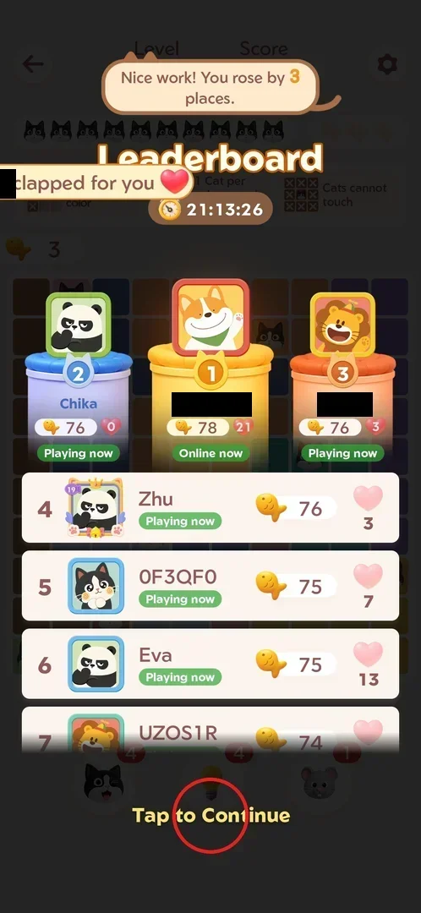
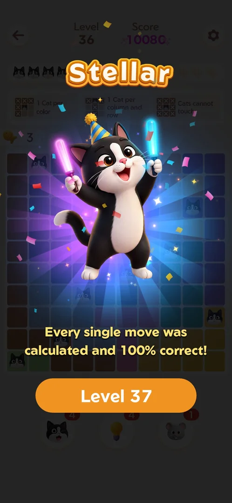
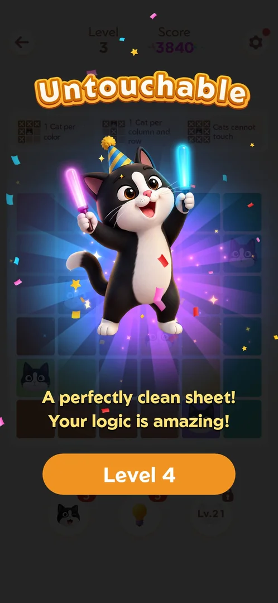
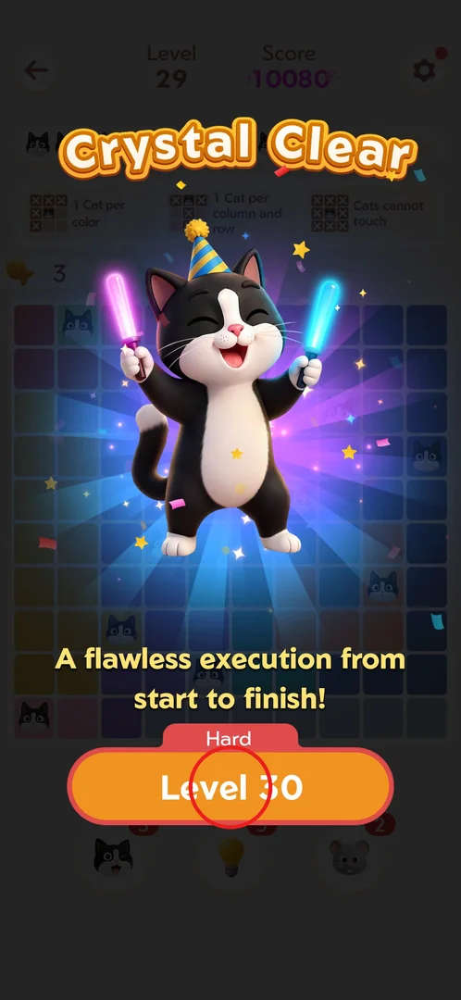
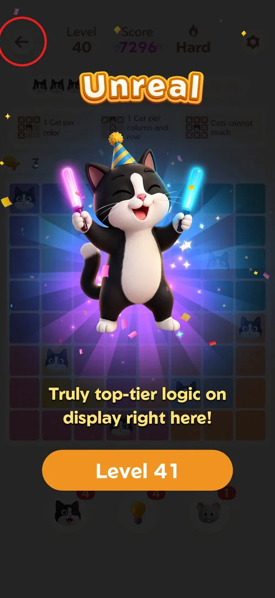
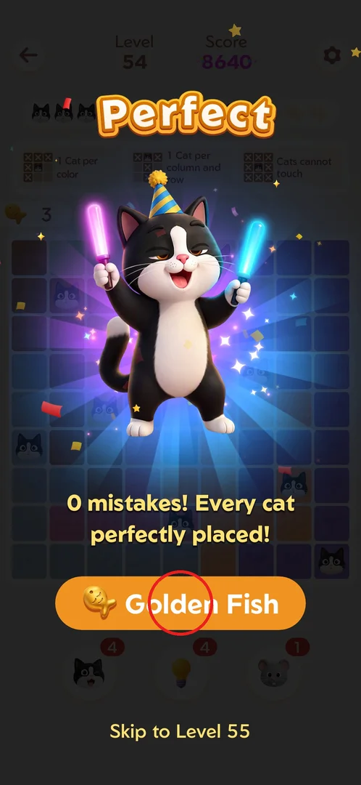
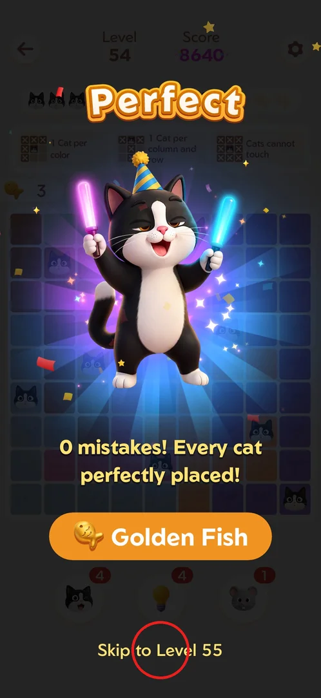
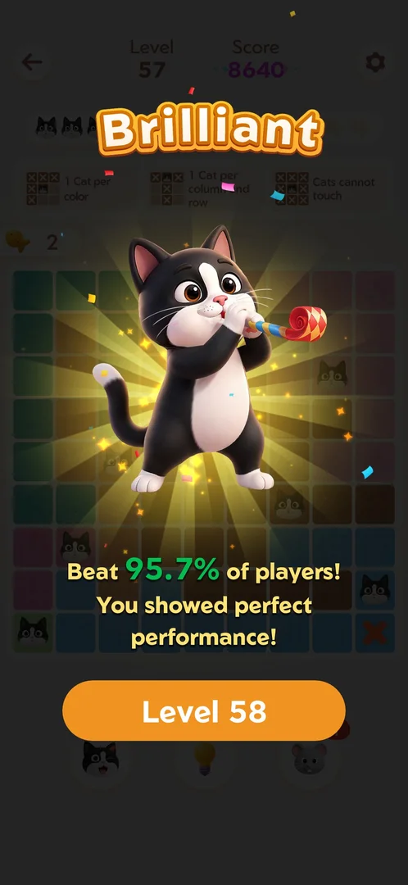

# Win screen titles

Every won level ends on a win screen: a big title word (Exact, Stellar, Perfect, Brilliant…), a
one-line comment under the dancing cat, the final score in the header and an orange button to the
next level. The title grades the solve: a win with no mistakes draws one of many "flawless" titles,
a win with mistakes shows "Brilliant" with a "Beat N% of players" line, and Hard levels have titles
of their own [^s1] [^s2]. It changes
nothing in the score; it is feedback for the player. Every fourth level from 54 the win screen also
offers the Golden Fish challenge [^s3].

## Where to find it

No button opens it: the win screen comes up by itself when the last cat of a level is placed. On the
first levels it follows the last move directly (on level 1, after the daily streak prompt)
[^s4] [^s5]. Once the leaderboard event
is running, a won level first shows the [leaderboard overlay](fish-event.md) with the fish just
earned; "Tap to Continue" at its bottom opens the win screen [^s6]
[^s7].

 [^s6]

## What it looks like

The level board stays behind a dark veil. On top: the title in large orange-outlined letters, the cat
with glow sticks and confetti, the comment line in yellow, and the next-level button. The header keeps
the level number, the final score and, on Hard levels, a flame with "Hard"
[^s7] [^s8]. After a win with mistakes
the cat blows a party horn on a yellow burst instead [^s9].

 [^s7]

 [^s5]

## What you can do

| Tab or button | What it does |
|---|---|
| [Level N button](#level-n-button) | Starts the next level; the only way off the screen |
| [Back arrow](#back-arrow) | Does nothing on the win screen (Android back neither) |
| [Golden Fish button](#golden-fish-button) | Every 4th level from 54: starts the Golden Fish challenge |
| [Skip to Level N](#skip-to-level-n) | Under the Golden Fish button: goes to the next level instead |
| [Title after mistakes](#title-after-mistakes) | Not a button: what the screen shows after a win with mistakes |

### Level N button

The orange button "Level N" opens the next level. When the next level is a Hard one, a red "Hard" tag
sits on top of the button (seen above Level 30 and Level 90) [^s10]
[^s11].

 [^s10]

### Back arrow

The top-left arrow and the Android back key are inactive on the win screen: only the Level N button
leads on [^s12].

 [^s12]

### Golden Fish button

On some wins the main button is "Golden Fish" with a fish icon instead of "Level N". It was seen on
levels 54, 58, 62, 66, 70, 74, 78, 82, 86, 90 and 94 (every fourth level from 54; 66 [^s1]), after flawless wins
and after a win with 2 mistakes alike [^s13]
[^s3] [^s14]
[^s15]. The challenge is a separate small board; winning it gave the
title "Masterclass" with a golden fish in the cat's arms, score 6048 and a fish counter of 5 (the
player inferred a golden fish counts as 5 fish), then the "Level 55" button
[^s16].

 [^s13]

### Skip to Level N

A text link "Skip to Level N" at the bottom of the screen, under the Golden Fish button, goes to the
next level without the challenge [^s13].

 [^s13]

### Title after mistakes

A win with 1 or 2 mistakes shows "Brilliant" (once "Awesome") and, instead of praise, a line "Beat N%
of players!" with a second sentence; the fish counter shows what is left (2 after one mistake)
[^s9] [^s17]
[^s18].

 [^s9]

## How it works

Version 1.18.0.

- **The title follows mistakes (fish lost), not time or score.** 0 mistakes: a title from a pool;
  1 or 2 mistakes: "Brilliant" (L57, L88, L89) or "Awesome" (L58) with the percentile line
  [^s19] [^s9]
  [^s17] [^s18]
  [^s11].
- **Flawless titles rotate.** Seen with 0 mistakes: Exact (L1–2), Untouchable (L3, L45), Stellar
  (L8, L36), Masterclass (L10, L46, L94), Crystal Clear (L29, L95), Purr-fect (L47, L87), Perfect
  (L54, L84, L91), Flawless, Surgical (L51, L61, L85), Spot On (L55), Immaculate (L63)
  [^s4] [^s5]
  [^s20] [^s10]
  [^s7] [^s21]
  [^s22] [^s23]
  [^s13] [^s24]
  [^s25] [^s26]
  [^s2]. Each title has its own comment; one title can have more than
  one ("Perfect" came with two different lines on L84 and L91) [^s27].
- **Hard levels** draw from their own titles: Exceptional (L30, L60), Unreal (L40), Supreme (L50),
  Masterful, Expert, Victory (L90, a comment about conquering Hard mode)
  [^s28] [^s8]
  [^s22] [^s25]
  [^s14] [^s29].
- **Golden Fish challenge titles:** Masterclass, Immaculate, Spot On, Success (score 7296); after a
  fish revival by ad, "Persevered" [^s16]
  [^s25] [^s30]
  [^s14] [^s31].
- **The score follows the board, not mistakes or the title:** on the levels seen, 9×9 boards scored
  8640 and 10×10 boards 10080; L57 with 1 mistake still scored 8640 and L58 with 2 mistakes 10080
  [^s23] [^s1]. Other scores seen: 6048 on the 8×8 level 8 and 7296 on Hard level 40 [^s34] [^s12].
  Boards of one size do not always score the same: the 8×8 level 61 (one cat already placed) scored
  6048 like the 7×7 level 62, while a golden 8×8 board with no cat placed scored 7296
  [^s25] [^s35] [^s36].
  The scores seen fit the number of cats the player places (7 → 6048, 8 → 7296, 9 → 8640, 10 → 10080);
  see [Golden Fish](golden-fish-level.md#how-it-works).

  > ⚠️ Previously (v1.18.0, 2026-10-01): "Whether every board of one size scores the same was not checked."
- **Fish earned on the win** (for the [leaderboard event](fish-event.md)): +3 with no mistakes, +2
  with one, +1 with two [^s18] [^s11].
- Boosters do not change the title: L92 with 4 booster cats and no mistakes was "Perfect"
  [^s32].

## Cases

| Case | What was done | Result | Source |
|---|---|---|---|
| Flawless wins show different titles | Levels 1–40 won with no mistakes | Exact (L1), Untouchable (L3), Stellar (L8, L36), Masterclass (L10), Crystal Clear (L29), Unreal (L40 Hard) | ✅ [^s4] [^s5] [^s20] [^s10] [^s8] |
| 0 fish lost gives Untouchable | L45 won with 3 of 3 fish | "Untouchable", 10080; the flawless L46 gave "Masterclass": the flawless title rotates | ✅ [^s33] [^s19] |
| What decides the title | Flawless, 1-mistake and 2-mistake wins compared | Mistakes pick the tier (flawless pool vs Brilliant/Awesome), Hard levels have their own titles; within a tier the title rotates | ✅ [^s1] [^s2] |
| Wins with 1 and 2 mistakes | L57 and L88 won with 1 deliberate mistake, L58 and L89 with 2 | 1 → Brilliant; 2 → Awesome (L58) or Brilliant (L89); score unchanged | ✅ [^s9] [^s17] [^s18] [^s11] |
| Back from the win screen | Top-left arrow, then Android back on L40's win screen | Nothing happens; only "Level N" proceeds | ✅ [^s12] |
| Golden Fish button frequency | Watched the win screens of L45–94 | L54, 58, 62, 66, 70, 74, 78, 82, 86, 90, 94: every 4th level, regardless of mistakes | ✅ [^s3] [^s15] |
| Red "Hard" tag on the Level N button | Watched the next-level buttons | The tag sat above Level 30 and Level 90; which levels get it and whether they reward more was not checked | [^s10] [^s11] |

## Not verified

- Which levels get the red "Hard" tag, and whether Hard levels give more reward.
- Whether 3 mistakes (across a Restart) still allow a win, and its title.
- Whether "Awesome" vs "Brilliant" after 2 mistakes depends on anything (seen once each).
- What the "Exact" title needs: seen only on levels 1–2.

[^s1]: session 20261001-082114-chrono-2FYKPJ, step 53
[^s2]: session 20261001-115413-chrono-2FYKPJ, step 71
[^s3]: session 20261001-082114-chrono-2FYKPJ, step 31
[^s4]: session 20260930-233055-chrono-2FYKPJ, step 16 — [video at 3:47](https://youtu.be/kfHedtB_k4Q?t=227)
[^s5]: session 20260930-233055-chrono-2FYKPJ, step 23 — [video at 6:18](https://youtu.be/kfHedtB_k4Q?t=378)
[^s6]: session 20261001-022624-chrono-2FYKPJ, step 16
[^s7]: session 20261001-022624-chrono-2FYKPJ, step 17
[^s8]: session 20261001-022624-chrono-2FYKPJ, step 61
[^s9]: session 20261001-082114-chrono-2FYKPJ, step 10
[^s10]: session 20261001-013526-chrono-2FYKPJ, step 67 — [video at 14:05](https://youtu.be/T86pLfervRE?t=845)
[^s11]: session 20261001-115413-chrono-2FYKPJ, step 39
[^s12]: session 20261001-022624-chrono-2FYKPJ, step 63
[^s13]: session 20261001-060942-chrono-2FYKPJ, step 103
[^s14]: session 20261001-093348-chrono-2FYKPJ, step 113
[^s15]: session 20261001-115413-chrono-2FYKPJ, step 67
[^s16]: session 20261001-060942-chrono-2FYKPJ, step 109
[^s17]: session 20261001-082114-chrono-2FYKPJ, step 15
[^s18]: session 20261001-115413-chrono-2FYKPJ, step 34
[^s19]: session 20261001-060942-chrono-2FYKPJ, step 28
[^s20]: session 20260930-233055-chrono-2FYKPJ, step 49 — [video at 11:59](https://youtu.be/kfHedtB_k4Q?t=719)
[^s21]: session 20261001-060942-chrono-2FYKPJ, step 37
[^s22]: session 20261001-060942-chrono-2FYKPJ, step 70
[^s23]: session 20261001-060942-chrono-2FYKPJ, step 76
[^s24]: session 20261001-060942-chrono-2FYKPJ, step 116
[^s25]: session 20261001-082114-chrono-2FYKPJ, step 41
[^s26]: session 20261001-115413-chrono-2FYKPJ, step 15
[^s27]: session 20261001-115413-chrono-2FYKPJ, step 49
[^s28]: session 20261001-013526-chrono-2FYKPJ, step 74 — [video at 15:13](https://youtu.be/T86pLfervRE?t=913)
[^s29]: session 20261001-115413-chrono-2FYKPJ, step 45
[^s30]: session 20261001-093348-chrono-2FYKPJ, step 47
[^s31]: session 20261001-115413-chrono-2FYKPJ, step 24
[^s32]: session 20261001-115413-chrono-2FYKPJ, step 59
[^s33]: session 20261001-060942-chrono-2FYKPJ, step 19
[^s34]: session 20260930-233055-chrono-2FYKPJ, step 38 — [video at 10:07](https://youtu.be/kfHedtB_k4Q?t=607)

[^s35]: session 20261001-082114-chrono-2FYKPJ, step 30 — [video at 8:12](https://youtu.be/9H-DeREITjo?t=492)
[^s36]: session 20261001-082114-chrono-2FYKPJ, step 36 — [video at 10:04](https://youtu.be/9H-DeREITjo?t=604)
