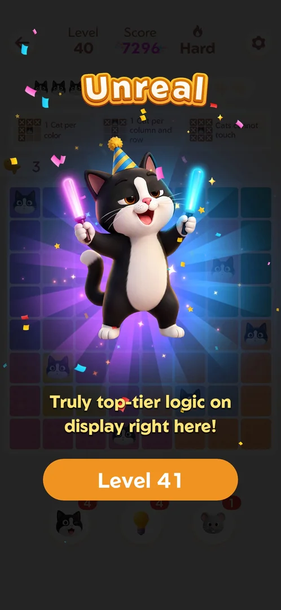

# Win screen titles

Every win shows a title, a one-line comment and the score, then a "Level N" button. All of these
wins were flawless, yet the titles differed: Exact (L1, "100% accurate"), Untouchable (L3), Stellar
(L8, L36), Masterclass (L10), Crystal Clear (L29), Unreal (L40 Hard) [s:20260930-233055-chrono-2FYKPJ#16] [s:20260930-233055-chrono-2FYKPJ#23]
[s:20260930-233055-chrono-2FYKPJ#49] [s:20261001-013526-chrono-2FYKPJ#67] [s:20261001-022624-chrono-2FYKPJ#61].

## Not verified
- What decides the title (not mistakes alone).
