# Levels: Meowdoku: Brain Puzzle Games

Every level the agents met, as its board looked at the start (the ad strips cropped). The notes tell where a new element or rule appears.

> Caveats (dream 2026-10-02): the thumbnails of levels 23 and 46 were full-screen ads and are blacked
> out. Some thumbnails are not starting boards (11: event popup; 108, 127, 129: win screens; 124: the
> loading screen; 126: the Quit popup). From level 97 on the labels come from bench records that counted
> golden boards (header "Score" only, e.g. 99, 103, 111, 119, 123) as levels and drifted by one, so a
> label there can be one level off. The level records are local and were not corrected.

| level 1 | level 2 | level 3 | level 4 | level 5 |
|---|---|---|---|---|
| 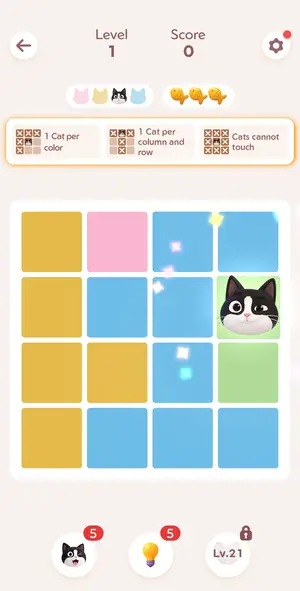 | 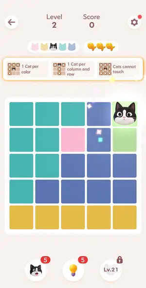 | 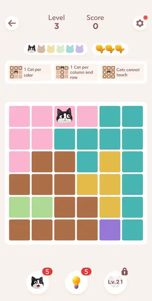 | 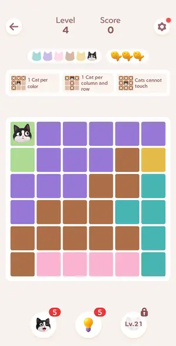 | 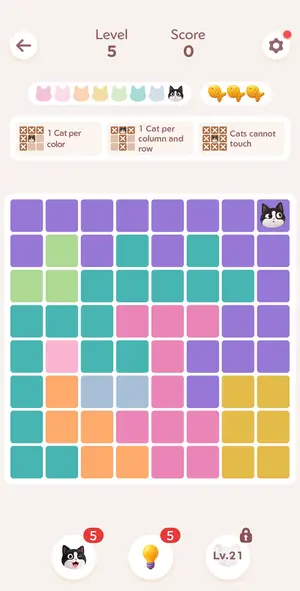 |

| level 6 | level 7 | level 8 | level 9 | level 10 |
|---|---|---|---|---|
| 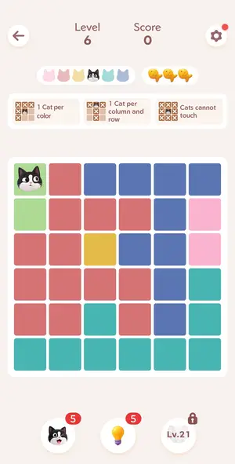 | 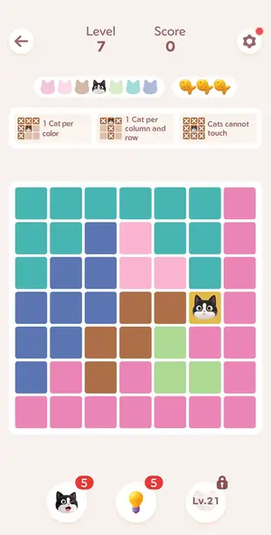 | 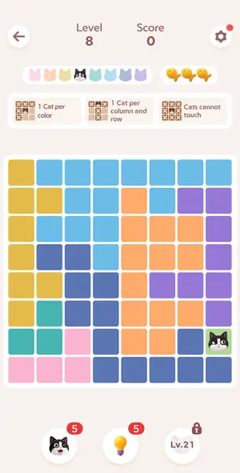 | 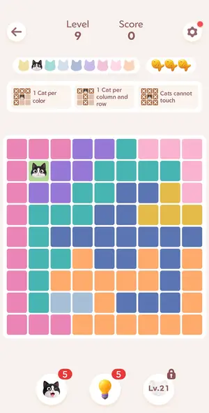 | 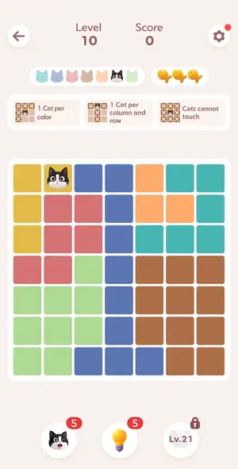 |

| level 11 | level 12 | level 13 | level 14 | level 15 |
|---|---|---|---|---|
|  | 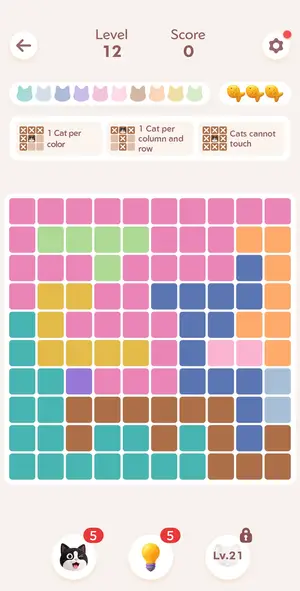 | 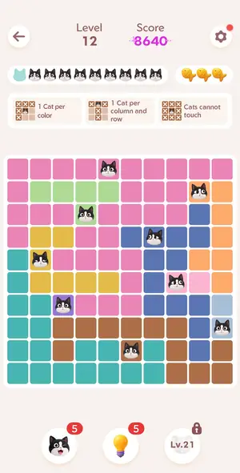 | 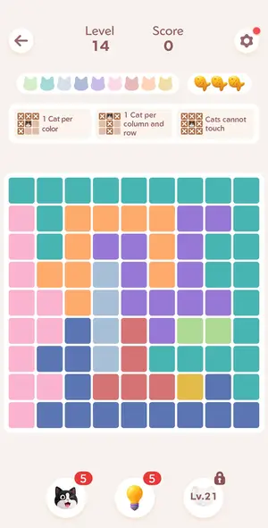 | 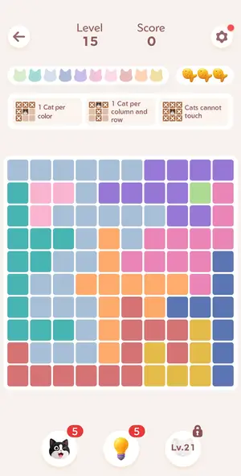 |

| level 16 | level 17 | level 18 | level 19 | level 20 |
|---|---|---|---|---|
| 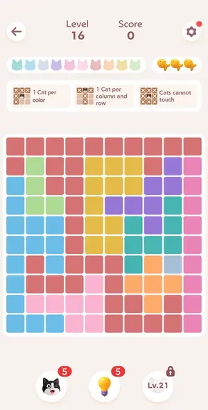 | 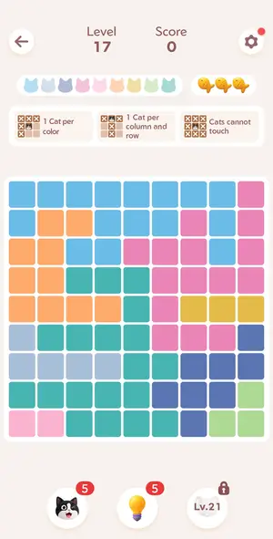 | 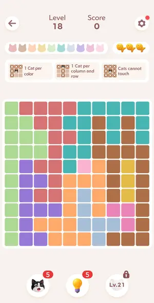 | 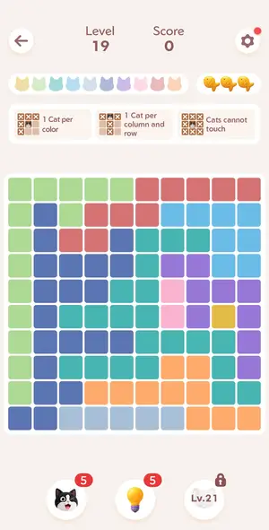 | 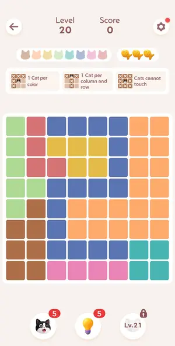 |

| level 21 | level 22 | level 23 | level 24 | level 25 |
|---|---|---|---|---|
| 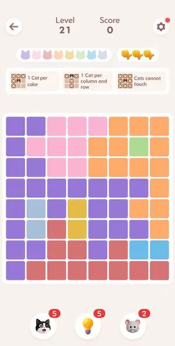 | 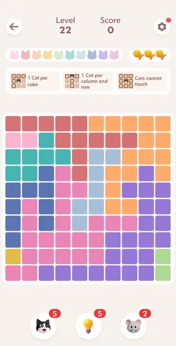 |  | 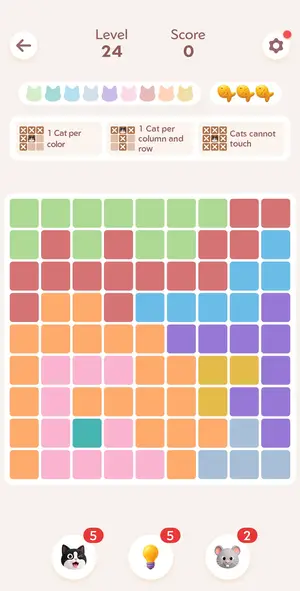 | 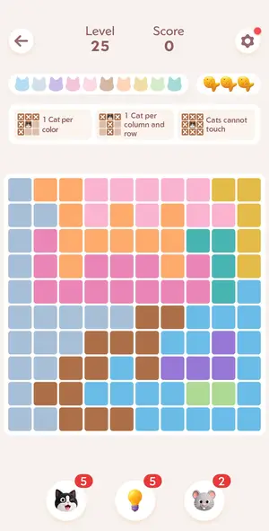 |

| level 26 | level 27 | level 28 | level 29 | level 30 |
|---|---|---|---|---|
| 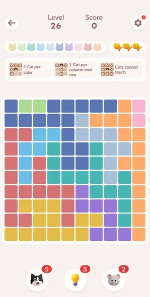 | 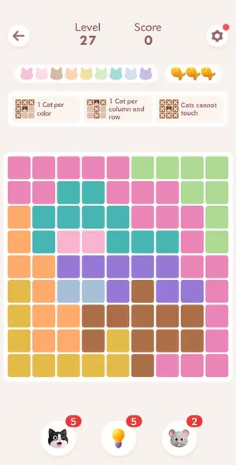 | 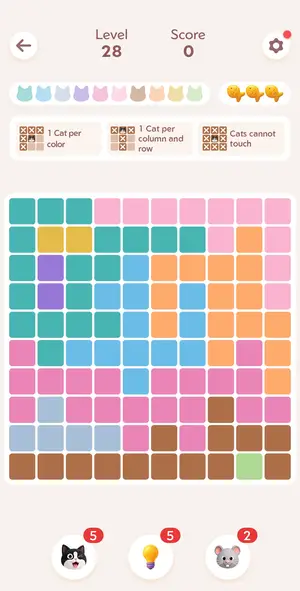 |  | 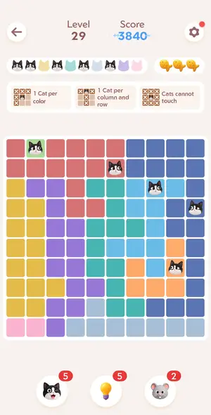 |

| level 31 | level 32 | level 33 | level 34 | level 35 |
|---|---|---|---|---|
| 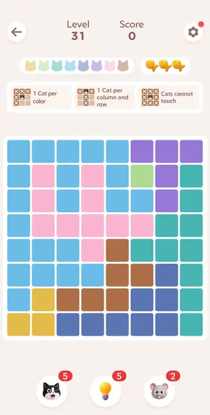 | 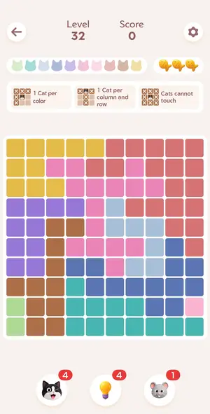 | 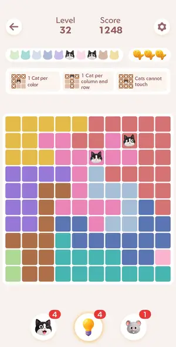 | 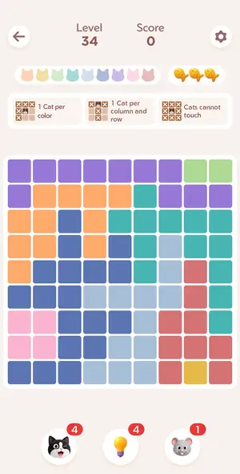 | 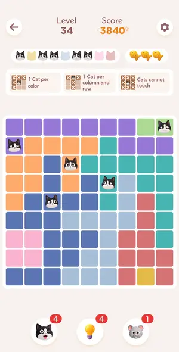 |

| level 36 | level 37 pattern mode | level 38 | level 39 | level 40 |
|---|---|---|---|---|
| 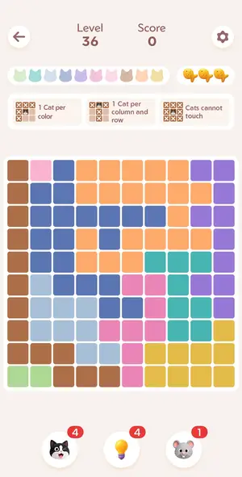 | 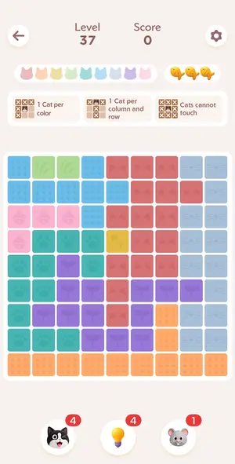 | 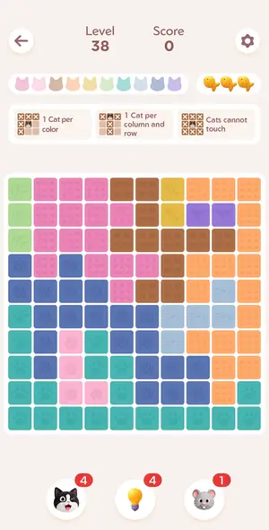 | 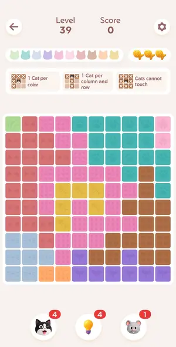 | 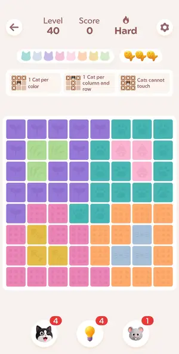 |

| level 41 | level 42 | level 43 | level 44 | level 45 |
|---|---|---|---|---|
| 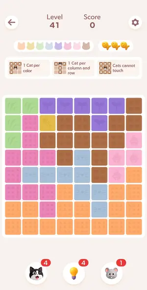 | 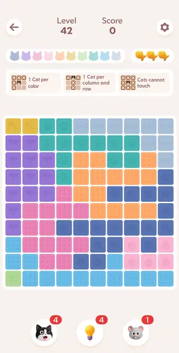 | 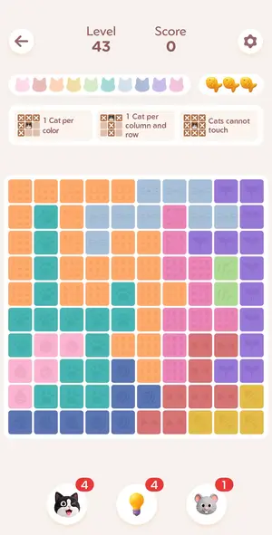 | 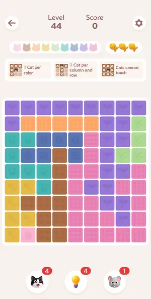 | 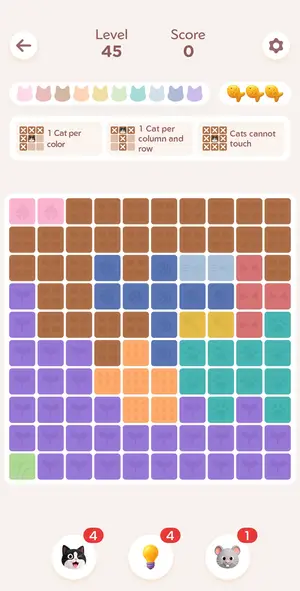 |

| level 46 | level 47 | level 48 | level 49 | level 50 |
|---|---|---|---|---|
|  | 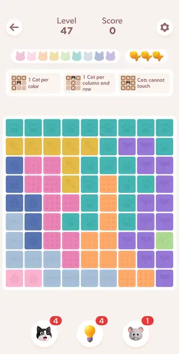 | 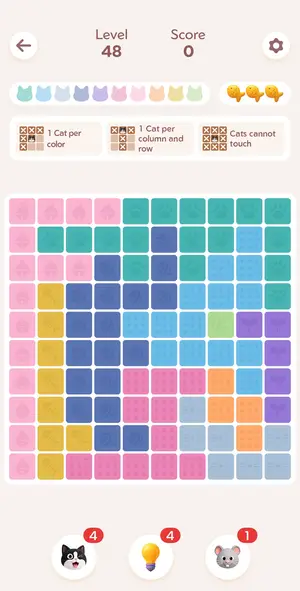 | 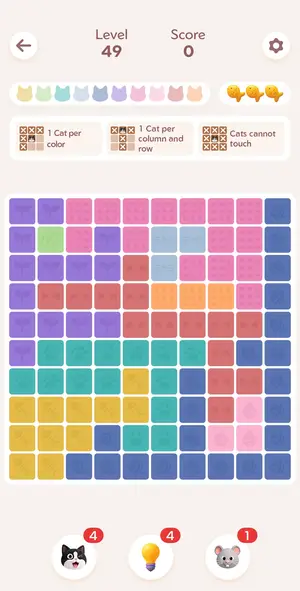 | 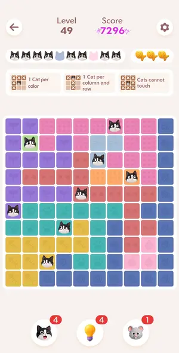 |

| level 51 | level 52 | level 53 | level 54 | level 55 |
|---|---|---|---|---|
| 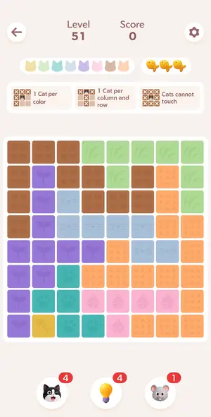 | 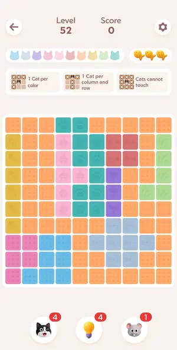 | 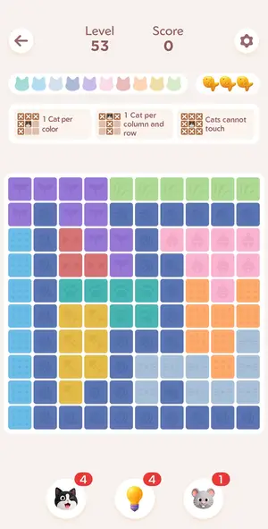 | 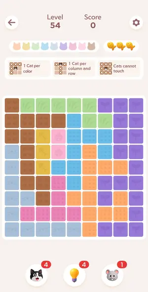 |  |

| level 56 | level 57 | level 58 | level 59 | level 60 |
|---|---|---|---|---|
|  |  |  |  |  |

| level 61 | level 62 | level 63 | level 64 | level 65 |
|---|---|---|---|---|
|  |  |  |  |  |

| level 66 | level 67 | level 68 | level 84 | level 85 |
|---|---|---|---|---|
|  |  |  |  |  |

| level 86 | golden fish after L86 | level 88 | level 89 | level 90 Hard |
|---|---|---|---|---|
|  |  |  |  |  |

| level 91 | level 92 | level 93 | level 94 | level 95 |
|---|---|---|---|---|
|  |  |  |  |  |

| level 96 | level 97 | level 98 | level 99 | level 100 |
|---|---|---|---|---|
|  |  |  |  |  |

| level 101 | level 102 | level 103 | level 104 | level 105 |
|---|---|---|---|---|
|  |  |  |  |  |

| level 106 | level 107 | level 108 | level 109 | level 110 |
|---|---|---|---|---|
|  |  |  |  |  |

| level 111 | level 112 | level 113 | level 114 | level 115 |
|---|---|---|---|---|
|  |  |  |  |  |

| level 116 | level 117 | level 118 | level 119 | level 120 |
|---|---|---|---|---|
|  |  |  |  |  |

| level 121 | level 122 | level 123 | level 124 | level 125 |
|---|---|---|---|---|
|  |  |  |  |  |

| level 126 | level 127 | level 128 | level 129 | daily 10/01 |
|---|---|---|---|---|
|  |  |  |  |  |

| golden fish home 9x9 |
|---|
|  |

## Tries

| Level | Mechanic | Result | Time | Note |
|---|---|---|---|---|
| level 1 | queens | 1 won | 55 s | 4x4, one pre-placed cat; pink single cell forced, then row/col/adjacency left one option each. Double-tap sometimes misses on first try: check the frame and retry. Score shown after each cat (1675 tot |
| level 2 | queens | 1 won | 95 s | 5x5 solved by hand in ~1 min: single-cell pink forced, then adjacency elimination. Solver written after this level and verified on levels 1-2 frames. |
| level 3 | queens | 1 won | 28 s | solver --run --gap 0 solved 6x6 in one round, 0.3 min |
| level 4 | queens | 1 won | 26 s | solver one round |
| level 5 | queens | 1 won | 23 s | solver one round |
| level 6 | queens | 1 won | 45 s | solver one round |
| level 7 | queens | 1 won | 24 s | solver one round |
| level 8 | queens | 1 won | 61 s | solver one round |
| level 9 | queens | 1 won | 29 s | solver one round |
| level 10 | queens | 1 won | 31 s | solver one round |
| level 11 | queens | 1 won | 123 s | solver |
| level 12 | queens | 1 won | 80 s | solver |
| level 13 | queens | 2 won | 32 s | NOTE: this record is actually the finish of level 12 (the previous 'level 12' end was premature: 2 double-taps were lost). Now solver does 3 cells per round and rescans. |
| level 14 | queens | 1 won | 27 s | solver, 3 cells per round |
| level 15 | queens | 1 won | 24 s | solver, 3 cells per round |
| level 16 | queens | 1 won | 28 s | solver, 3 cells per round |
| level 17 | queens | 1 won | 23 s | solver, 3 cells per round |
| level 18 | queens | 1 won | 31 s | solver, 3 cells per round |
| level 19 | queens | 1 won | 29 s | solver, 3 cells per round |
| level 20 | queens | 1 won | 18 s | solver, 3 cells per round |
| level 21 | queens | 1 won | 25 s | solver, 8x8 no given cat |
| level 22 | queens | 1 won | 32 s | solver ok |
| level 23 | queens | 1 won | 248 s | interstitial ad ate 4 min; launch dismissed it |
| level 24 | queens | 1 won | 67 s | solver |
| level 25 | queens | 1 won | 51 s | solver |
| level 26 | queens | 1 won | 50 s | solver |
| level 27 | queens | 1 won | 54 s | solver |
| level 28 | queens | 1 won | 38 s | solver |
| level 29 | queens | 1 won | 41 s | solver |
| level 30 | queens | 1 won | 133 s | solver |
| level 31 | queens | 1 won | 150 s | after boosters cases |
| level 32 | queens | 1 won | 28 s | solver |
| level 33 | queens | 2 won | 43 s | solver |
| level 34 | queens | 1 won | 46 s | solver |
| level 35 | queens | 2 won | 54 s | solver |
| level 36 | queens | 1 won | 68 s | solver placed 6 of 10, 4 last by hand (light-blue/green/brown/yellow missed) |
| level 37 pattern mode | queens | 1 won | 53 s | Pattern Mode ON: solver works (first run right after settings close failed, needed 2s wait) |
| level 38 | queens | 1 won | 165 s | after deliberate fish loss + rewarded revive, solver finished; ~5 min total due to test |
| level 39 | queens | 1 won | 29 s | ok |
| level 40 | queens | 1 won | 28 s | ok |
| level 41 | queens | 1 won | 34 s | ok |
| level 42 | queens | 1 won | 30 s | ok |
| level 43 | queens | 1 won | 21 s | ok |
| level 44 | queens | 1 won | 40 s | solver misread last small region (single bell cell); placed by hand. 1 fish lost (2/3) score 8640 |
| level 45 | queens | 1 won | 37 s | 10x10 solved clean, 0 fish lost, 0.5 min |
| level 46 | queens | 2 won | 10 s | clean |
| level 47 | queens | 1 won | 48 s | clean |
| level 48 | queens | 1 won | 43 s | clean |
| level 49 | queens | 1 won | 48 s | clean |
| level 50 | queens | 2 won | 17 s | clean |
| level 51 | queens | 1 won | 51 s | solver misread regions on 8x8 (brown regions merged); solved by hand |
| level 52 | queens | 1 won | 51 s | 1 cat by hand |
| level 53 | queens | 1 won | 59 s | 1 cat by hand; title Spot On |
| level 54 | queens | 2 won | 19 s | solved 9x9 by hand after solver misread |
| level 55 | queens | 1 won | 74 s | diagonal-stripe 9x9: solver misread similar hues; solved by brute force script on hand-read grid |
| level 56 | queens | 1 won | 45 s | L56 10x10 solver did nothing, brute force |
| level 57 | queens | 1 won | 22 s | L57 with 1 deliberate mistake |
| level 58 | queens | 1 won | 27 s | L58 2 deliberate mistakes |
| level 59 | queens | 1 won | 16 s | L59 brute force |
| level 60 | queens | 1 won | 15 s | L60 hard 9x9 brute |
| level 61 | queens | 1 won | 14 s | L61 8x8 brute |
| level 62 | queens | 2 won | 14 s | L62 7x7 brute |
| level 63 | queens | 1 won | 16 s | L63 brute |
| level 64 | queens | 1 won | 16 s | L64 brute |
| level 65 | queens | 1 won | 17 s | L65 brute |
| level 66 | queens | 1 won | 16 s | L66 brute |
| level 67 | queens | 1 won | 55 s | solver placed 1 cat; brute force the rest |
| level 68 | queens | 1 won | 37 s | brute force 10x10 |
| level 84 | queens | 1 won | 68 s | 9x9; solver merged brown+green regions, solved by hand |
| level 85 | queens | 1 won | 100 s | 10x10; solver solution was correct but taps did not register after ad launch (intro); placed by hand |
| level 86 | queens | 1 won | 63 s | 10x10 solver solution right but its taps not applied (banner ad level); hand taps worked |
| golden fish after L86 | queens | 2 won | 31 s | golden 8x8 solved by hand (solver right) |
| level 88 | queens | 1 won | 50 s | 10x10, 1 deliberate mistake; fish counter earned 2 (3 with no mistakes) |
| level 89 | queens | 1 won | 44 s | 10x10, 2 deliberate mistakes |
| level 90 Hard | queens | 1 won | 71 s | Hard level 9x9, after fish loss + Restart; hand solved |
| level 91 | queens | 1 won | 23 s | 8x8, one cat was pre-placed at level start (after Skip to Level 91 via golden skip) - score lower 6048 |
| level 92 | queens | 1 won | 187 s | boosters used x4 on this level |
| level 93 | queens | 1 won | 26 s | 10x10 hand taps |
| level 94 | queens | 1 won | 26 s | 9x9 hand taps |
| level 95 | queens | 1 won | 25 s | 10x10 hand taps |
| level 96 | queens | 1 won | 39 s | 10x10 hand taps, Pattern Mode OFF |
| level 97 | queens | 1 won | 52 s | level 97 solved in 0.8 min with solver, untouchable achievement |
| level 98 | queens | 1 won | 57 s | level 98 solved in 0.8 min with solver, expert achievement |
| level 99 | queens | 1 won | 67 s | level 99 solved in 0.9 min with solver, expert achievement |
| level 100 | queens | 2 won | 43 s | level 100 solved in 0.7 min with solver, spot on achievement, hard difficulty |
| level 101 | queens | 1 won | 58 s | ad then solver draw + hand taps |
| level 102 | queens | 1 won | 46 s | solver misread colours; hand-read grid, same solution |
| level 103 | queens | 1 won | 57 s | ad skipped via launch; hand-read grid |
| level 104 | queens | 2 won | 43 s | header showed Level 103 (record named 104); hand-read grid + backtrack |
| level 105 | queens | 1 won | 85 s | ad interstitial at start; relaunch+wait 10 then solver run |
| level 106 | queens | 1 won | 72 s | ad at start closed via Close button; solver run |
| level 107 | queens | 1 won | 43 s | solver run 9x9 clean |
| level 108 | queens | 1 won | 95 s | ad at start needed ~25s wait + launch; solver run |
| level 109 | queens | 1 won | 54 s | solver draw + manual taps, one batch |
| level 110 | queens | 1 won | 62 s | interstitial needed launch; then solver+manual |
| level 111 | queens | 1 won | 48 s | solver+manual |
| level 112 | queens | 1 won, 1 quit | 58 s | solver+manual; wait 6 s for the leaderboard before Continue |
| level 113 | queens | 1 won | 61 s | solver merged red/green; hand-fixed |
| level 114 | queens | 1 won | 53 s | solver ok |
| level 115 | queens | 1 won | 47 s | solver ok |
| level 116 | queens | 2 won | 59 s | solver misread colours (merged big region); solved by hand. Frame showed Level 115 for this board, so my level labels after 114 may be off by one |
| level 117 | queens | 1 won | 51 s | solver ok on 9x9, hand taps |
| level 118 | queens | 1 won | 52 s | 10x10 solver ok, hand taps |
| level 119 | queens | 1 won | 57 s | 10x10 solver ok, hand taps |
| level 120 | queens | 2 won | 26 s | 10x10 solver ok; header still said 119 though a different board |
| level 121 | queens | 1 won | 23 s | solver; skip given cats |
| level 122 | queens | 1 won | 25 s | solver + grid taps |
| level 123 | queens | 1 won | 23 s | solver + grid taps |
| level 124 | queens | 1 quit | — | solver could not read board - possible popup blocking |
| level 125 | queens | 1 won, 1 quit | 57 s | L125 Perfect, 10x10, solver then hand taps |
| level 126 | queens | 2 won | 35 s | solver solved 9x9 board with 9 colors in 5 rounds |
| level 127 | queens | 1 won | 63 s | solver solution placed successfully |
| level 128 | queens | 1 won | 65 s | solver solved 9x9 board in 4 rounds |
| level 129 | queens | 1 won | 64 s | puzzle solved |
| daily 10/01 | queens | 1 won | 73 s | daily challenge, 1 cat done by hand (solver missed light-blue region) |
| golden fish home 9x9 | queens | 1 won | 34 s | golden fish from home, solver 9x9 worked |
