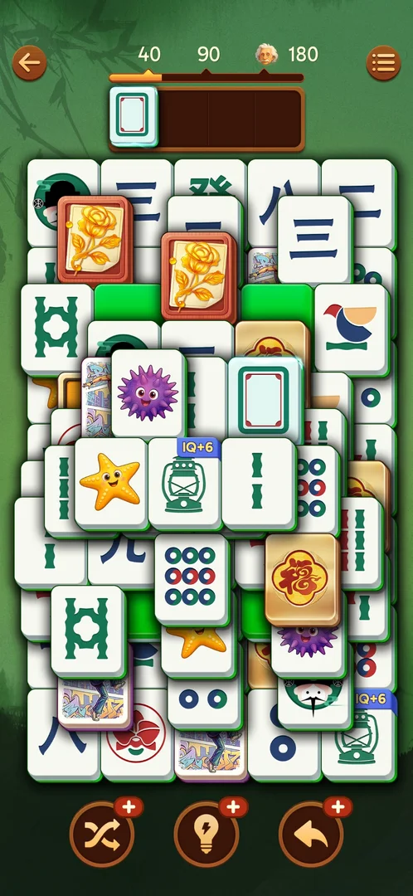

# Lessons for the agent: Vita Mahjong

- Never take a single into the tray while 2 tiles are already there, and never send two uncertain
  pairs in one batch: every Out of space came from this.
  *Confirmed: 20260930-225122-chrono-2FYKPJ, 3.39.1; 20261001-010125-chrono-2FYKPJ, 3.39.1; 20260930-235817-chrono-2FYKPJ, 3.39.1.* [s:20260930-225122-chrono-2FYKPJ#46] [s:20261001-010125-chrono-2FYKPJ#35] [s:20260930-235817-chrono-2FYKPJ#12]
- After a level opens, take one frame (or wait 1 s) before the first batch: the intro eats the first
  taps.
  *Confirmed: 20260930-221457-chrono-2FYKPJ, 3.39.1 (L6); playbook L3.* [s:20260930-221457-chrono-2FYKPJ#79]
- Wait 1 s after a match animation before a tray-critical or booster tap: such taps get lost.
  *Confirmed: 20260930-225122-chrono-2FYKPJ, 3.39.1; 20261001-031723-chrono-2FYKPJ, 3.39.1.* [s:20260930-225122-chrono-2FYKPJ#38] [s:20261001-031723-chrono-2FYKPJ#36]
- A playable ad with no close button: `sw.py launch` at once; the reward is still granted.
  *Confirmed: 20261001-010125-chrono-2FYKPJ, 3.39.1; 20261001-031723-chrono-2FYKPJ, 3.39.1.* [s:20261001-010125-chrono-2FYKPJ#43] [s:20261001-031723-chrono-2FYKPJ#82]
- Read league standings only after the rank animation ends.
  *Confirmed: 20261001-031723-chrono-2FYKPJ, 3.39.1 (frame mid-animation).* [s:20261001-031723-chrono-2FYKPJ#95]
- Never hand-tap tiles "to see a response": taps on covered or locked tiles change nothing and look
  like frame lag. On L18 three probe taps filled the tray to Out of space in 146 s; the frames were
  correct [s:20261001-204654-chrono-2FYKPJ#6] [s:20261001-204654-chrono-2FYKPJ#10].
  confirmed: 20261001-204654-chrono-2FYKPJ, 3.39.1 (frame: Out of space with blender, 4-circle, mixer, cat)
- A blank card (white face, green frame, red inner border) is an ordinary tile, not a face-down green:
  taken as a "free green", it went into the tray as a single; the Hint then lit two of them as a pair
  [s:20261001-211823-chrono-2FYKPJ#4] [s:20261001-211823-chrono-2FYKPJ#6].

  

  confirmed: 20261001-211823-chrono-2FYKPJ, 3.39.1 (frame)
- Tap Hint once, wait 1 s and look before tapping again: two quick taps spent both hints on the same
  pair (the highlight was not yet visible) [s:20261001-083725-chrono-2FYKPJ#20] [s:20261001-083725-chrono-2FYKPJ#21].
  Do not spend a Hint on a pair already visible [s:20261001-211823-chrono-2FYKPJ#5].
  confirmed: 20261001-083725-chrono-2FYKPJ, 3.39.1; 20261001-211823-chrono-2FYKPJ, 3.39.1
- A tile drawn on top is still locked when same-layer tiles (face-down greens too) touch both edges:
  check both edges before counting it free, and open a row end first [s:20261001-063226-chrono-2FYKPJ#56] [s:20261001-110957-chrono-2FYKPJ#52].
  confirmed: 20261001-063226-chrono-2FYKPJ, 3.39.1; 20261001-110957-chrono-2FYKPJ, 3.39.1
- Send certain pairs as batches, not one tap per call: batches of 4–8 certain pairs had zero wrong
  taps on L14–L17, while one tap per call on L18 was about 2x slower per tile and no safer
  [s:20261001-063226-chrono-2FYKPJ#10] [s:20261001-205148-chrono-2FYKPJ#29].
  confirmed: 20261001-063226-chrono-2FYKPJ, 3.39.1; 20261001-205148-chrono-2FYKPJ, 3.39.1

> ⚠️ Previously (20261001-204654-chrono-2FYKPJ, local playbook): "screenshots lag 1–2 s after a tap;
> after every tap wait 2 s and re-shot". The lab log and session 205148 (70 single taps, no lag) show the
> frames were correct; the loss came from probe taps [s:20261001-205148-chrono-2FYKPJ#29].
