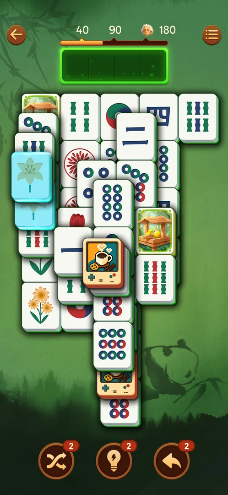
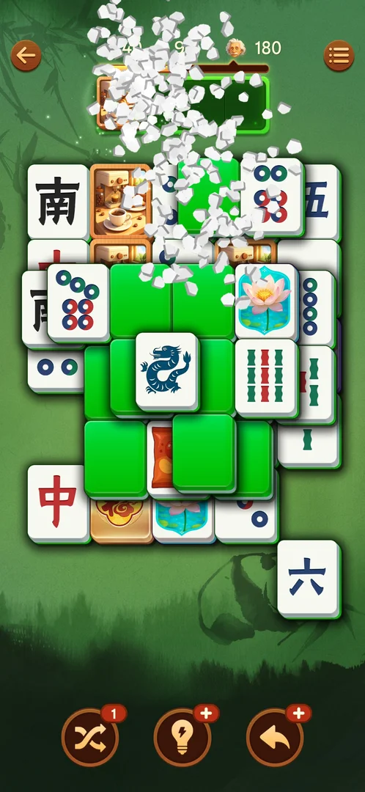
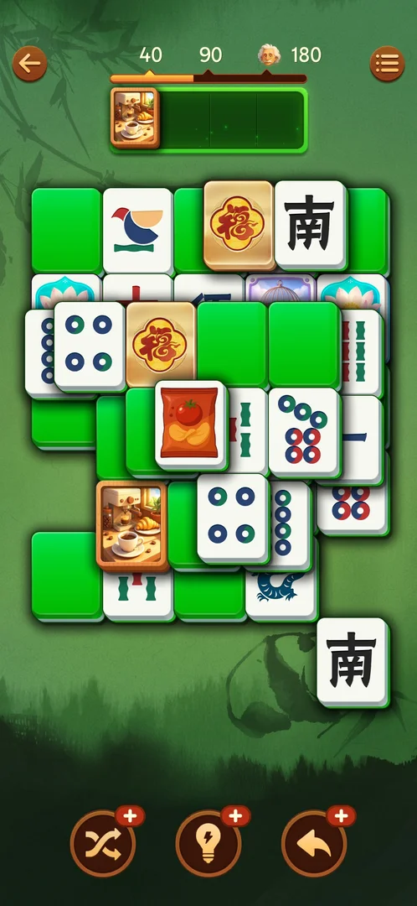

# Tactics

- Fast stretches came from batches of 8–13 certain taps in peel order: row end → the neighbour that
  becomes a row end → … (L6, L10 after Shuffle, the L13 opening) [s:20260930-221457-chrono-2FYKPJ#90] [s:20260930-235817-chrono-2FYKPJ#41] [s:20261001-031723-chrono-2FYKPJ#61].
- Put a blocker into the tray only when removing it frees the twin of a tray tile [s:20260930-214524-chrono-2FYKPJ#85] [s:20260930-221457-chrono-2FYKPJ#74].
- Shuffle when the tray holds singles with no free twin: it opened 5 pairs on L10 [s:20260930-235817-chrono-2FYKPJ#33].
- A hint target can still be covered: take the tile the hand points at first [s:20260930-214524-chrono-2FYKPJ#75] [s:20260930-235817-chrono-2FYKPJ#50].
- Rows of one layer that overlap vertically do not block each other:

  

- A tile visible only as a thin strip cannot be tapped: remove the tile drawn over it first [s:20260930-225122-chrono-2FYKPJ#53].

## Pairs and the tray

- Uncertain tile first: when one tile of a pair might be locked, tap it first. A locked tap does
  nothing, so the sure tile only enters the tray if the first one went; this saved the tray 5 times
  on L16 [s:20261001-083725-chrono-2FYKPJ#46] [s:20261001-083725-chrono-2FYKPJ#73].
- Tray-twin tap: a board tile whose twin waits in the tray costs nothing to try (locked: nothing
  happens; free: a match), so add it to any batch [s:20261001-083725-chrono-2FYKPJ#48] [s:20261001-083725-chrono-2FYKPJ#62].
- A certain pair is one call: send both taps in one `taps` (~1.3 s apart). One tap per call cost ~10.5 s
  per tap and about 12 of the 23 L18 minutes, with no fewer errors [s:20261001-205148-chrono-2FYKPJ#29].
- Endgame: with k pairs of k kinds left and k ≤ 3, the tray cannot overflow: tap everything in one
  batch [s:20261001-063226-chrono-2FYKPJ#29].

## Shuffle

- Shuffle at 2–3 tray singles with no free twin: L14 gave 3 pairs at once, L16 3 tray matches, L17 a
  10-tap certain batch (5 pairs + 2 tray matches) with no misses [s:20261001-063226-chrono-2FYKPJ#20] [s:20261001-083725-chrono-2FYKPJ#55] [s:20261001-083725-chrono-2FYKPJ#81].

  
  

## Face-down greens

- Flip, then pair: end a batch with one free-green flip (no tray slot), pair its face in the next batch
  [s:20261001-083725-chrono-2FYKPJ#43] [s:20261001-110957-chrono-2FYKPJ#15].
- Flip a known green last: when the twin of a green is already known, flip that green as the last flip,
  because any later flip turns it face down again [s:20261001-110957-chrono-2FYKPJ#32].
- A face-up green and its free twin: tap only the twin; both vanish without the tray [s:20261001-205148-chrono-2FYKPJ#73].
- Many greens and no certain pair: a Free Hint video at once is faster than peeking greens one per
  frame; hinted greens take one tap each [s:20261001-063226-chrono-2FYKPJ#53] [s:20261001-063226-chrono-2FYKPJ#58].
