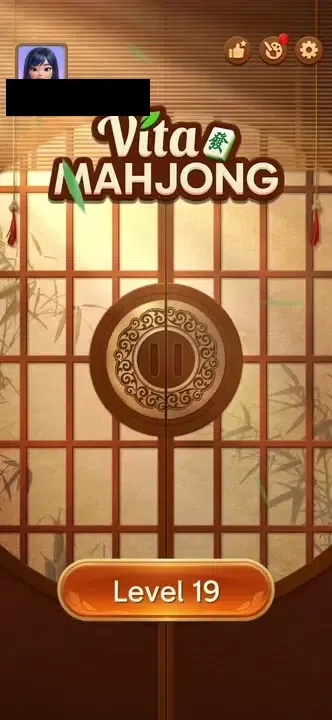
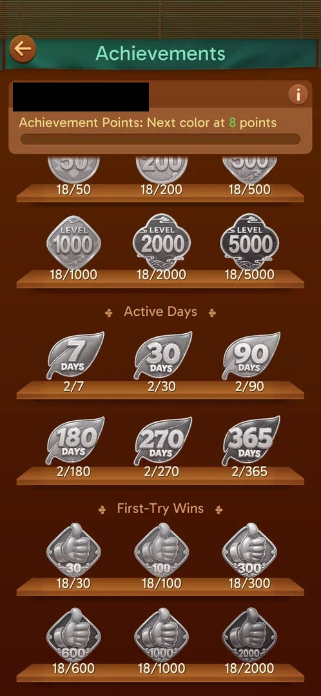
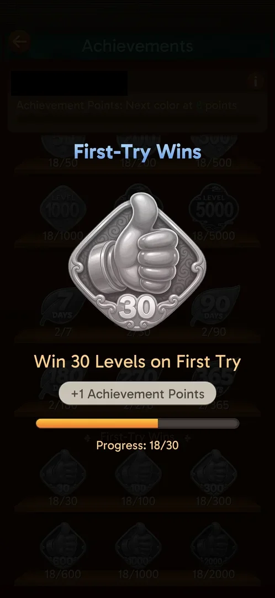

# Achievements

A full-screen list of long-term goals (medals) grouped on shelves: 1st-place finishes, leagues reached,
levels cleared, active days and first-try wins. Each medal shows the player's count against its target.
Each medal earned gives +1 Achievement Point, and the points unlock colours for the player's name (see
[Name colors](name-colors.md)) [^s5] [^s6] [^s7] [^s3].

## Why it appeared

In the first session its button was not on the home screen when the session arrived at level 19. It
appeared after the player opened level 19 and left it with the back arrow, without finishing the level
[^s1]. In the second session the button was already on the home screen in the first frame, behind the age
popup and with the Level 1 button showing, before any level was opened [^s9]. The trigger is therefore
not established. Hypothesis: the button shows once the game has loaded the player's data, and in the
first session it was simply late; not verified.

## Where to find it

Home screen, top right: the round thumbs-up-with-a-star button, left of the palette (Theme) and the gear
(Settings) [^s1].

 [^s1]
*The thumbs-up-with-a-star button, left of the palette, opens Achievements*

A tap plays the game's door transition: two wooden sliding doors close over the home screen and open on
Achievements, in about 3 s [^s5].

 [^s5]
*Clip 6.7 s · [original on YouTube from 1:33](https://youtu.be/D73ofuYaPzY?t=93)*

## What it looks like

 [^s5]
*The top of Achievements: points bar, then shelves of grey (not earned) medals with counts*

- A back arrow top left, the title "Achievements" [^s5].
- A header card with the player's name, an info (i) button and the line "Achievement Points: Next color
  at 8 points" over an empty bar [^s5].
- Shelves of medals, three per row. A grey medal is not earned; the count under it is progress against
  the target [^s5].

## What you can do

| Tab or button | What it does |
|---|---|
| [Medal shelves](#medal-shelves) | Scroll the list of achievements and their counts |
| [Medal detail](#medal-detail) | Tap a medal: its requirement, reward and progress |
| [Info button](#info-button) | Opens the Name Colors popup |
| [Back arrow](#back-arrow) | Returns to the home screen |

### Medal shelves

 [^s6]
*Levels Cleared, Active Days and First-Try Wins; counts at level 19*

Five shelves, each with six targets, all not yet earned at level 19 [^s5] [^s6] [^s2]:

| Shelf | Targets | Count at level 19 |
|---|---|---|
| Cumulative 1st-Place Finishes | 1, 5, 15, 30, 60, 100 | 0 |
| League Reached | six league medals, each with a different mascot | 0/1 on each |
| Levels Cleared | 50, 200, 500, 1000, 2000, 5000 | 18 |
| Active Days | 7, 30, 90, 180, 270, 365 | 2 |
| First-Try Wins | 30, 100, 300, 600, 1000, 2000 | 18 |

A further swipe to the end of the list changed nothing on the screen: First-Try Wins is the last shelf
[^s2].

### Medal detail

 [^s7]
*The First-Try Wins 30 medal: requirement, +1 Achievement Points, progress 18/30*

A tap on a medal dims the list and shows the medal large, with the shelf's name, the requirement ("Win 30
Levels on First Try"), the reward "+1 Achievement Points" and a progress bar with the count (18/30)
[^s7]. The Android back key did not close it; a tap on the dimmed area outside the medal did [^s11].

### Info button

 [^s3]
*Name Colors: colour 1 owned, colours 2 to 5 locked*

The (i) button in the header opens the Name Colors popup: five colours, colour 1 in use, colours 2 to 5
locked; the next colour needs 8 points. See [Name colors](name-colors.md) [^s3] [^s10].

### Back arrow

<!-- no-frame: the arrow is on the Achievements frame above -->
Returns to the home screen [^s4] [^s10].

## How it works

Version 3.40.1.

- One medal gives +1 Achievement Point (seen on the First-Try Wins 30 medal) [^s7]. The next name colour
  needs 8 points [^s5]. Inferred: 8 medals unlock the second colour; not verified.
- Medals are earned at count thresholds: 1st-place finishes, leagues reached, levels cleared, active
  days, first-try wins [^s10].
- Levels Cleared counts 18 and First-Try Wins counts 18 at level 19: every one of the 18 levels cleared
  was counted as a first-try win [^s6].
- Active Days counts 2 [^s6].
- League Reached and 1st-Place Finishes are 0: leagues were not seen at level 19 (see
  [Leagues](leagues.md)) [^s5].
- Nothing is equipped from this screen [^s10].

## Cases

| Case | What was done | Result | Source |
|---|---|---|---|
| Thumbs-up/star button on home, left of the palette; shows after leaving a level <!-- case:chk-entry --> | Left level 19 with the back arrow, tapped the new button | ✅ Opens Achievements; in the second session the button was there from the start | [^s1] [^s9] |
| Achievement Points bar and shelves: 1st-place finishes, League Reached, Levels Cleared, Active Days, First-Try Wins <!-- case:chk-screen --> | Scrolled the list to the end | ✅ Five shelves of six medals | [^s2] [^s6] |
| Why it appeared <!-- case:chk-appeared --> | Compared the home screen before and after a level visit; second session | ✅ First session: appeared after leaving level 19. Second session: present from the first frame | [^s1] [^s9] |
| The progress <!-- case:chk-progress --> | Read the header and a medal | ✅ Bar empty, next colour at 8 points; each medal +1 point; Levels Cleared 18, Active Days 2, First-Try Wins 18, others 0 | [^s5] [^s7] |
| The items <!-- case:chk-items --> | Scrolled the list, opened the info popup | ✅ 30 medals on 5 shelves, none earned; 5 name colours | [^s6] [^s3] |
| How a medal is earned <!-- case:chk-earn --> | Tapped the First-Try Wins 30 medal | ✅ Count thresholds; the detail shows the requirement and +1 point | [^s7] |
| Using an item <!-- case:chk-use --> | Tapped a medal, tapped (i) | ✅ Medal = detail popup; (i) = Name Colors; nothing to equip | [^s10] |
| Completing a medal or the bar: the reward <!-- case:chk-complete --> | — | ✅ as far as shown: +1 point per medal, colours by points; no medal earned yet (nearest First-Try Wins 18/30) | [^s7] [^s10] |

## Not verified

- A medal actually earned: the unlock animation and whether the point is added at once
- The second name colour at 8 points: what changes on the name
- Why the button was missing on arrival in the first session

[^s1]: session 20261003-195050-chrono-2FYKPJ, step 23 — [video at 6:19](https://youtu.be/KUKs3cQ-xqY?t=379)
[^s2]: session 20261003-195050-chrono-2FYKPJ, step 24 — [video at 6:56](https://youtu.be/KUKs3cQ-xqY?t=416)
[^s3]: session 20261003-195050-chrono-2FYKPJ, step 26 — [video at 7:27](https://youtu.be/KUKs3cQ-xqY?t=447)
[^s4]: session 20261003-195050-chrono-2FYKPJ, step 28 — [video at 7:53](https://youtu.be/KUKs3cQ-xqY?t=473)
[^s5]: session 20261003-231301-chrono-2FYKPJ, step 7 — [video at 1:39](https://youtu.be/D73ofuYaPzY?t=99)
[^s6]: session 20261003-231301-chrono-2FYKPJ, step 8 — [video at 1:58](https://youtu.be/D73ofuYaPzY?t=118)
[^s7]: session 20261003-231301-chrono-2FYKPJ, step 11 — [video at 2:21](https://youtu.be/D73ofuYaPzY?t=141)
[^s9]: session 20261003-231301-chrono-2FYKPJ, step 1 — [video at 0:28](https://youtu.be/D73ofuYaPzY?t=28)
[^s10]: session 20261003-231301-chrono-2FYKPJ, step 14 — [video at 2:45](https://youtu.be/D73ofuYaPzY?t=165)

[^s11]: session 20261003-231301-chrono-2FYKPJ, step 13 — [video at 2:35](https://youtu.be/D73ofuYaPzY?t=155)
