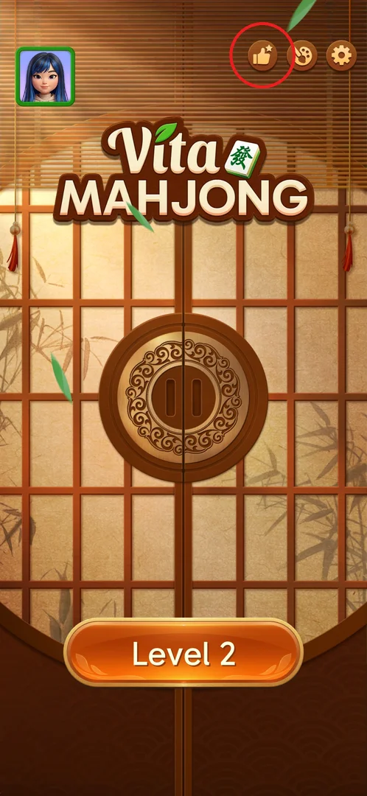
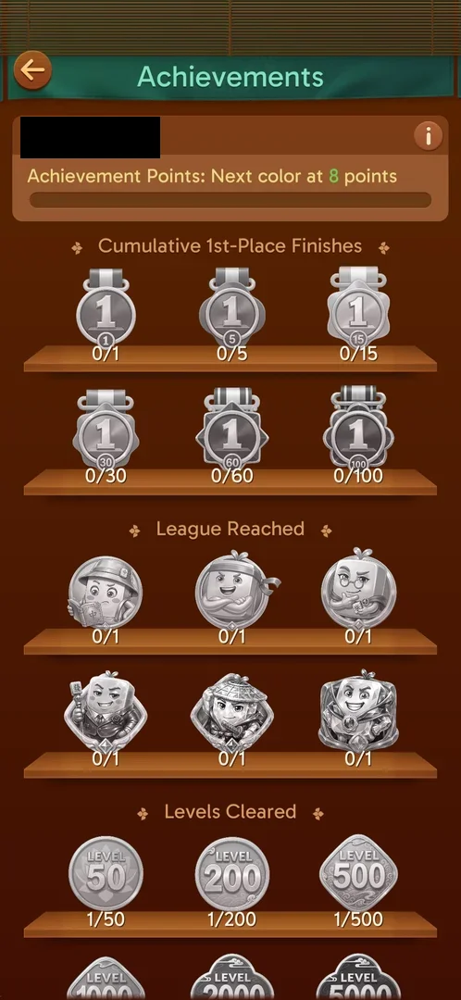
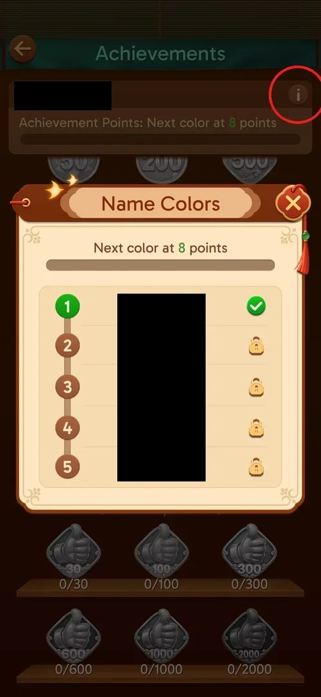
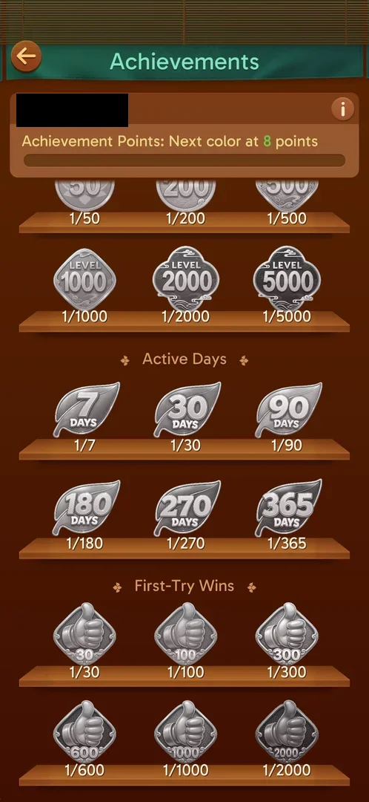

# Achievements

Achievements is a trophy shelf of long-term milestones: medals for 1st-place finishes, league badges,
cleared levels, active days and first-try wins. Each badge adds achievement points, and the points unlock
new colours for the player's nickname [^s5] [^s3].

## Where to find it

From the main screen: the thumbs-up button at the top right, to the left of the theme and settings
buttons [^s5]. The button was not there on first launch: it appeared after the player had visited a
level once and come back to the main screen [^s7].

 [^s1]

## What it looks like

A full screen titled "Achievements" with a back arrow at the top left. Under the title is a card with
the player's nickname, the line "Achievement Points: Next color at 8 points", a progress bar and an (i)
button. Below it the badges stand on wooden shelves, three per shelf, grouped by category; a locked
badge is grey and shows its progress as `current/target` [^s2] [^s6].

 [^s2]

## What you can do

| Tab or button | What it does |
|---|---|
| [Name Colors](#name-colors) | The (i) button on the nickname card opens the list of nickname colours and the points they need |
| [Lower categories](#lower-categories) | Scrolling down shows the rest of Levels Cleared, Active Days and First-Try Wins |

### Name Colors

A popup "Name Colors" over the Achievements screen: "Next color at 8 points", a progress bar and the
nickname in 5 numbered colours — 1 brown (default, ticked as unlocked), 2 green, 3 blue, 4 magenta,
5 orange (locked) [^s3]. The red X at the top right closes it back to Achievements [^s8].

 [^s3]

### Lower categories

Scrolling down the screen shows the second shelf of Levels Cleared (1000, 2000, 5000), Active Days
(7, 30, 90, 180, 270, 365) and First-Try Wins (30, 100, 300, 600, 1000, 2000). The nickname card stays
pinned at the top; the list ends with First-Try Wins (a second swipe did not move it) [^s4] [^s6] [^s9].

 [^s4]

## How it works

Version 3.39.1.

| Category | Badge targets |
|---|---|
| Cumulative 1st-Place Finishes | 1, 5, 15, 30, 60, 100 [^s2] |
| League Reached | 6 league badges (mascots), each 0/1 [^s2] |
| Levels Cleared | 50, 200, 500, 1000, 2000, 5000 [^s2] [^s4] |
| Active Days | 7, 30, 90, 180, 270, 365 [^s6] |
| First-Try Wins | 30, 100, 300, 600, 1000, 2000 [^s6] |

- Active Days counts from the first day: 1/7 on the day of install [^s6].
- Winning Level 1 moved Levels Cleared to 1/50 and First-Try Wins to 1/30, although a Revive was used in
  that level — so a Revive does not cancel a "first try" [^s2] [^s4].
- Achievement points unlock nickname colours in 5 tiers; the first new colour comes at 8 points [^s3].
- The six League Reached badges show league mascots; no league entry point was on the main screen through
  Level 2, so the leagues themselves are seen only here [^s2].

## Cases

| Case | What was done | Result | Source |
|---|---|---|---|
| Open | Tapped the thumbs-up button on the main screen (it appeared after the first level visit) | The Achievements screen opened | [^s5] |
| Categories | Scrolled the Achievements screen to the end | 1st-Place Finishes, League Reached, Levels Cleared, Active Days, First-Try Wins; Active Days already 1/7 on day one | [^s6] |
| Name colours | Tapped (i) on the nickname card | Name Colors: 5 nickname colours, next at 8 points | [^s3] |
| Level 1 counted | Opened Achievements after the Level 1 win | Levels Cleared 1/50, 1/200, 1/500; 1st-place medals still 0; League Reached 6 badges, all 0/1 | [^s2] |
| First try with a Revive | Scrolled down after the Level 1 win, in which a Revive was used once | First-Try Wins 1/30 | [^s4] |

## Not verified

- How many achievement points one badge gives, and what "Achievement Points" counts exactly.
- Whether an unlocked nickname colour is applied automatically or chosen by the player, and where the
  coloured nickname is shown to others.
- The names of the six leagues and how a league is reached (no league entry point seen yet).
- Whether a level won after a restart counts as a first-try win.

[^s1]: session 20260930-211039-chrono-2FYKPJ, step 145
[^s2]: session 20260930-211039-chrono-2FYKPJ, step 146
[^s3]: session 20260930-203959-chrono-2FYKPJ, step 91 — [video at 17:29](https://youtu.be/2yK_ch59JAg?t=1049)
[^s4]: session 20260930-211039-chrono-2FYKPJ, step 147
[^s5]: session 20260930-203959-chrono-2FYKPJ, step 88 — [video at 16:21](https://youtu.be/2yK_ch59JAg?t=981)
[^s6]: session 20260930-203959-chrono-2FYKPJ, step 89 — [video at 16:59](https://youtu.be/2yK_ch59JAg?t=1019)
[^s7]: session 20260930-203959-chrono-2FYKPJ, step 87 — [video at 16:00](https://youtu.be/2yK_ch59JAg?t=960)
[^s8]: session 20260930-203959-chrono-2FYKPJ, step 92
[^s9]: session 20260930-203959-chrono-2FYKPJ, step 90
