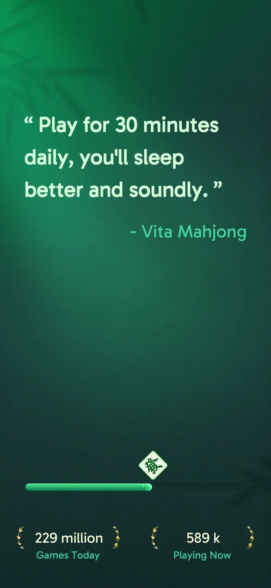
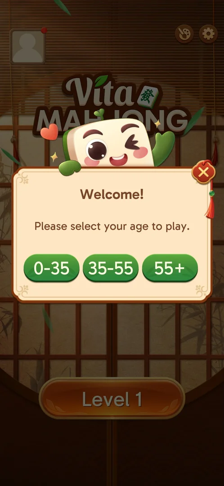
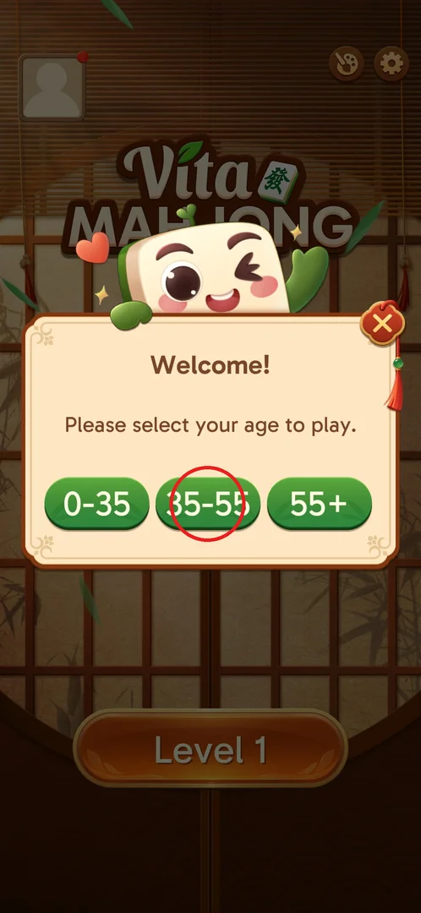
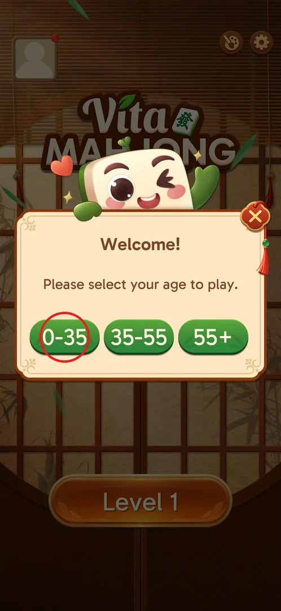
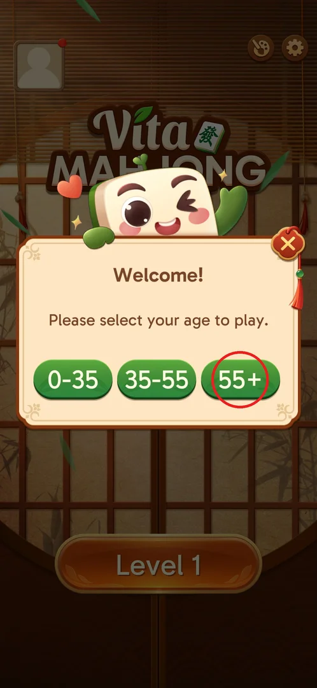
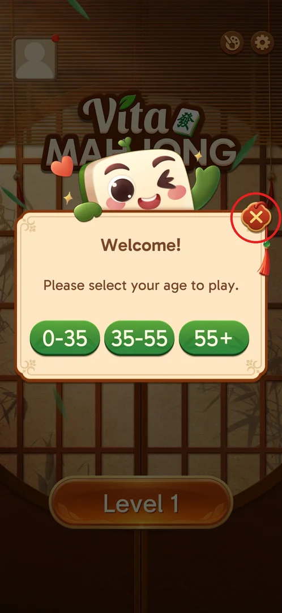

# Welcome age selection

A one-time popup on the first launch that asks for the player's age bracket before the first level.
It says "Welcome! Please select your age to play." and offers three buttons (0-35, 35-55, 55+) and a
close X. One tap on a bracket closes it and leaves the player on the main screen at Level 1 [^s1] [^s2].

## Where to find it

<!-- no-entry: the popup has no button; it opens by itself on the first launch, right after the loading screen -->

It opens by itself on the first launch of a fresh install: the Vita splash, then the loading screen
with a loading tip about daily play and better sleep, a progress
bar and two counters (229 million Games Today, 589k Playing Now). Android's notification permission
prompt also came up during loading (it was denied) [^s1]. When loading ends, the main screen comes up
with this popup over it [^s1]. Whether it can be reopened later (e.g. from settings) is not known.

 [^s1]

## What it looks like

A cream popup with the tile mascot on top, over the main screen (avatar top-left, theme and settings
buttons top-right, Level 1 button below, all dimmed). Title "Welcome!", the line "Please select your
age to play.", three green buttons in a row and a red close X at the top-right corner [^s1].

 [^s1]

## What you can do

| Tab or button | What it does |
|---|---|
| [35-55](#35-55) | Picks the 35-55 bracket; the popup closes to the main screen at Level 1 [^s2] |
| [0-35](#0-35) | Left button: another bracket; not tried |
| [55+](#55) | Right button: another bracket; not tried |
| [Close X](#close-x) | Red X at the top-right corner; not tried |

### 35-55

The middle button. Tapped in the first session: the popup closed at once and no further question
followed [^s2].

 [^s1]

### 0-35

The left button. Not tried in any session; presumably it closes the popup the same way (inferred).

 [^s1]

### 55+

The right button. Not tried in any session; presumably it closes the popup the same way (inferred).

 [^s1]

### Close X

The red X at the popup's top-right corner. Not tried: whether it skips the question or the popup
comes back on the next launch is not known.

 [^s1]

### Result

 [^s2]

## How it works

- Shown once, on the first launch, before any level (version 3.39.1) [^s1].
- One tap on a bracket is enough; there is no confirmation step [^s2].
- Nothing visible on the main screen changed after the choice (inferred from the result frame) [^s2].

## Cases

| Case | What was done | Result | Source |
|---|---|---|---|
| Select an age bracket on the first launch | Tapped 35-55 | Popup closed straight to the main screen at Level 1, no more questions | [^s2] |

## Not verified

- What the close X does (skip, or the popup comes back on the next launch).
- What 0-35 and 55+ do, and whether the bracket changes anything in the game (ads, difficulty, content).
- Whether the popup can be reopened or the bracket changed later.

[^s1]: session 20260930-203959-chrono-2FYKPJ, step 1 — [video at 0:22](https://youtu.be/2yK_ch59JAg?t=22)
[^s2]: session 20260930-203959-chrono-2FYKPJ, step 2 — [video at 0:49](https://youtu.be/2yK_ch59JAg?t=49)
