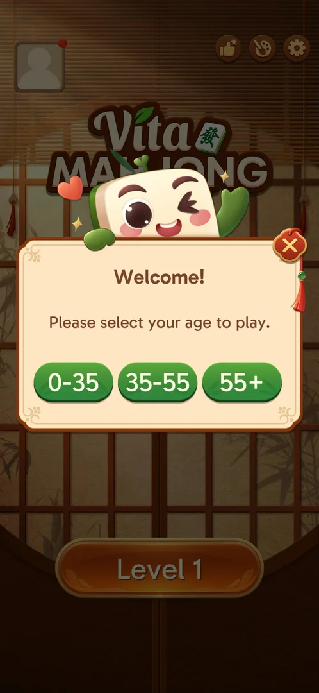

# Age selection

A popup that asks the player to pick an age bracket before playing. It shows over the home screen on the
first arrival, before the saved-game prompt [^s1] [^s2].

## Why it appeared

The first arrival on the home screen of a fresh install, right after the loading screen [^s1]. It was
shown again at the start of the second session, on a phone whose game had been synced to level 19: the home
screen behind it read Level 1, and the saved-game prompt followed [^s2] [^s3]. The same
happened on the next launch, in the third session [^s6]. That launch also began with
Android's notification permission request [^s2]. Hypothesis: the game's local data had been reset before
that session (reinstall or cleared data), so the game treated it as a first launch; not verified.

## Where to find it

<!-- no-entry: no control opens it; it shows by itself on the first home arrival -->
No button opens it: the game shows it by itself over the home screen, which still shows Level 1 [^s1]
[^s2].

## What it looks like

 [^s2]
*Three age brackets as green buttons; a close X on the top right corner*

The game's tile mascot peeks over the popup. The title is "Welcome!", the text asks for the player's age
[^s1] [^s2].

## What you can do

| Tab or button | What it does |
|---|---|
| [Age buttons](#age-buttons) | Pick a bracket: 0-35, 35-55 or 55+ |
| [Close X](#close-x) | Closes the popup without a choice |

### Age buttons

<!-- no-frame: the buttons are on the popup frame above -->
In the first session the player picked 35-55. The popup closed and the saved-game prompt came next (see
[Saved game sync](cloud-sync.md)) [^s5].

### Close X

<!-- no-frame: the X is on the popup frame above -->
In the second session the X closed the popup without a choice; the saved-game prompt came next, the same
as after a bracket [^s3].

In the third session the player picked 0-35: the saved-game prompt followed, the same as after the X.
After the save was restored, the home screen and the level 19 board showed nothing that differed from
the sessions with the other answers [^s6].

## How it works

Version 3.40.1. Shown before the saved-game prompt on a first launch [^s1] [^s2]. Whether closing it
with the X brings it back on a later launch, and what a bracket changes (tile size, difficulty, ads),
is not verified [^s4].

## Cases

| Case | What was done | Result | Source |
|---|---|---|---|
| Popup: Please select your age, brackets 0-35, 35-55, 55+, close X <!-- case:chk-screen --> | Fresh install, first home arrival | ✅ | [^s1] [^s2] |
| No entry: shown by itself on the first home arrival of a fresh install <!-- case:chk-entry --> | Fresh install; a relaunch showing Level 1 | ✅ | [^s1] [^s2] |
| The popup comes back on a relaunch of a phone with progress <!-- case:returns-on-relaunch --> | Relaunch on a phone synced to level 19 | ✅ Home showed Level 1 and an empty avatar, then the age popup, then the saved-game prompt | [^s2] |
| Close X dismisses the popup without choosing; the saved-game prompt follows <!-- case:close-x --> | Tapped the X | ✅ | [^s3] |
| Every option or button and what it changes <!-- case:chk-options --> | Picked 35-55 (first session), closed with the X (second) | ✅ partly: both close the popup and lead to the saved-game prompt; what a bracket changes not seen | [^s5] [^s4] |
| What each answer does and whether it comes back <!-- case:chk-answers --> | Closed with the X | ✅ partly: dismissed, saved-game prompt follows; whether it returns after the X not seen | [^s4] |
| Picked the 0-35 bracket <!-- case:bracket-0-35 --> | Tapped 0-35 | ✅ The saved-game prompt followed, as after the X; the home after the restore and the level 19 board showed no visible difference | [^s6] |
| Links out <!-- case:chk-links --> | — | ✅ none on the popup | [^s4] |
| Why it appeared <!-- case:chk-appeared --> | Fresh install; a relaunch on a progressed phone | ✅ First home arrival; also on a relaunch that showed Level 1 | [^s1] [^s2] |

## Not verified

- What each bracket changes in the game (0-35 and 35-55 showed no visible difference; 55+ not tried) <!-- case:chk-options -->
- Whether the popup comes back on a later launch after the X <!-- case:chk-answers -->
- Why it showed again on a phone that already had progress

[^s1]: session 20261003-195050-chrono-2FYKPJ, step 2 — [video at 0:35](https://youtu.be/KUKs3cQ-xqY?t=35)
[^s2]: session 20261003-231301-chrono-2FYKPJ, step 1 — [video at 0:28](https://youtu.be/D73ofuYaPzY?t=28)
[^s3]: session 20261003-231301-chrono-2FYKPJ, step 2 — [video at 0:47](https://youtu.be/D73ofuYaPzY?t=47)
[^s4]: session 20261003-231301-chrono-2FYKPJ, step 21 — [video at 3:55](https://youtu.be/D73ofuYaPzY?t=235)
[^s5]: session 20261003-195050-chrono-2FYKPJ, step 3 — [video at 1:05](https://youtu.be/KUKs3cQ-xqY?t=65)
[^s6]: session 20261003-231804-chrono-2FYKPJ, step 1 — [video at 0:40](https://youtu.be/ssTmhwls_uc?t=40)
